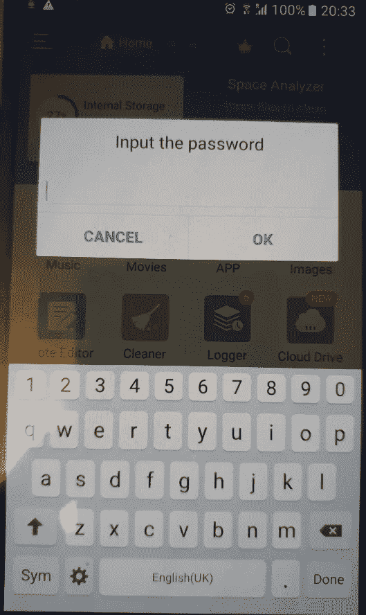
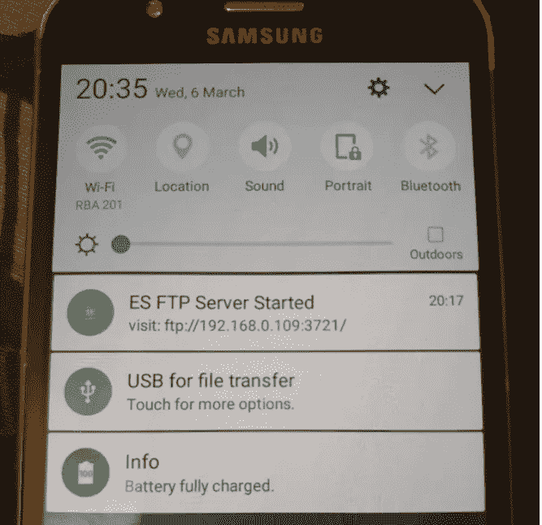
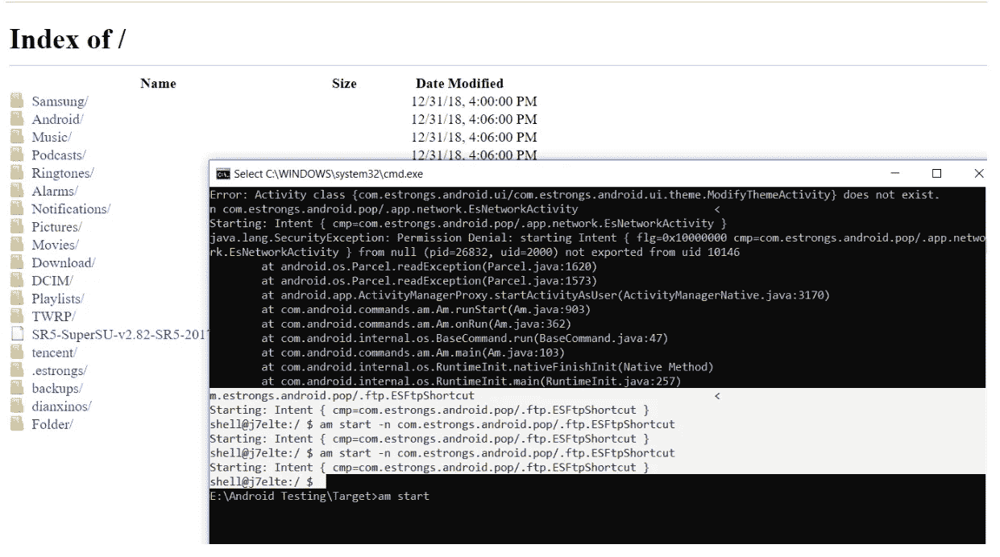

# CVE-2019–11380 |我如何能够访问 ES-FileExplorer 终端用户的完整存储

> 原文：<https://infosecwriteups.com/cve-2019-11380-how-i-was-able-to-access-complete-storage-of-es-fileexplorer-end-user-9bd8da5ac3b8?source=collection_archive---------0----------------------->

ES-file explorer 是一个非常受欢迎的文件管理器，在 play store 上有超过 30 个 lac 下载。我发现了一个关键漏洞 ***通过不安全的 FTP 活动执行*** 绕过认证，攻击者可以通过它访问受害者手机的完整文件系统。一个月后，ES-FileExplorer 被 playStore 下架，并被指控涉嫌点击欺诈。

ES 文件资源管理器为其最终用户提供各种功能，如浏览存储的文件、系统文件等。它的一个特点是使用 FTP 服务通过网络提供对文件系统的访问。

它还提供了一个功能，最终用户可以在该应用程序上设置一个主密码，这样其他移动用户或其他应用程序就不能使用它的功能。我发现 activity .ftp.ESFtpShortcut 负责通过电话启动 ftp 服务器。即使在设置了主密码之后，如果使用 adb activity manager 调用此活动，也可以启动 FTP 并通过网络访问完整的文件系统。在攻击场景中，任何恶意应用程序都可以为攻击者执行此活动。攻击者可以通过 FTP url 从远程位置访问本地存储中所有文件。

**重现步骤:**

为应用程序设置密码。

借助活动管理器命令启动 activity . FTP . esftpshortcut:*am start-n com.estrongs.android.pop/.ftp.ESFtpShortcut*
**Output:**
*Starting:Intent { CMP = com . estrongs . Android . pop/. FTP . esftpshortcut }*
*shell @ j7 elte:/$*

在移动通知面板上显示 FTP URL。

攻击者只需将 URL 加载到任何浏览器，就可以访问本地存储所有内容，包括图像、相机、下载等。

我向应用程序开发团队报告了这个漏洞，问题在 v4.2.0.1.4 中得到修复。

感谢阅读，狩猎愉快！

*关注* [*Infosec 报道*](https://medium.com/bugbountywriteup) *获取更多此类精彩报道。*

 [## 信息安全报道

### 收集了世界上最好的黑客的文章，主题从 bug 奖金和 CTF 到 vulnhub…

medium.com](https://medium.com/bugbountywriteup)