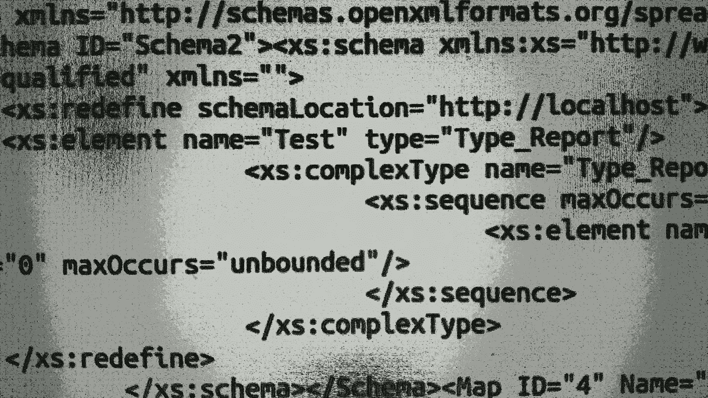

# CVE-2019-12415:Apache POI 中的 XML 处理漏洞

> 原文：<https://infosecwriteups.com/cve-2019-12415-xml-processing-vulnerability-579fdbfbaa18?source=collection_archive---------1----------------------->

Apache POI 是一个流行的 Java 库，用于处理 Microsoft 文档。例如，它允许您使用 Java 读写 Microsoft Excel 文件。当我最近查看图书馆时，我注意到一个小漏洞，后来成为 CVE-2019–12415。该问题已在 POI 4.1.1 中修复。以下是详细内容。



# 问题

除了许多其他格式，Apache POI 还可以处理 Microsoft Excel 文档。特别是，该库包含用于处理 Microsoft Excel Open XML 电子表格(XLSX)文件的`XSSFExportToXml`类。该类接受一个在 Open Office XML 规范中定义的`Map`元素，并将其转换为 XML。

元素包含了 XLSX 文件的内部内容。特别是，它包含一个 XSD 模式。可以指示`XSSFExportToXml.exportToXml()`方法使用这个模式进行 XML 验证:

```
private boolean isValid(Document xml) throws SAXException {
    try {
        String language = "http://www.w3.org/2001/XMLSchema";
        SchemaFactory factory = SchemaFactory.newInstance(language);
        Source source = new DOMSource(map.getSchema());
        Schema schema = factory.newSchema(source);
        Validator validator = schema.newValidator();
        validator.validate(new DOMSource(xml));
...
```

这里的问题是，`SchemaFactory`没有打开安全 XML 处理模式，如果攻击者可以将恶意的 XSD 模式传递给`isValid()`方法，就会导致 XXE 漏洞。

模式是如何到达`isValid()`方法的？答案很简单:它来自一个 XLSX 文档。首先，XSLT 文档只是一个 ZIP 存档。如果您提取它，您会发现一堆 XML 文档和其他文件。XSD 模式来自`xl/xmlMaps.xml`文件，该文件包含如下内容:

```
<MapInfo  SelectionNamespaces="">
    <Schema ID="Schema2">
        <xs:schema xmlns:xs="http://www.w3.org/2001/XMLSchema" elementFormDefault="qualified" 1be1" class="pw-post-body-paragraph jq jr it js b jt ju jv jw jx jy jz ka kb kc kd ke kf kg kh ki kj kk kl km kn im bi">There may be various payloads. For example, an attacker can inject a `<xs:redefine schemaLocation="https://internal.site/endpoint">` element into the schema. Here `https://internal.site/endpoint` is a URL to a resource from the private network which can't be directly accessed by an attacker:

```
<MapInfo  SelectionNamespaces="">
    <Schema ID="Schema2">
        <xs:schema xmlns:xs="http://www.w3.org/2001/XMLSchema" elementFormDefault="qualified" https://internal.site/endpoint">
            ...
```

然后，攻击者把所有东西归档回去，恶意的 XLSX 就准备好了。当`SchemaFactory`加载模式时，它将访问`[https://internal.site/endpoint](https://internal.site/endpoint.)` [。](https://internal.site/endpoint.)

已通过将`XMLConstants.FEATURE_SECURE_PROCESSING`功能设置为`SchemaFactory`修复了该问题。

# 攻击者能做什么

攻击者可以在有效载荷中使用 XSD 格式的所有功能。可能的后果包括但不限于:

1.  服务器端请求伪造(SSRF)
2.  本地和远程资源的敏感信息泄漏

# 利用漏洞的先决条件

以下是使应用程序易受攻击的原因:

1.  该应用程序使用 Apache POI 4.1.0 及更低版本。
2.  该应用程序允许不受信任的数据被`XSSFExportToXml`类处理。
3.  `XSSFExportToXml.exportToXml()`方法的第三个参数被设置为 true，这将启用 XML 验证。

# 结论

Java 标准库为 XML 处理提供了许多类。`DocumentBuilder`是加载 XML 文档最流行的类之一。然而，还有许多其他的类，比如`SchemaFactory`、`Transformer`等等可以解析 XML 文档。如果这些类从不受信任的来源获取数据，那么所有这些类都应该配置为以一种安全的方式完成这项工作。

# 参考

*   [阿帕奇兴趣点](https://poi.apache.org/)
*   [CVE-2019–12415](https://nvd.nist.gov/vuln/detail/CVE-2019-12415)
*   [补丁](https://svn.apache.org/viewvc?view=revision&revision=1867484)
*   [兴趣点 4.1.1 公告](https://lists.apache.org/thread.html/13a54b6a03369cfb418a699180ffb83bd727320b6ddfec198b9b728e@%3Cannounce.apache.org%3E)
*   [服务器端请求伪造](https://www.owasp.org/index.php/Server_Side_Request_Forgery) 
```

*关注* [*Infosec 报道*](https://medium.com/bugbountywriteup) *获取更多此类精彩报道。*

[](https://medium.com/bugbountywriteup) [## 信息安全报道

### 收集了世界上最好的黑客的文章，主题从 bug 奖金和 CTF 到 vulnhub…

medium.com](https://medium.com/bugbountywriteup)