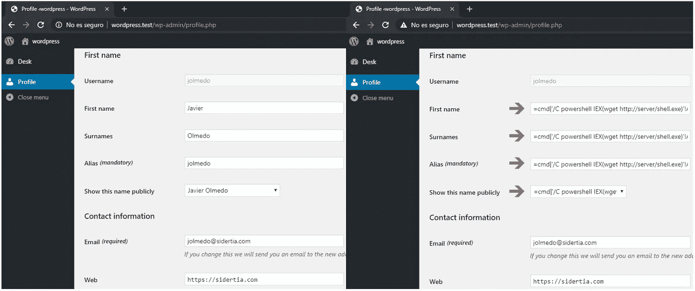
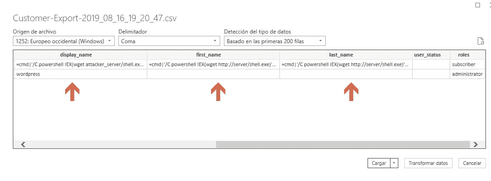

# CVE-2019-15092 WordPress 插件导入导出用户= 1.3.0 - CSV 注入

> 原文：<https://infosecwriteups.com/cve-2019-15092-wordpress-plugin-import-export-users-1-3-0-csv-injection-b5cc14535787?source=collection_archive---------0----------------------->

[https://WordPress . org/plugins/users-customers-import-export-for-WP-woo commerce/](https://wordpress.org/plugins/users-customers-import-export-for-wp-woocommerce/)

# 摘要

CSV 注入，也称为公式注入，在网站将不受信任的输入嵌入 CSV 文件时发生。当使用 Microsoft Excel 或 LibreOffice Calc 等电子表格程序打开 CSV 时，任何以“=”开头的单元格都将被软件解释为公式。恶意制作的公式可用于三种主要攻击:

*   通过利用电子表格软件中的漏洞，如 CVE-2014–3524，劫持用户的计算机。
*   通过利用用户忽略从自己网站下载的电子表格中的安全警告的倾向来劫持用户的计算机。
*   从电子表格或其他打开的电子表格中过滤内容。

# 影响

拥有**基本 WordPress 权限**(订户)的恶意用户可以利用该插件的 CSV 注入漏洞，公开修改域名、姓氏、别名或显示名称，恶意加载到**的管理员电脑上执行命令**。

许多公司通常非常重视 CSV 注射。

*   **https://hackerone.com/reports/126109:**[优步](https://hackerone.com/reports/126109)
*   **哈克罗内:**https://hackerone.com/reports/72785
*   **哈克罗内:**https://hackerone.com/reports/124223
*   **新遗迹:**[https://hackerone.com/reports/127032](https://hackerone.com/reports/127032)

# 概念证明

1.  使用订阅者用户登录并更改“名字”、“姓氏”和“别名”字段(此有效负载使用 PowerShell 从 web 服务器下载恶意文件并在管理员的计算机中执行)。

恶意用户用户面板

2.使用管理员用户登录，然后**将所有用户**导出到 CSV。

3.如果您使用 Microsoft Office 打开该文件，您将看到**字段以字符“=”**开头，后跟 PowerShell 命令。

在 Microsoft Office 上导入 CSV 文件

# 减轻

这种攻击很容易缓解和补救，在生成 CSV 文件时，请确保没有任何单元格以下列字符开头:

*   等于(" = ")
*   加号(“+”)
*   减号(“-”)
*   在(“@”)

# 易受攻击代码

来自**的函数 **do_export()** 不检查字段是否以 **(=，+，-，@)** 字符开头。**

# 时间表

*   2019 年 8 月 15 日-👨‍💻发现
*   2019 年 8 月 15 日-👨‍💻向 Webtoffee 支持部门报告
*   2019 年 8 月 16 日-👨‍💼更多信息请求
*   2019 年 8 月 16 日-👨‍💻详细的漏洞报告
*   2019 年 8 月 19 日-👨‍💼无法识别的漏洞
*   2019 年 8 月 22 日-👨‍💻公开披露

**西班牙语版**

 [## CVE-2019-15092 WordPress 插件导入导出用户= 1.3.0 - CSV 注入-黑客攻击

### CVE 公共图书馆-2018-15571 en El plugin para WordPress Import Export Users = 1 . 3 . 0 permite eje cución de…

hackpuntes.com](https://hackpuntes.com/cve-2019-15092-wordpress-plugin-import-export-users-1-3-0-csv-injection/) 

*关注* [*Infosec 报道*](https://medium.com/bugbountywriteup) *获取更多此类精彩报道。*

 [## 信息安全报道

### 收集了世界上最好的黑客的文章，主题从 bug 奖金和 CTF 到 vulnhub…

medium.com](https://medium.com/bugbountywriteup)