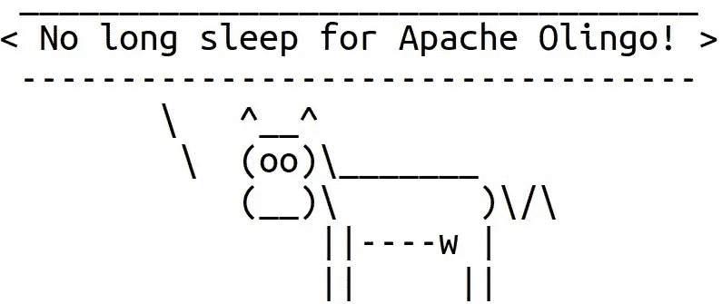

# CVE-2019–17555:通过 Apache Olingo 中的重试后标头拒绝服务

> 原文：<https://infosecwriteups.com/cve-2019-17555-dos-via-retry-after-header-in-apache-olingo-5b4a46cb6bde?source=collection_archive---------0----------------------->

Apache Olingo 是一个实现开放数据协议(OData)的 Java 库。该协议允许以一种简单的方式创建和使用可查询和可互操作的 RESTful APIs。

这篇文章描述了我最近在 Apache Olingo 中发现的一个小漏洞。该问题已在 4.7.0 版中修复。

(最初发表于[https://blog.gypsyengineer.com](https://blog.gypsyengineer.com/en/security/cve-2019-17555-dos-via-retry-after-header-in-apache-olingo.html)



# 问题

OData 协议在 HTTP 上运行。Apache Olingo 实现了一个 OData 客户端。特别是，它提供了`AsyncRequestWrapperImpl`类，该类向 OData 服务器发送请求，然后处理响应。当客户端请求服务器创建新记录时，服务器可能无法立即创建记录。在这种情况下，服务器可能会回复 202 状态代码，并在响应中包含以下 HTTP 标头:

*   `Location`带有一个监视器 URL 的标题，客户端可以检查该监视器以查看记录是否准备好。
*   `Retry-After`带有客户端在检查监视器之前应该等待的秒数的标题。

发送请求后，`AsyncRequestWrapperImpl`类将收到的响应传递给`AsyncResponseWrapperImpl`。如果响应包含 202 状态码，那么`AsyncResponseWrapperImpl`类开始检查监视器。如果监视器返回 202 代码，那么类等待它从`Retry-After`头得到的秒数。[这里的](https://github.com/apache/olingo-odata4/blob/4.6.0/lib/client-core/src/main/java/org/apache/olingo/client/core/communication/request/AsyncRequestWrapperImpl.java)是它的样子:

```
[@Override](http://twitter.com/Override)
public R getODataResponse() {
  HttpResponse res = null;
  for (int i = 0; response == null && i < MAX_RETRY; i++) {
    res = checkMonitor(location); if (res.getStatusLine().getStatusCode() == HttpStatusCode.ACCEPTED.getStatusCode()) {
      final Header[] headers = res.getHeaders(HttpHeader.RETRY_AFTER);
      if (ArrayUtils.isNotEmpty(headers)) {
        this.retryAfter = Integer.parseInt(headers[0].getValue());
      } try {
        // wait for retry-after
        Thread.sleep((long)retryAfter * 1000);
      } catch (InterruptedException ignore) {
        // ignore
      }
```

这里的问题是头值直接指向`Thread.sleep()`方法。恶意服务器可以在`Retry-After`头中返回一个巨大的值，这使得客户端的线程长时间休眠。它可能有助于实现拒绝服务攻击，但是，攻击者可能很难欺骗客户端与恶意服务器对话。

# 解决方案

通过检查`Retry-After`割台是否没有超过最大允许值，问题已被[修复](https://github.com/apache/olingo-odata4/pull/61/files)。如果报头大于最大允许值，则使用默认延迟。

# 结论

这个问题看起来并不严重，因为可能很难利用它。然而，为了安全起见，最好将 Apache Olingo 更新到 4.7.0。

# 参考

*   [CVE-2019-17555](https://nvd.nist.gov/vuln/detail/CVE-2019-17555)
*   [阿帕奇安全咨询](https://mail-archives.apache.org/mod_mbox/olingo-user/201912.mbox/%3CCAGSZ4d65UmudJ_MQkFXEv9YY_wwZbRA3sgtNDzMoLM51Qh%3DRCA%40mail.gmail.com%3E)
*   [贴剂](https://github.com/apache/olingo-odata4/pull/61)
*   [Apache Olingo](https://olingo.apache.org/)

*原为 2019 年 12 月 13 日在*[*https://blog.gypsyengineer.com*](https://blog.gypsyengineer.com/en/security/cve-2019-17555-dos-via-retry-after-header-in-apache-olingo.html)*发表。*

*跟随* [*Infosec 写下*](https://medium.com/bugbountywriteup) *来获得更多精彩绝伦的写下。*

[](https://medium.com/bugbountywriteup) [## 信息安全记录

### 世界上最好的黑客写的关于从臭虫奖励和 CTF 到 vulnhub 的话题的一个集合…

medium.com](https://medium.com/bugbountywriteup)