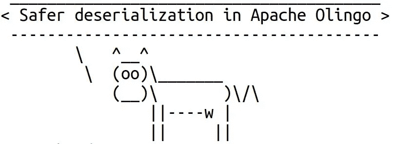

# CVE-2019-17556:Apache Olingo 中的不安全反序列化

> 原文：<https://infosecwriteups.com/cve-2019-17556-unsafe-deserialization-in-apache-olingo-8ebb41b66817?source=collection_archive---------1----------------------->

不久前，我写了一篇关于我在图书馆发现的安全问题的文章。这篇文章描述了 Apache Olingo 中的另一个小漏洞。该问题在 4.7.0 版中也已得到修复。

顺便说一下，Apache Olingo 是一个实现开放数据协议(OData)的 Java 库。该协议允许以一种简单的方式创建和使用可查询和可互操作的 RESTful APIs。

(最初发表于[https://blog.gypsyengineer.com](https://blog.gypsyengineer.com/en/security/cve-2019-17556-unsafe-deserialization-in-apache-olingo.html)



# 问题

Apache Olingo 有`AbstractService`类，它是公共 API 的一部分。根据 Javadoc，该类是代理模式的入口点。它提供对实体容器实例的访问。该类的构造函数接受压缩的元数据。更准确地说，构造函数期望一个序列化的`XMLMetadata`对象，它用 Base64 编码，用 GZIP 压缩。它使用哪种序列化机制？这是默认的 Java 序列化，很容易受到反序列化的攻击。下面是构造函数处理压缩元数据的方式:

```
protected AbstractService(final String compressedMetadata, final String metadataETag,
      final ODataServiceVersion version, final String serviceRoot, final boolean transactional) {ByteArrayInputStream bais = null;
    GZIPInputStream gzis = null;
    ObjectInputStream ois = null;
    XMLMetadata metadata = null;
    try {
      // use commons codec's Base64 in this fashion to stay compatible with Android
      bais = new ByteArrayInputStream(new Base64().decode(compressedMetadata.getBytes("UTF-8")));
      gzis = new GZIPInputStream(bais);
      ois = new ObjectInputStream(gzis);
      metadata = (XMLMetadata) ois.readObject();
```

首先，它使用`Base64.decode()`方法解码输入数据。然后，它将解码后的数据转换成一个字节数组，并将该数组包装成一个`ByteArrayInputStream`实例。接下来，输入流被打包成一个`GZIPInputStream`对象来解压缩数据。最后，GZIP 输入流被打包成一个`ObjectInputStream`来反序列化元数据。

默认情况下，`ObjectInputStream`在反序列化数据时不会应用任何检查。这意味着，如果攻击者能够向扩展了`AbstractService`的类提供恶意元数据，那么在更糟糕的情况下，可能会导致执行攻击者的代码。

问题的严重性很大程度上取决于特定应用程序如何使用`AbstractService`类，以及元数据来自哪里。

如果应用程序从受保护的资源加载元数据，攻击者必须想办法将恶意元数据写入受保护的资源。这可能并不容易。例如，如果元数据是从正确配置的数据库中加载的，那么攻击者必须找到一种 SQL 注入或其他方法，使他能够将恶意数据注入数据库。或者，如果应用程序从具有适当访问权限的文件中加载元数据，那么攻击者必须找到一种方法来写入该文件。

另一方面，如果应用程序通过网络接收元数据，攻击者可能更容易让应用程序加载他的恶意数据。

然而，项目维护者同意让`AbstractService`类使用起来更安全一点。

# 解决方案

通过为允许反序列化的类实现一个白名单，这个问题得到了缓解。例如，可以通过扩展`ObjectInputStream`类并在被覆盖的`resolveClass()`方法中实现白名单来实现。但是这不是必要的，因为 Olingo 使用 Apache IO，它提供了用于实现这种白名单的`ValidatingObjectInputStream`类。另一种选择可能是 JEP 290 中添加的过滤器，但这种方式需要使用较新版本的 Java。

[修复](https://github.com/apache/olingo-odata4/pull/60/files)非常简单:

*   添加了一个工厂方法`createObjectInputStream()`，它创建了一个`ValidatingObjectInputStream`实例，配置了一个允许反序列化的类的白名单。
*   `AbstractService`类的构造函数调用`createObjectInputStream()`方法来获取元数据的反序列化器。
*   默认情况下，白名单只包含来自`org.apache.olingo`包的类。
*   如果用户想要扩展默认的白名单，他可以覆盖`getAllowedClasses()`方法，让它返回一个允许类的列表。

该补丁已在 Apache Olingo 4.7.0 中发布。

# 我的应用程序容易受到攻击吗？

当然，并不是所有使用旧版本 Apache Olingo 的应用程序都容易受到攻击。在使用 Apache Olingo 的应用程序中，至少需要检查两件事情:

1.  它使用了`AbstractService`类吗？
2.  有什么方法可以让某些人将恶意数据输入到这个类中？

上述问题的答案取决于具体的应用。如果两个答案都是肯定的，那么应用程序很可能是易受攻击的。

# 结论

此问题是应用程序使用默认 Java 反序列化机制时反序列化漏洞的另一个示例。默认情况下，并非所有使用 Apache Olingo 的应用程序都容易受到攻击。不过保险起见还是更新库可能更好。

# 参考

*   [CVE-2019–17556](https://nvd.nist.gov/vuln/detail/CVE-2019-17556)
*   [补丁](https://github.com/apache/olingo-odata4/pull/60)
*   [阿帕奇安全顾问](https://mail-archives.apache.org/mod_mbox/olingo-user/201912.mbox/%3CCAGSZ4d4vbSYaVh3aUWAvcVHK2qcFxxCZd3WAx3xbwZXskPX8nw%40mail.gmail.com%3E)
*   [阿帕奇奥林戈](https://olingo.apache.org/)
*   [JEP 290](https://openjdk.java.net/jeps/290)

*原载于 2019 年 12 月 21 日*[*https://blog.gypsyengineer.com*](https://blog.gypsyengineer.com/en/security/cve-2019-17556-unsafe-deserialization-in-apache-olingo.html)*。*

*关注* [*Infosec 报道*](https://medium.com/bugbountywriteup) *获取更多此类精彩报道。*

[](https://medium.com/bugbountywriteup) [## 信息安全报道

### 收集了世界上最好的黑客的文章，主题从 bug 奖金和 CTF 到 vulnhub…

medium.com](https://medium.com/bugbountywriteup)