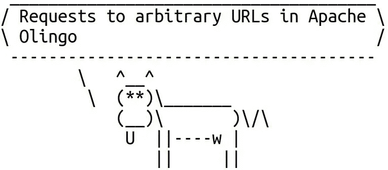

# CVE-2020-1925:对 Apache Olingo 中任意 URL 的请求

> 原文：<https://infosecwriteups.com/cve-2020-1925-requests-to-arbitrary-urls-in-apache-olingo-c66958682835?source=collection_archive---------0----------------------->

不久前，我写了一篇关于不安全的反序列化和我在 Apache Olingo 中发现的 DoS 漏洞的文章。这篇文章描述了图书馆的另一个问题。这一次，它是 Olingo 客户端中的一个小缺陷，可能允许向任意 URL 发送一些 HTTP 请求。该问题已在 4.7.1 版中修复。

如果你不知道，Apache Olingo 是一个实现开放数据协议(OData)的 Java 库。该协议允许以一种简单的方式创建和使用可查询和可互操作的 RESTful APIs。

*最初发表于*[*https://blog.gypsyengineer.com*](https://blog.gypsyengineer.com/en/security/cve-2020-1925-ssrf-in-apache-olingo.html)



# 问题

OData 协议在 HTTP 上运行。Apache Olingo 提供了一个 OData 客户端。特别是，这个库有一个`AsyncRequestWrapperImpl`类，可以向 OData 服务器发送请求，然后处理响应。当客户机请求 OData 服务器创建新记录时，服务器可能无法立即创建。在这种情况下，服务器可能会回复 202 状态代码，并在 URL 中包含`Location`标头。该类保存此 URL 以备将来使用:

```
private void retrieveMonitorDetails(final HttpResponse res) {
  Header[] headers = res.getHeaders(HttpHeader.LOCATION);
  if (ArrayUtils.isNotEmpty(headers)) {
    this.location = URI.create(headers[0].getValue());
...
```

然后，该类可以向 URL 发送一个 GET 请求来检查记录是否准备好了:

```
public boolean isDone() {
   if (response == null) {
     // check to the monitor URL
     final HttpResponse res = checkMonitor(location);
 ...
 public R getODataResponse() {
   HttpResponse res = null;
   for (int i = 0; response == null && i < MAX_RETRY; i++) {
     res = checkMonitor(location);
 ...
 protected final HttpResponse checkMonitor(final URI location) {
   if (location == null) {
     throw new AsyncRequestException(
         "Invalid async request response. Missing monitor URL");
   }
   final HttpUriRequest monitor = odataClient.getConfiguration()
       .getHttpUriRequestFactory().create(HttpMethod.GET, location);
```

或者，它甚至可以发送删除请求:

```
public ODataDeleteResponse delete() {
   final ODataDeleteRequest deleteRequest = odataClient.getCUDRequestFactory()
       .getDeleteRequest(location);
   return deleteRequest.execute();
 }
 ...
 public AsyncResponseWrapper asyncDelete() {
   return odataClient.getAsyncRequestFactory().getAsyncRequestWrapper(
       odataClient.getCUDRequestFactory().getDeleteRequest(location)).execute();
  }
```

问题是这个类不检查来自`Location`头的 URL 是否属于服务器。因此，服务器可以欺骗客户端向任意 URL 发送请求。例如，URL 可以指向客户端可访问但服务器不可访问的私有资源。

`AsyncBatchRequestWrapperImpl`级也有同样的问题。

该问题是在代码审查期间发现的。

# 解决方案

该问题已通过添加检查来确保来自`Location`标题的 URL 属于服务器而得到修复。现在在`checkLocation()`方法中执行检查，该方法验证方案、域名和端口是否与服务器的 URL 匹配:

```
private URI checkLocation(URI uri) {
   if (!this.uri.getScheme().equals(uri.getScheme())) {
     throw new AsyncRequestException("Unexpected scheme in the Location header");
   }
   if (!this.uri.getHost().equals(uri.getHost())) {
     throw new AsyncRequestException("Unexpected host name in the Location header");
   }
   if (this.uri.getPort() != uri.getPort()) {
     throw new AsyncRequestException("Unexpected port in the Location header");
   }
   return uri;
 }
```

# 我的应用程序容易受到攻击吗？

这个问题的答案很大程度上取决于特定应用程序如何使用 Apache Olingo。

首先，如果应用程序不使用`AsyncRequestWrapperImpl`或`AsyncBatchRequestWrapperImpl`类，那么它不会受到影响。

如果应用程序使用这些类，那么以下问题可能有助于理解攻击者如何利用这些类中的问题:

1.  应用程序可以连接到不受信任的服务器吗？
2.  有什么方法可以欺骗应用程序向不受信任的服务器发送请求吗？
3.  攻击者有办法修改客户端和服务器之间的数据吗？

如果至少有一个问题的答案是肯定的，而不是否定的，那么这个应用程序很可能会受到影响。

# 结论

这个问题看起来并不严重，因为对手可能很难利用它。尽管如此，为了安全起见，最好还是将 Apache Olingo 更新到 4.7.1。

# 参考

*   [CVE——2020 年至 1925 年](https://nvd.nist.gov/vuln/detail/CVE-2020-1925)
*   [补丁](https://github.com/apache/olingo-odata4/pull/63)
*   [阿帕奇安全顾问](https://mail-archives.apache.org/mod_mbox/olingo-user/202001.mbox/%3CCAGSZ4d6HwpF2woOrZJg_d0SkHytXJaCtAWXa3ZtBn33WG0YFvw%40mail.gmail.com%3E)
*   [阿帕奇奥林戈](https://olingo.apache.org/)

*最初发表于*[*https://blog.gypsyengineer.com*](https://blog.gypsyengineer.com/en/security/cve-2020-1925-ssrf-in-apache-olingo.html)

*关注* [*Infosec 报道*](https://medium.com/bugbountywriteup) *获取更多此类精彩报道。*

[](https://medium.com/bugbountywriteup) [## 信息安全报道

### 收集了世界上最好的黑客的文章，主题从 bug 奖金和 CTF 到 vulnhub…

medium.com](https://medium.com/bugbountywriteup)