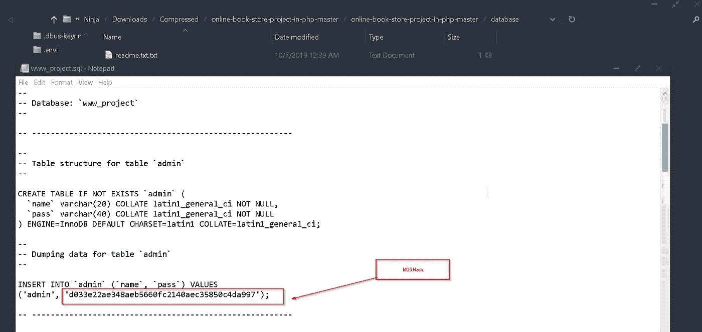
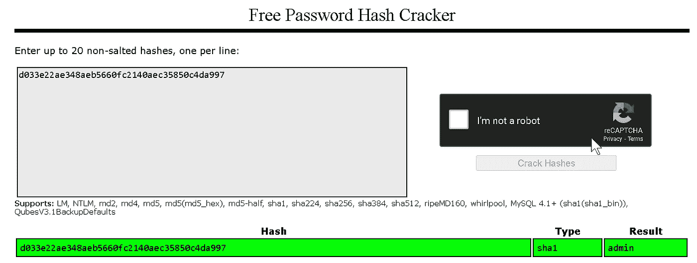
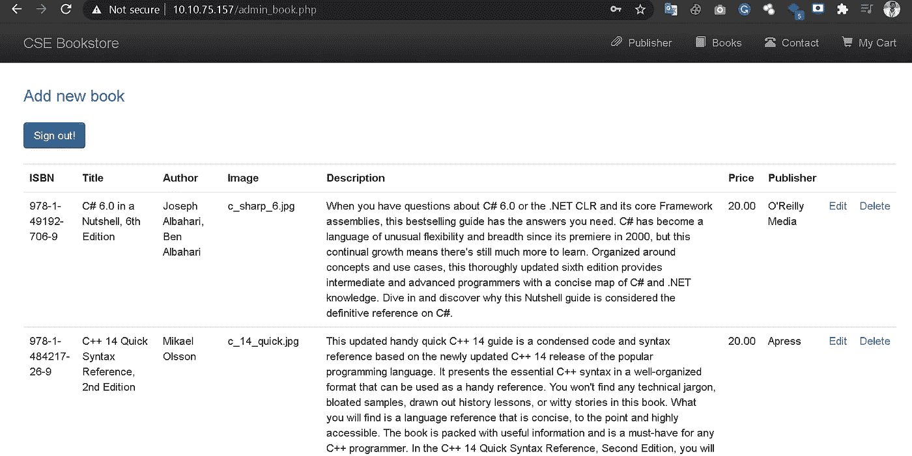

# CVE-2020 年至 24115 年

> 原文：<https://infosecwriteups.com/cve-2020-24115-use-of-hardcoded-credentials-in-source-code-leads-to-admin-panel-access-8262cb51d119?source=collection_archive---------3----------------------->

## 在源代码中使用硬编码凭据会导致管理面板访问

[链接:https://nvd.nist.gov/vuln/detail/CVE-2020-24115](https://nvd.nist.gov/vuln/detail/CVE-2020-24115)

# **漏洞标题** : **网上书店 1.0 —在源代码中使用硬编码凭证导致管理面板访问**
#日期:2020–07–22
#漏洞作者:Mayur Parmar(th3cyb3rc0p)
#厂商主页:[https://project worlds . in/free-projects/PHP-projects/Online-Book-Store-project-in-PHP/](https://projectworlds.in/free-projects/php-projects/online-book-store-project-in-php/)
#软件链接:【链接

**硬编码凭证:**

硬编码密码通常也称为嵌入式凭据，是源代码中的明文密码或其他秘密。密码硬编码是指嵌入纯文本(非加密)密码和其他秘密(SSH 密钥、DevOps 秘密等)的做法。)到源代码中。默认的硬编码密码可以跨许多相同的设备、应用程序、系统使用，这有助于大规模简化设置，但同时也带来了相当大的网络安全风险。

**攻击载体:**

攻击者可以使用默认凭据获得管理面板访问权限，并进行恶意活动。

**重现步骤:**

1.  从[https://project worlds . in/free-projects/PHP-projects/online-book-store-project-in-PHP/](https://projectworlds.in/free-projects/php-projects/online-book-store-project-in-php/)下载源代码
2.  现在将其解压缩并转到**数据库**文件夹，在这里我们可以看到一个 SQL 文件。
3.  现在使用记事本打开该文件，我们可以看到管理员凭据。但是密码是加密的。从模式我确定这是 MD5 散列。因此，我们可以很容易地解密使用 crackstation.net 或任何哈希破解工具，如哈希卡特，约翰开膛手。

资格证书

伪造的证书

4.现在我们有了管理员凭据，因此可以轻松登录门户。

管理员登录

**缓解:**

*   始终使用强大的加密算法，如 SHA-256 盐。
*   从不使用默认凭据在安装时总是会改变

**作者:** [**马尤尔**](https://medium.com/u/4dbaf35dbafc?source=post_page-----9b6c3db4a6c1--------------------------------) **(** [**马尤尔**](https://medium.com/u/4dbaf35dbafc?source=post_page-----8262cb51d119--------------------------------) **)**

在 Twitter 和 LinkedIn 上关注我(通常我会在这些社交媒体平台上分享技巧)

[https://twitter.com/th3cyb3rc0p?lang=en](https://twitter.com/th3cyb3rc0p?lang=en)

[https://in.linkedin.com/in/th3cyb3rc0p](https://in.linkedin.com/in/th3cyb3rc0p)

[https://www.instagram.com/th3cyb3rc0p/?hl=en](https://www.instagram.com/th3cyb3rc0p/?hl=en)

[https://twitter.com/cyberdefecers?lang=en](https://twitter.com/cyberdefecers?lang=en)

[https://ctftime.org/team/112504](https://ctftime.org/team/112504)