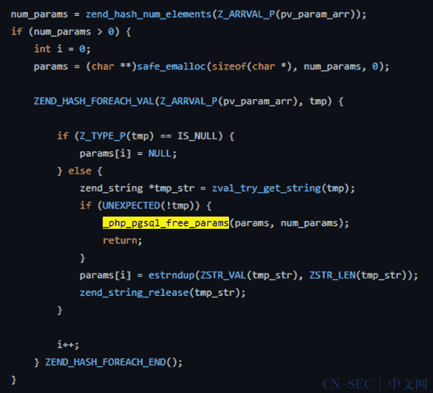
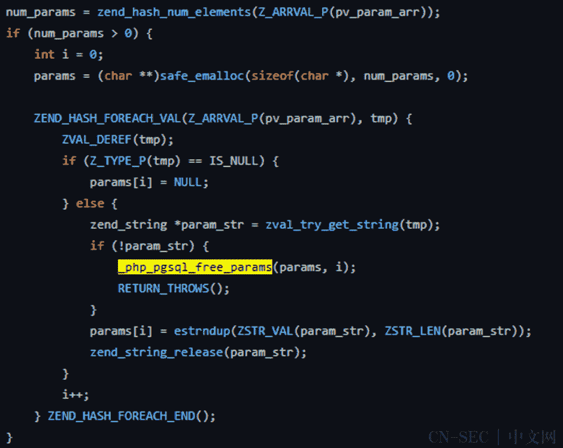

# CVE-2022-31625:由于未初始化的数组导致的 PHP 漏洞

> 原文：<https://infosecwriteups.com/cve-2022-31625-php-vulnerability-due-to-uninitialized-array-30b04f6536f?source=collection_archive---------2----------------------->

## 由于 pg_query_params()函数中未初始化的数组，在 PHP 中发现了一个漏洞。由 [anshul vyas](https://www.instagram.com/_ansh_vyas/) 撰写

## **描述**

在 PHP 7 . 4 . 30 以下的 7.4.x 版本、8.0.20 以下的 8.0.x 版本和 8.1.7 以下的 8.1.x 版本中，当 pdo_mysql 扩展带有 mysqlnd 驱动程序时，如果允许第三方提供要连接的主机和连接的密码，过长的密码会触发 PHP 中的缓冲区溢出，从而导致远程代码执行漏洞。

**严重程度-** 8.8(高)

# **漏洞分析**

## 易受攻击代码

在“PHP_FUNCTION”中，使用“safe_emalloc”来申请指针数组“params ”,但它没有初始化，导致“params”数组包含内存中的剩余数据或指针。如果出现异常，代码将执行` _php_pgsql_free_params `函数来释放整个指针数组:

emalloc()使用 php 自己的内存分配器(它针对 php 的工作负载进行了优化，并强制使用最大内存)。应该尽可能使用 emalloc()，如果 PHP 可能释放或重新分配内存区域，就必须使用它。

由于 pg_query_params()函数中未初始化的数组，在 PHP 中发现了一个漏洞。当使用 Postgres 数据库扩展时，向参数化查询提供无效参数可能会导致 PHP 试图释放内存，使用未初始化的数据作为指针。这可能导致 RCE 漏洞或拒绝服务。

## 补丁代码

此内存未初始化漏洞很容易转化为 UAF 漏洞，其利用比 CVE-2022–31626 更容易。很有可能通过远程堆风水实现任意内存释放，然后通过 UAF 实现远程代码执行。受影响的客户需要尽快进行补丁升级和保护。

UAF 代表释放后使用，是一个与程序运行期间不正确使用动态内存相关的漏洞。如果在释放一个内存位置后，一个程序没有清除指向那个内存的指针，攻击者就可以利用这个错误来攻击这个程序。目前官方修复版本已经发布，用户可以升级到以下安全版本:PHP 8.1.7，PHP 8.0.20 和 PHP 7.4.30。

## 来自 Infosec 的报道:Infosec 每天都有很多内容，很难跟上。[加入我们的每周简讯](https://weekly.infosecwriteups.com/)以 5 篇文章、4 个线程、3 个视频、2 个 Github Repos 和工具以及 1 个工作提醒的形式免费获取所有最新的 Infosec 趋势！