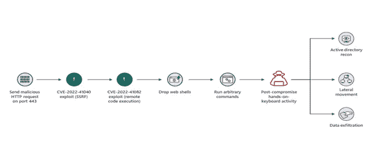
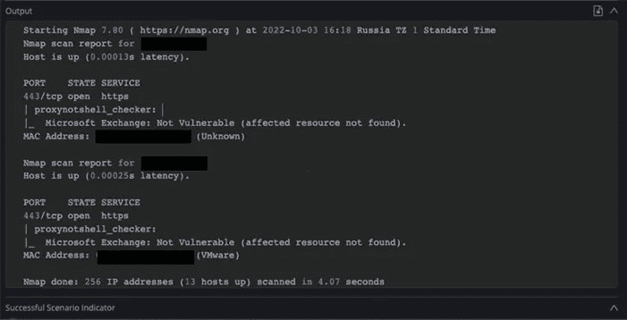
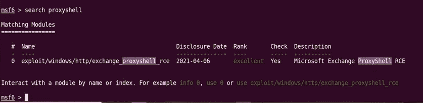

# CVE-2022–41040:ProxyNotShell Exchange 漏洞

> 原文：<https://infosecwriteups.com/cve-2022-41040-proxynotshell-f0b8fb53ec8b?source=collection_archive---------0----------------------->

作者:[安舒尔·维亚斯](https://www.instagram.com/_ansh_vyas/)


[塔达斯·萨尔](https://unsplash.com/@stadsa?utm_source=medium&utm_medium=referral)在 [Unsplash](https://unsplash.com?utm_source=medium&utm_medium=referral) 上的照片

# 什么是 ProxyNotShell 攻击？

这个名为 ProxyNotShell 的严重漏洞是在微软的 exchange server 中发现的，并被 CVE-2022–41040(cvss v3 评分为 6.3)归入服务器端请求伪造(SSRF)类别，同时还有另一个被 CVE-2022–41082(cvss v3 评分为 8.8)归入远程代码执行(RCE)类别的漏洞

# 在哪里找到的？

如前所述，它于 2022 年 9 月 29 日在微软 Exchange 服务器中被发现，微软证实了对手利用两个影响微软 Exchange 服务的零日漏洞的报告。2021 年 8 月，大约 1，900 台微软 Exchange 服务器
已知遭到黑客攻击。女猎手实验室首席执行官凯尔·汉斯洛万(Kyle Hanslovan)表示，有许多组织受到了 ProxyShell 攻击的影响，包括建筑、食品加工、工业机械、维修店、小型民用机场等。

# 它能做什么？

通过利用此漏洞，任何具有恶意内容的攻击者都可以远程执行代码和植入勒索软件，并可以访问 Exchange 邮件服务器上的关键文件，这与其他易于利用的远程代码执行漏洞不同。对于希望了解他们面临的 ProxyNotShell 暴露程度的组织，Cymulate 研究实验室开发了一种自定义的 ProxyNotShell 评估，可用于估计暴露程度。

# 利用它的方法



在利用漏洞之前，您必须知道有很多假冒的人在销售 ProxyNotShell 漏洞利用，要小心他们，来利用漏洞您可以使用 Nmap 脚本引擎(NSE)来利用这个关键的漏洞命令来利用 is

```
nmap --script proxyshell.nse ip/subnet -p 443
```



或者您可以使用 Metasploit 来利用这一点



您只需在 msfconsole 中搜索代理外壳，然后使用数字 0 exploit 来选择漏洞，之后使用命令 show options，然后输入值，然后键入 exploit 来执行有效负载

# 修补此漏洞

尽管 Microsoft 尚未就此漏洞发布官方声明，但他们建议您使用第三方基于 web 的保护或 Web 应用程序防火墙(WAF)产品来实施推荐的 URL 过滤器和阻止。您还可以限制传出连接或在传出代理上限制可疑的 web 请求。

# 事实

●需要对 Exchange 服务器进行身份验证访问
●仅影响内部部署的 Exchange 服务器(2013/2016/2019)
●目前没有可用的补丁
●网络外壳被对手通过链接两个零日
丢弃●微软在全球不到 10 个组织中观察到攻击

## 来自 Infosec 的报道:Infosec 每天都有很多内容，很难跟上。[加入我们的每周时事通讯](https://weekly.infosecwriteups.com/)以 5 篇文章、4 个线程、3 个视频、2 个 GitHub Repos 和工具以及 1 个工作提醒的形式免费获取所有最新的 Infosec 趋势！