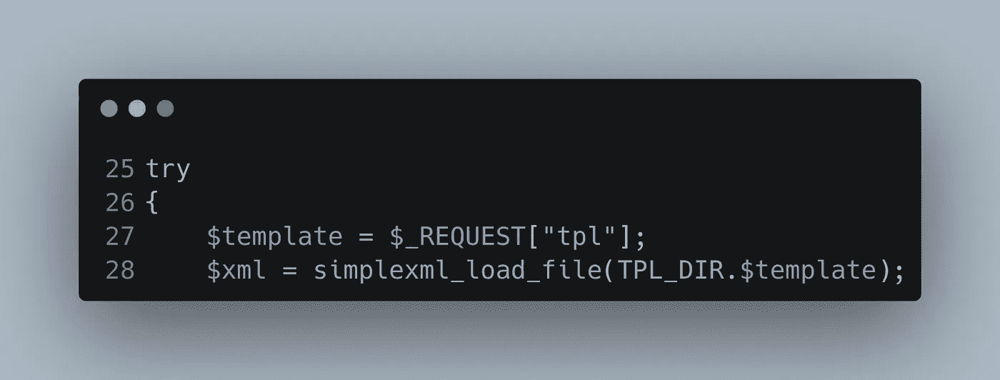
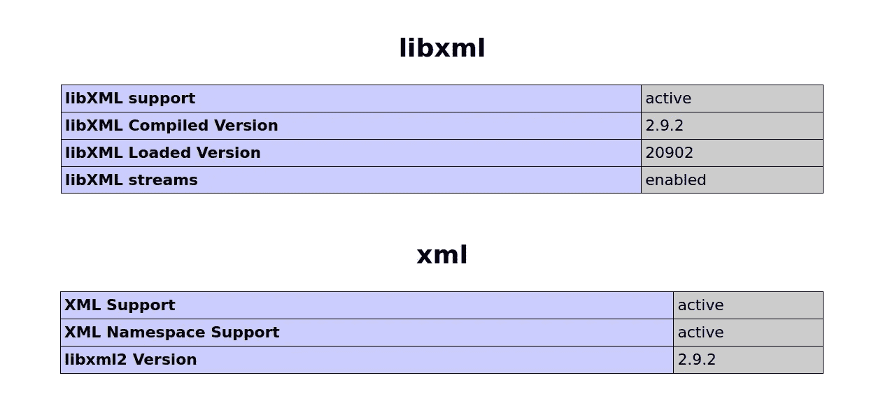
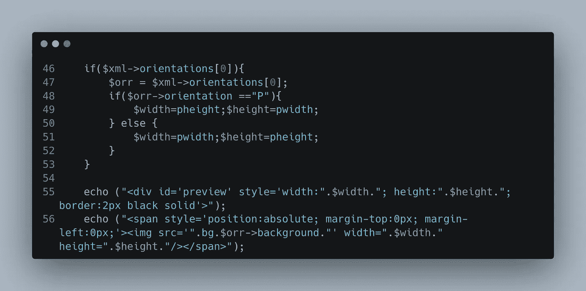
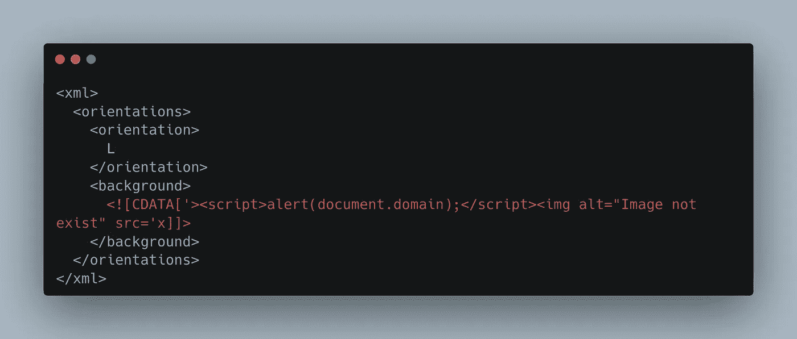
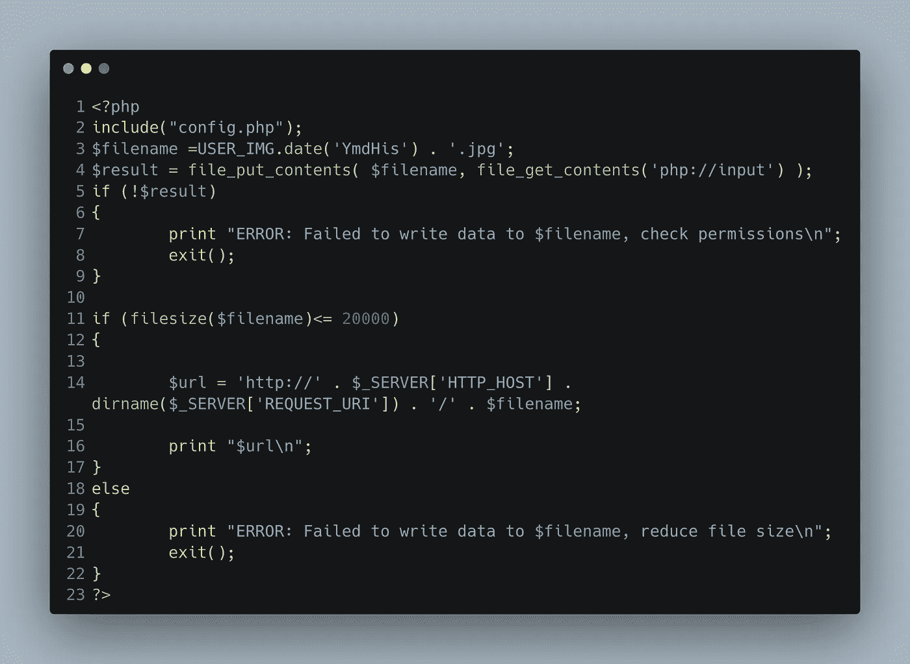
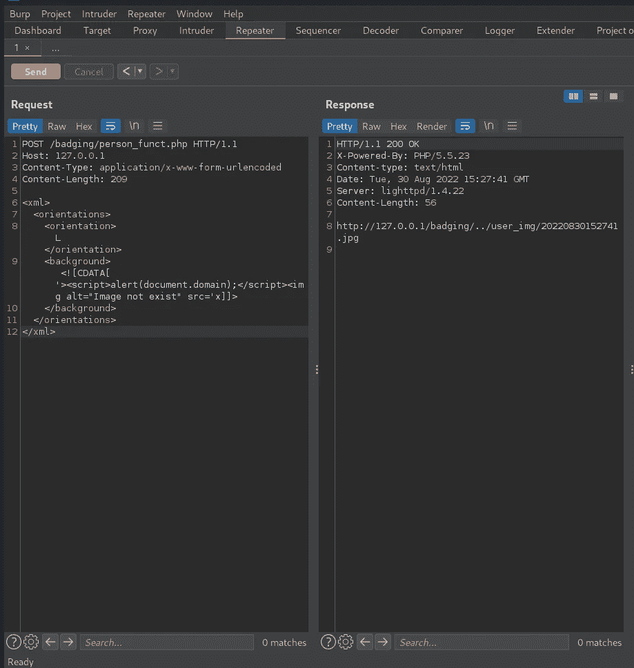
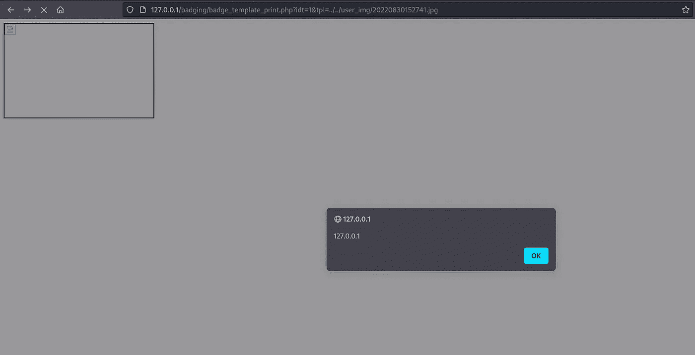

# CVE-2022-42710:从 XXE 到 XSS 的旅行

> 原文：<https://infosecwriteups.com/cve-2022-42710-a-journey-through-xxe-to-stored-xss-851d74dfe917?source=collection_archive---------0----------------------->

## 大家好，我将在这篇文章中与大家详细分享我是如何通过静态分析找到 CVE-2022–42710 的


## 线性浮现 E3 系列概述:

线性浮现 E3 系列是建筑管理系统中的行业领先产品之一，因为它是控制行业中使用最广泛的产品之一

*   学区和校园(K12 和高等教育)
*   企业园区
*   州/地方政府建筑(市政中心、市政厅、警察局、监狱等。)
*   公用事业
*   交通(机场、地铁、公共汽车站)
*   礼拜场所(教堂、大型教堂校园)
*   医疗设施(医院、制药公司、生物实验室等。)
*   更多

## 让我们开始静态分析:

当我在做安全源代码审查时，我看到了这个 PHP 脚本

http://127 . 0 . 0 . 1/badging/badge _ template _ print . PHP



> 配置文件中的 TPL _ DIR = TPL/

我们从用户那里获得“tpl”参数，然后将它传递给 simplexml_load_file，这样我们的输入将被 xml 解析器解析，乍一看，它似乎不容易受到 XXE 的攻击，而容易受到 XXE 的攻击，它需要加载“LIBXML_NOENT”类，该类替换导致 XXE 的外部实体

易受 XXE 攻击的代码示例

```
try
{
    $template = $_REQUEST["tpl"];
    $xml = simplexml_load_file(TPL_DIR.$template, 'SimpleXMLElement', LIBXML_NOENT);
```

但这不是我们的情况，所以到目前为止，它还不容易受到 XXE 的影响

但是我开始收集更多关于 XML 解析器库的信息



好的，libxml 版本不容易受到 XXE 的攻击，默认情况下在最新版本中“替换外部实体”,但根据这个版本，它似乎有点旧，所以我们需要在 https://www.cvedetails.com/的 CVE 详细信息[上做一些搜索](https://www.cvedetails.com/)

也许有剥削或以某种方式滥用功能在一个坏的方式

在做了一些搜索后，发现了一些漏洞，但它们与应用程序的配置不匹配，所以它们不会导致任何漏洞

无论如何，上述步骤在我们的静态代码分析中很重要，因为它有时会导致严重的漏洞

有一位研究人员在对一个 java 应用程序进行代码审查时发现了一个类似的场景，他发现开发人员使用 XMLparser 库，默认情况下允许外部实体替换，最终导致 XXE 漏洞，您可以在 https://nvd.nist.gov/vuln/detail/CVE-2017-1000190[的](https://nvd.nist.gov/vuln/detail/CVE-2017-1000190)找到关于易受攻击应用程序在之前的场景中使用的易受攻击的 XML parser 库的更多详细信息

因此，我没有找到这个特定版本的任何内容，唯一允许的方法是将“LIBXML_NOENT”类添加到“simplexml_load_file”函数中，以替换外部实体，这样产品就不会受到 XXE 的攻击

所以让我们回到我们的主题

在下划线代码中，我们可以知道 XML 数据将如何被解析



应用程序将一个文件作为输入，由 XMLparser 解析它，然后将它保存在$xml 变量中

正如你在上面的代码中看到的，输入文件应该包含一个方向标签，在它里面应该有两个标签方向和背景标签，然后在第 56 行你会发现背景标签里面的任何内容都会被打印出来

因此，为了实现我们的 XSS，我们应该首先定义<xml>标记，让解析器知道我们解析 XML 文件，然后像我们在 PHP 代码中看到的那样定义<orientations>标记，然后在它内部定义两个标记，第一个是<orientation>标记，第二个是<background>标记，它们将通过 echo 函数打印，并包含我们的 XSS 有效负载</background></orientation></orientations></xml>

最终的有效载荷会是这样的



剥削

CDATA 用于命令解析器，文档的特定部分不包含标记，应该被视为常规文本，而不是 XML

这样做的原因是让解析器将我们的

但是等一下

我们如何上传包含利用漏洞实现 XSS 的 XML 文件？

在对应用程序做了一些研究后，我发现了这个 PHP 脚本

http://127 . 0 . 0 . 1/badging/person _ funct . PHP



这是一个文件上传功能，验证大小，以防止 DOS 攻击，并命名与上传文件的时间，以防止 XSS 在文件名和部队”。jpg "文件扩展名，以防止上传恶意扩展名

> 在这个 PHP 脚本中有一些最佳实践，但是让我们关注更重要的事情

现在我们需要上传 exploit.xml 文件，但是应用程序强制使用 jpg 扩展名，那么我们该如何做呢

实际上，文件扩展名是什么并不重要，因为 simplexml_load_file()使用的 XML 解析器并不关心文件扩展名，它所关心的只是文件语法，所以我们将使用“http://127 . 0 . 0 . 1/badging/person _ funct . PHP”脚本上传我们的漏洞



上传我们的 expolit 请求

我们的漏洞被上传到“http://127 . 0 . 0 . 1/user _ img/20220830152741 . jpg”

现在我们将在“http://127 . 0 . 0 . 1/badging/badge _ template _ print . PHP”脚本中使用 tpl 参数请求它

但是我们在“user_img”目录中的漏洞和易受攻击的函数从不同的目录“/badging/tpl/”中加载文件，那么我们如何加载我们的漏洞呢？

我们需要从 user_img 目录中获取漏洞，因此我们将进行目录遍历”../../user_img "从" http://127.0.0.1/badging/tpl/"目录转到我们的漏洞所在的" http://127.0.0.1/user_img "目录

> http://127 . 0 . 0 . 1/badging/badge _ template _ print . PHP？idt=1&tpl=../../user_img/20220830152741.jpg



我们得到了我们储存的 XSS

## 自动化漏洞脚本:

[https://github . com/omarhashem 123/Security-Research/tree/main/CVE-2022-42710](https://github.com/omarhashem123/Security-Research/tree/main/CVE-2022-42710)

# 保持联络

推特: [@OmarHashem666](https://twitter.com/OmarHashem666)

领英:【https://www.linkedin.com/in/omar-1-hashem 

YouTube:【https://www.youtube.com/@omarhashem7351 

## 来自 Infosec 的报道:Infosec 每天都有很多内容，很难跟上。[加入我们的每周简讯](https://weekly.infosecwriteups.com/)以 5 篇文章、4 个线程、3 个视频、2 个 GitHub Repos 和工具以及 1 个工作提醒的形式免费获取所有最新的 Infosec 趋势！