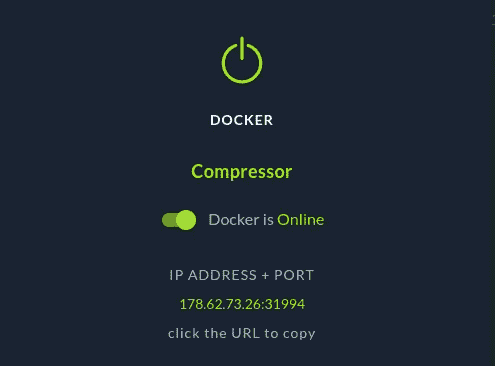
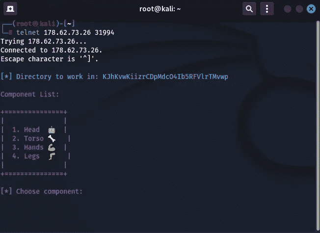
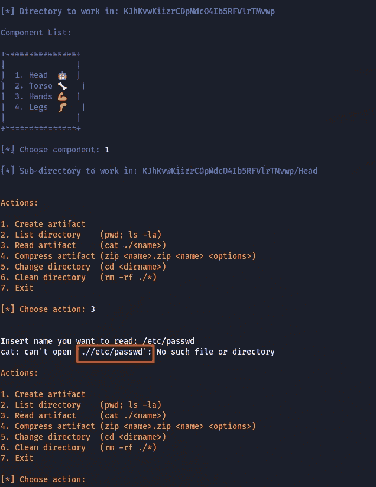
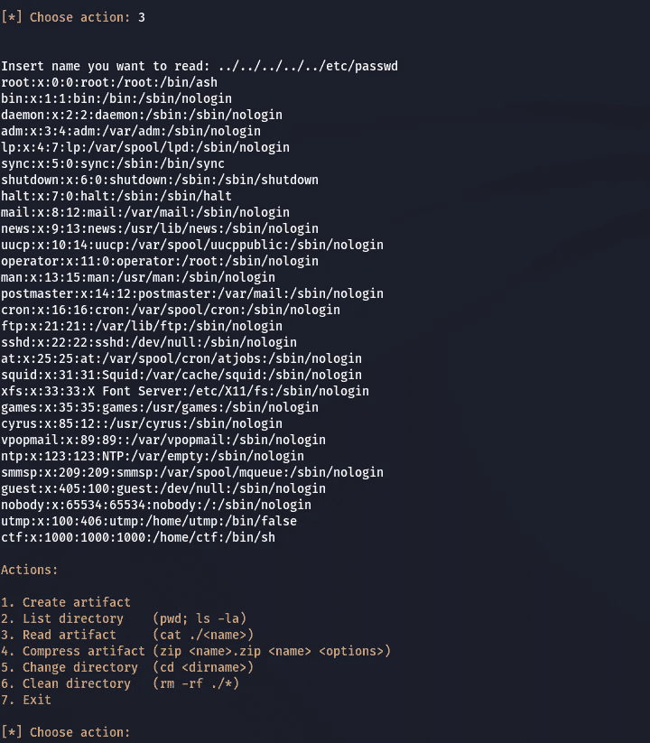
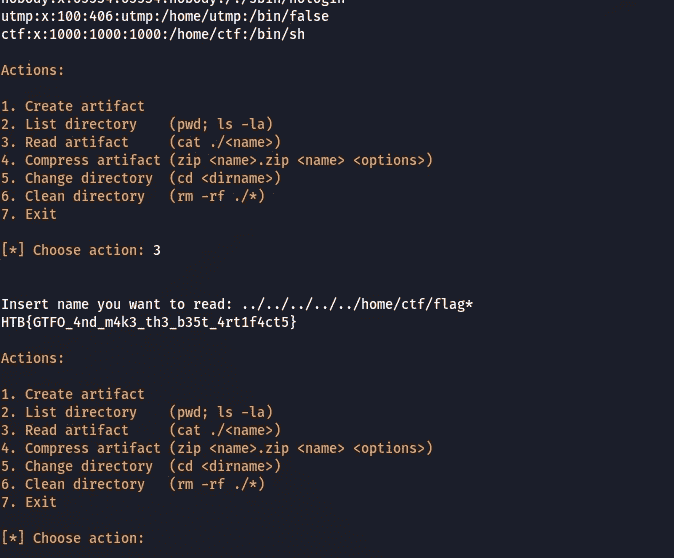

# 网络启示录 CTF 2022 —杂项—压缩机报道(简易方法)

> 原文：<https://infosecwriteups.com/cyber-apocalypse-ctf-2022-misc-compressor-write-up-easy-way-de9efcccd6af?source=collection_archive---------4----------------------->

**提示:**

压缩器
拉蒙娜对身体改造和添加神器的痴迷已经拖慢了她的速度，让她在许多任务中失败并差点丧命。正因如此，她决定黑掉金方旗下一个名为“压缩器”的微型机器人，它可以根据任务需要缩小和增大任何物体的体积，使其最小化/最大化。有了这个东西，她将能够携带任何她需要的备用零件，而不会增加她背部的额外重量，使她速度更快。你能帮她拿去黑吗？

**开始:**

这个挑战没有任何可下载的部分。还有另一种方法，但我想向你展示应对这一挑战的最简单的方法。你可以查看其他文章来了解更多信息。

因此，我们正在尝试通过 telnet 连接。

然后我们选择 1 和另一个选项表显示。

看起来我们可以使用一些终端命令，我正在尝试阅读 etc passwd 来了解 home 路径在哪里..但是无法打开，因为程序检查存在路径。

我正在尝试访问那里的攻击，比如 lfi 有效载荷和 done，它给了 etc passwd。

我正按照一些步骤去抓旗子..

