# 网络启示录 CTF 2022 —网络—在美国报道中

> 原文：<https://infosecwriteups.com/cyber-apocalypse-ctf-2022-web-amidst-us-write-up-a6864e23c3b9?source=collection_archive---------3----------------------->

**提示:**

在我们
中，阿米塔斯部落是一个臭名昭著的雇佣潜伏间谍组织。我们有可信的理由相信他们与德雷格合作，所以我们必须采取行动揭露他们的身份。尤利西斯和邦妮潜入了他们的总部，在一台未上锁的电脑上发现了这个神秘的入口。尽管能见度很低，你能黑进去让他们进入吗？

**开始:**

这是一个网络挑战，我们有应用程序的源代码，所以我们正在下载它，并在从真正的网站上获得标志之前，在我们的本地测试它。

首先，我们正在检查网站及其功能，

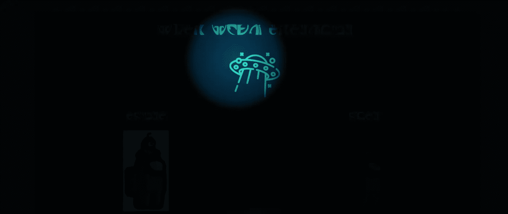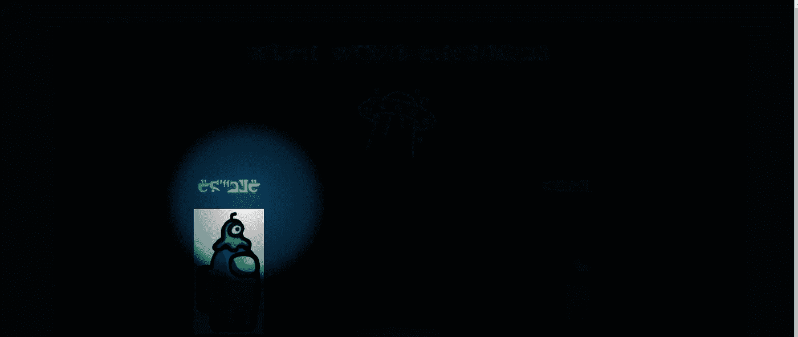

网站就像一个暗室，我们有手电筒。我正在检查任何可点击的东西，我发现如果我们点击不明飞行物，它给上传图像的机会。当我上传它时，图像呈现在同一个页面上..

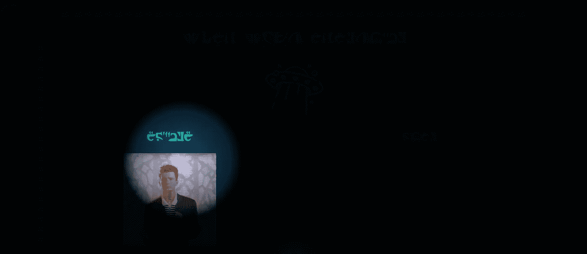

还有另一个互动部分，我们可以改变一些东西的颜色..

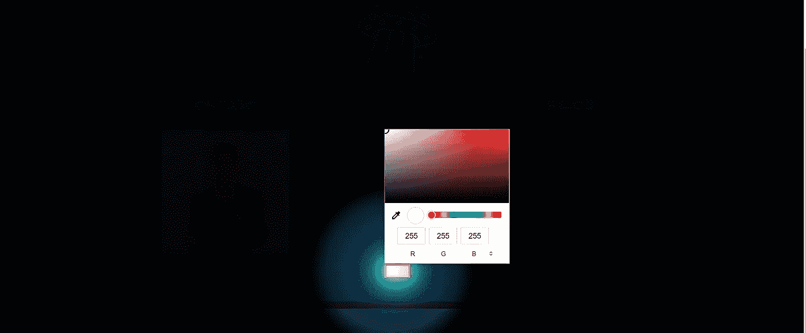

当我试图拦截他们时，我做不到..为了拦截它们，你可能需要告诉它代理图像和东西，默认是隐藏 css，图像和二进制文件。

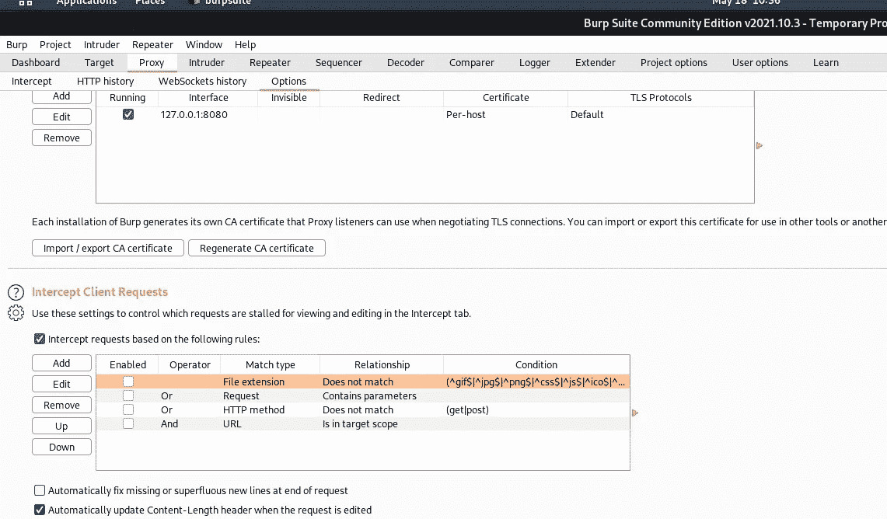

对于打嗝套件，请遵循以下路径..

代理>选项>拦截客户端请求>>取消选中文件扩展名选项。

然后我们可以拦截请求。

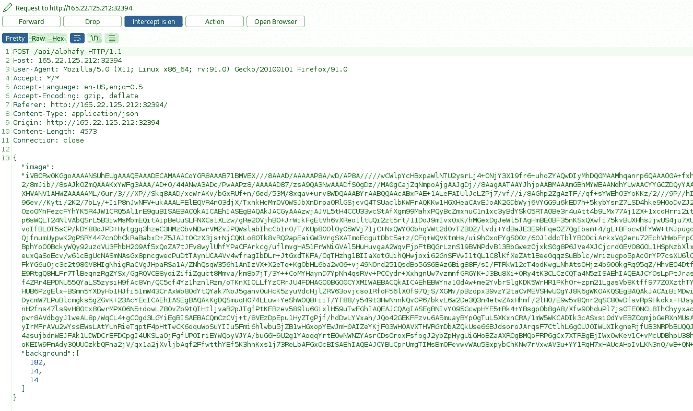

当我检查源代码时，我总是检查应用程序所需的东西，看看是否有任何版本漏洞。在这个应用上，我们看到了 Pillow 8.4.0。问题是为什么特别需要这个版本。

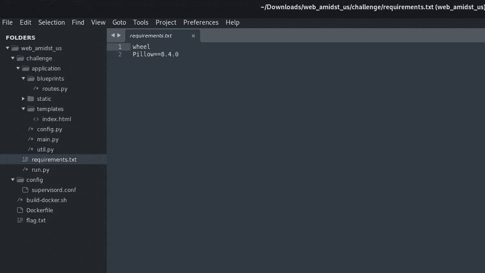

当我们研究它时，我们了解到该应用程序使用 Pillow 来处理图像，如果通过 eval 运行(它正在这样做)[https://security-tracker.debian.org/tracker/CVE-2022-22817](https://security-tracker.debian.org/tracker/CVE-2022-22817)

让我们回头看看代码，看看是否有 eval 函数。

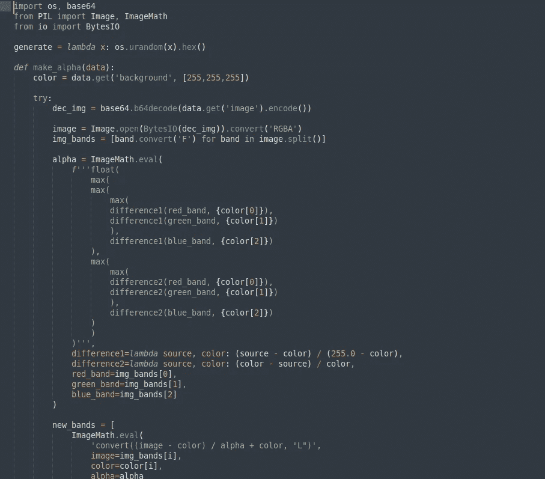

是的，有一个来自 ImageMath 的 eval 函数..

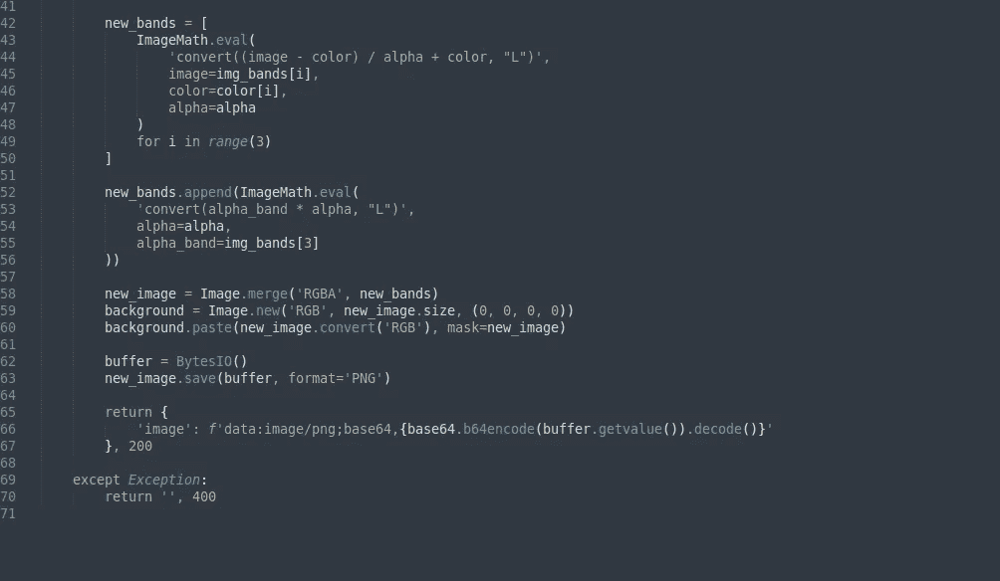

在下面的代码，这是转换图像从 base64 等..

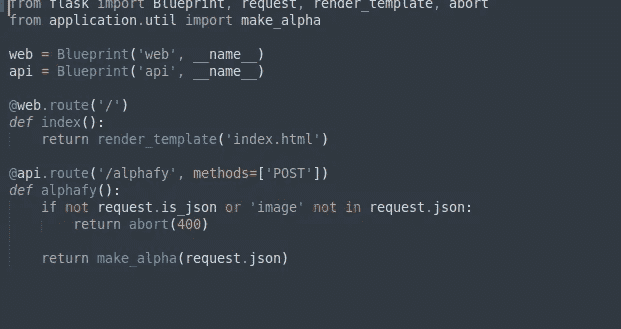

对于路由部分，它只是检查它是 JSON 还是包含 image..因此，将我们的有效载荷注入背景 rgb 颜色是最好的方法..从源代码中，我们确切地知道路径，所以我们可以写一些路径的标志。(如果您没有 rce 漏洞的源代码，首先可以尝试 id、whoami 或 ping 方法)

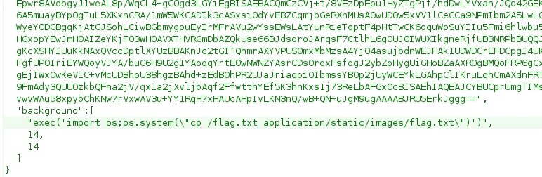

由于它是外部网站，我没有得到一个反国旗外壳..它需要 ngrok 或外部 ip，所以这是最简单的方法。

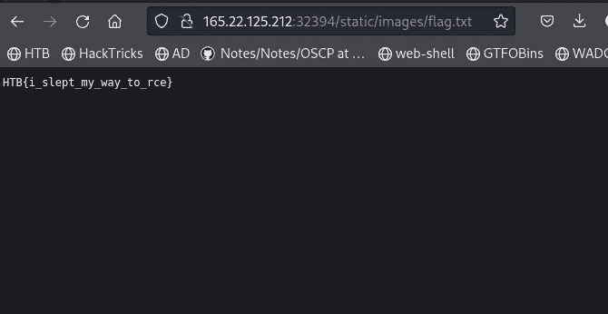