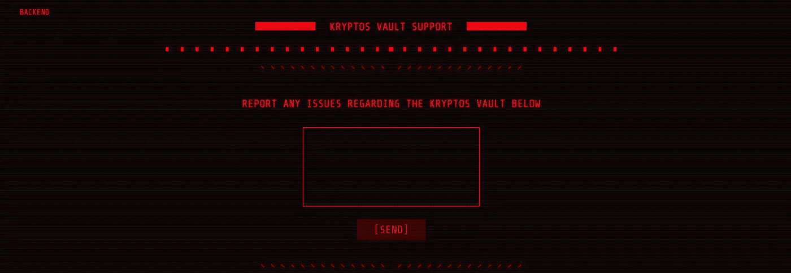
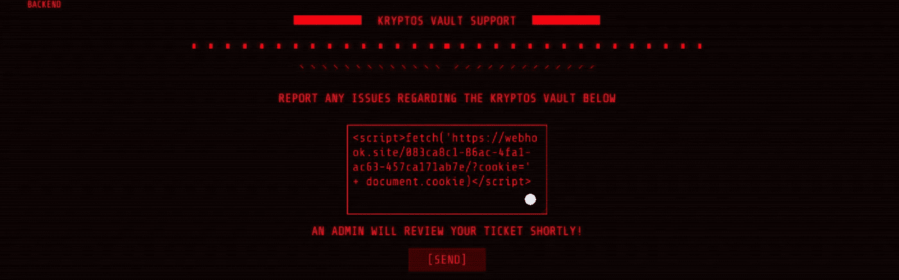
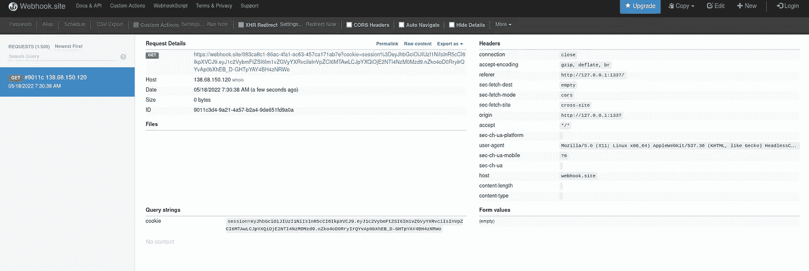
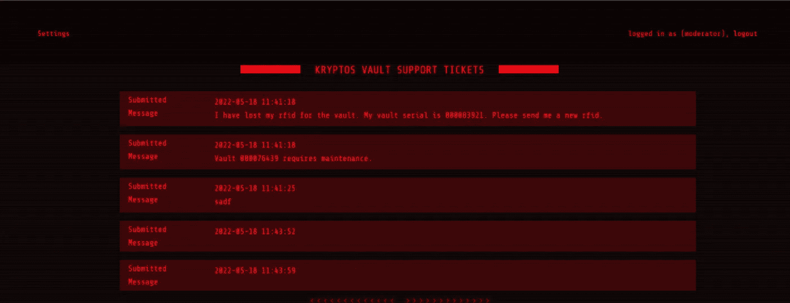
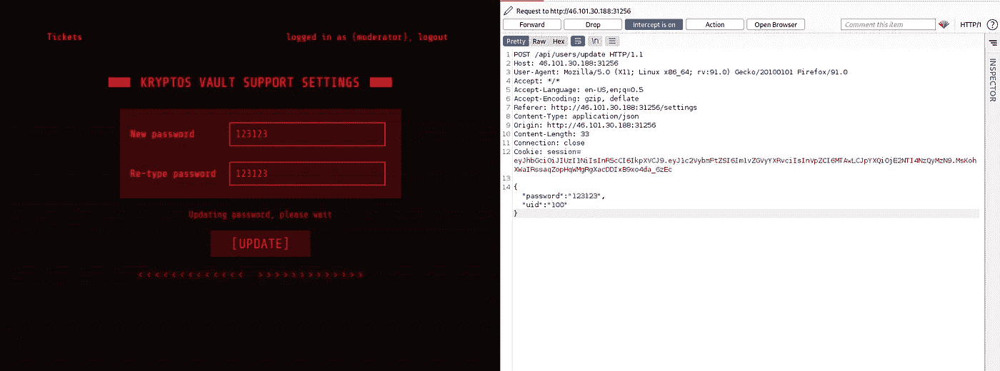
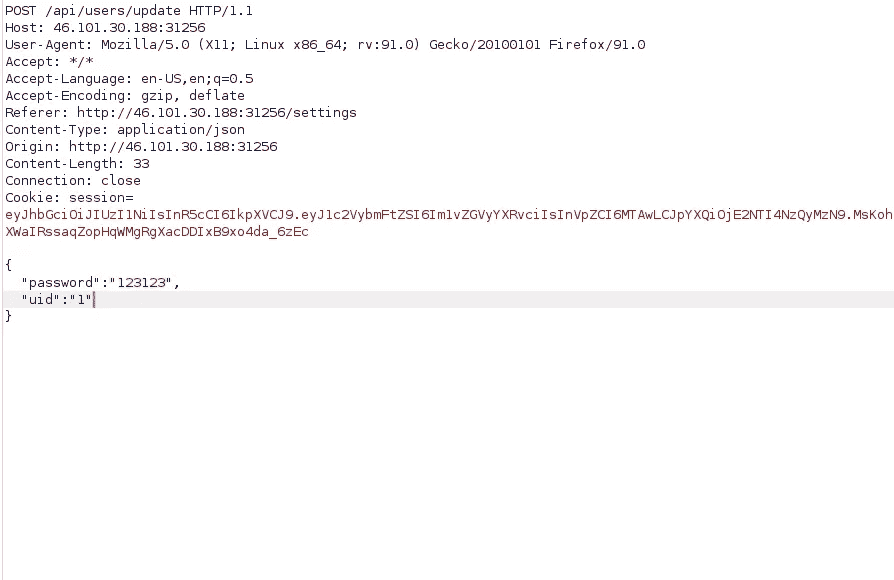
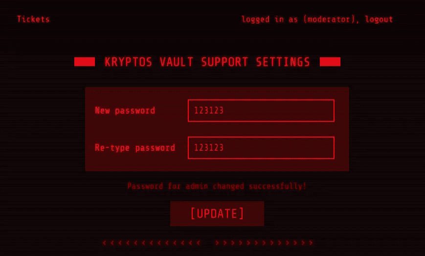
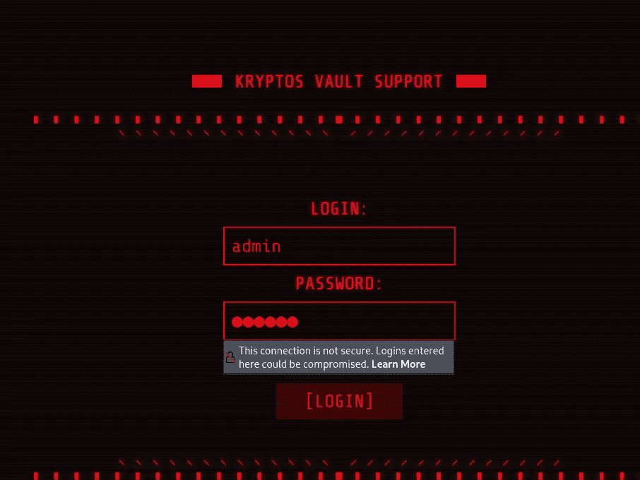
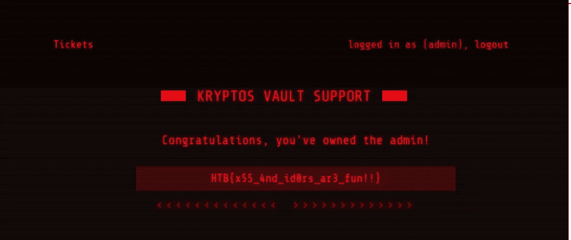

# 网络启示录 CTF 2022 —网络—氪星支持报道

> 原文：<https://infosecwriteups.com/cyber-apocalypse-ctf-2022-web-kryptos-support-write-up-2cf5057c4161?source=collection_archive---------5----------------------->

**提示:**

氪星支持
龙希尔的星球议会使用的秘密金库氪星包含一些非常敏感的国家机密，维吉尔和雷蒙娜正在寻找这些机密来证明委员会的不公正。尤利西斯应他们的要求进行了一次初步侦察，并找到了一个支持金库的入口。你能不能看看你能不能渗透进这个系统？

**开始:**

这是一个网络挑战，没有源代码可以下载并在本地测试。所以我们将在没有任何代码审查的情况下进行攻击..

网站看起来是这样的。

因为是票系统，首先想到的是我们发送一些东西给管理员，他会审查它。所以去 XSS 试试是个好主意。

我正在打开一个 webhook 网站，并编写我的有效载荷来检查管理员是否点击了它。

是的，我偷了饼干..因此，从开发人员工具，我们可以设置我们的 cookie 登录为管理员..

我们看到了门票，但它们不是交互式的，所以我点击设置，有一个门户网站可以帮助我们更改密码。

当我通过 burp 检查它时，我看到只有 uid 和密码数据进入服务器，所以即使我们改变 uid，我们也无法理解..但是正如你所知道的，几乎所有的网站管理员的 uid 都是 1，有时是 0。所以我把它改成 1..

然后嘣..有一个 idor 漏洞可以帮助我们更改管理员的密码..

我们以管理员身份从/登录路径登录

我们抓住了这次挑战的旗帜..

