# 网络卫士恶意软件流量分析 2 演练

> 原文：<https://infosecwriteups.com/cyber-defenders-malware-traffic-analysis-2-walkhthrough-9dee33e3d5e7?source=collection_archive---------1----------------------->

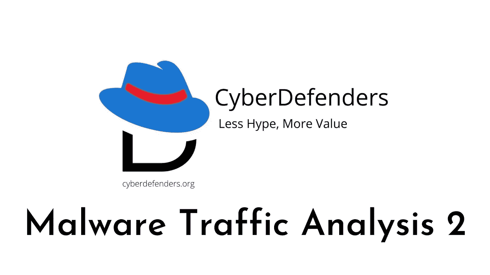

cyberdefenders.org/ CTF 站点

挑战名称:恶意软件流量分析 2

作者:布拉德·邓肯

## QST 1)被感染的 Windows 虚拟机的 IP 地址是什么？

**路径** : *打开网络矿工中的 pcap，查看 windows 机器*

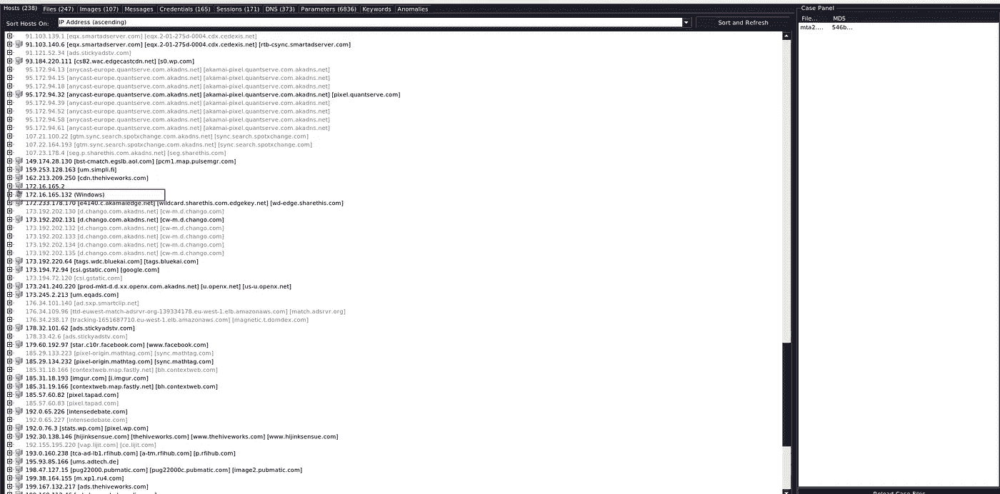

> 答复:172.16.165.132

## QST 2)受感染虚拟机的 MAC 地址是什么？

**路径** : *我们知道被感染系统的 ip 地址。使用 ip.addr==172.16.165.132 过滤器并检查以太网 II 的 mac 地址，或者在 NetworkMiner* 中展开(+)受感染的 ip。

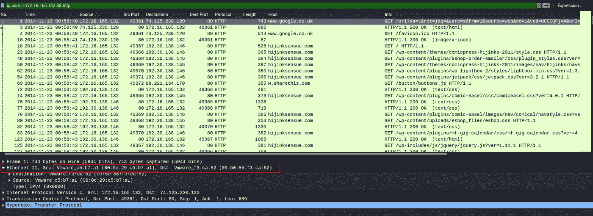

> 答案:00:0c:29:c5:b7:a1

## QST 3)提供漏洞工具包和恶意软件的 IP 地址和端口号是什么？

**路径** : *打开 brim security 中的 pcap，在搜索框中搜索文件。查看所有文件的 mime 类型。我们可以看到有一个应用程序/x-dosexec。在大多数情况下，这些类型的文件是可执行的和恶意的。这是一个可下载的文件。要确认我们的答案，请打开 Wireshark 并使用 ip.src==37.143.15.180 filter 检查端口号和文件内容。这真的很可疑*

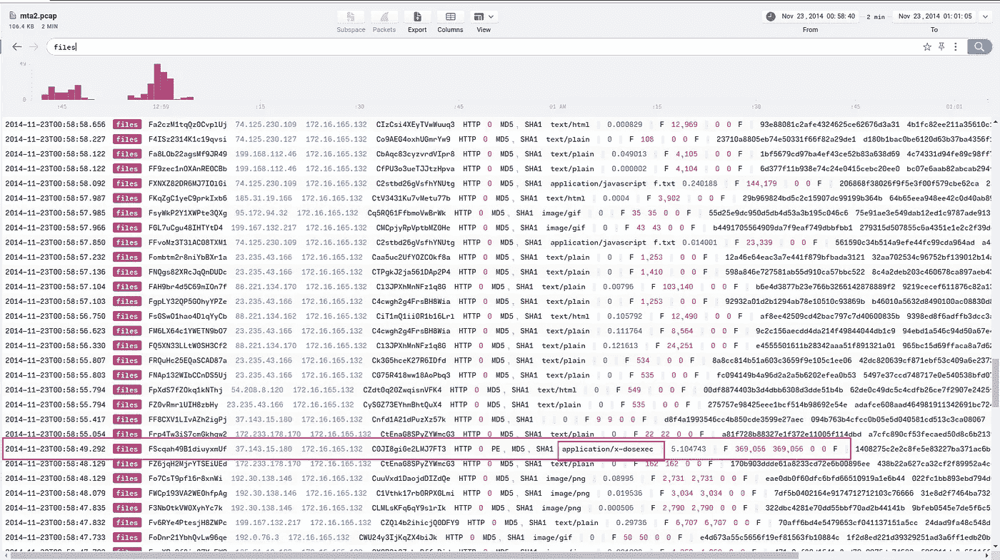

> 答:37.143.15.180:51439

## QST 4)提供漏洞工具包的两个 FQDN 是谁？按字母顺序用逗号分隔。

**路径:** *在 NetworkMiner 中打开 pcap，查看可疑域*

> 答案:g.trinketking.com，h.trinketking.com

## QST 5)被入侵网站的 IP 地址是什么？

**路径:** *打开 Wireshark，转到统计- >对话- > ipv4，记下发送数据包最多的所有 ip 地址。请记住，总是大多数数据包传送的 ip 地址不是恶意/可疑的。但有时也可能存在可疑活动*

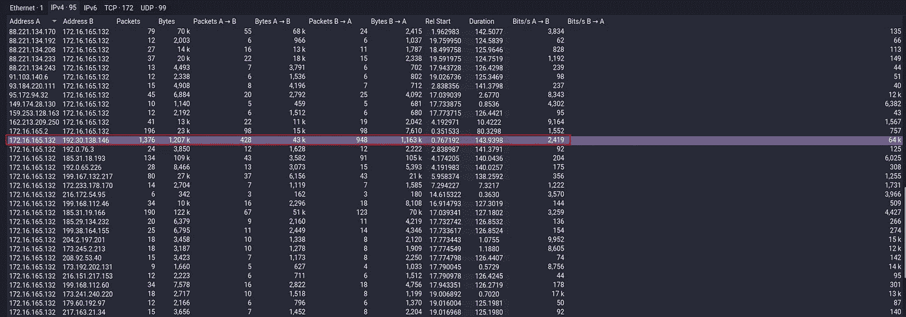

> 答:192.30.138.146

## QST 6)被入侵网站的 FQDN 是多少？

**路径:** *我们知道被入侵网站的 ip 地址。使用 wireshark 并找到主机名*

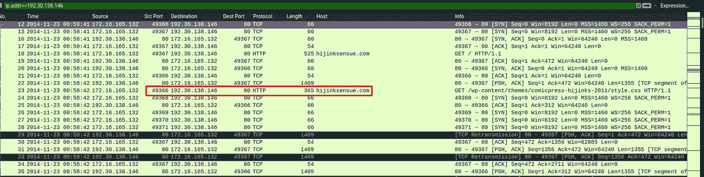

> 答:hijinksensue.com

## QST 7)这个 PCAP 是什么时候被俘虏的？

**路径:**

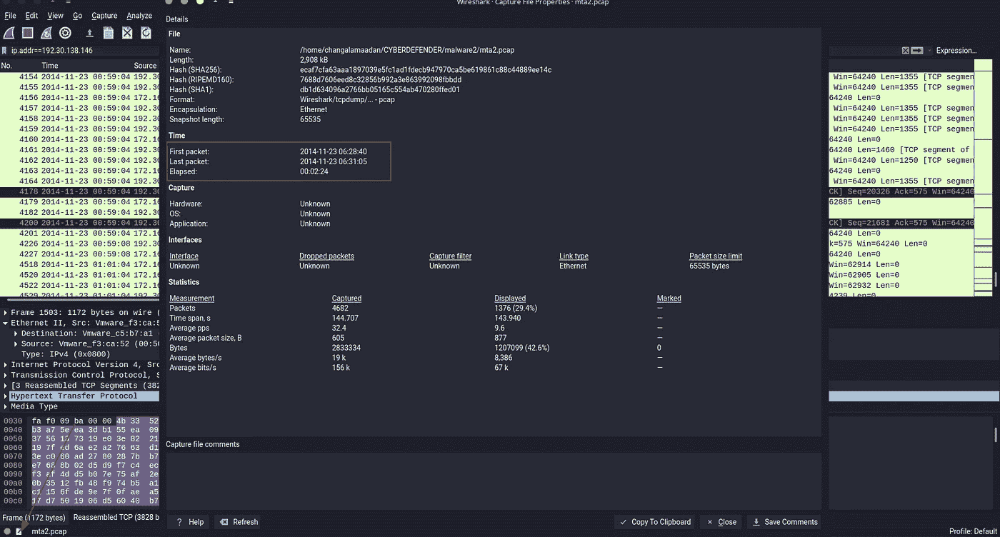

> 答复:2014 年 11 月 23 日

## QST 8)从 PCAP 中提取恶意软件有效载荷(PE 文件)。什么是 MD5 哈希？

**路径:** *在 Wireshark 中打开 pcap，转到文件- >导出对象- >将应用程序/x-dosexec 保存在您的设备中，并将文件上传到 virustotal.com。分析报告并找到答案*

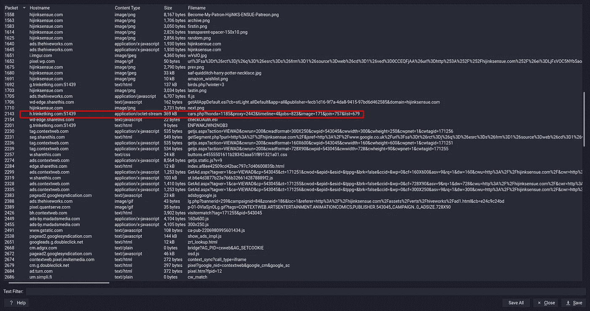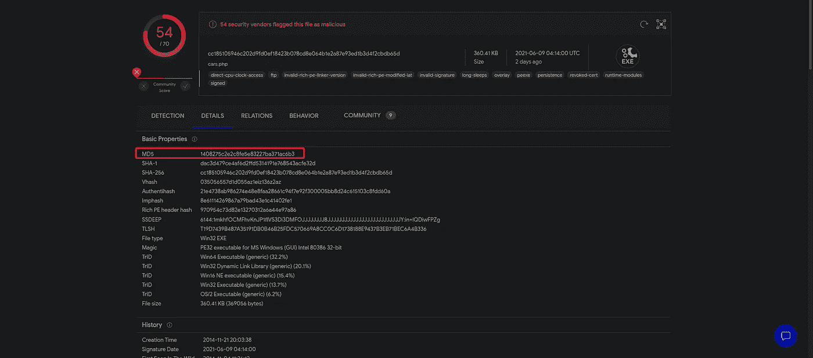

> ans:1408275 C2 e2c 8 Fe 5 e 83227 ba 371 AC 6 b 3

## QST 9)PE 文件是什么时候编译的？

**路径:**

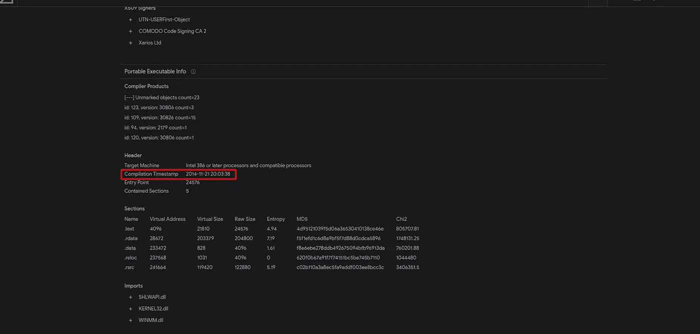

> 答复:2014 年 11 月 21 日

## QST 10)返回文件“f.txt”的被访问 URI 的推荐人是谁？

**路径:** *在 Brim security 中打开 pcap，查看文件活动。这里我们可以看到 f.txt 文件。然后打开它看 http 部分*

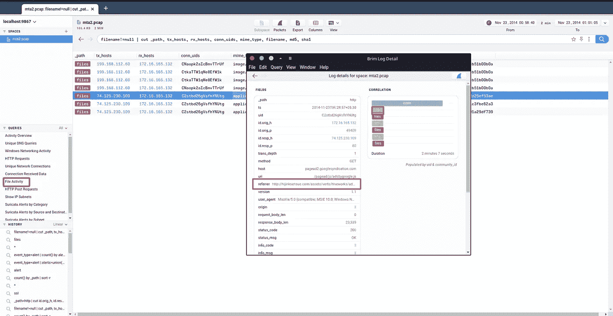

> 答案:[http://hijinksensue.com/assets/verts/hiveworks/ad1.html](http://hijinksensue.com/assets/verts/hiveworks/ad1.html)

## QST 11)使用 Zeek 分析花费最长时间(持续时间)的文件的 mime 类型是什么？

**路径:**MIME 类型是用于标识数据类型的标签。

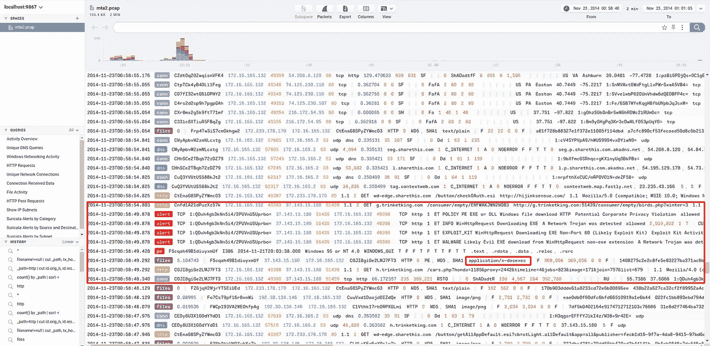

Ans:应用程序/x-dosexec

## QST 12)指向漏洞利用工具包登录页面的重定向 URL 是什么？

**路径** : *这里我依赖一个在线 pcap 分析网站。这是个很棒的网站。它注意到所有可疑的活动，并给你一个全面的分析报告。但缺点是只允许 50md 以下的 pacap 文件，并且分析数据是公开的。*

*进入*[*https://packettotal.com*](https://packettotal.com)*上传 pcap 文件，查看恶意活动区*

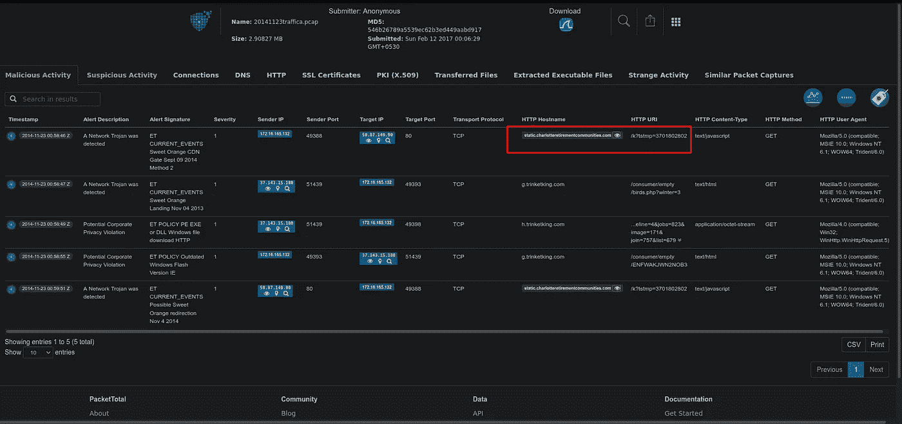

> 答:static.charlotteretirementcommunities.com/k?tstmp=3701802802

## QST 13)指向漏洞利用工具包登录页面的重定向 URL 的 IP 地址是什么？

**路径**

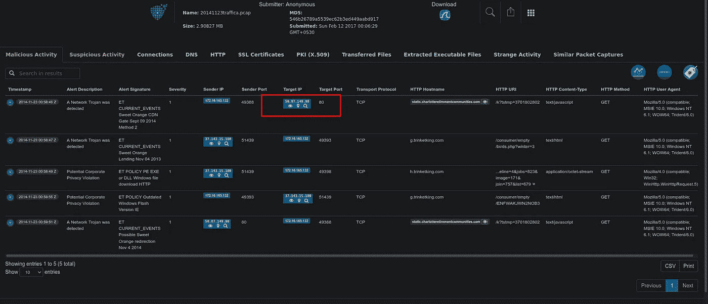

> 答:50.87.149.90

## QST 14)传播恶意软件的漏洞利用工具包(EK)的名称是什么？(两个字)

**路径:**

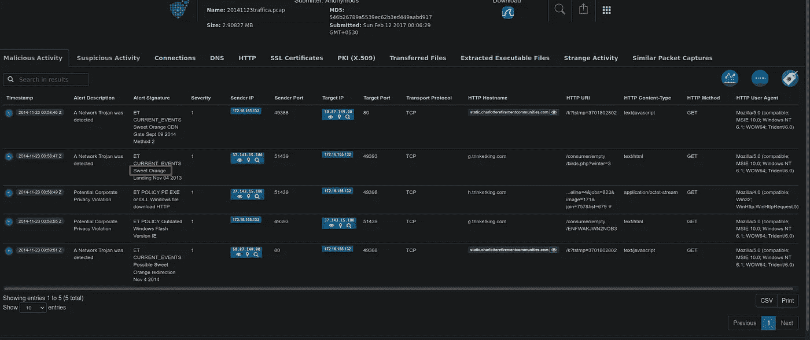

> 答案:甜橙

## QST 15)被利用漏洞的 CVE 是什么？

**路径:** *我们知道网络木马的名字。我在谷歌搜索甜橙的 CVE*

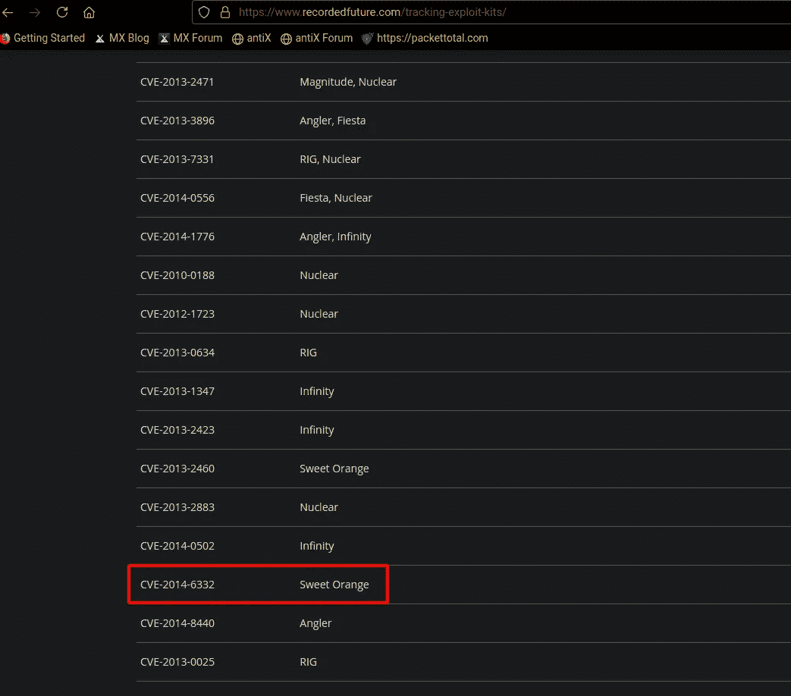

> 答:CVE-2014–6332

## QST 16)只出现过一次的 SSL 证书颁发者的名称是什么？(一个词)

**路径:**[*https://try.bro.org/#/?example=hello*](https://try.bro.org/#/?example=hello)*使用此网站，上传 pcap 并转到 ssl 部分*

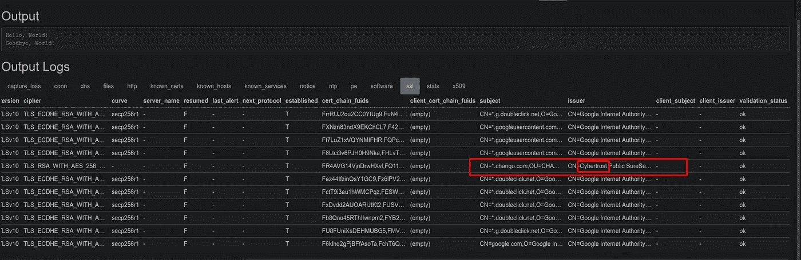

> 答:网络信任

## QST 17)在编译当前 PE 文件期间启用了哪两种保护方法？格式:按字母顺序逗号分隔

**路径:** *对我来说是一个复杂的挑战。这里我只知道一件事，这是一个恶意软件静态分析相关的问题。我使用 Linux 作为主要机器，所以我的系统不支持提示中给出的工具。所以我尝试了一些 Linux 支持的恶意软件分析工具。但那对我无效。然后我决定使用在线分析工具。我真倒霉，我找不到任何有趣的东西。然后决定手动找答案。我找到了第一个答案，但没有找到第二个答案。最后，经过两天的研究，我找到了答案。*

 [## 可执行空间保护-维基百科

### 在计算机安全学中，可执行空间保护将内存区域标记为不可执行的，这样试图…

en.wikipedia.org](https://en.wikipedia.org/wiki/Executable_space_protection)  [## 什么是数据执行保护(DEP)？-来自 Techopedia 的定义

### 数据执行保护(DEP)是操作系统中的一项安全功能，可防止应用程序执行…

www.techopedia.com](https://www.techopedia.com/definition/50/data-execution-prevention-dep) 

> 答:DEP。圣伊丽莎白医院

引用链接

 [## network miner-nsm 和网络取证分析工具⛏

### NetworkMiner 是一个用于 Windows 的开源网络取证分析工具(NFAT)

www.netresec.com](https://www.netresec.com/?page=networkminer)  [## [计] 下载

### 单击下面的链接，开始为您的平台下载软件。Brim 桌面应用程序可用…

www.brimsecurity.com](https://www.brimsecurity.com/download/)  [## 一个免费的在线 PCAP 分析引擎

### PacketTotal 是一款免费的在线 PCAP 分析器，旨在可视化网络流量，检测恶意软件，并提供…

packettotal.com](https://packettotal.com/)  [## 跟踪移动目标:利用工具包和 CVE

### 一年前，一个臭名昭著的编写黑洞开发工具包的程序员庞奇被逮捕并被指控…

www.recordedfuture.com](https://www.recordedfuture.com/tracking-exploit-kits/)  [## 试试齐克

### 编辑描述

try.bro.org](https://try.bro.org/#/?example=hello)  [## 可执行空间保护-维基百科

### 在计算机安全学中，可执行空间保护将内存区域标记为不可执行的，这样试图…

en.wikipedia.org](https://en.wikipedia.org/wiki/Executable_space_protection)  [## 什么是数据执行保护(DEP)？-来自 Techopedia 的定义

### 数据执行保护(DEP)是操作系统中的一项安全功能，可防止应用程序执行…

www.techopedia.com](https://www.techopedia.com/definition/50/data-execution-prevention-dep) 

谢谢大家…..