# 网络防御者 Phishy 演练

> 原文：<https://infosecwriteups.com/cyber-defenders-phishy-walkthrough-ea10826ac711?source=collection_archive---------4----------------------->

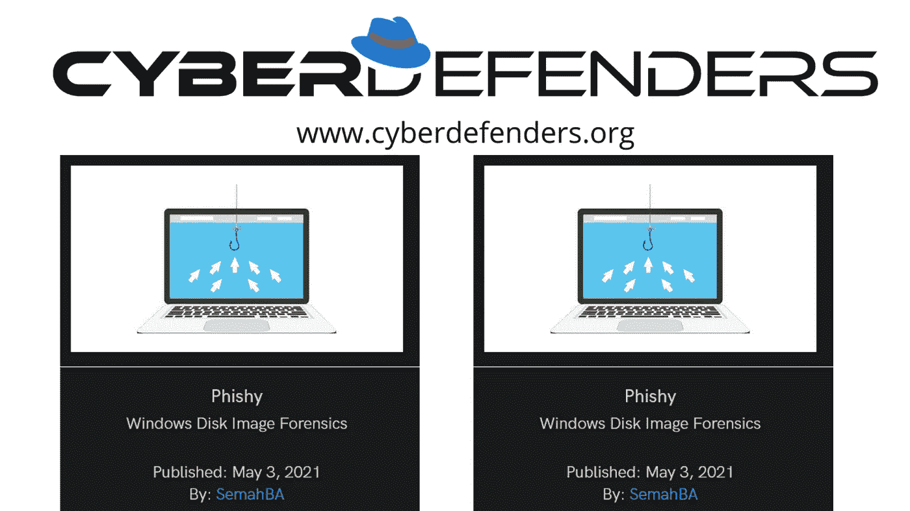

AD1 文件是什么？
AD1 文件名后缀大多用于法医工具包 FTK 成像仪的图像文件。法医工具包 FTK 成像仪图像格式由 AccessData Group，LLC 开发..AD1 文件受运行 Windows 的设备可用的软件应用程序支持。

提示:AD1 文件格式不直接支持尸检。因此，在开始之前，请查看他们的安装指南

Q1__)受害机器的主机名是什么？

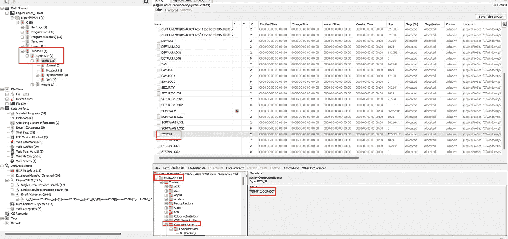

提示:windows →system32 →配置→系统→ CurrentControlSet001 →控制→计算机名

ANS : WIN-NF3JQEU4G0T

Q2__)受害者机器上安装的是什么消息应用程序？

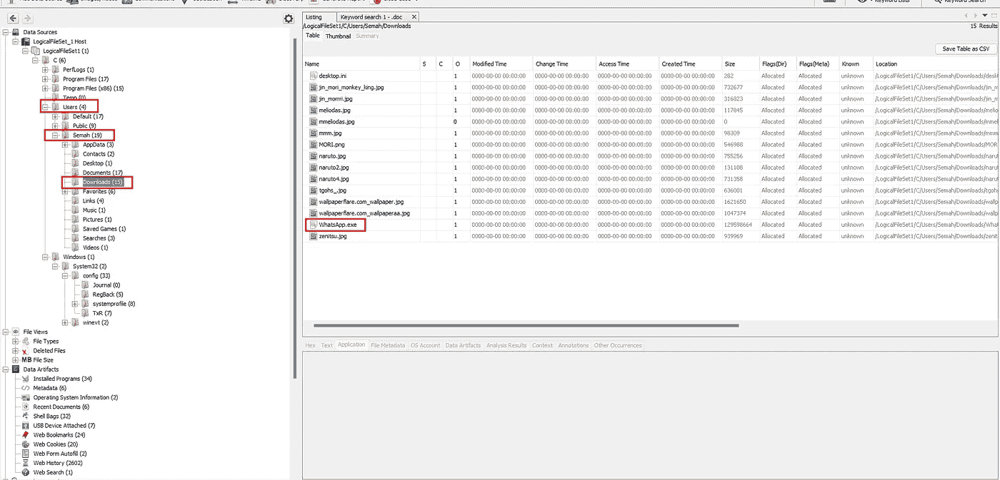

提示:用户→Semah →检查下载/AppData

答:Whatsapp

Q3__)攻击者诱骗受害者下载恶意文档。提供完整的下载 URL。

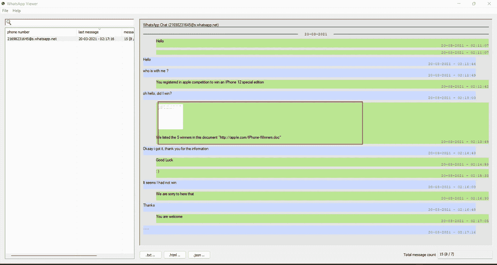

提示:用户→Semah→AppData→whatsapp→数据库→msgstore.db(导出)在 whatsapp 查看器中打开文件。检查消息

答案:[http://appIe.com/IPhone-Winners.doc](http://appIe.com/IPhone-Winners.doc)

Q4__)多个流在文档中包含宏。提供最高流的数量。

提示:进入 FTK 成像仪→打开用户文件夹 semah →下载→导出文档

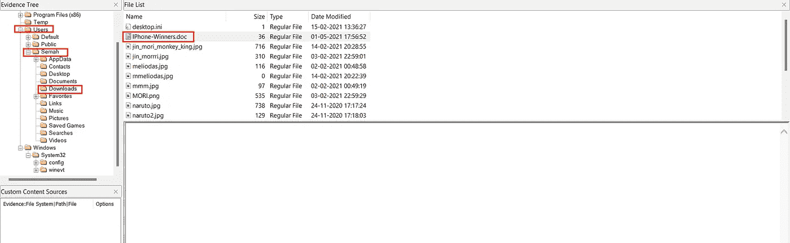

使用 oldedump.py 查找最大的宏流

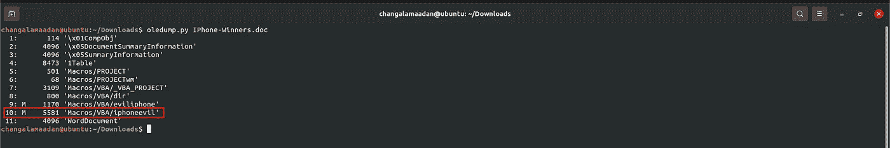

答:10

Q5__)宏执行了一个程序。提供程序名？

提示:使用 olevba

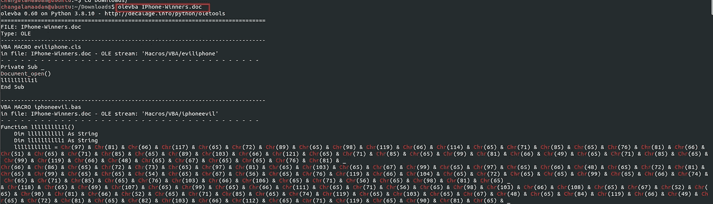

这里使用字符串混淆。

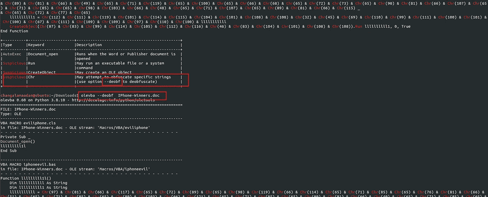

使用—去氧并使其去氧

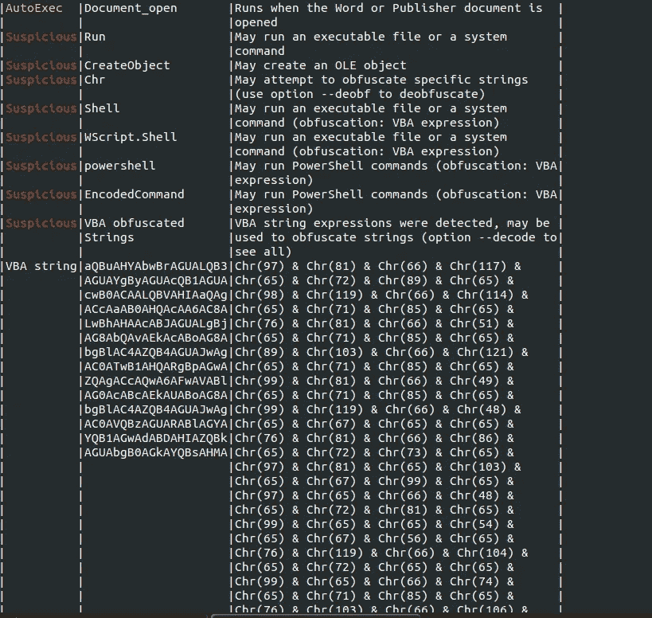

答案:powershell

Q6__)宏下载了一个恶意文件。提供完整的下载 URL

首先去除混淆代码的模糊

提示:olevba — deobf IPhone-Winners.doc

取 base64 代码，去掉不需要的空格和符号，使它成为一个单独的字符串并保存它

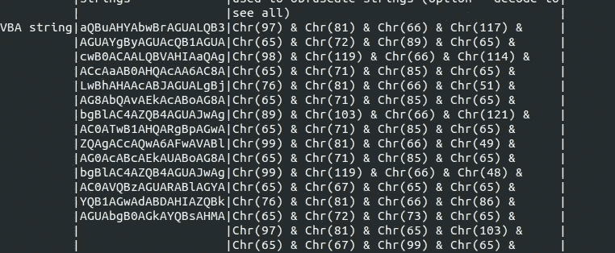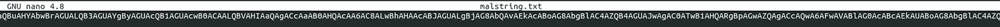

删除不需要的空格和符号

使用 base64dump.py 解码字符串

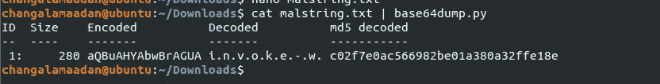

cat IPhone-winners . doc | base 64 dump . py-S1-t utf 16

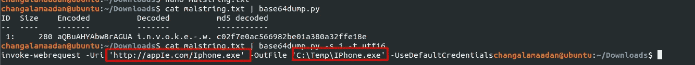

[http://appIe.com/Iphone.exe](http://appIe.com/Iphone.exe)

Q7__)用于创建恶意软件的框架的名称是什么？

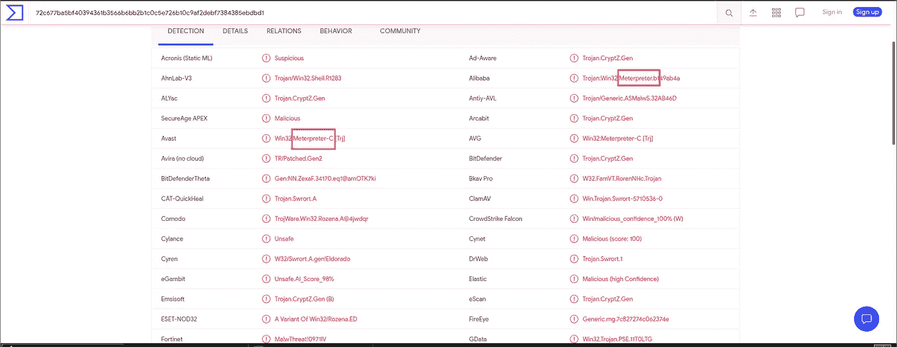

答:Metasploit

Q9__)攻击者的 IP 地址是什么？

答:155.94.69.27

Q10__)假赠品使用登录页面收集用户信息。提供登录页面的完整 URL？

提示:这里我们有两种方法。第一个对我来说不太合适。

方法 1:在 AppData 部分，您可以看到系统中安装了 Mozilla Firefox。因此，这里我们使用一个名为" [browsinghistoryview](https://www.nirsoft.net/utils/browsing_history_view.html) 的 Firefox 历史查看器应用程序。exe”。接下来的事情是，

打开尸检→用户→Semah→AppData→漫游→Mozilla→Firefox→profiles→pyb 51 x2n . default-release→places . SQLite

(places.sqlite →Firefox 书签存储在 places。“sqlite”数据库，在**的“moz_bookmarks”表**中。关联的 URL 信息存储在“moz_places”表中。缓存。Firefox 缓存使用一个缓存映射文件(' _CACHE_MAP_ ')、三个缓存块文件(' _CACHE_00#_ ')和许多独立的数据文件来存储

在[浏览器的历史视图](https://www.nirsoft.net/utils/browsing_history_view.html)中打开 places.sqlite。可执行程序的扩展名

但这不适合我。所以我用另一种方法

Methos II →打开尸检→用户→Semah→AppData→漫游→Mozilla→Firefox→profiles→pyb 51 x2n . default-release→places . SQLite→看 moz_places 部分

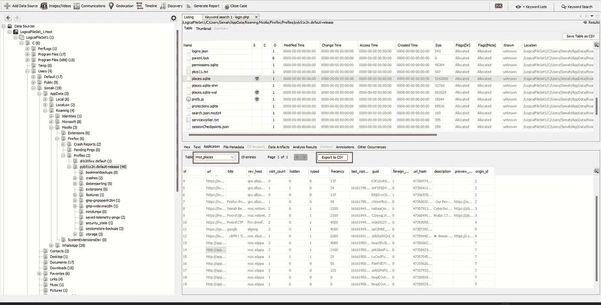

http://appIe.competitions.com/login.php

Q11__)用户提交到登录页面的密码是什么？

提示:在你的系统中保存 Firefox 的 profile 文件夹。并将其打开进入 [passwordfox](https://www.nirsoft.net/utils/passwordfox.html) 。这个应用程序用来显示 firefox 保存的用户名和密码。配置文件文件夹包含保存的用户名和密码。

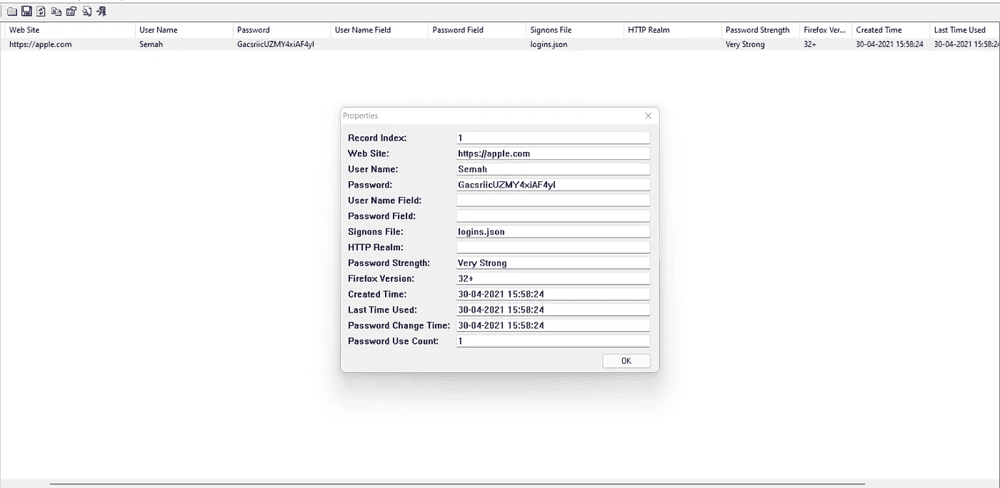

ANS : GacsriicUZMY4xiAF4yl