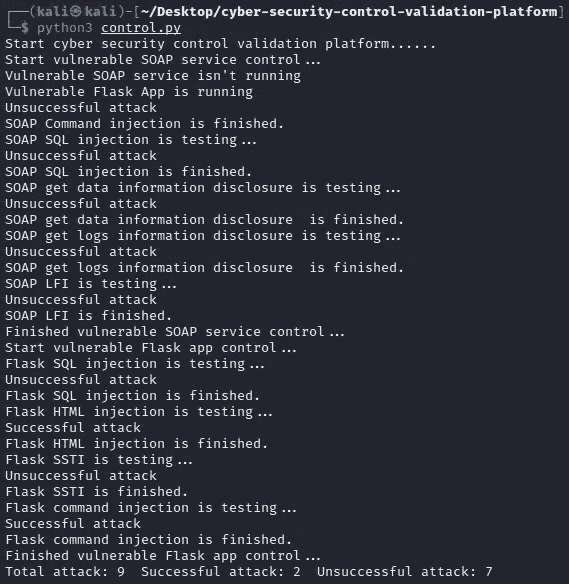

# 网络安全控制验证平台

> 原文：<https://infosecwriteups.com/cyber-security-control-validation-platform-bf22dca3657e?source=collection_archive---------3----------------------->

 [## GitHub-Anil-yelken/网络安全-控制-验证-平台:网络安全控制验证…

### 测试- Kali 2022.1 与此工具写端点安全，攻击向量将进行从不同的…

github.com](https://github.com/anil-yelken/cyber-security-control-validation-platform) 

已测试— Kali 2022.1

# 描述

有了这个为端点安全而编写的工具，易受攻击的 web 应用程序将从位于端点的不同网络中进行攻击。它是一个网络安全控制验证平台，用于检查两个网络之间的安全设备通过了多少攻击媒介。它被开发出来，以便在培训中进行解释。

# 特征

信息收集在以下内容中。

易受攻击的 SOAP 服务命令注入控制

易受攻击的 SOAP 服务 SQL 注入控制

易受攻击的 SOAP 服务信息泄露控制

易受攻击的 SOAP 服务 LFI 控件

易受攻击的 Flask App。SQL 注入控制

易受攻击的 Flask App。HTML 注入控件

易受攻击的 Flask App。SSTI 控制

易受攻击的 Flask App。命令注入控制

# 装置

git clone[https://github . com/Anil-yelken/cyber-security-control-validation-platform](https://github.com/anil-yelken/cyber-security-control-validation-platform)

cd 网络安全控制验证平台

sudo pip3 安装要求. txt

# 使用

首先，服务器位于并运行在内部网络上。

将攻击的 control.py 放在所需的网络上并运行。

# 接触

https://twitter.com/anilyelken06

【https://medium.com/@anilyelken 

 [## 阿尼尔-耶尔肯-概述

### 此时您不能执行该操作。您已使用另一个标签页或窗口登录。您已在另一个选项卡中注销，或者…

github.com](https://github.com/anil-yelken) 

## 来自 Infosec 的报道:Infosec 每天都有很多内容，很难跟上。[加入我们的每周简讯](https://weekly.infosecwriteups.com/)以 5 篇文章、4 个线程、3 个视频、2 个 GitHub Repos 和工具以及 1 个工作提醒的形式免费获取所有最新的 Infosec 趋势！