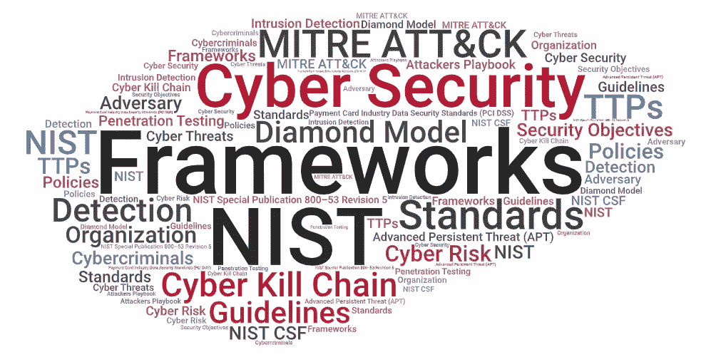
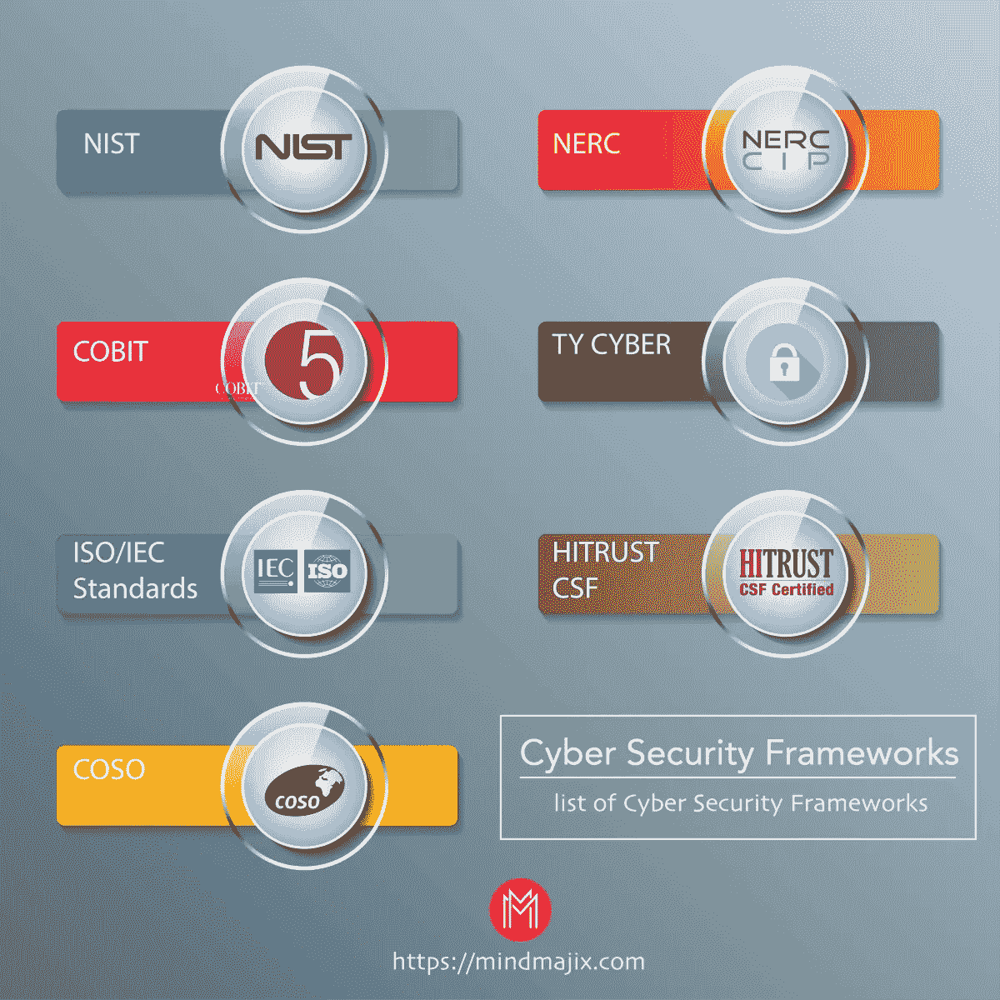
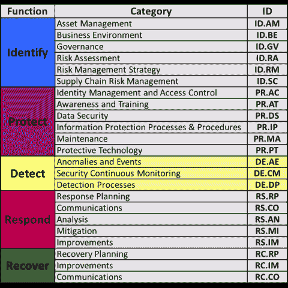
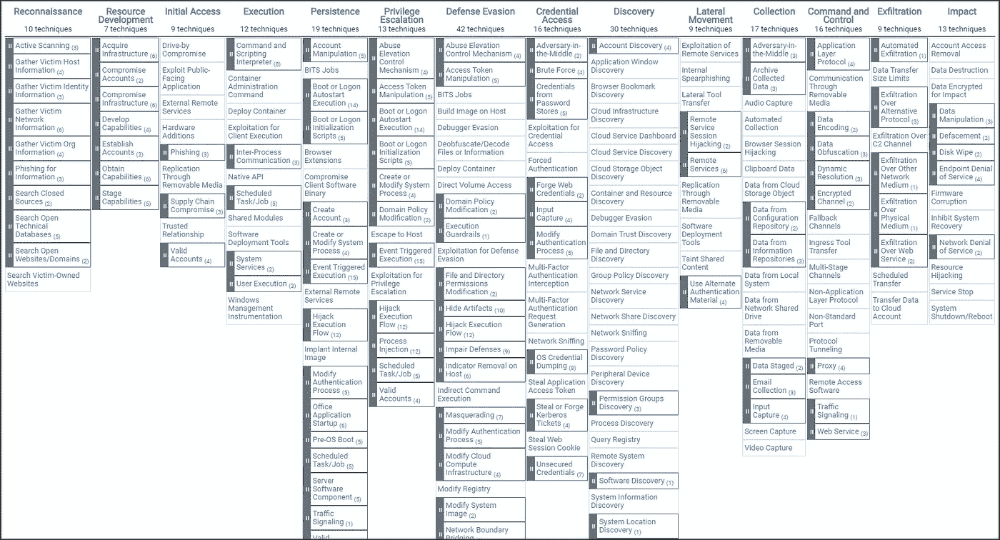
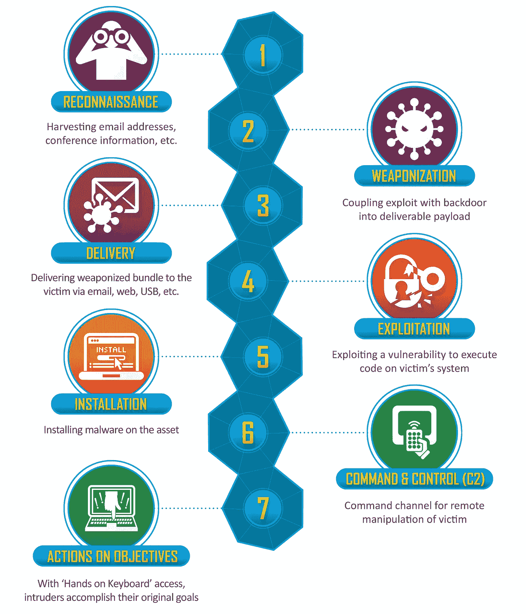
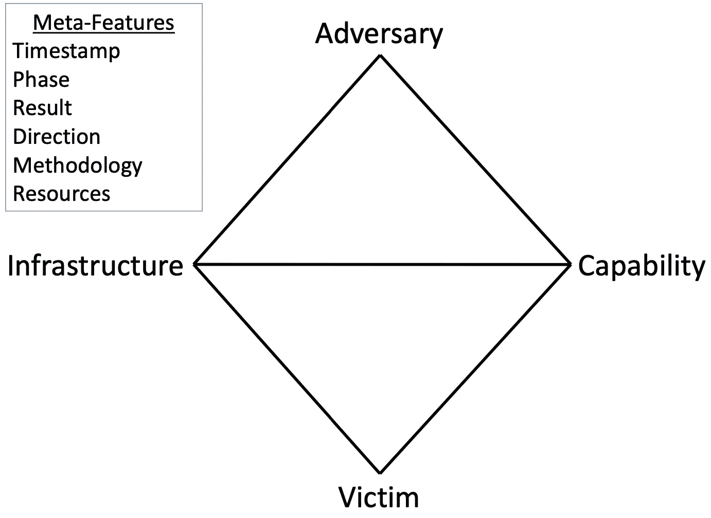
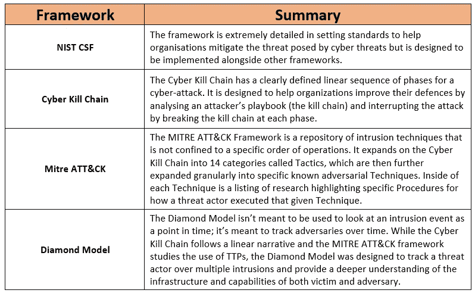

# 网络安全检测框架

> 原文：<https://infosecwriteups.com/cyber-security-detection-frameworks-b5fec0c93195?source=collection_archive---------1----------------------->

如果你在网络安全行业或周围呆了足够长的时间，你会经常听到提到“*网络安全框架*”这个术语。在本文中，我将简要介绍一些常见的网络安全检测框架，这些框架被组织用来帮助理解网络攻击中对手的行为。

# 什么是网络安全框架？

一个[网络安全框架](https://reciprocity.com/resources/what-is-a-cybersecurity-framework/)是标准、指南、程序和最佳实践的集合，旨在帮助组织防御网络攻击或数据泄露。组织使用它们来实现安全目标，对于希望遵守国家、行业和国际网络安全法规的公司来说，它们通常是强制性的，或者至少是受到强烈鼓励的。

[网络安全框架列表。](https://mindmajix.com/cyber-security-frameworks)

如今，网络安全行业内存在许多不同类型的框架，旨在实现不同的安全目标。例如，为了处理信用卡交易，企业必须通过审核，证明其符合[支付卡行业数据安全标准(PCI DSS)](https://www.itgovernance.eu/en-ie/what-is-the-pci-dss-ie#:~:text=The%20PCI%20DSS%20(Payment%20Card%20Industry%20Data%20Security%20Standard)%20is,JCB%2C%20Mastercard%20and%20Visa).) 框架。另一个例子是一个组织使用 [NIST 特别出版物 800–53 修订版 5](https://nvlpubs.nist.gov/nistpubs/SpecialPublications/NIST.SP.800-53r5.pdf) 来实施安全和隐私控制。组织实现一个以上的框架来实现他们的目标也是很常见的。

# 网络安全检测框架

网络安全行业中有多种框架可以帮助组织了解网络攻击期间对手的行为。本文重点介绍了组织用来指导他们处理和理解攻击和防御策略的几种常见框架。

## NIST 网络安全框架

NIST 网络安全框架是一个流行的框架，用于提高组织的网络安全标准和管理网络威胁的风险。该框架为来自关键基础设施(发电厂等)的组织的成功提供了关于安全控制&基准的指南。)一直到广告。还有一个有限的章节是关于渗透测试者应该采取的方法的标准指南。

NIST 框架由五个功能组成:

*   **识别:**全面了解您的人员、物理和数字资产、风险和漏洞以及防御系统。
*   **保护:**建立分层和多样化的方法来保护业务，同时也准备好应对任何攻击。
*   **检测:**实施技术和实践，快速检测所有安全数据中的真正积极事件。
*   **响应:**对事件做出适当的响应，防止其演变成严重的违规行为。
*   **恢复:**通过规划弹性将组织恢复到原始状态，并实施新的预防措施来防止重复攻击。

[NIST CSF 框架核心的功能和类别。](https://www.nist.gov/cyberframework/online-learning/components-framework)

## 米特 ATT 和 CK

[米特 ATT & CK 框架](https://attack.mitre.org/)是一个由常用战术、技术和程序(TTP)组成的活的、不断发展的框架，被[高级持续威胁(APTs)](https://attack.mitre.org/groups/) 和其他网络犯罪分子所使用。战术被定义为演员的目标，而技术是达到目标的方法。MITRE 框架使用来自过去攻击的证据来深入攻击者的头脑，详细了解这些战术是如何表现的、使用的技术、潜在的响应步骤以及用于深入分析的有用数据源。

[米特 ATT & CK 框架](https://attack.mitre.org/)

米特 ATT 和 CK 框架提出的 14 项策略包括:

*   侦察:敌人试图收集他们可以用来计划未来行动的信息。
*   资源开发:对手试图建立他们可以用来支持作战的资源。
*   **初始访问**:利用网络钓鱼等技术，绕过网络防御在环境中立足的行为。
*   **执行**:恶意代码的执行使参与者能够更深入地渗透到网络中，并朝着他们的目标前进。
*   持续:让一个行动者在一个系统或网络中逗留，尽管有潜在的干扰，也能赢得时间来执行他们的计划。
*   **权限提升**:通过管理员级别的访问，为攻击者在网络中提供更大范围的活动和控制。窃取用户凭证是特权提升的一个典型例子。
*   防御规避:伪装之类的战术是试图在网络中不被发现。
*   **凭证访问**:允许不良行为者获得他们实现目标所需的访问和控制。
*   **发现**:了解操作系统和网络，为攻击计划提供信息。
*   **横向移动**:迂回通过系统或网络到达关键数据或目标对象的方法。
*   **收集**:指对有价值的数据进行识别和收集，然后进行提取。
*   **命令&控制**:行动者通过一个已经受损的系统远程控制一个网络。
*   **渗透**:出于恶意目的，从目标网络或系统中移除敏感、令人垂涎的数据的最终目标，如在黑市上转售。
*   **影响**:对业务的影响是另一个关键目标，破坏数据、服务和系统的完整性和可用性。

## 网络杀伤链

网络杀伤链是由洛克希德·马丁公司的计算机科学家创造的。该模型描述了一种分阶段的端到端网络攻击检测和预防方法，该方法基于标准威胁参与者的精心设计的动作。

[网络杀戮链。](https://www.lockheedmartin.com/en-us/capabilities/cyber/cyber-kill-chain.html)

网络杀伤链有七个步骤:

1.  **侦察**:指攻击者试图尽可能多地了解目标的步骤(如服务器、操作系统、IP 地址、用户名、电子邮件地址等)。)
2.  **武器化**:指准备一个带有恶意组件的文件，例如，为攻击者提供远程访问。
3.  **交付**:通过任何可行的方式，如电子邮件或 u 盘，将“武器化”文件交付给目标。
4.  **利用**:用户打开恶意文件，他们的系统执行恶意组件。
5.  **安装**:之前的攻击步骤应该会在目标系统上安装恶意软件。
6.  **命令&控制(C2)** :恶意软件的成功安装为攻击者提供了命令和控制目标系统的能力。
7.  **对目标的动作**:获得一个目标系统的控制权后，攻击者就达到了目的。一个示例目标是数据渗透(窃取目标的数据)。

## 钻石模型

[钻石模型](https://apps.dtic.mil/dtic/tr/fulltext/u2/a586960.pdf)强调入侵的四个核心特征的关系和特征:对手、基础设施、能力和受害者。它进一步定义了额外的元特性来支持更高层次的结构，并应用度量、可测试性和可重复性来提供更全面的科学分析方法。

钻石模型对组织的价值在于识别事件之间的关系，以及分析事件以了解对手的行为。

[钻石模型。](https://medium.com/@warnerchad/diamond-model-for-cti-5aba5ba5585)

菱形模型如此命名是因为入侵事件的四个核心特征之间的关系形成的形状:

*   **对手**:入侵者/攻击者
*   **能力** *:* 对手的工具和/或技术
*   **基础设施** *:* 对手使用的物理和/或逻辑资源
*   **受害者**:被对手攻击的组织或系统

事件元特征提供了关于事件的更多信息:

*   **时间戳**:入侵事件发生的日期和时间。
*   **阶段**:在事件链中，哪个事件由这个特定的模型表示。
*   **结果**:入侵事件的结果(如成功、失败或未知)
*   **方向**:事件如何通过网络或主机(例如，受害者到基础设施、对手到基础设施)
*   **方法**:事件类别(例如鱼叉式网络钓鱼、端口扫描)
*   **资源**:入侵所需的要素(例如，特定的软件、硬件、知识、资金、设施、访问)
*   **社会政治**:基于受害者的需求和愿望的对手和受害者之间的关系
*   **技术**:涉及敌方能力和基础设施使用的技术

# 框架摘要

每个框架都旨在通过不同的方式实现检测攻击和理解防御的目标。下表根据每个框架的工作方式对其进行了总结。

框架摘要。

# 结论

希望这篇短文提供了当今业界使用的一些常见网络安全检测框架的基本概述。网络安全检测框架是一个强大的工具，组织可以使用它来了解攻击者的策略，防御网络攻击并管理其网络风险。网络安全框架是一个庞大的话题，值得了解更多。谢谢你看完，继续黑！😄

来自 Infosec 的报道:Infosec 上每天都会出现很多难以跟上的内容。 [***加入我们的每周简讯***](https://weekly.infosecwriteups.com/) *以 5 篇文章、4 个线程、3 个视频、2 个 Github Repos 和工具以及 1 个工作提醒的形式免费获取所有最新的 Infosec 趋势！*