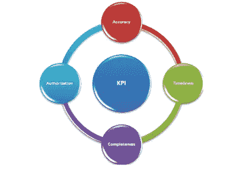

# 网络安全—关键性能指标

> 原文：<https://infosecwriteups.com/cyber-security-key-performance-indicators-30971d04672?source=collection_archive---------0----------------------->

关键绩效指标

[2019 年 EY GISS](https://www.ey.com/Publication/vwLUAssets/ey-global-information-security-survey-2018-19/$FILE/ey-global-information-security-survey-2018-19.pdf) (全球信息安全调查)谈到了组织需要进步的三个方面。

**保护企业:** *重点识别资产，构筑防线。*

识别皇冠上的宝石，并实施适当的保护机制来检测和防止违规。大多数大型企业拥有从大型机、Wintel、Unix/Linux、虚拟环境到现在的云环境的异构技术组合；维护准确的 IT 资产清单，包括硬件、应用程序、数据库、存储等。对大多数首席信息官和首席技术官来说是一个挑战。虚拟服务器可以在几分钟内启动，也可以同样快地停止。构建流程和实施工具来管理、监控和报告法规遵从性是保护企业资产的一个重要因素。

**优化网络安全:** *专注于停止低价值活动，提高效率，并将资金重新投资于新兴和创新技术，以增强现有保护。*

公司正在转向自动化、数据分析和人工智能以提高效率，但错误配置的工具可能会导致漏洞无法被发现。许多高级持续威胁(APT)事件都是由中断的流程和/或错误配置的设备和工具造成的。 [FireEye 报告](https://www.fireeye.com/current-threats/annual-threat-report/mtrends.html)称，2018 年美洲的平均停留时间为 71 天，EMEA 为 177 天，APAC 为 204 天。这使得攻击者有大量的时间来完成攻击循环、传播和实现他们的目标。

**实现增长:** *专注于实施安全设计，将其作为大多数组织正在经历的数字化转型的关键成功因素。*

在接受调查的 40%的企业中，网络安全正成为企业战略的重要组成部分。随着数字化转型计划的成功，董事会成员现在开始对网络安全负责

[在 PwC Digital Trust Insights](https://www.pwc.com/us/en/services/consulting/assets/pwc-journey-to-digital-trust.pdf) 调查中，只有 27%的受访者表示，他们对董事会收到关于网络安全和隐私风险的充分报告感到满意。有效的监控和报告流程可帮助管理层和领导层做出明智的决策。

[网络安全指标和措施](https://www.nist.gov/publications/cyber-security-metrics-and-measures)来自 NIST，他说:

*“网络安全指标和措施可以帮助组织*

*   *验证他们的安全控制符合政策、流程或程序；*
*   *识别他们的安全优势和弱点；和*
*   *识别组织控制范围内外的安全趋势。*

*通过研究趋势，组织可以监控一段时间内的安全性能，并确定需要调整组织安全态势的变化。在更高的层面上，这些优势可以结合起来，帮助组织通过*实现其使命

*   *评估其是否符合法律法规，*
*   *提高其实施的安全控制的性能，以及*
*   *回答关于安全性的高级业务问题，这有助于组织最高管理层做出战略决策。”*

这些是我认为在开发关键绩效指标(KPI)时有用的属性。

关键业绩指标

例如，在漏洞扫描的环境中:

*   **准确性** —扫描报告中的误报数量？
*   **及时性** —已确定的关键、高&中等问题是否在规定的时限内得到补救？
*   **完整性** —网络上应该被扫描的系统是否已经被扫描；比较 CMDB/资产数据库和扫描人群；
*   **授权** —认证扫描失败

然而，我们可以创建与数据点一样多的指标，进行健全性检查并删除未通过*“这意味着什么？”的 KPI*测试。我遇到过仪表板提供不准确且有时相互矛盾的信息。

排名不分先后，以下是应该出现在每个 CISO 仪表板上的一些指标。

身份和访问管理

**身份&权限管理:**

*   停用凭据所花费的时间
*   权利审查:拥有过多权利的用户数量
*   第三方(供应商/销售商/承包商)访问审查:#删除第三方不必要的访问
*   被监控的拥有特权访问权限的员工百分比:监控拥有“王国之钥”的用户(超级用户)有助于了解是否有太多个人拥有无限制的网络访问权限，并限制绝对需要的人访问。

结构管理

**配置管理:**

*   符合强化标准的服务器和设备的百分比—随着 IT 环境的变化，配置漂移是一个风险，随着开发运营的广泛采用，每天都可能发生多次变化。
*   防火墙/交换机审计结果
*   公司网络(有线和无线)上未识别设备的数量

安全意识和培训

**安全意识:**

*   培训合规水平-完成百分比
*   对员工进行网络钓鱼和其他社会工程测试的结果:%失败

安全事件

**安全事件:**

*   检测到的事件数量(SIEM/AV/恶意软件等。)
*   平均检测时间-安全团队意识到威胁需要多长时间？根据[网络进化:加强亚太地区弹性的途中](https://www.fireeye.com/offers/wp-cyber-evolution-apac.html)报告，在 2017 年，全球范围内，网络入侵和检测到威胁因素之间的中间天数为 99 天。
*   停留时间—检测和解决阶段之间经过的时间。
*   平均解决时间—修复需要多长时间？

服从

**合规:**

*   未决审计问题
*   未结异常/老化
*   法规遵从性状态(美联储、OSFI、SEC)
*   符合行业标准(PCI)

数据泄漏预防

**防止数据泄露:**

*   数据分类级别:如果我们对敏感数据源视而不见，DLP 就会失败。此指标指示无控制的数据库、设备、端点和文件共享的数量。
*   数据库指纹识别级别:保存敏感数据的数据库必须进行指纹识别，并且可供 DLP 工具使用。此指标指示与尚未采集指纹的数据库相关的风险。
*   具有敏感数据的未受管理设备的数量:理想情况下，所有设备/端点都应该对 DLP 工具可见。
*   LOB 报告的事件数量
*   按 LOB 列出的策略例外数

漏洞和补丁管理

**漏洞和补丁:**

*   具有已知严重和高度漏洞的系统数量:虽然报告所有系统是一种规范，但我更喜欢侧重于高风险系统和应用程序(皇冠上的宝石)的管理报告
*   具有已知关键和高漏洞的高风险系统的修补级别:这表明修补节奏的有效性
*   供应商尚未发布补丁程序的具有严重和高度漏洞的系统数量—应用替代缓解措施，或者如果无法缓解，则接受风险
*   供应商发布补丁所需的时间
*   从供应商版本推出补丁的天数

这绝不是一个全面的列表，我希望听到你的意见并补充到这个 KPI 列表中。

*请留下您的想法和反馈。*

首发于[https://securityriskandcompliance . blogspot . com/2019/11/cyber-security-key-performance . html](https://securityriskandcompliance.blogspot.com/2019/11/cyber-security-key-performance.html)

*关注* [*Infosec 报道*](https://medium.com/bugbountywriteup) *获取更多此类精彩报道。*

 [## 信息安全报道

### 收集了世界上最好的黑客的文章，主题从 bug 奖金和 CTF 到 vulnhub…

medium.com](https://medium.com/bugbountywriteup)