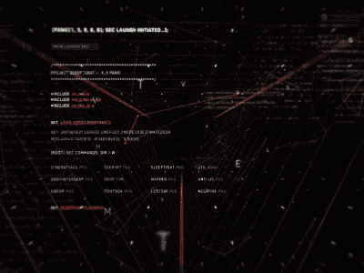
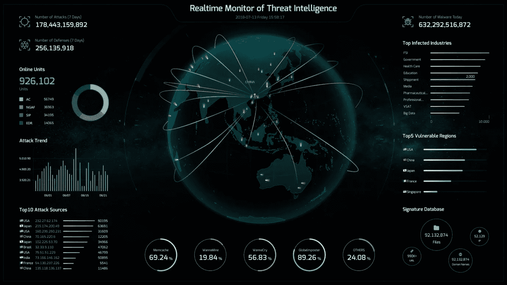

# 网络威胁情报

> 原文：<https://infosecwriteups.com/cyber-threat-intelligence-c-t-i-92c09832fe18?source=collection_archive---------4----------------------->

网络威胁情报是一个在网络安全行业之外鲜为人知的领域，但其受欢迎程度和重要性都在快速增长。网络攻击变得越来越强大和频繁，需要熟练的个人来理解这些事件，并能够以能够采取行动和先发制人的方式传递信息。

# 什么是网络威胁情报？

网络威胁情报是收集和分析信息的艺术或科学(取决于你如何看待它)，使用上下文将所述信息转化为可操作的*情报，然后企业可以使用这些情报围绕其安全做出决策。这包括了解普遍存在的威胁、它们的影响，以及预防和先发制人。*

*让我们从上面提到的智力公式开始——信息+背景=智力。组成它的部分有(举例):*

*   *信息—数据、姓名、地点*
*   *背景—日期、时间、资产、基础设施、位置、员工、行为、目标*
*   *情报—将信息与上下文结合起来，威胁情报分析师就可以拼凑出一个叙述，指导或引导企业采取行动。*

**

*网络安全正成为一个越来越热门的话题，这主要是由于来自有组织犯罪集团、民族国家组织和黑客的数据泄露、网络攻击和盗窃的数量不断增加。这些恶意实体以疯狂的速度创新和开发新的工具和技术，迫使网络防御者不断努力了解他们正在防御的是什么。CTI 分析师的工作是监控和了解竞争环境，看谁在攻击，他们使用什么工具和方法。在大多数情况下，在内部，网络威胁情报团队与安全运营中心(SOC)一起工作，后者每天监控和保护业务。*

*企业很快看到了发展网络威胁情报单位的吸引力。能够帮助给组织提个醒，告诉他们什么样的恶意软件可以针对他们的行业或他们的供应商/销售商的专业人士是非常受重视的。特别是那些可以利用这些信息不仅先发制人的攻击，而且还可以帮助应对网络入侵事件的人。*

*当然，这是一个非常高层次的概述，其他领域的大量知识是非常有益的。网络、渗透测试(也称为 pentesting)和更广泛的信息安全等领域都有助于深入了解网络攻击的复杂性。*

*对情报分析员来说，最大的财富是阅读和研究。这是了解威胁形势和最大威胁的有效方式。了解最新的行业事件、主要参与者和技术发展是至关重要的。*

*成为一名威胁情报分析师需要知识基础、关联和链接信息的分析技能，以及可能最不被重视的技能……写作能力。大多数情况下，最终交付的是某种形式的书面报告，无论长短，或者即使结论需要在更直观的媒体中做出，创建叙述、得出结论、做出判断并将其交付给客户的能力也是至关重要的*

# *是给谁的？*

*网络威胁情报基于已经存在了几个世纪的基本情报实践，可以追溯到敌对部落和国家的首次间谍活动。目的是向目标个人或群体提供有助于计划或实施行动的信息。在过去，这是通过侦察员、间谍和秘密文件来完成的。尽管这些元素今天仍然存在，但许多情报收集现在是通过计算机和电子资产完成的。*

**

*中央情报局*

*情报的历史在于军事。如果一个军队或政府比它的对手有更好的情报，例如对补给线、位置、军队数量的了解，它将有优势(这里我们将插入孙子的语录，如果你不知道是谁，请阅读*孙子兵法*)。情报在全球范围内发展，很快政府将情报收集作为重中之重，成立了像中情局和联邦安全局这样的组织，他们向政府报告，以实现某些目标。*

*进行情报分析的行为本身就是一门完整的学科，在 CTI 出现之前就已经存在了…如果你有兴趣的话，CIA 有一些很棒的情报资源值得一读。任何进入这一行的人都应该读一读理查德·豪雅的*智力分析心理学**

*所以，让我们来回答这个问题‘它是给谁的？’。情报分为三个部分，每个部分都有自己的目标:*

*   *战术的*
*   *操作的*
*   *战略的*

> **战术**

*这是短期、可快速消化的情报领域，可以提供内部 SOC，并为其提供基本指标，用于监控和搜寻内部和外部威胁。这些指示器被称为*妥协指示器(* IOCs *)* ，有多种方法可以获得这些信息。方法包括数据馈送、安全研究和情报平台。*

> **操作**

*这种级别的情报是观察对手和了解网络罪犯和团体如何运作的领域。情报分析师使用这种更详细的信息，应用人工分析(通常通过技术增强)从数据和战术情报中创建上下文，并将其提供给许多可以从这些信息中受益的不同团队:*

*   *漏洞管理*
*   *事故响应*
*   *威胁监控*

*通过解释 ***谁*** 是攻击的幕后黑手， ***为什么*** 他们要这么做，以及*他们是如何做的，这对防御网络攻击至关重要。**

> ***战略***

**这种级别的智能是为组织内的高层管理人员和决策者保留的。战略情报的广度更广，需要深入了解网络安全风险如何与更广泛的全球商业和地缘政治风险联系在一起，以便能够为高级领导人描绘事件的图景。战略情报通常是情报职能中最后实施的，因为它需要专家和主题专家(SME)提供更多的资源、经验和时间。然后，组织中那些没有时间阅读冗长报告的人——那些需要视觉效果、图形、图表、描述和解释的人——可以将这些压缩成易于理解的形式。**

****要点:能够解释网络威胁情报的规模，以及您可能向谁提供情报，这是展示您了解情报在商业环境中的作用的绝佳方式。****

**我希望这能对什么是网络威胁情报以及它如何适应商业和网络安全运作有一个总体的概述。请务必在这个平台上关注我，以获得更多关于网络安全的信息性文章 **- Zeus****

## **来自 Infosec 的报道:Infosec 每天都有很多内容，很难跟上。[加入我们的每周简讯](https://weekly.infosecwriteups.com/)以 5 篇文章、4 个线程、3 个视频、2 个 GitHub Repos 和工具以及 1 个工作提醒的形式免费获取所有最新的 Infosec 趋势！**