# 网络卫士|世界报

> 原文：<https://infosecwriteups.com/cyberdefenders-lespion-a27d08c5e0a4?source=collection_archive---------1----------------------->

## 最新报道

OSINT 代表开源智能。这意味着收集和分析从公开来源收集的数据，以产生可操作的情报。

今天我们将和来自 CyberDefenders.org 的**飞行员**一起练习有关 OSINT 的内容。如果你想尝试这个挑战，就点击这个链接[https://cyberdefenders.org/labs/73](https://cyberdefenders.org/labs/73)

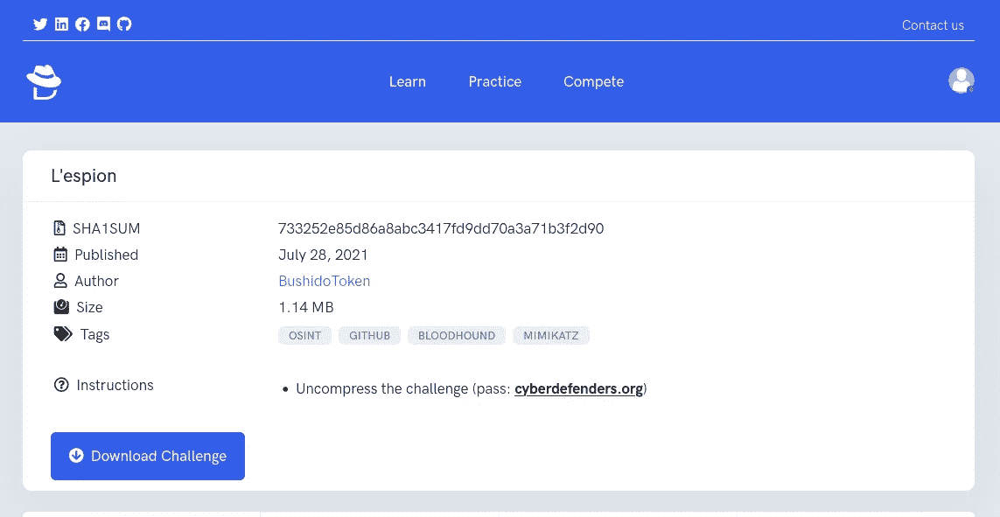

你必须从平台下载挑战线索，根据线索和网络回答 10 个问题。

**我们开始吧..**

## 下载挑战线索

下载挑战后，有 3 个文件。
1。Github.txt
2。office.jpg
3。WebCam.png

所有的线索都将有助于回答下面的任何问题。

## 问题

1.File -> Github.txt:
内部人员添加到他的 Github 库的 API 密匙是什么？

> `aJFRaLHjMXvYZgLPwiJkroYLGRkNBW`

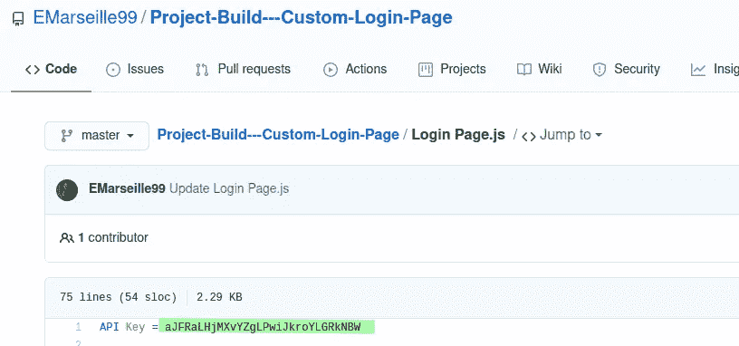

2.File -> Github.txt:
内部人员添加到他的 Github 存储库中的明文密码是什么？

> 毕加索法棍 99

在同一个文件中，我们可以得到这个答案，并用 base64 解码。

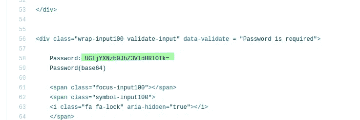

我使用 Linux 作为我的操作系统，只要用这个命令你就可以解码信息。另外，你可以使用 [CyberChef](https://gchq.github.io/CyberChef/) 。

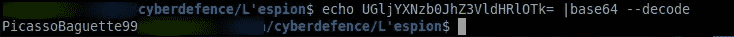

3.File -> Github.txt:
知情人使用了什么加密货币挖掘工具？

> xmrig

在另一个回购中搜索。

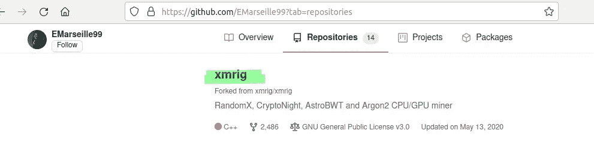

4.知情人上的什么大学？

> 巴黎大学文理学院

从 github 信息，然后我在 Linkedin 搜索。

我使用 2 个关键字，并设置了一个人的过滤器。

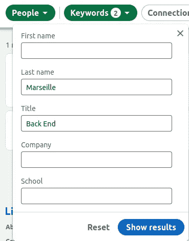

我拿到了这个 Linkedin 个人资料，

5.知情人在哪个游戏网站有账户？

> 蒸汽

我使用一些工具来查找用户名:**email 99**最后，我使用[https://whatsmyname.app/](https://whatsmyname.app/)。

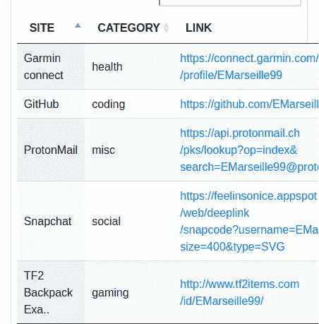

点击她照片时看到了这个。

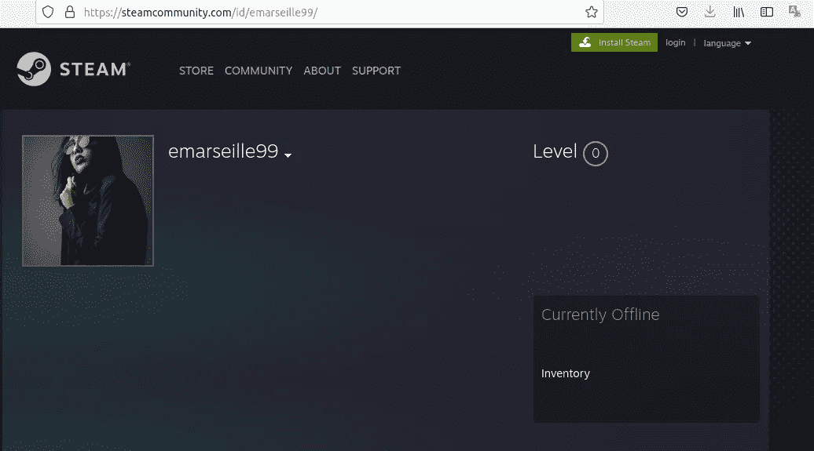

6.insider Instagram 个人资料的链接是什么？

> [https://www.instagram.com/emarseille99/](https://www.instagram.com/emarseille99/)

因为我是从 Linkedin 上知道她的全名，所以在 Instagram 上搜索。

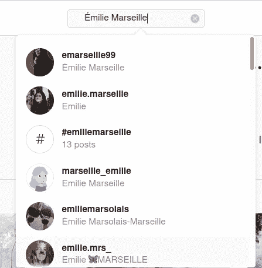

这是她的 Instagram 资料。

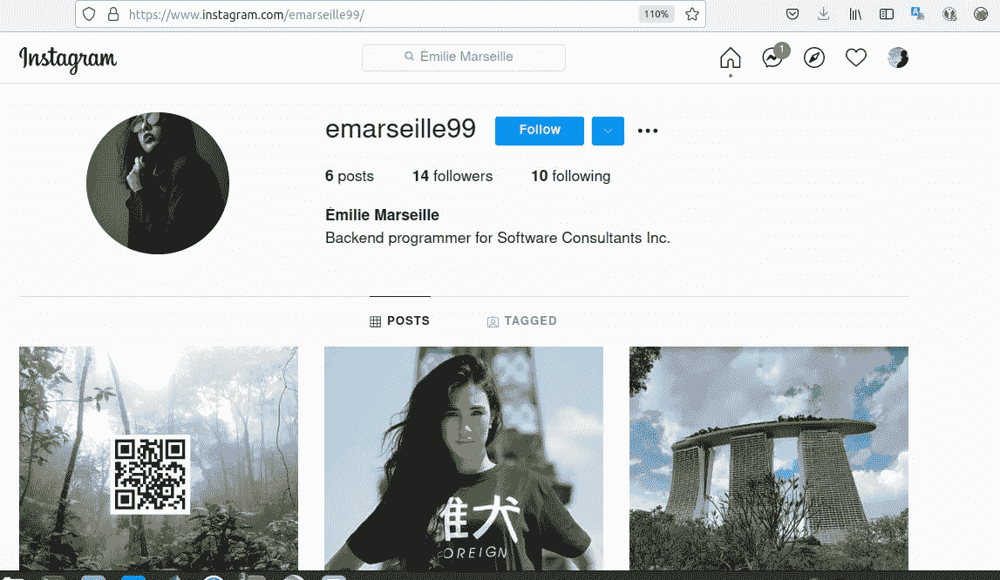

7.知情者假期去哪里了？(仅限国家)

> 新加坡

8.知情人家住哪里？(仅限城市)

> 迪拜

我不知道只有一张照片，

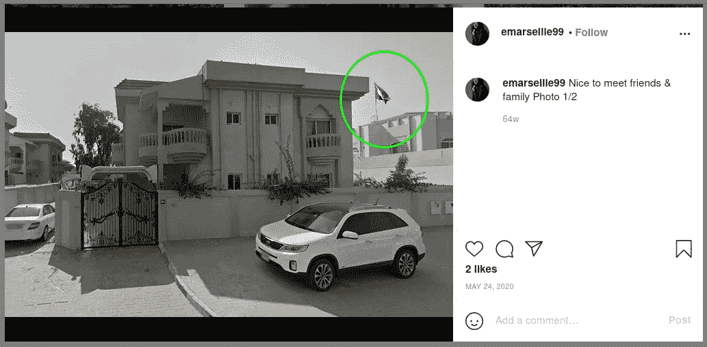

我试着看另一张照片，

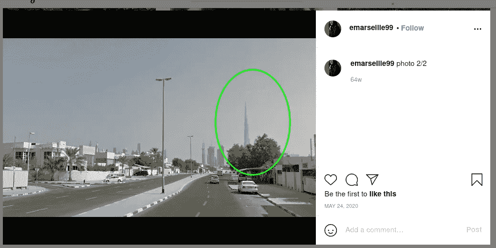

我想那是**哈利法塔。**

9.File -> office.jpg:
已经给你提供了一张公司办公的大楼的图片。该公司位于哪个城市？

> 伯明翰

我试着一个接一个地寻找这个标志。

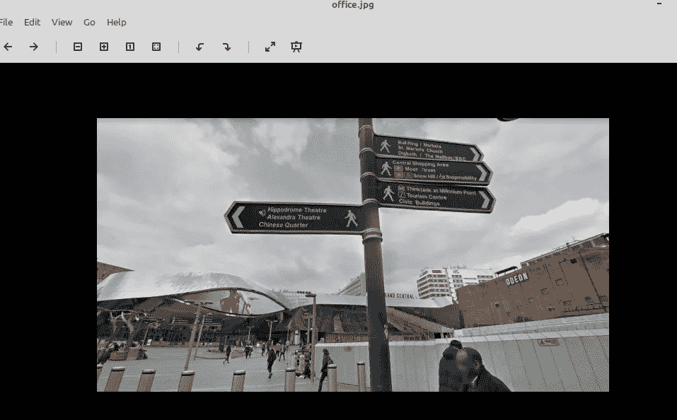

这和谷歌地图视图的另一张图是同一个地方。

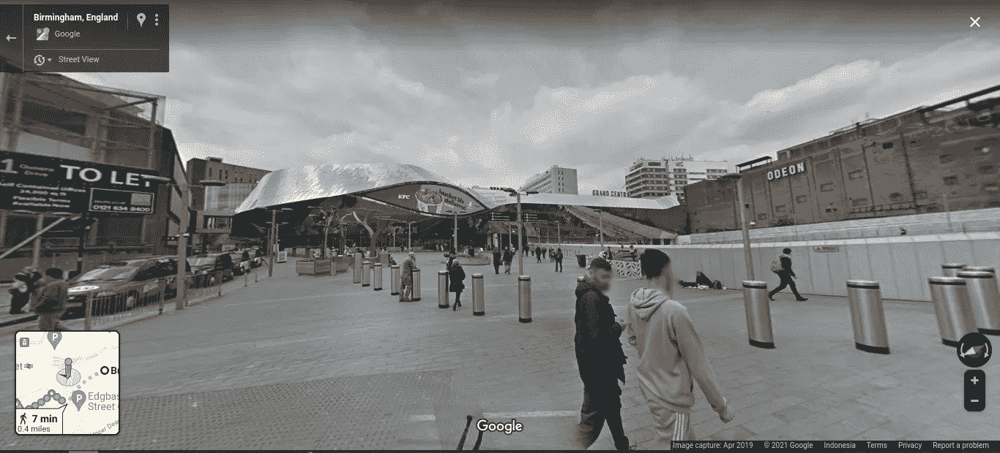

10.File -> Webcam.png:
有了你提供的情报，我们的地面监视单位现在可以监视嫌疑人的可疑地址。他们看见他们离开公寓，跟着他们去了机场。他们的飞机起飞了，已经在另一个国家着陆。我们的情报小组用这个 IP 摄像头发现了目标。这个相机是什么状态？

> 印第安纳

我发现图片来源是 **EarthCam** 。

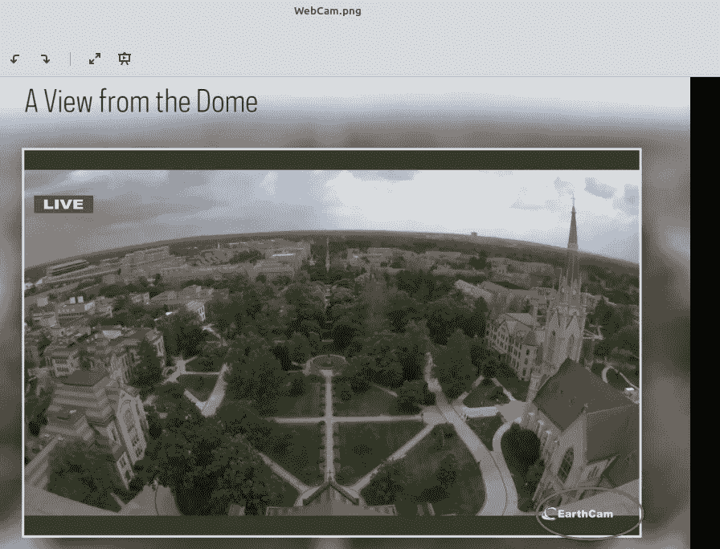

我试着用**家**作为关键字来匹配所有国家的某个房子的顶部，我再次幸运地找到了:D

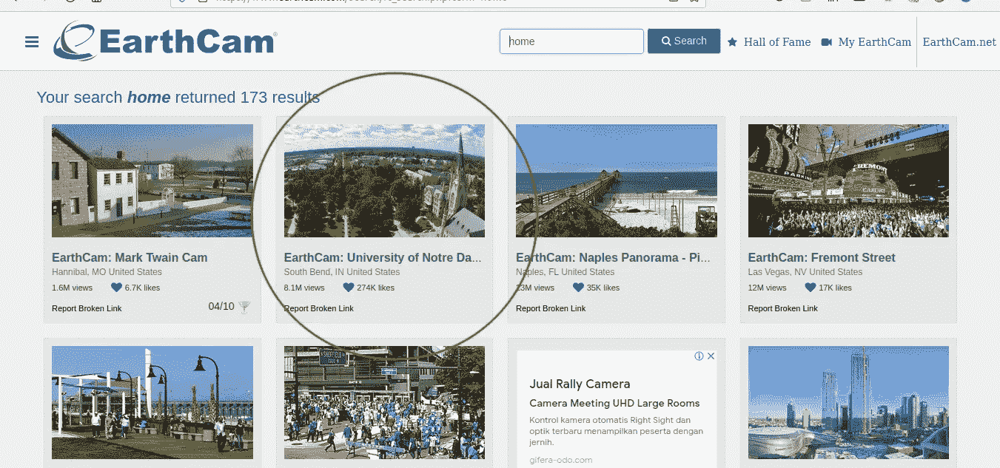

这是一个可怕的观点。

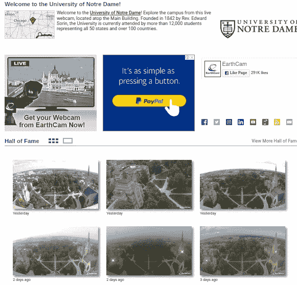

## 结论

毫无疑问，我对互联网领域非常感兴趣，因为它有助于在互联网上搜索你想要的东西。这个技能太牛逼了。只需使用你的智能手机，就可以进行在线聊天。如果你今天学到了什么，我会说“不客气:”

谢了。