# 网络卫士演练:英特尔 101

> 原文：<https://infosecwriteups.com/cyberdefenders-walkthrough-intel101-47dc943409a6?source=collection_archive---------0----------------------->

## 一个新的 CTF 挑战

这篇文章是网络卫士对英特尔 101 挑战的概述。挑战可以在 [**这里找到**](https://www.cyberdefenders.org/labs/38) 。


照片由[马库斯·温克勒](https://unsplash.com/@markuswinkler?utm_source=medium&utm_medium=referral)在 [Unsplash](https://unsplash.com?utm_source=medium&utm_medium=referral) 上拍摄

## 挑战详情:

> “开源情报(OSINT)练习练习挖掘和分析公共数据，以便在调查外部威胁时生成有意义的情报。”

让我们直接进入问题并解决这个挑战吧！

## Q1。谁是 jameskainth.com 的注册员？

我们可以运行一个简单的 whois 查找来查找上述域名的注册商。

```
whois jameskainth.com | grep Registrar:
```

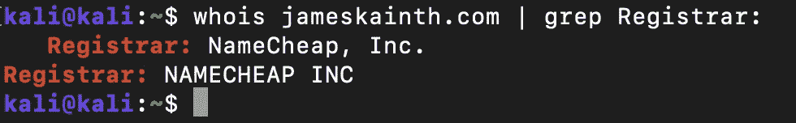

whois 查找

根据输出，该域名的注册商是 **NameCheap** ，这成为我们这个问题的标志。

## Q2。你接到了这个号码打来的电话:855–707–7328，他们以前有另一个名字？(单词之间没有空格)

通过在谷歌上直接搜索上述电话号码，我们在我的 Spectrum/Time Warner 账单上找到了文本“*如果我对账单有任何疑问，请拨打该电话号码:(855–707–7328)”*

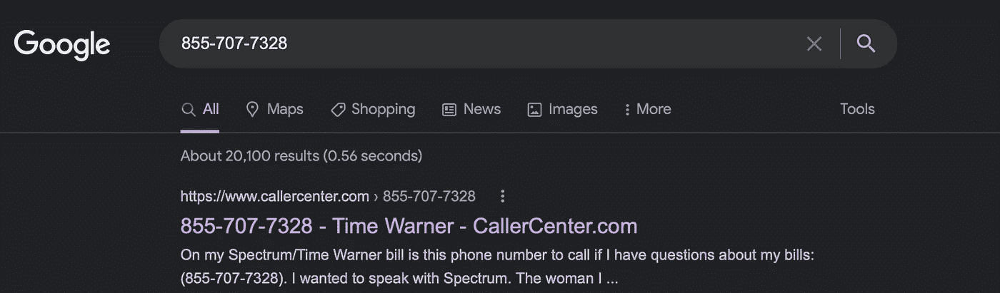

855–707–7328 的谷歌搜索结果

这表明这是 Spectrum/Time Warner 的支持热线号码。这也告诉我们，Spectrum 和时代华纳是同一家公司，因为它们的名字可以互换使用。关注问题的第二部分，我们需要找出"*它们以前被称为"*"什么。

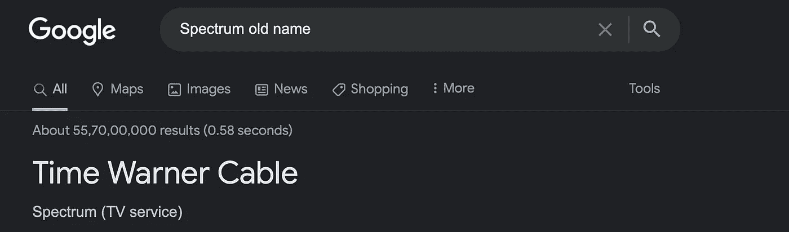

Spectrum 以前被称为时代华纳有线电视，所以我们对这个问题的回答是**时代华纳有线电视**

## Q3。英国首相内阁会议的 Zoom 会议 id 是多少？

在谷歌上搜索关键词，我们得知英国首相在主持有史以来第一次数字内阁会议时意外泄露了 Zoom ID。


一些新闻文章可能还包括一张照片以及泄露的 ID，然而，为了使这更有趣，我们将找到泄露的确切位置！

我们知道名人经常在 Twitter 上积极发帖，我们可以使用谷歌呆子在鲍里斯·约翰逊的官方账户上找到关于有史以来第一次数字内阁会议的实际 Twitter 帖子。

```
site:twitter.com intitle:Boris Johnson intext:digital cabinet
```

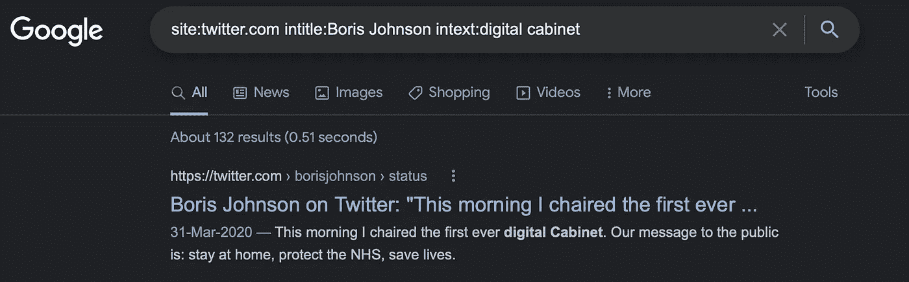

这让我们看到了关于这个数字内阁会议的 Twitter 帖子:

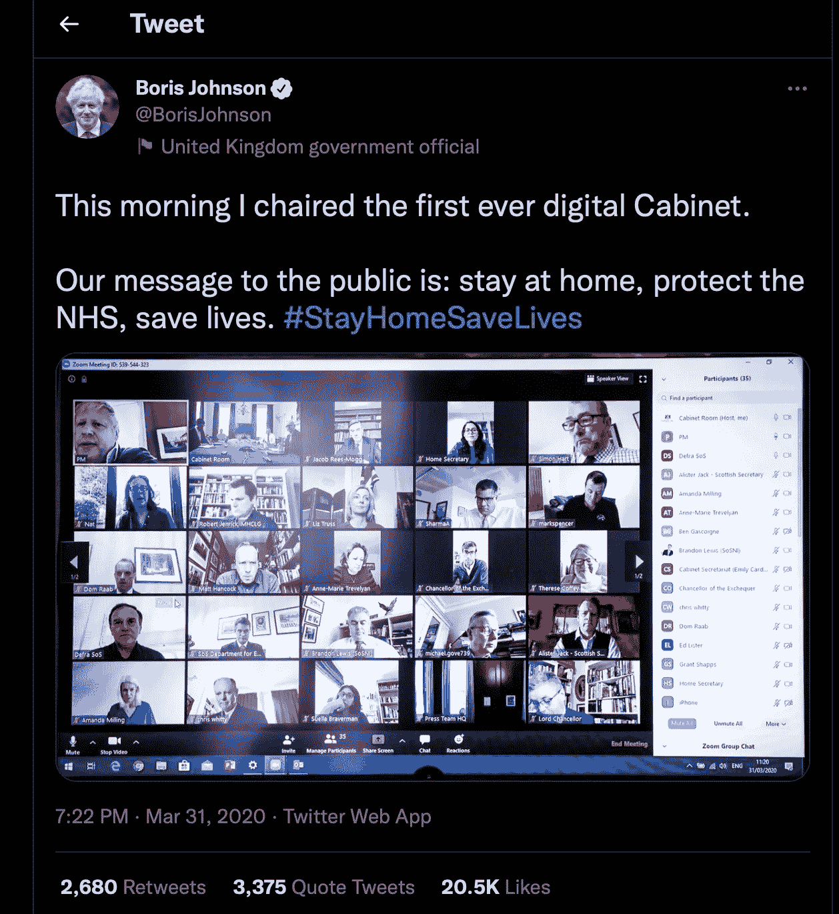

推特帖子


左上角泄露的 ID

缩放 ID 在左上角的栏中可见。我们这次挑战的旗帜是 **539544323**

## Q4。2018 年秋季的全日制学位寻求新生在 2019 年秋季重新入学到尚普兰的比例是多少？

我们将从快速谷歌搜索问题中的关键词开始，以获得一些包含学生入学统计数据的网站。

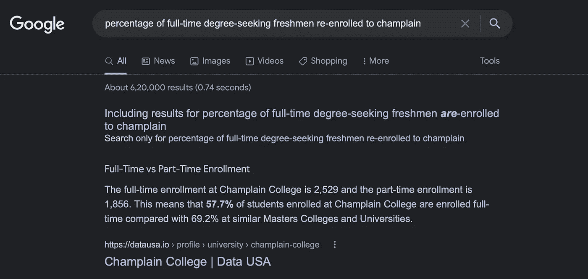

在浏览第一个搜索结果后，我们成功地发现 2019 年的保留率为 82%。但是，根据我们的问题格式，我们需要更准确的答案，精确到小数点后一位。(在这一点上，我们可以简单地尝试提交 82.1 到 82.9，看看哪个被接受，但我们将通过适当的 OSINT 更深入地寻找答案。)

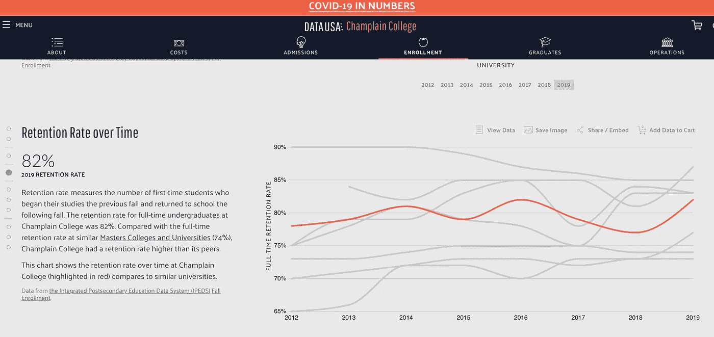

datausa.io

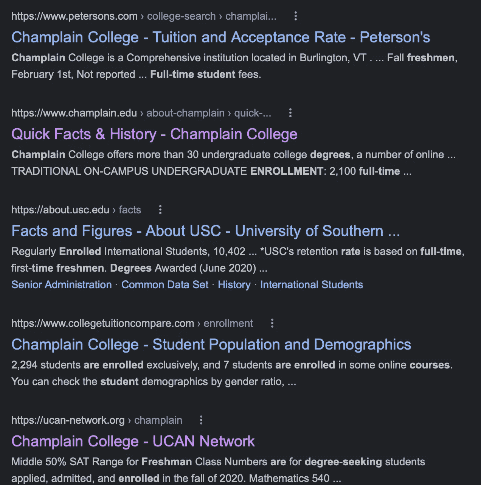

搜索结果

在浏览了更多包含统计数据的搜索结果后，我们没有发现任何有趣的东西，大多数网站都提到了接受率，但没有提到保留率。然而，我们的搜索结果之一，*ucan-network.org*包含了一些有用的数据。

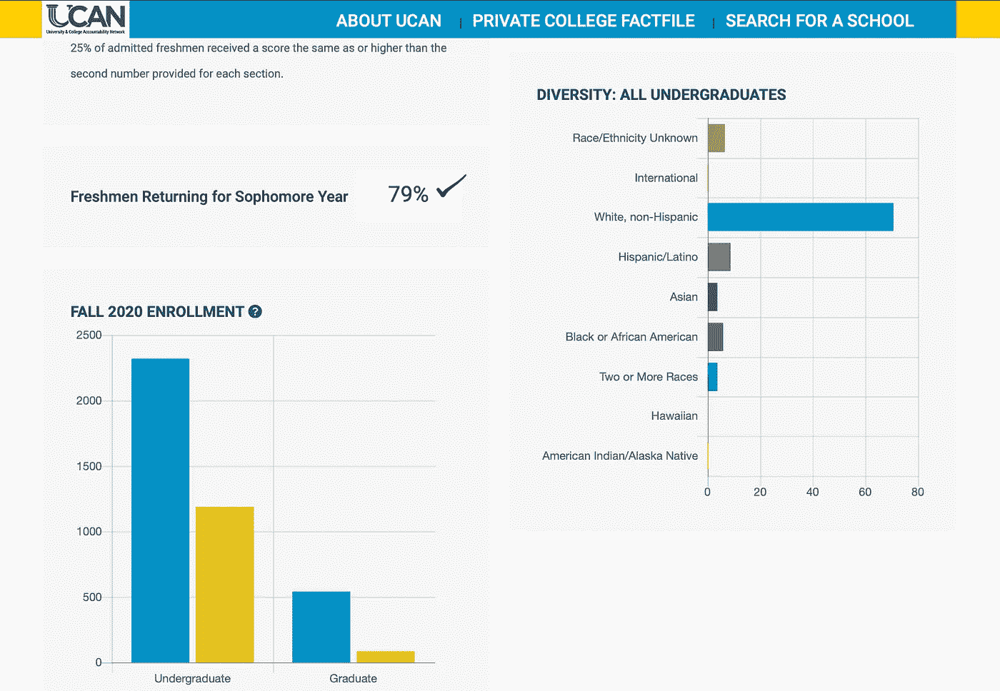

ucan-network.org

在这里，我们注意到一个字段*，“大一新生大二返校”，*这正是我们需要找出的，但对于 2019 年秋季。网站上目前的数据是 2020 年秋季的。对于这个任务，我们可以利用 [*时光倒流机*](https://archive.org/) ，这是一个互联网的数字档案，包含各种网站的历史快照。这可以帮助我们查看包含 2019 年秋季旧发布数据的快照。

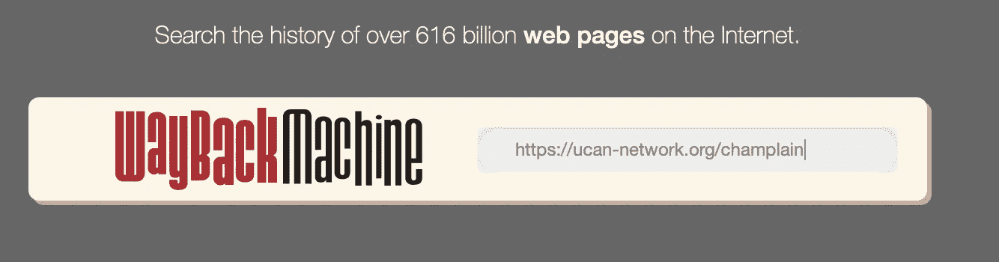

回溯机器搜索

在 wayback 机器上搜索此页面，我们可以看到不同时间的可用快照。让我们从 2019 年的快照开始，尝试找到包含 2019 年秋季数据的页面版本。

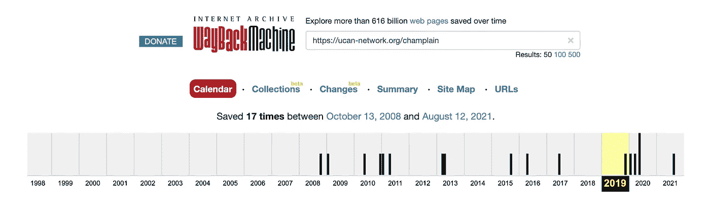

快照

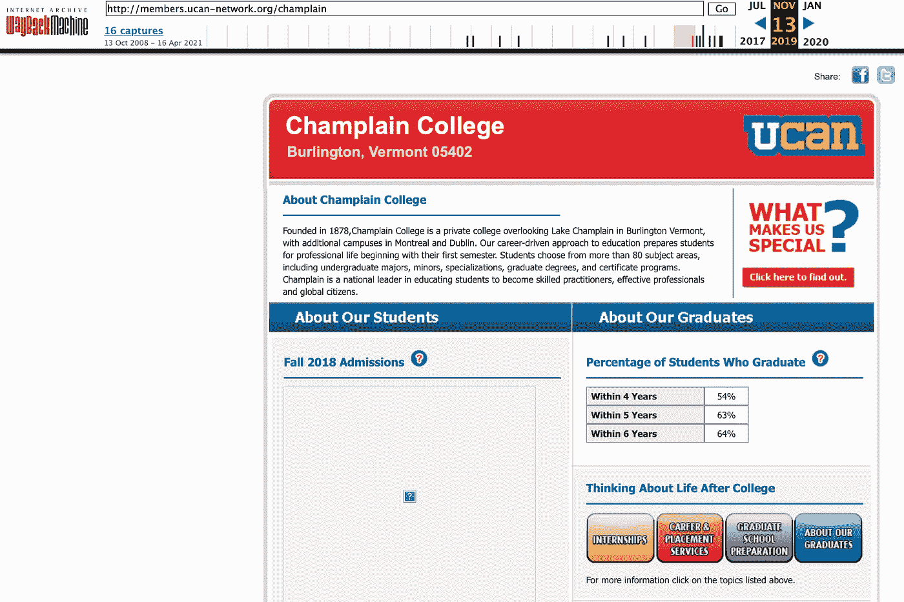

该页面包含 2018 年的数据，因此我们需要查看更近的页面，直到找到 2019 年的数据。

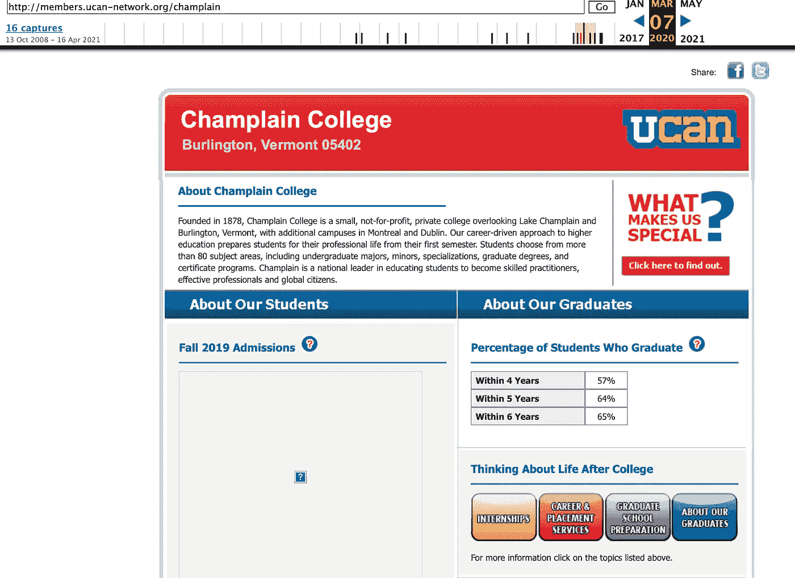

2020 年 3 月 7 日的快照包含 2019 年秋季的数据

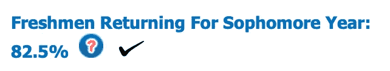

向下滚动，我们找到了我们正在寻找的字段，我们的标志是 **82.5%**

## Q5。尚普兰学院有一个公开的 excel 表格，列出了互联网上可用的校园地址，Excel 文件的 SHA256 哈希是什么？

首先，我们会通过谷歌找到尚普兰学院的官方网站。


champlain.edu

现在，我们可以使用 Google dorks 来搜索存在于*champlain.edu*上的所有 excel 文件，使用:

```
inurl:champlain.edu file:xls
```

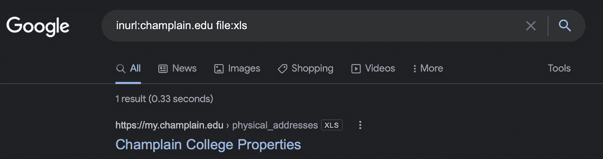

我们发现一个暴露的 excel 文件 physical_addresses.xls，其中包含各个校园位置的地址。要获得我们的标志，我们需要提供这个文件的 SHA256 散列。

```
openssl dgst -sha256 physical_addresses.xls
```

## 输出:

此问题的标志-

sha 256(physical _ addresses . xls)=**c 96 ee 03 c 4043 c 366 c6f 573 bb1d 194 de c8 f 4c 0 c 81150 c60d 310 BC 59d 9 e 17 a 6906**

## Q6。1998 年 2 月 12 日，尚普兰计划在校园里增加一栋令人兴奋的新建筑。当时，它被称为“信息共享空间”。你能找到里面是什么样子的图片吗？在这里上传 sha256 哈希。

因为这个问题提供了一个非常具体的日期，所以我们可以推断，在 1998 年的那个时候，学院的主网站上就会提到一座新大楼。对于这个任务，我们可以再次使用[*way back Machine*](https://archive.org/)*来查看网站的旧版本和 1998 年以来发布的数据。首先，让我们检查一下我们是否有当时尚普兰网站的快照。*

*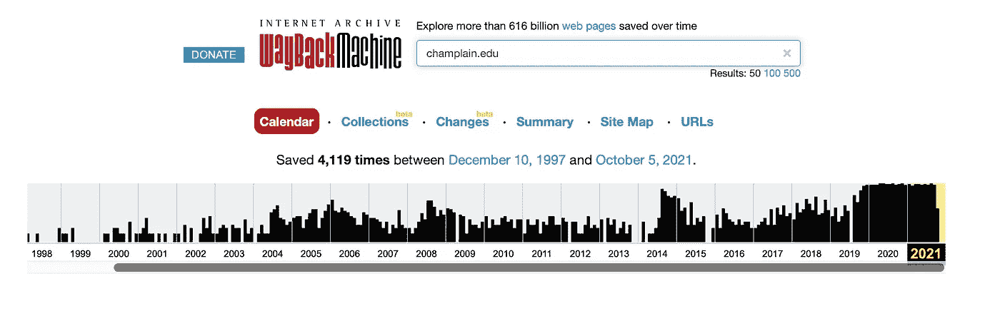*

*回溯机器搜索*

*我们可以看到，我们确实有可以追溯到 1998 年的快照，甚至是我们问题中提到的确切日期！*

*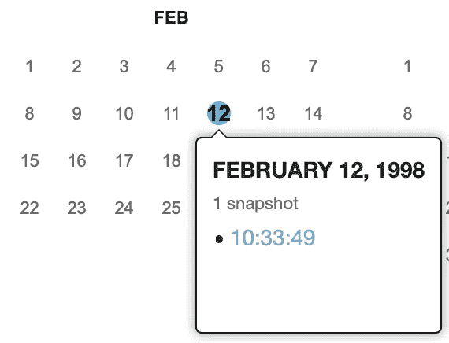*

*尚普兰快照 1998*

*加载快照后，我们会看到一个特定的页面链接*“信息共享项目”*，其中有提到了这座新建筑，还有一张从内部看上去的图片。*

*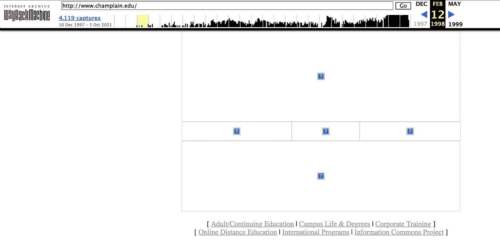**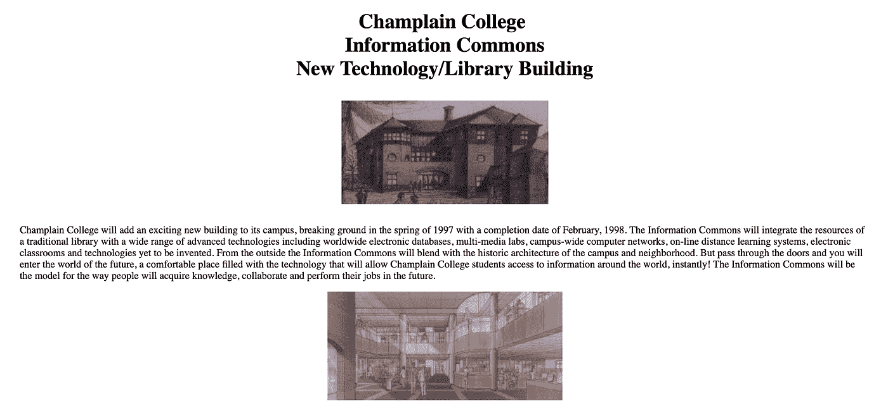*

**信息共享空间项目**

*要获得我们的旗帜，我们只需要下载代表这座建筑内部设计的图像，并获得它的 SHA256 哈希。*

```
*openssl dgst -sha256 inside1.jpeg*
```

*sha 256(inside 1 . JPEG)=**f 4952 b 314 EB 15 ACF 0 EEC 79 c 954 f 83881 c 17d 50d 2 b 5922 ee 37 e 8 fc 5 e 5c D1 AAC 2***

## *Q7。尚普兰学院的一名网络安全教员获得了俄亥俄州大学的文学学士学位。另一个在那里学习的教员是谁？(名字姓氏-两个单词)*

**

*谷歌-尚普兰学院网络安全学院*

*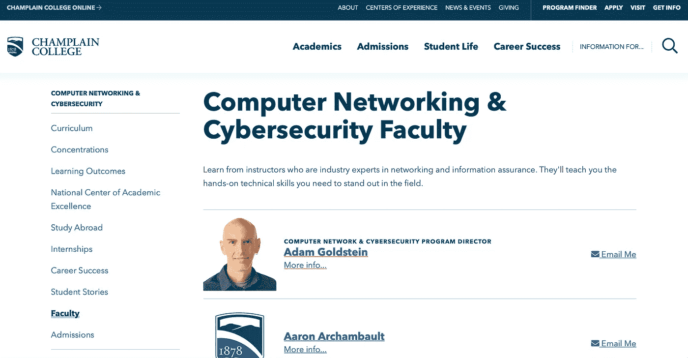*

*champlain.edu 大学的正式教师名单*

*浏览教员列表，首先我们需要快速浏览每个人的教育部分，并找到一个拥有俄亥俄州大学文科学士学位的人。*

*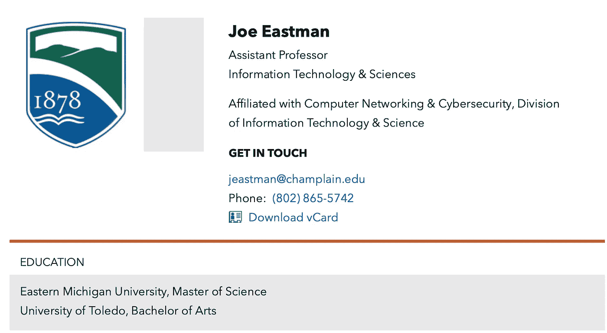*

*俄亥俄州一所大学的文科学士*

*我们可以看到乔·伊斯曼获得了俄亥俄州托莱多大学的文学学士学位。*

*现在我们只需要扫描其他的教员，找出还有谁在托莱多大学学习过。我们可以在这里使用谷歌呆子，使我们的搜索更有效。*

```
*inurl:champlain.edu/academics/our-faculty intext:University of Toledo*
```

*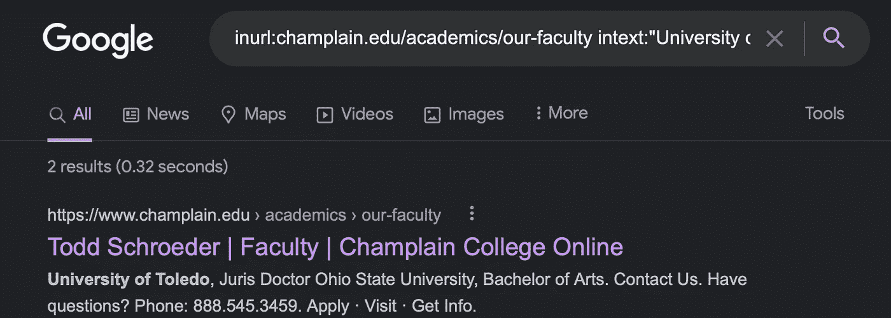*

*谷歌呆子在教师页面找到托莱多大学*

*我们从谷歌搜索结果中找到托德·施罗德，在确认他的简历页面时，我们可以看到他确实是网络安全学院的一员。因此，我们这个问题的旗帜是**托德·施罗德。***

## *Q8。2019 年，UVM 的鱼类学课程必须为他们的鱼命名。你能找出公共花名册上的最后一个人给他们的鱼起了什么名字吗？*

*在谷歌上搜索 UVM 大学的鱼类学课程，我们会看到该大学的网页:*

*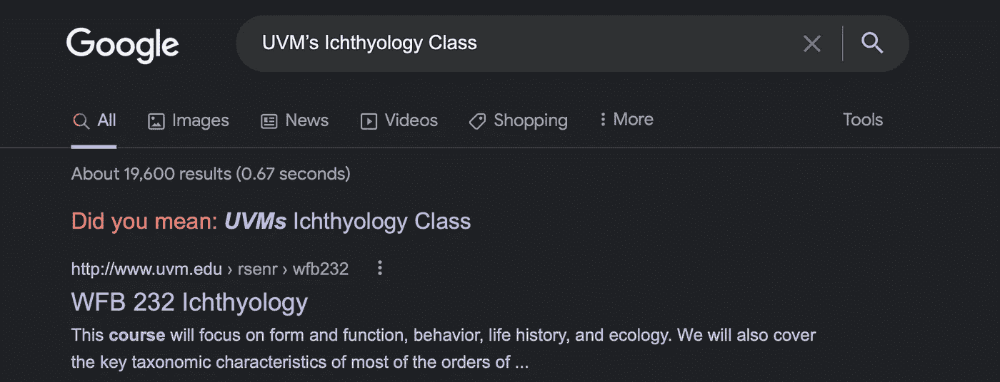*

*谷歌搜索*

*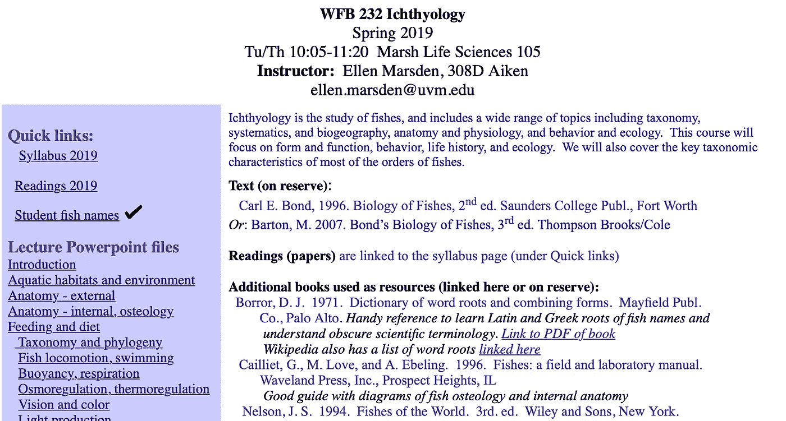*

*UVM 计划信息页面*

*在鱼类学课程信息页面上，有一个快速链接部分，在那里我们可以看到学生鱼名的链接。链接下载了一个名为*studentfishnames 2019 . xls .*的 xls 文件转到列表的末尾，我们可以看到公共花名册上的最后一个学生给他们的鱼命名为 **Saccopharyngiformes，**这是我们这个问题的标志。*

*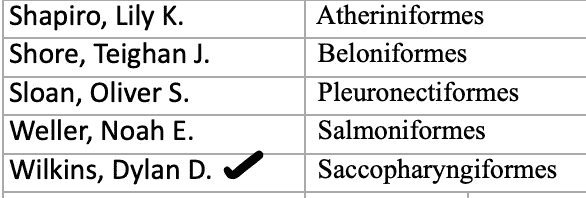*

**studentfishnames 2019 . xls**

## *Q9。你能找出这张照片是从哪个州拍的吗？见附件照片*

*下面是问题中提到的照片:*

*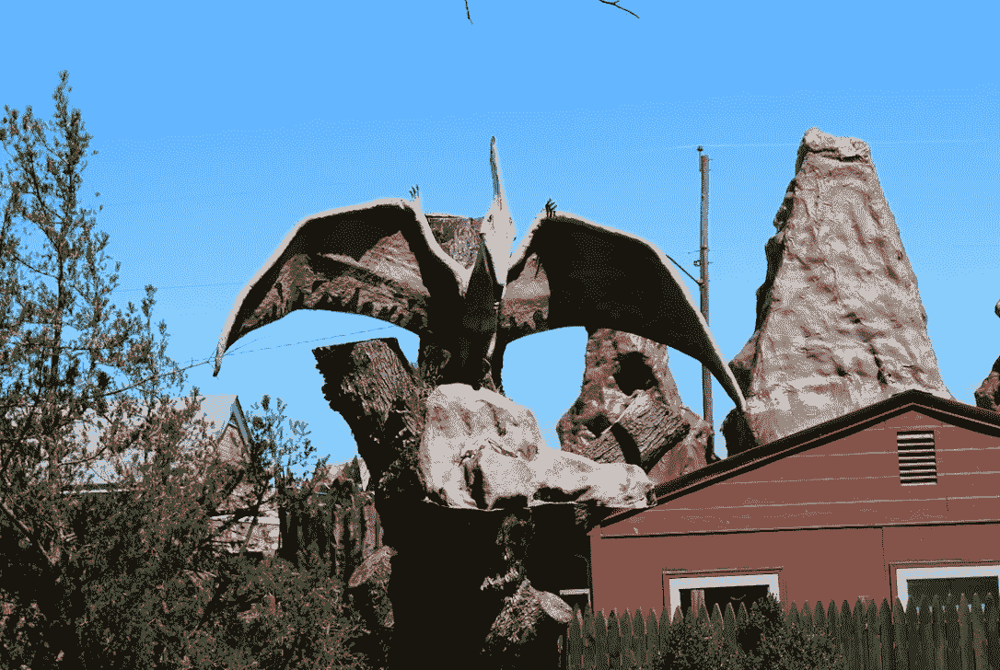*

*挑战图像*

*让我们使用这张图片进行反向图片搜索。谷歌没有给我们任何关于图片的具体信息。在 Bing、Yandex 等多个搜索引擎上搜索图片总是一个好主意。*

*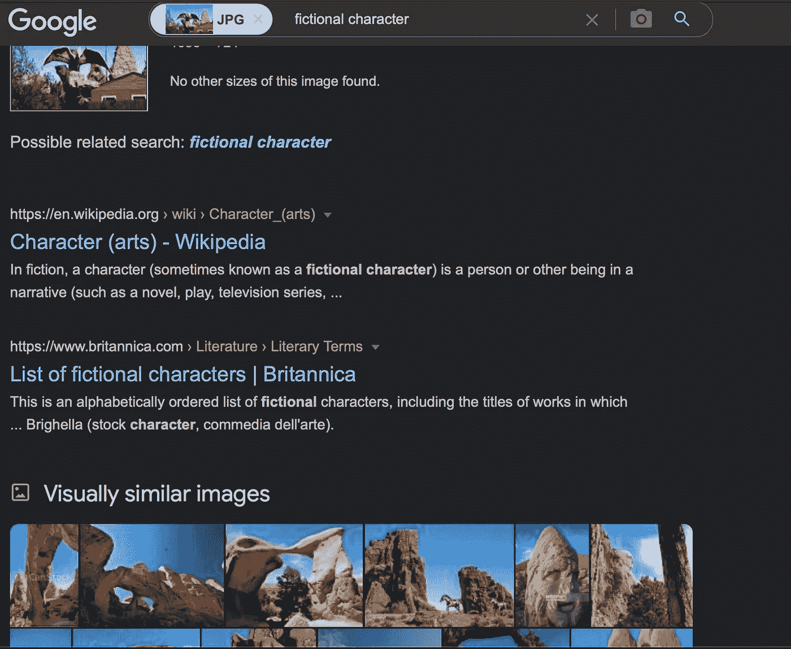*

*谷歌反向图片搜索*

*Bing 搜索会提供有用的有趣结果。*

*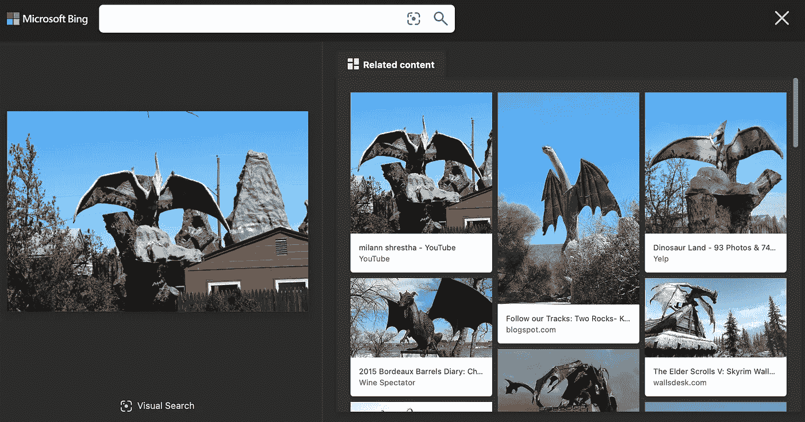*

*Bing 反向图像搜索*

*第一个结果是确切的图像，并指向一个 Youtube 频道，该频道将此图像作为个人资料图片。“关于”部分和视频内容没有给出太多信息，只是根据视频标题暗示了一些视频是在尼泊尔拍摄的。尝试尼泊尔的几个州并不能得出正确的答案，这是一个兔子洞。*

*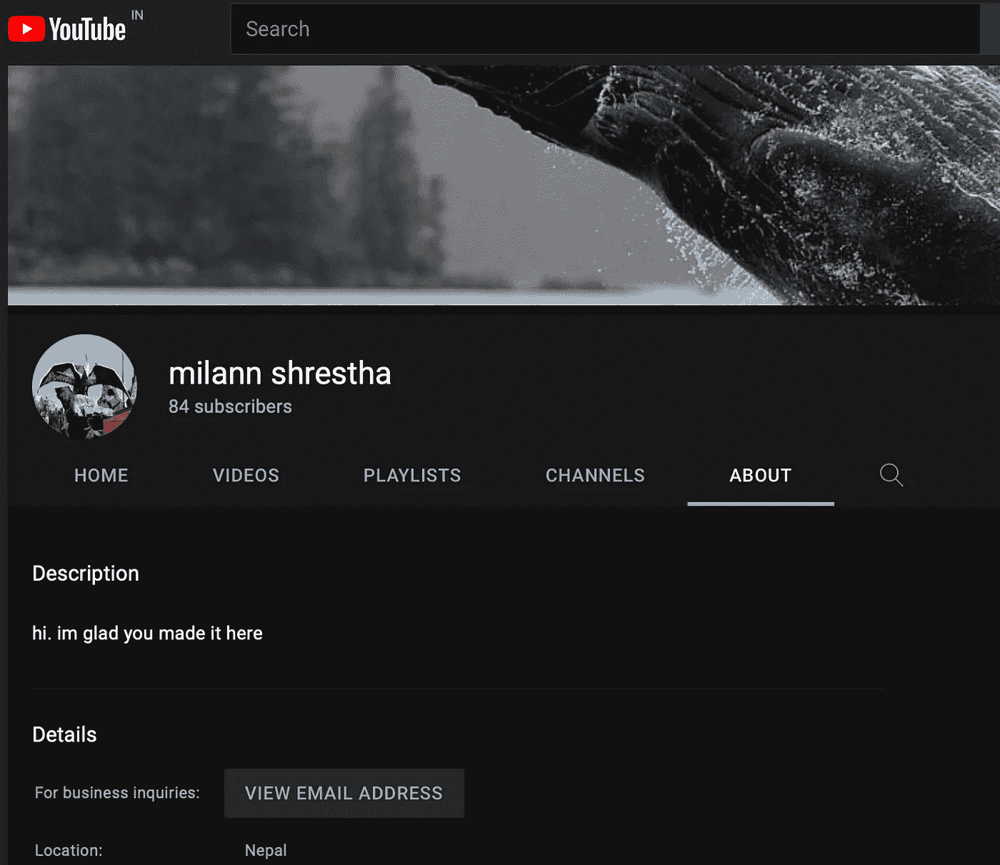*

*继续关注 Bing 上一个更有趣的结果:*

*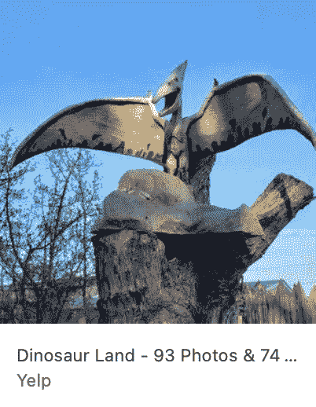*

*Bing 图像搜索结果*

*这张图片看起来像我们从不同角度拍摄的挑战图片，并根据谷歌*将我们引向*恐龙乐园、*弗吉尼亚州的一个主题公园。**

*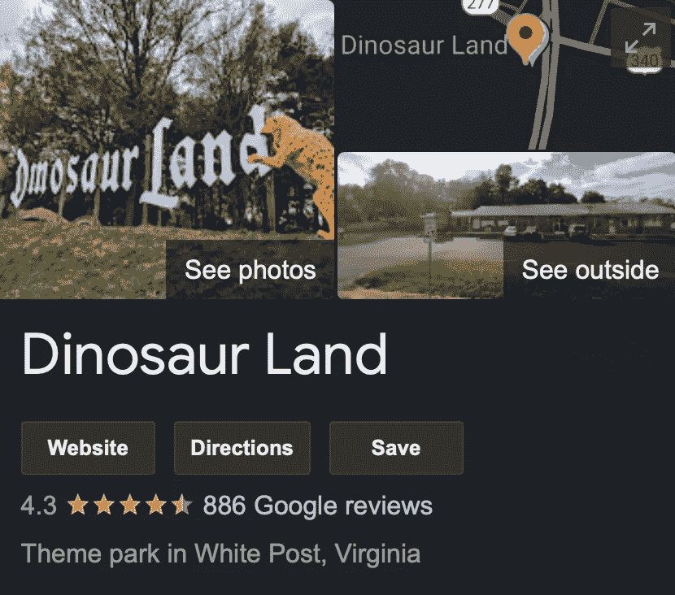*

*谷歌——恐龙王国*

*我们的挑战到此结束，我们最后的旗帜是**维吉尼亚**！*

## *感谢阅读:)*

## *我希望这个演练是有趣的！*