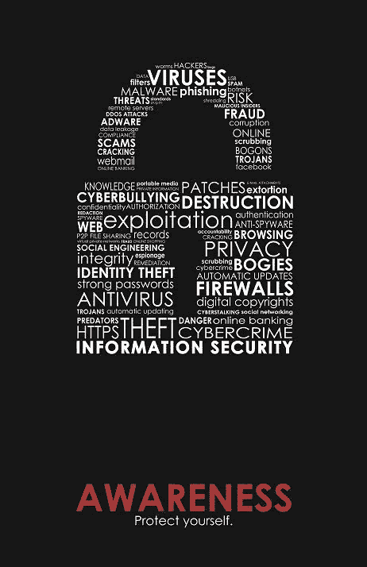

# 网络安全学习路径

> 原文：<https://infosecwriteups.com/cybersecurity-learning-path-19f64f6a547e?source=collection_archive---------0----------------------->

在这个博客中，我将分享网络安全的学习途径，帮助你了解网络安全

我会更好地指导你如何在这个领域开始，下面是你应该采取的各种基本设置，以获得从基础到高级概念的良好知识。所以让我们来看看:

## 学习编程

如果你想在网络安全领域发展，编程是一个核心部分。作为一名网络专业人员，重要的是你要认识到你所面临的任何威胁的原因和症状。编码知识可以给你足够的洞察力来识别一个软件在做什么，即使它是不是恶意代码。

然而，任何一种编程语言都不会提供对每个应用程序级和硬件弱点的全面理解。

***例如:***

1.  理解 C 语言可以帮助您发现系统软件中的缓冲区溢出漏洞。
2.  熟悉 Perl 可以帮助您测试应用程序中的错误。
3.  精通 JavaScript 有助于识别 web 应用程序中的安全问题。
4.  了解 SQL 将帮助您防止结构化查询语言注入(SQLi)攻击，这是一种特定类型的网络攻击，它允许攻击者操纵 SQL 语句并渗透到安全的基于 SQL 的数据库中。

这些语言分为两类:

**1。编程语言**

它们通常像脚本一样在父程序中运行。在将代码与数学模型集成时更加兼容。像 JAVA 这样的语言可以被编译，然后在任何平台上使用

**2。脚本语言**

使程序中的某些任务自动化。从数据集中提取信息。与传统编程语言相比，代码量更少

**学习编程语言的资源:**

***C :***

 [## 学习 C 编程

### c 是一种强大的通用编程语言。我们的 C 教程将指导你一步到位地学习 C 编程…

www.programiz.com](https://www.programiz.com/c-programming)  [## c 教程

### c 程序设计是一种通用的、过程化的、命令式的计算机程序设计语言，由 Dennis M…

www.tutorialspoint.com](https://www.tutorialspoint.com/cprogramming/index.htm) 

***Java:***

 [## 学习 Java 编程

### Java 是一种强大的通用编程语言。我们的 Java 教程将指导你一步到位地学习 Java。

www.programiz.com](https://www.programiz.com/java-programming)  [## 初学者 Java 教程:学习 Java 编程

### 本教程将帮助你像专业人士一样学习 Java。我已经分享了 500 多个关于 Java 各种主题的教程，包括…

beginnersbook.com](https://beginnersbook.com/java-tutorial-for-beginners-with-examples/) 

***戈朗:***

 [## 以身作则

### Go 是一种开源编程语言，旨在构建简单、快速、可靠的软件。请阅读…

gobyexample.com](https://gobyexample.com/)  [## Golang 教程:目录

### 教程学习从零开始，用手的方法。简单的例子使学习变得容易。运行…

golangbot.com](https://golangbot.com/learn-golang-series/) 

**学习脚本语言的资源:**

***外壳:***

 [## 学习 Shell - Free 交互式 Shell 教程

### 欢迎来到 learnshell.org 交互式 Shell 编程教程。不管你是不是一个有经验的程序员…

www.learnshell.org](https://www.learnshell.org/)  [## Shell 脚本教程

### shell 脚本是一种设计为由 Unix/Linux shell 运行的计算机程序，它可以是以下程序之一…

www.tutorialspoint.com](https://www.tutorialspoint.com/unix/shell_scripting.htm) 

***PHP:***

 [## 学习 PHP——免费的交互式 PHP 教程

### 欢迎来到 learn-php.org 免费互动 PHP 教程。不管你是不是有经验的程序员，这…

www.learn-php.org](https://www.learn-php.org/)  [## PHP 教程

### 欢迎来到现代 PHP 教程！这个 PHP 教程帮助你学习如何开发动态网站和 web…

www.phptutorial.net](https://www.phptutorial.net/) 

***Python:***

 [## Python 教程

### 本 Python 教程帮助您从头开始学习 Python 编程。如果你想快速掌握 Python 编程…

www.pythontutorial.net](https://www.pythontutorial.net/)  [## 学习 Python-免费的交互式 Python 教程

### 这个网站得到了 DataCamp 的大力支持。DataCamp 为数据科学提供在线互动 Python 教程…

www.learnpython.org](https://www.learnpython.org/) 

***Javascript:***

 [## 现代 JavaScript 教程

### 现代 JavaScript 教程:简单，但详细的例子和任务的解释，包括:闭包，文档…

javascript.info](https://javascript.info/)  [## JavaScript 教程

### 面向初学者的 JavaScript 教程—学习世界上最流行的客户端脚本语言的概念…

www.tutorialrepublic.com](https://www.tutorialrepublic.com/javascript-tutorial/) 

## 学习数据库

大多数组织缺乏及时响应违规事件的能力，并且不能持续评估数据库活动。常见的数据库安全问题包括凭据受损、潜在的重大数据泄露以及无法及时发现泄露。

在基本层面上，据估计，大多数组织对谁在访问他们的数据库缺乏高度的确定性。这是一个重大的安全问题。不知道谁在您的数据库中会导致严重的问题，如删除数据、不正确的数据或重大数据违规。

**了解数据库的资源:**

***SQL:***

 [## SQL 教程

### SQL 是为在关系数据库管理系统中管理数据而设计的标准语言。SQL 代表…

www.tutorialrepublic.com](https://www.tutorialrepublic.com/sql-tutorial/)  [## SQL 教程-初学者必备的 SQL

### 本 SQL 教程通过许多实际例子帮助你快速有效地开始使用 SQL。如果你是一个…

www.sqltutorial.org](https://www.sqltutorial.org/) 

***Mongo DB:***

 [## 使用分步教程学习 MongoDB

### 使用实际示例逐步学习 MongoDB。MongoDB 是一个面向文档的开源 NoSQL 数据库…

www.tutorialsteacher.com](https://www.tutorialsteacher.com/mongodb)  [## MongoDB 教程

### 了解企业如何利用 MongoDB

www.mongodb.com](https://www.mongodb.com/docs/manual/tutorial/) 

***PostgreSQL:***

 [## PostgreSQL 教程

### 欢迎来到 PostgreSQLTutorial.com 网站！本 PostgreSQL 教程帮助你快速理解 PostgreSQL。你会…

www.postgresqltutorial.com](https://www.postgresqltutorial.com/)  [## PostgreSQL 教程

### PostgreSQL 是一个强大的开源对象关系数据库系统。它有超过 15 年的活跃…

www.tutorialspoint.com](https://www.tutorialspoint.com/postgresql/index.htm) 

## **学习 OS(操作系统)**

我们都知道什么是操作系统

> *“操作系统(OS)是管理计算机硬件、软件资源并为计算机程序提供公共服务的软件系统”。*

有许多操作系统可用，然而，最常见的是基于 Windows、Mac 和 Linux 的操作系统。另一方面， **Android & iOS** 是手机操作系统中的多数玩家。

当您需要了解特定操作系统的工作原理、它们提供的各种安全特性、它们各自的限制以及攻击者如何滥用它们时，您会面临许多情况。

**学习操作系统的资源:**

***Linux 基础知识:***

 [## 主页| Linux 之旅

### 什么是 Linux？开始选择发行版和安装。

linuxjourney.com](https://linuxjourney.com/)  [## 网络终端

### 我们提供了一个独特的免费在线学习平台，在这里你可以了解 Linux，练习，玩 Linux 和…

www.webminal.org](https://www.webminal.org/) 

***安卓基础知识:***

 [## Android 开发

### Android 开发教程- Android，活动，意图，ADT，服务，广播接收器

www.vogella.com](https://www.vogella.com/tutorials/android.html)  [## Android 核心档案- Java 代码极客- 2022

### JCGs (Java 代码极客)是一个独立的在线社区，致力于为 Java 开发人员创造终极 Java…

www.javacodegeeks.com](https://www.javacodegeeks.com/category/android/android-core)  [## Android 操作系统| Android 操作系统的基本结构

### Android 操作系统是一个开源系统。很多人说它是 Linux，但这并不完全正确。虽然…

www.educba.com](https://www.educba.com/android-operating-system/) 

***Windows 基础知识:***

 [## Windows 10 教程

### Windows 10 是微软最新的操作系统版本。本教程给你所有的深入信息，这一新的…

www.tutorialspoint.com](https://www.tutorialspoint.com/windows10/index.htm)  [## GCFGlobal 的免费 Windows 基础教程

### 在这个免费的 Windows 基础教程中，你将学习所有关于导航，查找和发送文件，使用快捷方式…

edu.gcfglobal.org](https://edu.gcfglobal.org/en/windowsbasics/) 

如果您希望深入了解这些操作系统，您可以查找 Windows 内部或 Linux 内部。然而，我建议获得基本知识是好的，只要知道正确的命令和它们的用法。

## **学计算机网络**

对于任何在互联网上工作的 IT 专业人员来说，网络是最重要的方面之一。连接到互联网意味着你可以收到大量的流量。巨大的流量会导致稳定性问题，并可能导致系统中的漏洞。网络安全通过持续监控任何可能破坏系统的可疑交易来防止延迟和停机，从而提高网络的可靠性。

要从事网络安全工作，你必须了解网络的基本概念，包括了解**路由、防火墙、SSL、TLS、端口、协议、IP、TCP、UDP、MAC 和**其他重要的网络安全功能如何工作。

**学习计算机网络的资源**

 [## 计算机网络教程-学习百科

### 本教程将向您概述并解释计算机网络和通信的高级概念。的…

studyopedia.com](https://studyopedia.com/tutorials/computer-networks/)  [## 网络安全教程

### 网络安全涉及与保护网络上敏感信息资产相关的所有方面

www.tutorialspoint.com](https://www.tutorialspoint.com/network_security/index.htm)  [## 数据通信和计算机网络

### 数据通信指的是两台或多台计算机和一台计算机之间的数字数据传输…

www.tutorialspoint.com](https://www.tutorialspoint.com/data_communication_computer_network/index.htm) 

也有一些书可以帮助你理解网络概念。

**1。自上而下的方法:计算机网络**

**2。系统管理员网络(IT 精通)**

**3。全新开关书(第二版)**

**4。虚拟网络一体机(第 8 版)**

**5。高性能浏览器联网**

**6。商业数据通信与网络(第 14 版)**

## **学习网络应用**

Web 应用程序安全是一系列协议和工具，它们协同工作，确保所有移动、云应用程序、网站和桌面应用程序免受恶意威胁或意外破坏和故障。这是一个发现、修复和消除漏洞的过程，使应用程序容易受到黑客的攻击。

任何组织的大部分对外资源都是 web 应用程序。

在深入研究如何测试 Web 应用程序安全性之前，有必要了解关于 Web 应用程序、它们的通信和组件的各种概念。

**学习基本概念的资源**

 [## 网络安全网络应用

### 无论是访问互联网还是远程控制，Web 应用程序几乎是我们所做的每一件事情的组成部分

www.w3schools.com](https://www.w3schools.com/cybersecurity/cybersecurity_web_applications.php) 

如果你想更详细地了解这个话题，请访问这个网站，它会帮助你了解它。

 [## 面向开发人员的网络技术| MDN

### 您可以使用 JavaScript 编程 API 在 Web 上构建应用程序。HTML 为…提供了基本的构建块

developer.mozilla.org](https://developer.mozilla.org/en-US/docs/Web) 

***网络安全备忘单:***

 [## 网络安全

### 本文档的目标是帮助运营团队创建安全的 web 应用程序。所有 Mozilla 网站和…

infosec.mozilla.org](https://infosec.mozilla.org/guidelines/web_security) 

## **了解通用安全框架**

网络安全框架是一系列描述网络安全风险管理指南、标准和最佳实践的文档。这些框架旨在减少组织暴露于黑客和其他网络犯罪分子可能利用的弱点和漏洞的风险。

当你上网搜索网络安全框架时，你会发现信息安全框架实际上是工业界用来保护你的数据的。

实际的网络安全框架是 **OWASP。**

**OWASP:***Open Web Application Security Project*是一个在线运行的社区，它制作的文章可以在互联网上免费获得。他们还提供了 Web 应用程序安全领域的方法、文档、工具和技术。

**OWASP 网页前 10 名:**

 [## OWASP 十大

### OWASP Top 10 是开发人员和 web 应用程序安全性的标准认知文档。它代表了广泛的…

owasp.org](https://owasp.org/www-project-top-ten/) 

**OWASP API 前 10 名:**

 [## OWASP API 安全项目

### 在当今应用驱动的世界中，创新的一个基本要素是 API。从银行、零售和运输到…

owasp.org](https://owasp.org/www-project-api-security/) 

**OWASP 手机前 10:**

 [## OWASP 手机前 10 名

### 2015 年，我们进行了一项调查，并在全球范围内发起了数据提交呼吁。这有助于我们分析和…

owasp.org](https://owasp.org/www-project-mobile-top-10/) 

**OWASP 应用安全验证标准:**

 [## 应用安全验证标准

### OWASP 应用程序安全验证标准(ASVS)项目为测试 web 应用程序提供了基础

owasp.org](https://owasp.org/www-project-application-security-verification-standard/) 

OWASP 漏洞管理指南:

**OWASP 风险评级方法:**

 [## OWASP 风险评级方法

### 多年来，关于 OWASP 风险评级方法和威胁因素的权重有很多争论…

owasp.org](https://owasp.org/www-community/OWASP_Risk_Rating_Methodology) 

**STRIDE:**[STRIDE](https://docs.microsoft.com/en-us/previous-versions/commerce-server/ee823878(v=cs.20)?redirectedfrom=MSDN)是六种威胁类别的首字母缩略词:假冒身份、篡改数据、否认威胁、信息泄露、拒绝服务和提升特权。

团队可以在应用或系统的设计阶段使用 STRIDE 威胁模型来发现威胁。第一步是使用主动流程帮助发现潜在威胁。该系统的设计构成了发现威胁的基础。接下来的步骤包括发现系统实施方式中固有的风险，然后采取措施弥补差距。

[例如](https://docs.microsoft.com/en-us/previous-versions/commerce-server/ee810587(v=cs.20))，假设您发现一个管理数据库面临篡改数据、信息泄露和拒绝服务的威胁。在这种情况下，您可以实现访问控制日志、安全套接字层/传输层安全性或 IPSec 身份验证来应对这些威胁。

**阅读更多:**

 [## 步幅威胁模型

### 当您考虑威胁时，询问以下问题是很有用的:攻击者如何改变…

docs.microsoft.com](https://docs.microsoft.com/en-us/previous-versions/commerce-server/ee823878%28v=cs.20%29?redirectedfrom=MSDN) 

**CVSS:** 通用漏洞评分系统提供了评估软件漏洞级别的程序。大多数网络安全专家使用 CVSS 基本分数作为检查系统中任何弱点严重性的主要因素。该框架支持组织确保机密性和完整性，同时保护公司拥有的数据。该系统有助于组织根据需要立即关注的软件漏洞确定软件漏洞的优先级。

**阅读更多:**

 [## 通用漏洞评分系统

### 通用漏洞评分系统(CVSS)提供了一种捕捉漏洞主要特征的方法

www.first.org](https://www.first.org/cvss/) 

## **如何从 Web 应用安全入手**

我们将了解什么是 Web 应用程序安全性，现在谈谈一些资源。那里有大量的资源，不可能学习/阅读所有的资源，然而，选择最好的也是一项困难的任务。因此，为了让它变得更好，这里有一些好的参考资料。

1.  **OWASP 测试指南**

 [## OWASP 网络安全测试指南

### 网络安全测试指南(WSTG)项目产生了网络应用程序的首要网络安全测试资源…

owasp.org](https://owasp.org/www-project-web-security-testing-guide/) 

2. **PortSwigger 网络安全学院**

 [## 网络安全学院:PortSwigger 提供的免费在线培训

### 推动您的职业生涯灵活学习向专家学习网络安全学院是一个免费的在线培训中心，面向…

portswigger.net](https://portswigger.net/web-security) 

3. **Bugcrowd 漏洞等级分类**

 [## Bugcrowd 的漏洞评级分类

### 方法在 2016 年初，我们发布了 Bugcrowd 漏洞评级分类法(VRT ),以努力…

bugcrowd.com](https://bugcrowd.com/vulnerability-rating-taxonomy) 

4. [**OWASP 果汁店**](https://owasp.org/www-project-juice-shop/#:~:text=OWASP%20Juice%20Shop%20is%20probably,and%20sophisticated%20insecure%20web%20application!&text=Juice%20Shop%20encompasses%20vulnerabilities%20from,found%20in%20real%2Dworld%20applications!)

5. **Cobalt.io 漏洞维基**

 [## 漏洞维基|钴

### 阅读 Cobalt 漏洞 Wiki，这是一个针对 pentesters 和安全专业人员的常见漏洞数据库…

www.cobalt.io](https://www.cobalt.io/vulnerability-wiki) 

6. **PayloadAllTheThings**

 [## GitHub-swisskyrepo/payloads all things:Web 应用程序的有用负载和旁路列表…

### Web 应用程序安全性的有用负载和旁路列表。请随意改进您的有效载荷和…

github.com](https://github.com/swisskyrepo/PayloadsAllTheThings) 

7. **HackTricks GitBook**

 [## 黑客技巧

### 欢迎来到这个页面，在这里你会找到每一个黑客技巧/技术/我在 CTFs、现实生活应用程序中学到的任何东西…

book.hacktricks.xyz](https://book.hacktricks.xyz/welcome/readme) 

8.**信息安全报道**

 [## 信息安全报道

### 收集了世界上最好的黑客的文章，主题从 bug 奖金和 CTF 到 vulnhub…

infosecwriteups.com](https://infosecwriteups.com) 

**9。PentesterLand**

 [## 主页

### 编辑描述

彭特斯.兰](https://pentester.land/) 

**10。黑客披露**

 [## 哈克龙

### 编辑描述

hackerone.com](https://hackerone.com/hacktivity) 

## 如何从**网络安全**入手

对于网络安全，你不必深入研究，但从安全的角度对计算机网络有一个很好的理解是非常必要的。有许多方法可以练习网络安全

一些好的资源包括:

**黑客盒子:**

 [## 最佳黑客培训

### 加入一个动态增长的黑客社区，通过最…

www.hackthebox.com](https://www.hackthebox.com/) 

VulnHub:

 [## 设计脆弱~ VulnHub

### Good Tech Inc .已经意识到其机器易受攻击。他们决定在…内部署一台永久的 VAPT 机器

www.vulnhub.com](https://www.vulnhub.com/) 

**TryHackMe:**

 [## 网络安全培训

### TryHackMe 是一个免费的学习网络安全的在线平台，使用动手练习和实验室，通过您的…

tryhackme.com](https://tryhackme.com/) 

**HackTricks GitBook**

 [## 黑客技巧

### 欢迎来到这个页面，在这里你会找到每一个黑客技巧/技术/我在 CTFs、现实生活应用程序中学到的任何东西…

book.hacktricks.xyz](https://book.hacktricks.xyz/welcome/readme) 

**结束语**

我希望这个博客能帮助每个人，所有正在寻找“如何开始网络安全”、“什么是正确的道路”的答案的新人

我会试着定期更新这个博客。我希望你喜欢阅读这篇文章，并获得足够的资源来开始学习网络安全。

**备注:**

1.永远不要忽视学习基础知识。学完基础知识后，你就能理解事情是如何运作的了。这对你有很大帮助。

2.在 Twitter、Github 和其他社交平台上关注合适的人，在那里你可以随时了解市场的最新动态。

3.从不认为没有资源可供你学习互联网是一部百科全书，在那里你可以免费获得每一条信息，你只需要找到这些信息的艺术。

如果你有任何好的资源，你知道应该包括在这个博客中，**请留下私人笔记**，我会把相关的添加到博客中。

如果你喜欢阅读文章**，请鼓掌并跟随:**

【https://twitter.com/i_amsphinx】*碎碎念:*

***领英:***[https://www.linkedin.com/in/pathakabhi24/](https://www.linkedin.com/in/pathakabhi24/)

***GitHub:***[https://github.com/pathakabhi24](https://github.com/pathakabhi24)

*来自 Infosec 的报道:Infosec 上每天都会出现很多难以跟上的内容。* [***加入我们的每周简讯***](https://weekly.infosecwriteups.com/) *以 5 篇文章、4 个线程、3 个视频、2 个 Github Repos 和工具以及 1 个工作提醒的形式免费获取所有最新的 Infosec 趋势！*