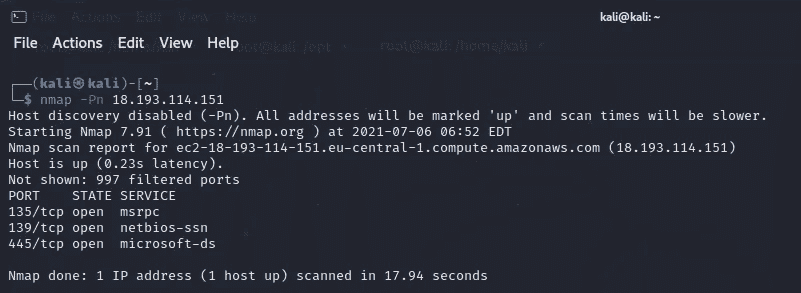
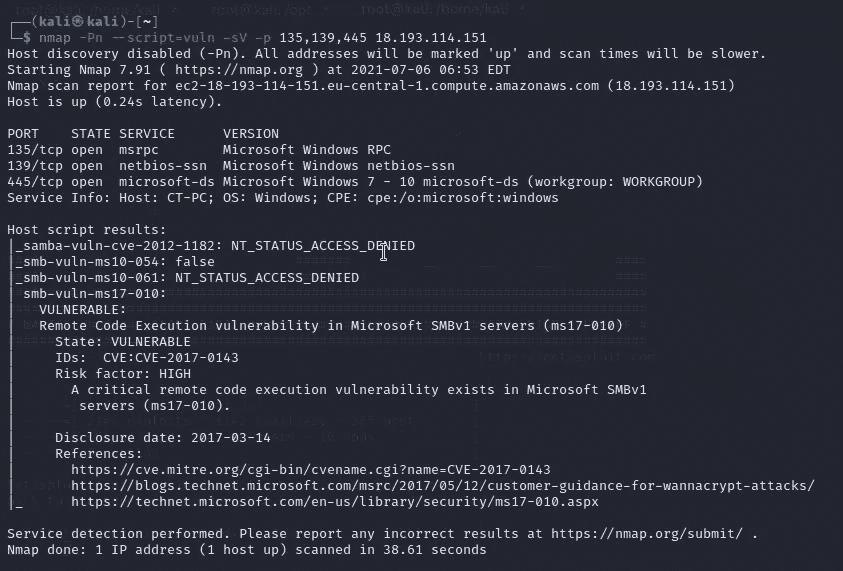
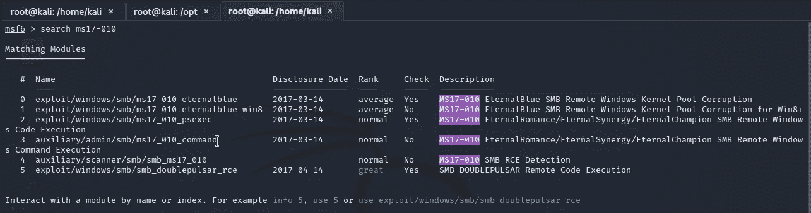
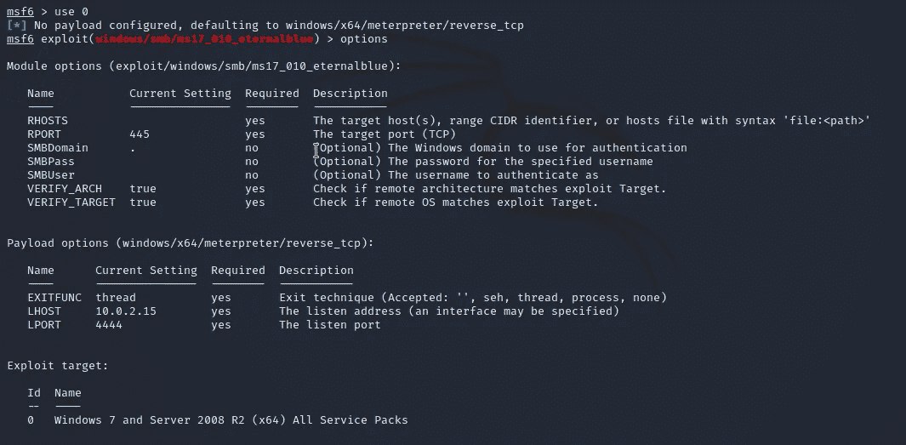
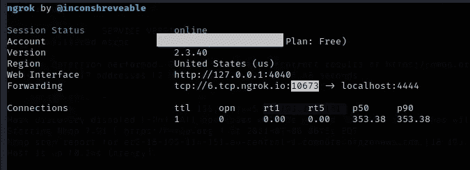
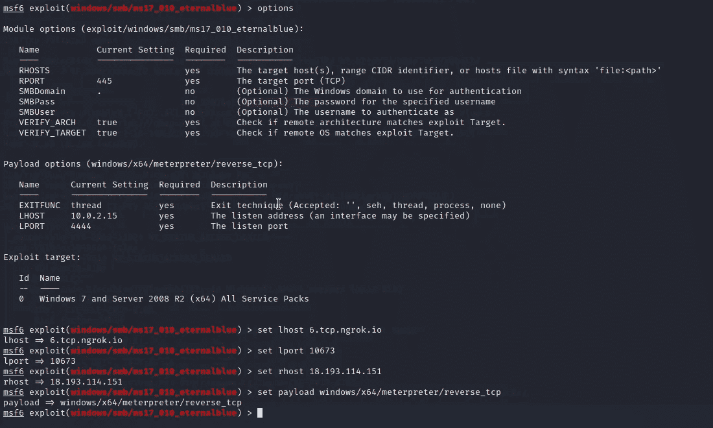
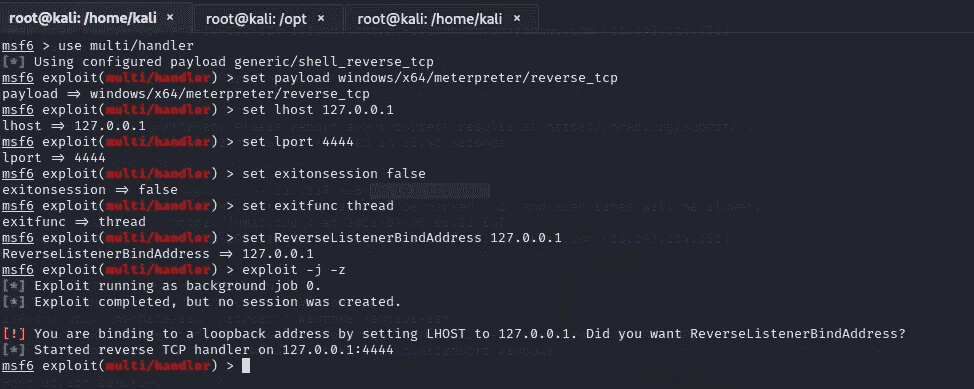
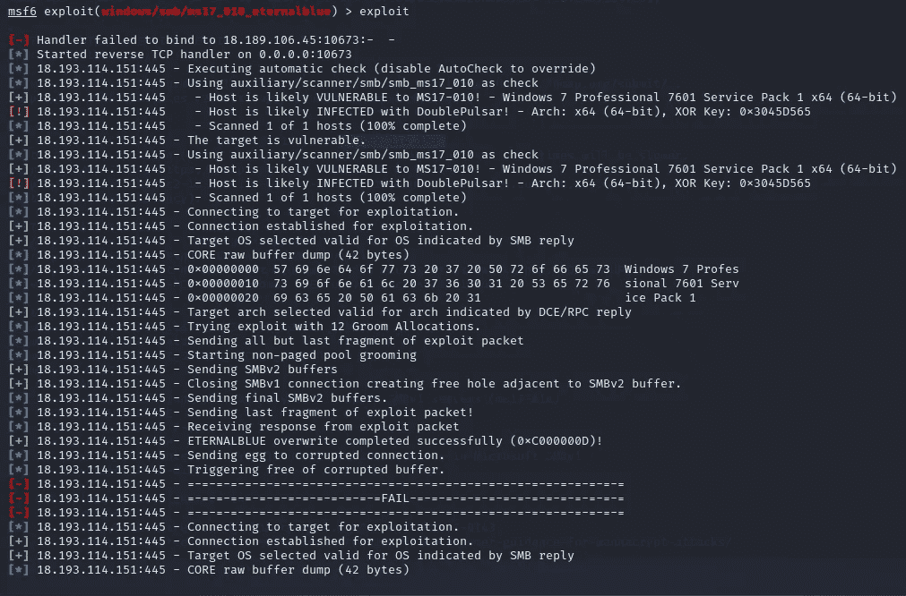
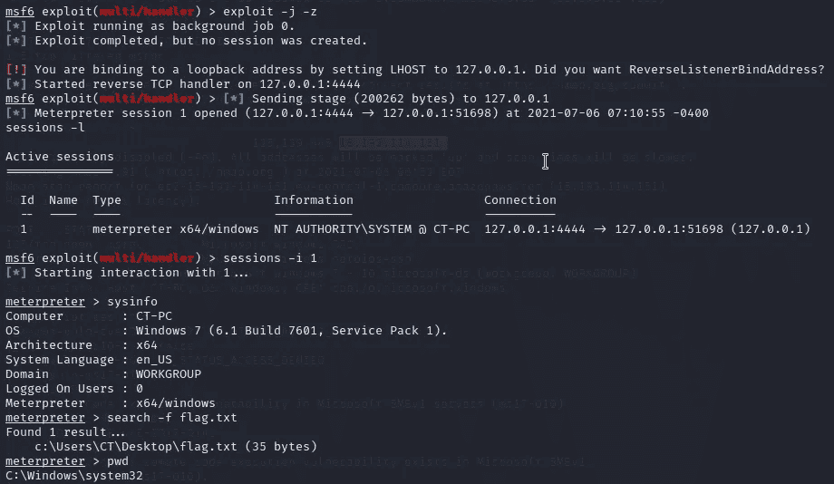

# CyberTalent —利用远程服务器上的 MS17_010(永恒之蓝)(成熟之蓝实验室)

> 原文：<https://infosecwriteups.com/cybertalent-exploiting-ms17-010-eternal-blue-on-a-remote-server-mature-blue-lab-18dee68da431?source=collection_archive---------2----------------------->

来源:https://www.cybertalents.com

> 成熟蓝是 cyber talent 上被评为难搞机器的机器。它呈现了一个微软漏洞(CVE-2017–0143)。今天(2021 年 7 月 6 日)，我将利用这台 IP 地址为 18.193.114.151**的机器。**

**枚举**

**Nmap**

所以我对机器的前 1000 个端口进行了端口扫描，发现有 3 个端口是打开的。之后，我不得不使用 Nmap 脚本引擎和 Nmap 版本扫描对我发现的开放端口进行更多的枚举。

根据我们的结果，我们有 1 个漏洞[CVE-2017–0143](https://msrc.microsoft.com/update-guide/vulnerability/CVE-2017-0143#:~:text=A%20remote%20code%20execution%20vulnerability,code%20on%20the%20target%20server.)(也称为 MS17_010)。在谷歌上简单搜索，我们可以看到 CVE-2017–0413 是微软一个名为永恒之蓝的流行漏洞，允许远程代码执行。永恒之蓝看起来多汁，所以我决定尝试一下。

**剥削**

**Metasploit**

我使用**search<keyword>**命令对 Metasploit 进行了搜索，发现 Metasploit 上存在几个针对 ms17_010 的漏洞利用代码。

我决定选择“exploit/windows/SMB/ms17 _ 010 _ eternal blue”，查看选项 **LHOST** 和 **LPORT** 是我感兴趣的，因为我的目标在远程服务器上。如果我将 **LPORT** 和 **LHOST** 设置到我的本地机器，我的 kali 防火墙将限制所有来自 reverse_shell 有效负载的**入站流量**。因此，如果我要获得一个会话，我必须将我的流量通过隧道传输到 [**ngrok**](https://ngrok.com/download) 。下载配置好 ngrok 后，我运行了 ***。/ngrok tcp 4444*** 建立隧道。

在成功地用 ngrok 建立了一个隧道之后，我不得不为永恒之蓝漏洞利用设置选项，将 ngrok URL 用作我的 **LHOST** 并将 ngrok 端口用作我的 **LPORT** 。此外，我必须设置我的 **RHOST** 和有效载荷。

我成功地将我的连接隧道化到 ngrok，但是如果我要从有效负载获得连接，我必须让 ngrok 将所有入站流量转发到我的本地机器。为了实现这一点，我打开了另一个 metasploit 实例来运行另一个侦听器，该侦听器具有与第一个 metasploit 实例相同的负载。请注意，用于 LPORT 的端口与用于 ngrok 命令的端口相同。**T1。/ngrok TCP 4444**

在我的 multi/handler 上运行 exploit -j -z 之后，我得到了一个“在 127.0.0.1:4444 上开始反向 tcp 处理程序”,这是一个好迹象。现在我必须等待，并在我的另一个 metasploit 实例上运行“exploit”来开始利用。

等等！！！我在 metasploit eternal blue 实例上得到一个“fail ”,但是当我查看我的另一个 metasploit 实例时，我得到一个 meterpreter 会话。

哦对了，我还找到了旗子。感谢阅读，我希望你喜欢阅读。

# **参考文献**

[https://ngrok.com/download](https://ngrok.com/download)

[https://msrc . Microsoft . com/update-guide/vulnerability/CVE-2017-0143 #:~:text = A % 20 remote % 20 code % 20 execution % 20 vulnerability，code % 20 on % 20 the % 20 target % 20 server](https://msrc.microsoft.com/update-guide/vulnerability/CVE-2017-0143#:~:text=A%20remote%20code%20execution%20vulnerability,code%20on%20the%20target%20server)。

[https://www.exploit-db.com/exploits/41891](https://www.exploit-db.com/exploits/41891)