# cyber talent——利用远程服务器上的 shell shock(CVE-2014–6271 )(实验室内部)

> 原文：<https://infosecwriteups.com/cybertalent-exploiting-shellshock-cve-2014-6271-on-a-remote-server-inside-lab-b9e1680c0500?source=collection_archive---------1----------------------->

来源:https://www.cybertalents.com

> 里面是 Cyber talent 上的一台机器，被评为中型机器。它提供了一个允许远程代码执行的 shellshock 漏洞。今天我将使用 Metasploit 来利用这台机器，这台机器的 IP 地址是 18.185.92.165。

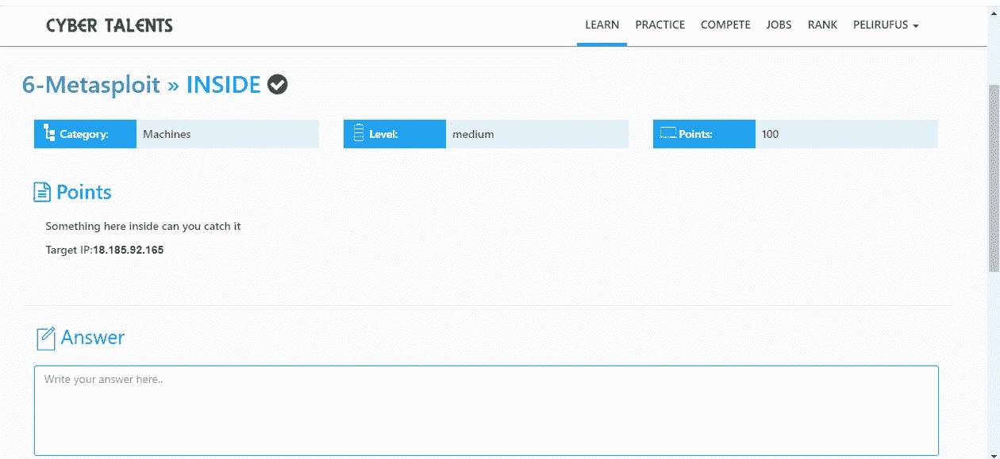

来源:https://cybertalents.com/challenges/machines/inside

**枚举**

**Nmap**

像往常一样，我使用 Nmap 从端口扫描开始，检查开放的端口。

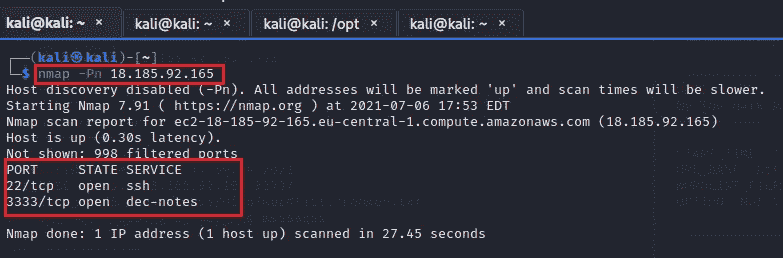

我扫描了前 1000 个端口，发现有 2 个端口(22 和 3333)是打开的。我开始了另一次 Nmap 扫描，但这一次，我使用了 Nmap 版本扫描来做更多的枚举。

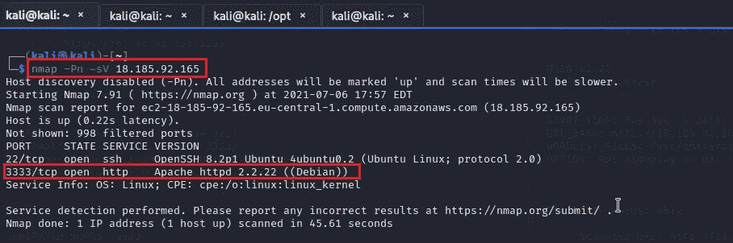

从 Nmap 版本扫描输出中，我发现端口 3333 是一个 HTTP 服务，这意味着它是一个网站，需要更多的枚举。我在网络浏览器上搜索 18.185.92.165:3333。

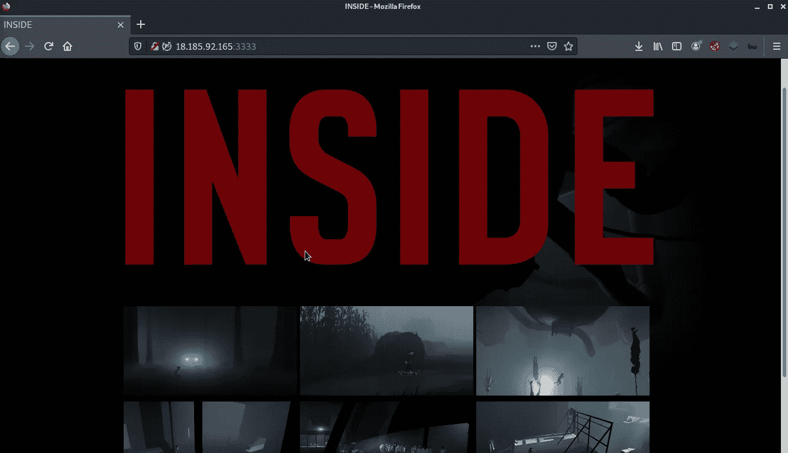

手动浏览整个网页后，我没有发现任何有趣的东西，所以我继续使用 dirb 扫描隐藏的目录。

**Dirb**

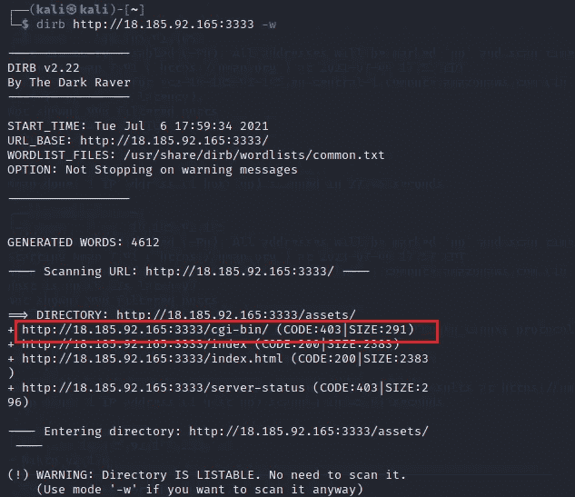

通过对隐藏目录的扫描，我发现了一个 cgi-bin 目录，其状态代码为 403(禁止),即无论身份验证如何，都不允许任何人访问该资源。我进一步扫描隐藏目录仍然使用 dirb，但在我新发现的目录。

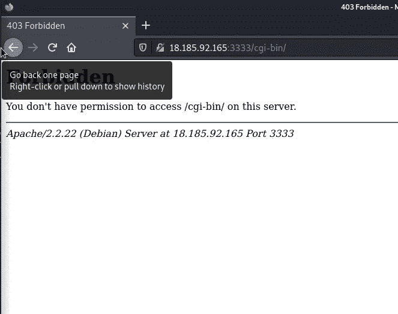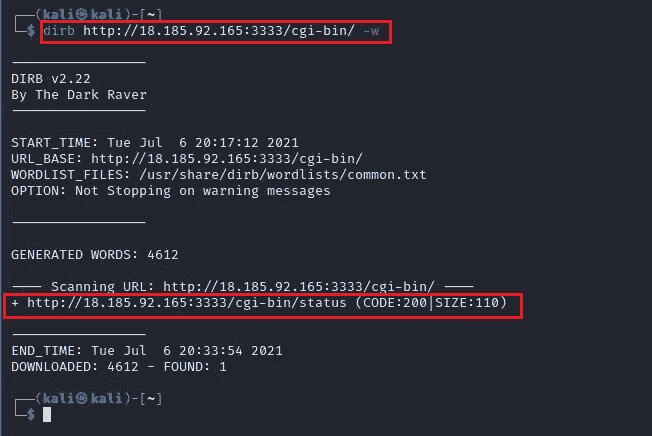

所以我发现了一个新的 cgi-bin 目录，状态码是 200(好的)。我决定使用 kali linux 中已经安装的另一个工具来检查我们的目标上是否存在漏洞。

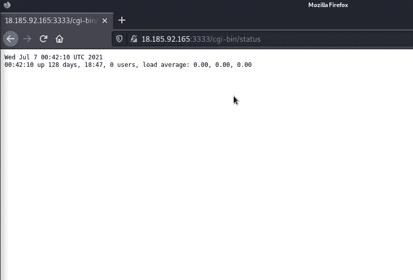

**Nikto**

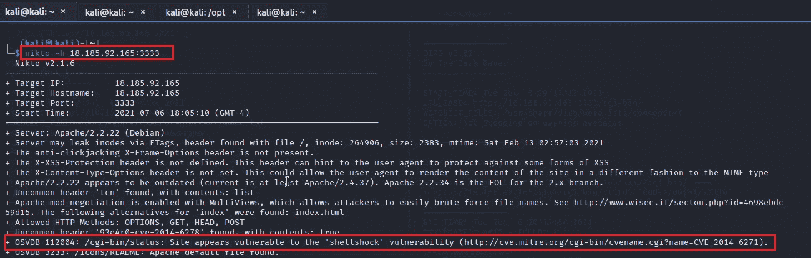

使用 nikto I 确认我们的目标易受 shellshock 漏洞(CVE-2014–6271)的攻击。我在 google 上搜索了对 shellshock 漏洞的简要描述，发现 shellshock 允许包含 Bash 的易受攻击版本的系统被利用来以更高的权限执行命令。我还发现 metasploit 上存在对此漏洞的利用。所以我继续在我的终端中启动 metasploit。

**剥削**

**Metasploit**

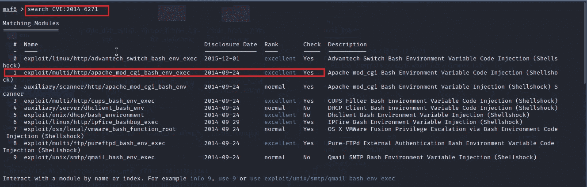

当我在 metasploit 中搜索漏洞时，我看到了大量可用的漏洞，但决定使用*漏洞/multi/http/Apache _ mod _ CGI _ bash _ env _ exec*漏洞，因为它被评为优秀，并且也被检查为是。

由于目标是一台远程机器，为了绕过我的 kali 机器防火墙，我不得不将我的流量传输到一个在线代理。默认情况下，kali machine 将限制来自我的反向 shell 有效负载的所有入站流量。为此，我不得不使用另一个工具“Ngrok”将我的流量转发到远程服务器。

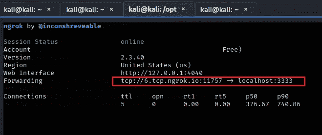

用 ngrok 成功建立隧道后，我必须设置 shellshock 漏洞利用的选项，将 ngrok URL 用作我的 **LHOST** ，将 ngrok 端口用作我的 **LPORT** 。此外，我必须设置我的 **targeturi** 、 **RHOST** 和 **payload** 。

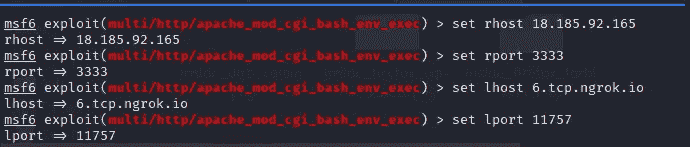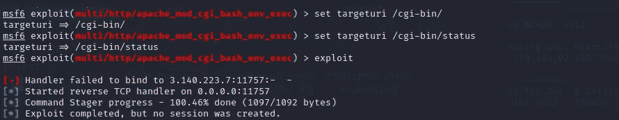

现在，我必须在我的本地主机和本地端口上使用 metasploit multi/handler 设置一个监听器来接收来自我的有效负载的连接。

***N/B 首先在 multi/handler 上运行您的“漏洞利用”,作为在 cgi-bin 上运行“漏洞利用”之前的监听器。***

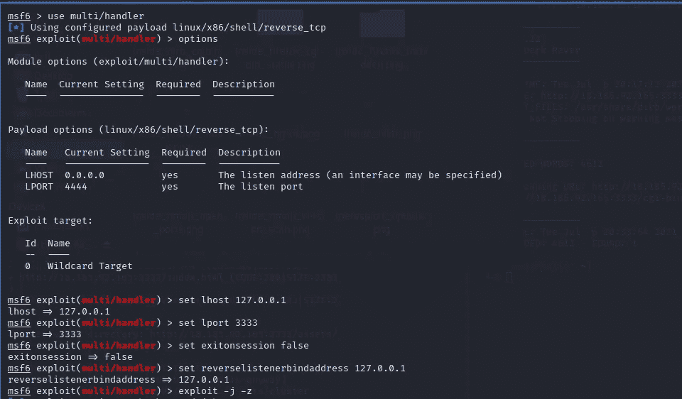

在我的两个 metasploit 实例上运行“exploit”之后，我收到了一个命令 shell 会话。

万岁…

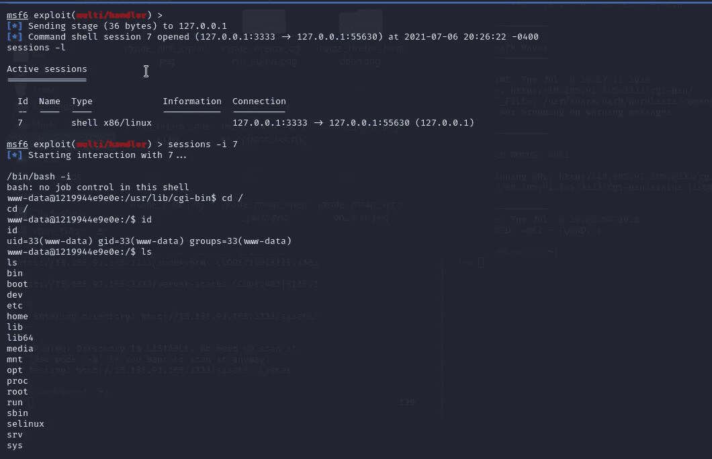

我立即在系统目录中手动搜索该标志，是的，我确实找到了该标志。

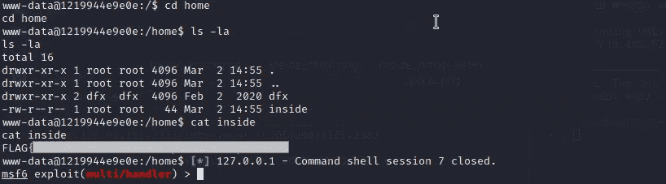

虽然这台机器在网络人才方面被评为中等，但我能够使用 nmap 提高我的端口和版本扫描技能，使用 dirb 枚举隐藏目录，使用 nikto 评估漏洞，使用 metasploit 利用漏洞。

谢谢你…

# 参考

 [## ngrok -下载

### 运行此命令会将您的 authtoken 添加到 ngrok.yml 文件中。连接一个帐户会列出你打开的隧道…

ngrok.com](https://ngrok.com/download)  [## Shellshock(软件错误)-维基百科

### Shellshock，也称为 Bashdoor，是 Unix Bash shell 中的一系列安全错误，其中第一个是…

en.wikipedia.org](https://en.wikipedia.org/wiki/Shellshock_%28software_bug%29)  [## CVE CVE 2014-6271

### CVE 是一个记录列表——每个记录都包含一个标识号、一个描述和至少一个公共引用…

cve.mitre.org](https://cve.mitre.org/cgi-bin/cvename.cgi?name=cve-2014-6271)  [## 内幕“网络人才

### 网络人才是一个平台，根据他们在不同领域的技能对全球网络安全人才进行排名

cybertalents.com](https://cybertalents.com/challenges/machines/inside)