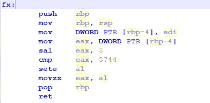
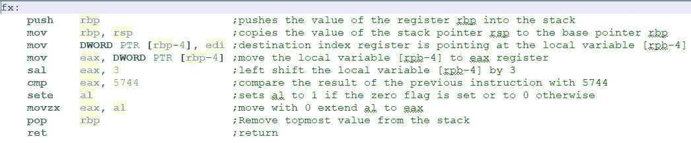

# [CyberTalents]铜牌 ASM 挑战赛报道

> 原文：<https://infosecwriteups.com/cybertalents-bronze-asm-challenge-writeup-b6d28574e9e4?source=collection_archive---------1----------------------->

## *恶意软件逆向工程|轻松。*

这个挑战伴随着下面的描述，以及你可以在这里上传[的“ASM_Par.asm”文件。](https://hubchallenges.s3-eu-west-1.amazonaws.com/Reverse/ASM_Par.asm)

> 该标志是函数的参数，其格式如下(" FLAG{0_%X_0}" % parameter ")

在使用任何工具之前，检查文件的最简单方法是使用简单的文本编辑器，下面是输出:

ASM_Par.asm

老实说，我学习汇编已经有很长时间了，我做了一些研究来了解每个指令的作用，下面是我的发现:

外汇描述

换句话说，该函数意味着将存储在 rbp-4 中的局部变量乘以 8(左移 3)并将结果与 5744 进行比较。

是啊！我们正在寻找的参数是存储在 rbp-4 中的值，但是我们应该如何知道它呢？简单假设**参数*8=5744，**使得**参数=718** 。

还是有消息*错误提交*弹出？简单，再看看挑战描述里就知道了，它表示格式应该是: **FLAG{0_%X_0}** ，%X 指十六进制；正如你已经猜到的标志是: **FLAG{0_2CE_0}**

回顾:铜牌 ASM 挑战赛旨在介绍 x86 汇编的[，如果您是新手，我建议您抓住这个机会，深入了解它的架构、寄存器和地址……您可以查看以下资源:](https://cybertalents.com/learn/introduction-to-cybersecurity/24-intel-x86-architecture-cover)

1.  [*https://blog . holbertonschool . com/hack-virtual-memory-stack-registers-assembly-code/*](https://blog.holbertonschool.com/hack-virtual-memory-stack-registers-assembly-code/)
2.  [http://flint.cs.yale.edu/cs421/papers/x86-asm/asm.html](http://flint.cs.yale.edu/cs421/papers/x86-asm/asm.html)
3.  [https://sense post . com/blog static/2014/01/sense post _ crash _ course _ in _ x86 _ assembly-。pdf](https://sensepost.com/blogstatic/2014/01/SensePost_crash_course_in_x86_assembly-.pdf)