# 2019 年网络卡车挑战赛-安卓 CTF

> 原文：<https://infosecwriteups.com/cybertruck-challenge-2019-android-ctf-e39c7f796530?source=collection_archive---------0----------------------->

CyberTruck Challenge 2019 是一项重要活动，旨在汇集与重型车辆网络安全相关的利益群体，培养应对这些挑战的人才。这是为他们的 CTF 写的。他们的网站可以在[这里](https://www.cybertruckchallenge.org/)找到，挑战的 Github 简介可以在[这里](https://github.com/nowsecure/cybertruckchallenge19)找到。

注:活动期间我没有在场。我想做的就是练习 Android CTFs，这时候我看到了他们的 [*Github 页面*](https://github.com/nowsecure/cybertruckchallenge19) *。*

## 使用的工具

*   [ApkTool](https://ibotpeaches.github.io/Apktool/)
*   [dex2jar](https://github.com/pxb1988/dex2jar/)
*   [京东-桂](https://github.com/java-decompiler/jd-gui/releases/)
*   弗里达

# 挑战描述

最著名的汽车安全公司之一“NowSecure Mobile Vehicles”实施了一种新的移动遥控无钥匙系统“CyberTruck”。汽车安全公司已经确保该系统是完全不可破解的，因此攻击者将无法恢复移动应用程序中的秘密。

如果你是一个经验丰富的 Android 反向器，那么在解锁你的汽车之前，启用`tamperproof`按钮来加固应用程序。你的目标是在应用程序中恢复 6 个秘密。

# 为 CTF 做准备

## 安装应用程序

使用 adb 在手机上安装应用程序。

`adb install cybertruck19.apk`

## 使用 ApkTool 解码应用程序

使用 Apktool 解码 APK，并将其输出到`cybertruck-smali`文件夹。

`apktool d cybertruck19.apk -o cybertruck-smali`

## 正在转换 apk。使用 dex2jar 的 jar 格式

我把。apk 到 jar，因为这样我就可以使用 JD-GUI 来查看 Java 源代码。

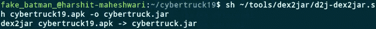

*注意:我下载了 dex2jar 并创建了一个工具目录，这样我所有的工具都很容易访问*

使用 **JD-GUI** ，我们打开由 dex2jar 创建的`cybertruck.jar`(之前的命令)。

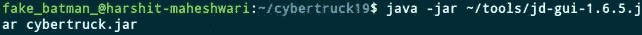

*注意:我下载了 jd-gui 并创建了一个工具目录，这样我所有的工具都很容易访问*

## 启动应用程序

我们一启动应用程序，就能看到这张图片。

因此，我们试图理解解锁按钮和切换按钮的作用。

# 挑战 1

*解锁汽车 1 的挑战 1。“DES key:完全无钥匙。*完全安全

为了弄清楚正在发起什么活动，让我们看一看`AndroidManifest.xml`

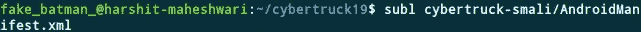

`AndroidManifest.xml`文件位于 cybertruck-smali 目录下(由 apktool 创建)

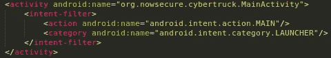

MainActivity 是首先启动的活动

所以，用`JD-GUI`来看看`MainActivity.class`的源代码

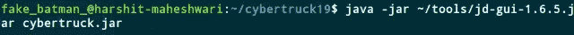

注意:我在工具目录下下载了 jd-gui jar 文件，并使用 java 启动

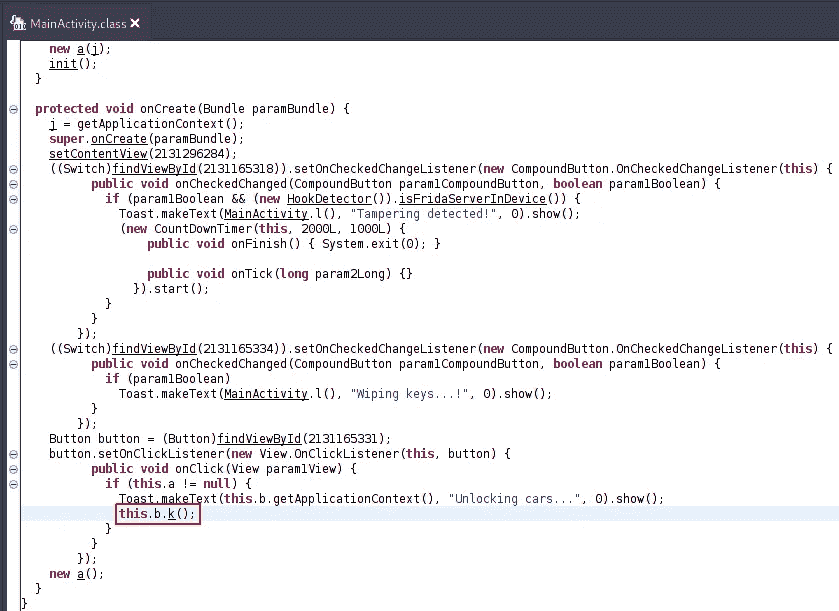

查看`onCreate`功能，我们发现解锁按钮。点击解锁按钮，调用`this.b.k()`。所以我们进一步调查。

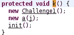

函数 k 的快照

该函数创建了一个类`Challenge1`的实例。所以我们来看看`Challenge1.class`

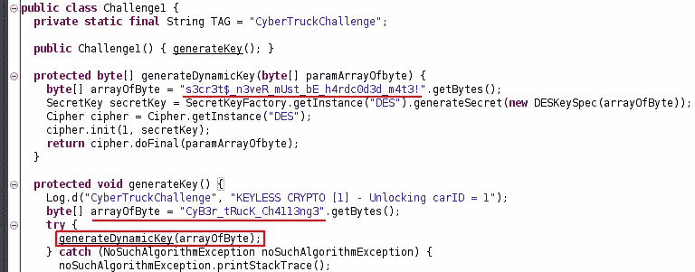

挑战 1 的静态标志为`s3cr3t$_n3veR_mUst_bE_h4rdc0d3d_m4t3!`

对于动态标志，我们必须想办法在运行时获取`generateDynamicKey`函数返回的值。这些正是弗里达派上用场的场景。你可以从弗里达的官方文件中了解更多。

`generateDynamicKey`返回一个字节数组。字节数组存储在变量`result`中，我们将其转发给 python 函数`on_message`。这里我们将字节数组转换成字符串。

## 捕获动态标志

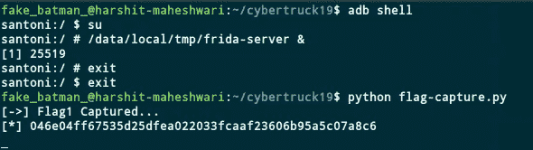

首先，我们在 android 设备上运行 frida-server。然后，我们使用 flag-capture.py 来捕获动态标志

动态标志为`046e04ff67535d25dfea022033fcaaf23606b95a5c07a8c6`

# 挑战#2

*解锁汽车 2 的挑战 2:“AES 密钥:您的手机是您的钥匙”*

通过`MainActivity.class`中的`this.b.k()`功能

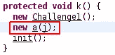

调用类`a`的实例。让我们进一步调查。

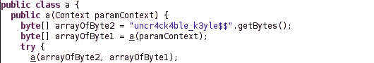

所以我们有了带有构造函数`a`的类`a`和两个名为`a`的函数。

声明构造函数时，不需要指定返回值。所以 public a(Context paramContext)是构造函数，其余都是函数。

所以这个文件包含:

构造器

接受一个参数并返回字节数组的函数

接受两个参数并返回字节数组的函数

不管怎样，回到构造函数 a，它调用`a(Context paramContext)`，然后它的返回值被作为`a(byte[] paramArrayOfbyte1, byte[] paramArrayOfbyte2)`中的一个参数传递

所以我们来看看函数`a(Context paramContext)`

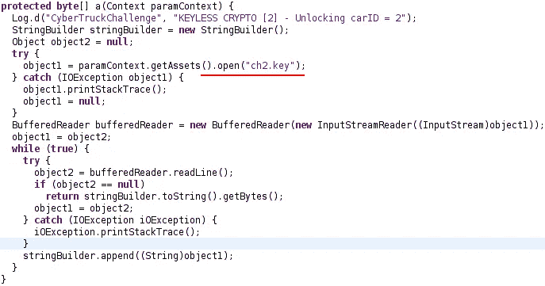

文件 ch2.key 已打开。所以我们来看看它的内容。

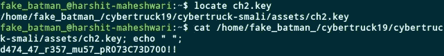

挑战 2 的静态标志的值是`d474_47_r357_mu57_pR073C73D700!!`

现在让我们看看功能`a(byte[] paramArrayOfbyte1, byte[] paramArrayOfbyte2)`

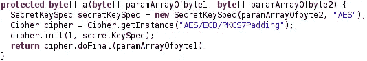

对于动态标志，我们需要再次使用 Frida 来捕获这个函数的返回值

我们将这个 javascript 片段附加到 flag-capture.py 文件中的 js_code 变量

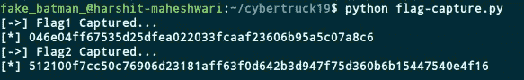

在将上面的代码片段附加到 js_code 之后，我们重新运行 flag-capture.py

挑战 2 的动态标志是`512100f7cc50c76906d23181aff63f0d642b3d947f75d360b6b15447540e4f16`

# 挑战 3

*解锁汽车 3 的挑战 3。"卡车先生:给我开锁，宝贝！"*

**Challenge3 描述:**原生代码中有一个有趣的字符串。你能抓住它吗？

在`MainActivity.class`内部，这个`native-lib.so`是加载的。

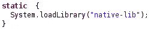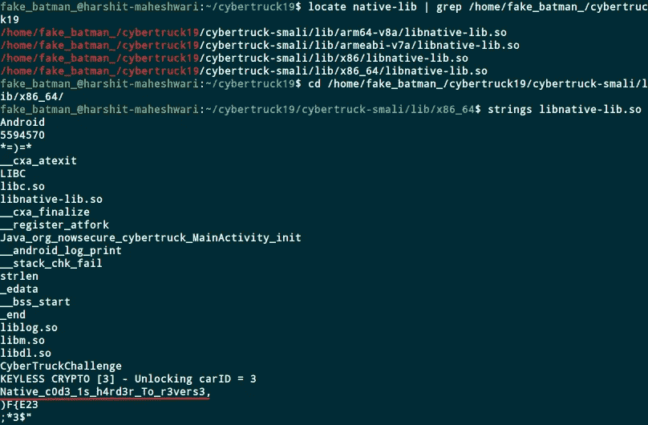

我们首先定位这个文件，然后使用**字符串**打印文件中的所有字符串

本次挑战的静态标志为`Native_c0d3_1s_h4rd3r_To_r3vers3`

对于动态标志，这取决于您的设备的指令集。在我的例子中，是`arm64-v8a`要求你能够理解同样的汇编语言指令。这似乎超出了我的能力范围(..还没！).

## 如何绕过防篡改检查？

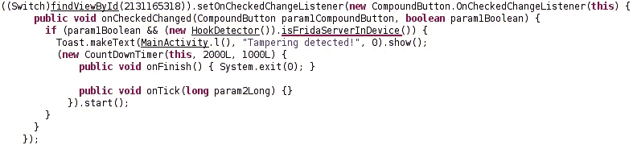

该函数检查该设备中是否有 frida 服务器

如果 frida 服务器存在，该函数返回 true，否则返回 false。所以我们使用 Frida 来覆盖这个函数的返回值

将这段代码附加到 flag-collector.py 中的 js_code

这就是我对这个 CTF 的解决方案。我仍然是 CTFs 的新手，还有很多需要学习的地方。然而，这次 CTF 是一个很好的学习机会。希望你也学到了一些东西。

感谢阅读我的文章！干杯！🍺

在 [Twitter](https://twitter.com/fake_batman_) 、 [Github](https://github.com/harshitm98) 上关注我，或者在 [LinkedIn](https://linkedin.com/in/harshitm98) 上联系我。

*关注* [*Infosec 报道*](https://medium.com/bugbountywriteup) *获取更多此类精彩报道。*

 [## 信息安全报道

### 收集了世界上最好的黑客的文章，主题从 bug 奖金和 CTF 到 vulnhub…

medium.com](https://medium.com/bugbountywriteup)