# Cyborg | TryHackMe 演练

> 原文：<https://infosecwriteups.com/cyborg-tryhackme-walkthrough-3bb0ce989f85?source=collection_archive---------0----------------------->

## 破解备份文件

永远不要停止努力学习，让我们从 TryHackMe 开始解决半机械人房间。

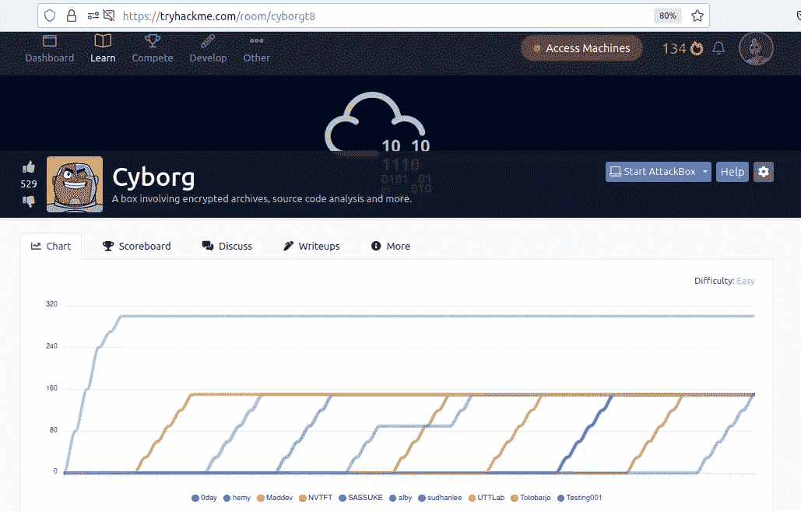

## 列举

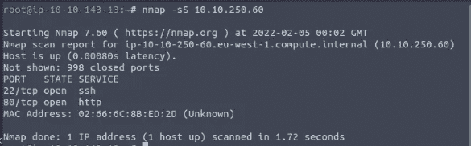

1.扫描机器，有多少端口是开放的？

> 2

2.端口 22 上运行的是什么服务？

> 嘘

3.端口 80 上运行的是什么服务？

> 超文本传送协议（Hyper Text Transport Protocol 的缩写）

让我们检查服务的版本并检查补丁的漏洞。我没有发现任何漏洞。

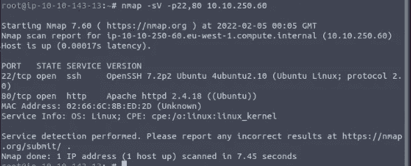

接下来，端口 80 打开，让我们检查一下网站是什么样子的，

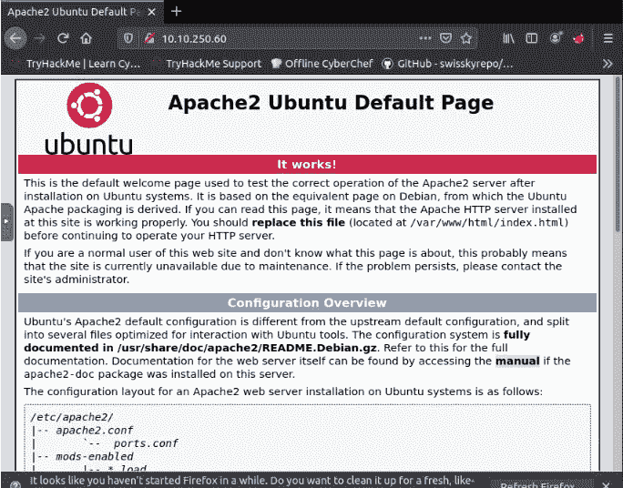

内容不在根目录下，所以用 gobuster 强制。

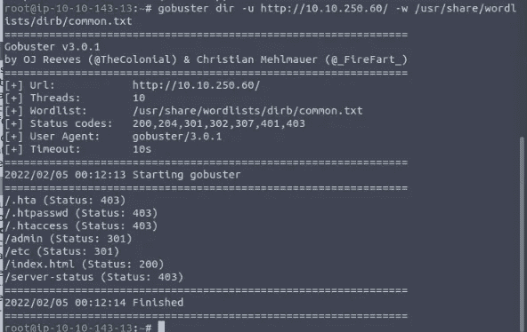

浏览目录，我找到了有趣的文件，

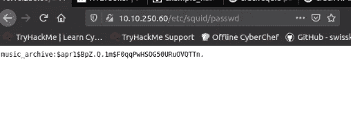

和约翰一起聊天

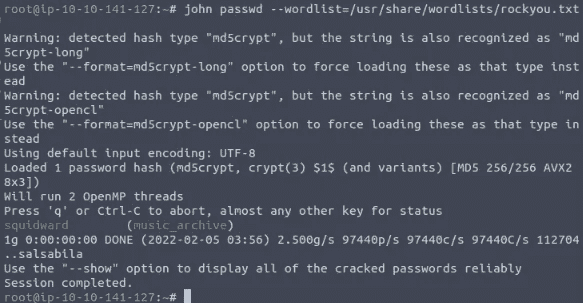

呜呜呜，music_archive 的密码是 **squidward** 。

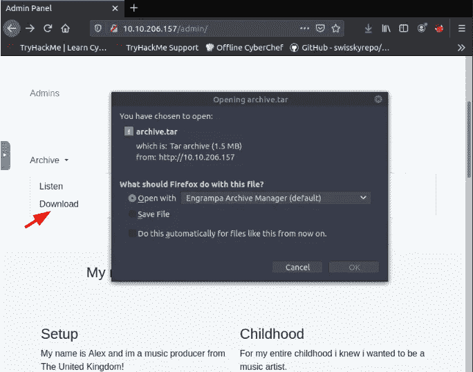

全部提取

```
mkdir mountbackup
borg mount . mountbackup
```

然后输入你之前拥有的最后一个凭证， **squidward** 。

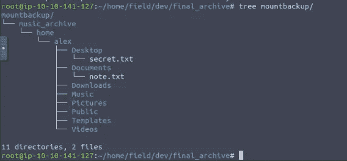

**猫**一些有趣的文件。

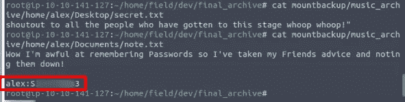

当然，ssh 用 alex 密码进入服务器。

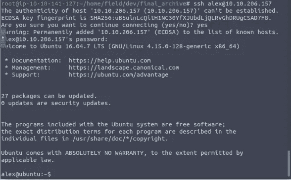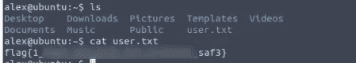

## 权限提升

首先，我想为调用用户 **alex** 准备一份允许(和禁止)
命令的清单。

```
sudo -l
```

是的，我们可以以 root 身份执行**/etc/PM3 backups/backup . sh**而无需密码。

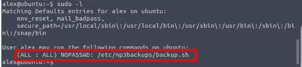

然后，我检查文件包含了什么。

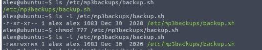

而且我已经用 sudo 运行了 **/bin/bash** 修改了脚本。


请记住，我们可以在没有密码的情况下运行 sudo /etc/mp3backups/backup.sh，只需运行该文件即可。

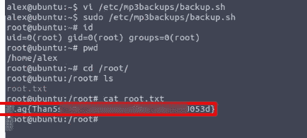

## 结论

今天我学到了一些新东西，鱿鱼密码哈希和博格安装。
另外，我发现了一个漏洞，标准用户可以在没有密码的情况下以 root 用户身份运行命令。
感谢阅读。

# 🔈 🔈Infosec Writeups 正在组织其首次虚拟会议和网络活动。如果你对信息安全感兴趣，这是最酷的地方，有 16 个令人难以置信的演讲者和 10 多个小时充满力量的讨论会议。[查看更多详情并在此注册。](https://iwcon.live/)

[](https://iwcon.live/) [## IWCon2022 - Infosec 书面报告虚拟会议

### 与世界上最优秀的信息安全专家建立联系。了解网络安全专家如何取得成功。将新技能添加到您的…

iwcon.live](https://iwcon.live/)