# Cyborg Tryhackme 报道

> 原文：<https://infosecwriteups.com/cyborg-tryhackme-writeup-76013464397?source=collection_archive---------0----------------------->

**作者 Shamsher khan 这是一篇关于 Tryhackme room“Cyborg”的文章**

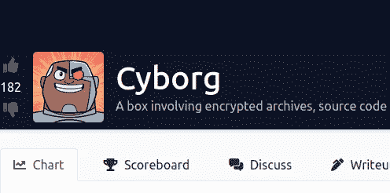

[https://tryhackme.com/room/cyborgt8](https://tryhackme.com/room/cyborgt8)

**房间链接:**[https://tryhackme.com/room/cyborgt8](https://tryhackme.com/room/cyborgt8)
**注:此房免费**

这篇文章将帮助你在 [TryHackMe](https://tryhackme.com/) 上解开机器人盒子。在我们开始枚举盒子之前，将下面一行添加到您的`/etc/hosts`文件中。

```
echo "10.10.186.238   cyborg.thm" >> /etc/hosts
```

# TryHackMe Cyborg —枚举

像往常一样，我们首先使用`nmap`在主机上运行端口扫描。`sC`和`sV`标志表示针对目标执行基本的漏洞脚本，并且端口扫描试图找到版本信息。

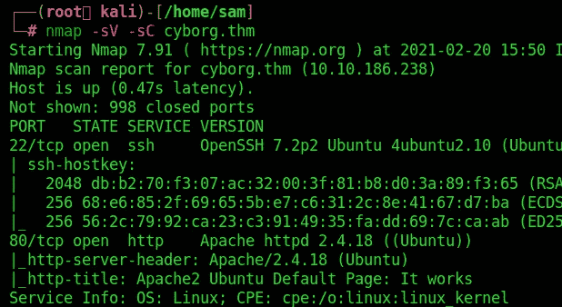

前三个问题的答案可以在这个输出中找到。首先，有`2`开放的港口。第二，端口`22`上运行的服务是 SSH。第三，端口`80`上运行的服务是`HTTP`。浏览至:`http://cyborg.thm/`给出如下页面:

**#1** :扫描机器，多少个端口开着？

> **答案:2**

**#2** :端口 22 上正在运行什么服务？

> **答案:宋承宪**

端口 80 上正在运行什么服务？

> **答案:http**

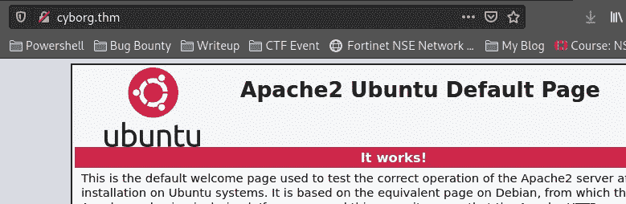

**Gobuster**

```
gobuster dir -u [http://cyborg.thm/](http://cyborg.thm/) -w /usr/share/wordlists/common.txt
```

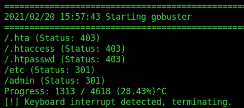

最有趣的路径是`etc`和`admin`。

浏览到[http://cyborg.thm/admin/](http://cyborg.thm/admin/)给我们以下网址:

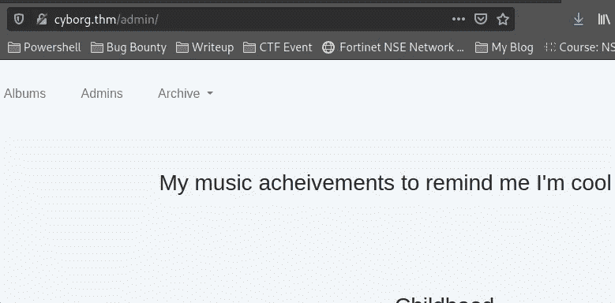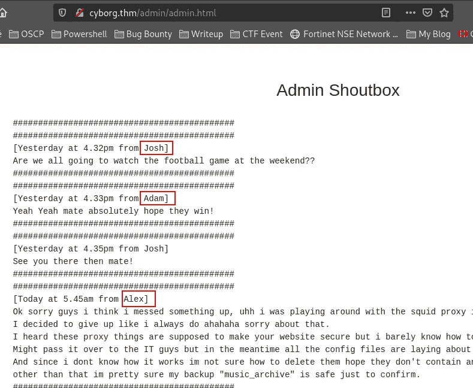

所以“Alex”不确定如何正确配置 squid，也许我们在 found /etc 目录中找到了更有用的东西，备份文件总是值得一看。

浏览到`etc`目录，我们可以找到以下散列:

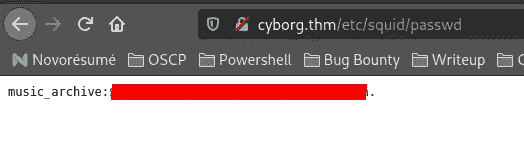

我们可以使用`john`来破解这个散列。你可以使用下面的 [GitHub 页面](https://github.com/openwall/john)安装 John。安装完`john`后，运行下面的命令来破解散列。

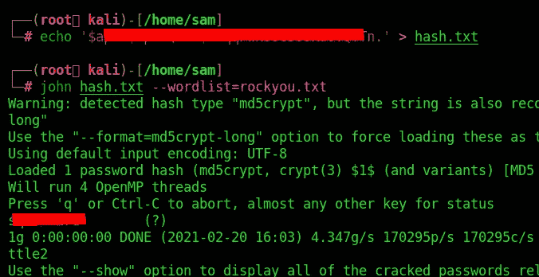

# 用户标志

很好我们找到了一个密码！回到管理部分，我们可以通过点击标题中的链接下载一个存档文件。运行以下命令下载`archive.tar`文件:

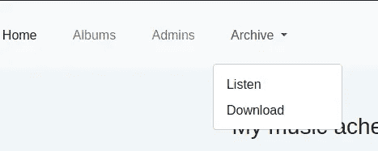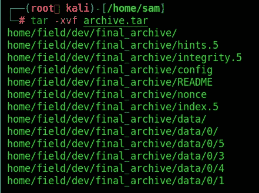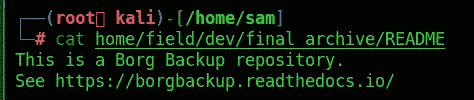

很好，我们刚刚发现这些文件是由`Borg`创建的备份。您可以通过运行以下命令来安装`Borg`:

```
sudo apt install borgbackup -y
```

之后，我们可以列出存储库来验证我们的发现

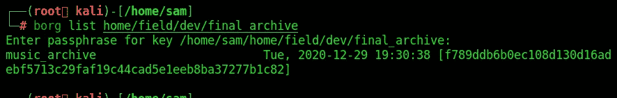

使用以下命令创建一个新文件夹并打开/装载存储库

```
mkdir unpacked
borg mount home/field/dev/final_archive unpacked
*put in passphrase*
```

现在我们的目录`unpacked` 充满了我们可以签出的新文件。

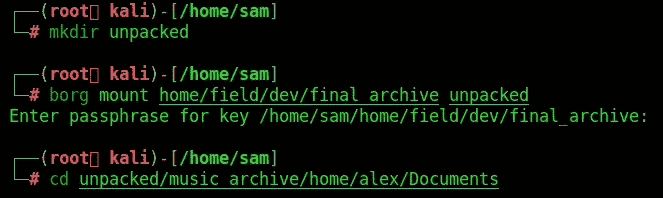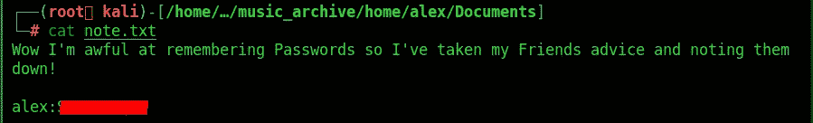

看起来我们有任何需要的东西来刺激端口 22，我们可以用它来卸载归档文件

```
borg umount unpacked
```

通过 ssh 连接并升级用户标志！

```
ssh alex@cyborg.thm
```

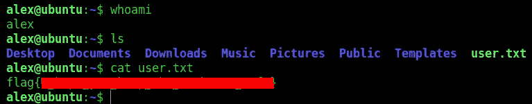

# 根标志

## 权限提升

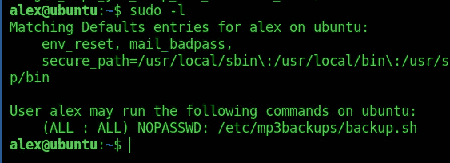

该文件归`alex`所有，因此我们可以自由编辑该文件的内容，成为 root 用户。运行以下命令成为`root`用户:

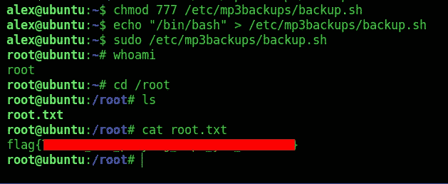

你可以在:
**LinkedIn:-**[https://www.linkedin.com/in/shamsher-khan-651a35162/](https://www.linkedin.com/in/shamsher-khan-651a35162/)
**Twitter:-**[https://twitter.com/shamsherkhannn](https://twitter.com/shamsherkhannn)
**Tryhackme:-**[https://tryhackme.com/p/Shamsher](https://tryhackme.com/p/Shamsher)


更多演练敬请关注……
出发前…

访问我的其他演练:-

感谢您花时间阅读我的演练。如果您觉得它有帮助，请点击👏按钮👏(高达 40 倍)并分享
它来帮助其他有类似兴趣的人！+随时欢迎反馈！