# 悬空 DNS: AWS EC2

> 原文：<https://infosecwriteups.com/dangling-dns-aws-ec2-e2d801701e8?source=collection_archive---------0----------------------->

> **注**

这一期的新的书面重分类自动化在[这里](https://blog.melbadry9.xyz/ddns-ec2-ips-current-state)发布。

这篇文章的稍微更新版本在[这里](https://blog.melbadry9.xyz/ddns-ec2)发表。

> **关于我**

我是 Mohamed elba dry aka "*melbadry 9 "(*赏金猎人[*@ hacker one*](https://hackerone.com/melbadry9))***。***

> **时间线**

*   **2019 年 10 月 3 日:** *第一条线索(亚马逊网络服务)*
*   **2019 年 11 月 24 日:**第二条线索(*公司有严重问题*)
*   **2019 年 11 月 26 日:**第三条线索(*检查*开放端口)
*   **2019 年 12 月 26 日:**确保是悬空记录
*   **2020 年 6 月 16 日 *:*** 付款日
*   **2020 年 7 月 10 日:**基础发行和其他标的

> ***2019 年 10 月 3 日***

*   **资产**:私有程序#1 *(*.example.com)*
*   **报告**:

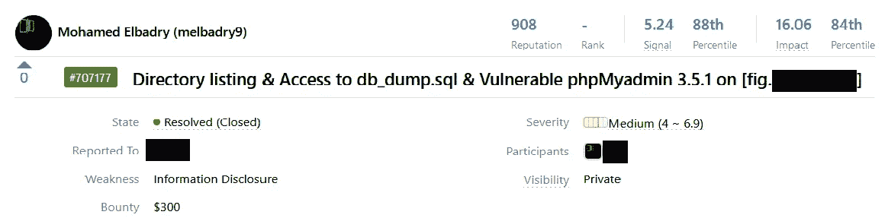

*   **详情**:

当我偶然发现有趣的子域“fig.example.com”时，我开始用 [*子列表 3r*](https://github.com/aboul3la/Sublist3r) *列举子域。(我不知道它为什么有趣，但它确实很有趣)*

我打开了“*http；//fig.example.com/* "在浏览器上除了一个空 HTML 代码的空白页什么也没有，所以我决定使用*[*Dirsearch*](https://github.com/maurosoria/dirsearch)*来暴力破解目录。当我找到启用了目录列表的“http://fig . example . com/includes/”目录时。**

**

*我举报了，得到了如下回复。*

*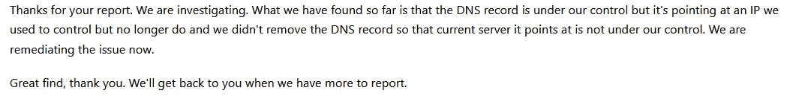*

*所以我决定寻找子域重置的类似问题，不久后我发现另外两个子域“*github.example.com*”和“*goose.example.com*”也有同样的问题。我怎么知道它是？很简单，这是重定向到一个完全不同的网站。*

*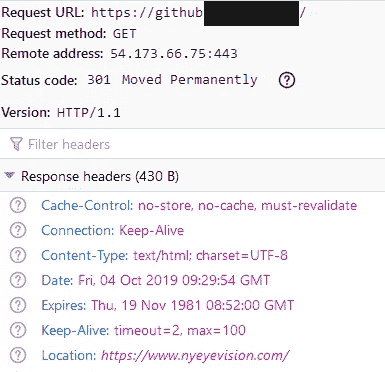*

*然后检查了域名系统的记录，也许它会帮助我识别其他有同样问题的子域名。*

*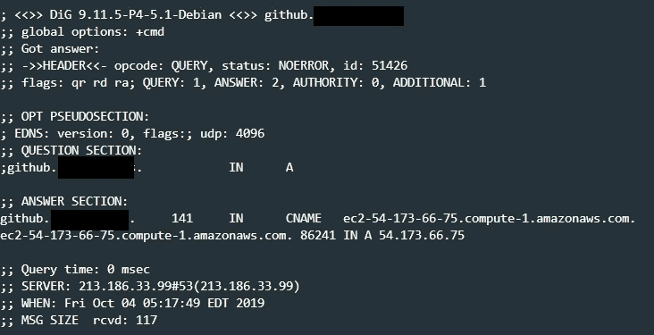*

*当我意识到他们的共同点“ ***亚马逊网络服务*** *e* ”时。*

*然后我决定根据 CNAMEs 记录过滤子域名，我使用了我自己创建的这个工具。现在让我们检查类似的问题，花了一个小时没有运气。现在我们需要暂时放下。*

*我错过了什么？这是开放港口的简单检查！*

> ***2019 年 11 月 24 日 ***

*   ***资产**:私人程序#1 *(*.example.com)**
*   ***报告**:*

*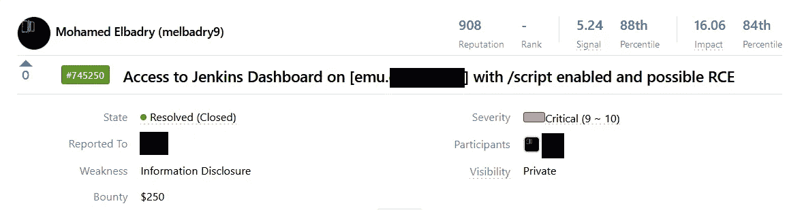*

*   ***回复:***

*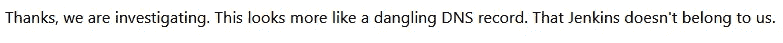*

*现在我知道这个程序有严重的悬挂 DNS 记录的问题。*

> ****2019 年 11 月 26 日****

*   ***资产**:私人项目#1 *(*.example.com)**
*   ***报告**:*

*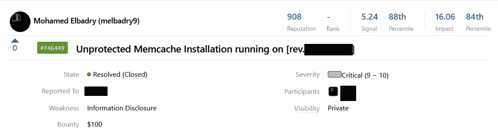*

> ***2019 年 12 月 26 日***

*现在我们有了一个可能带有悬空 DNS 的子域名列表，但无法确定它是否真实存在。*

*我们能做什么？*

*   *让我们检查 SSL 证书。*

*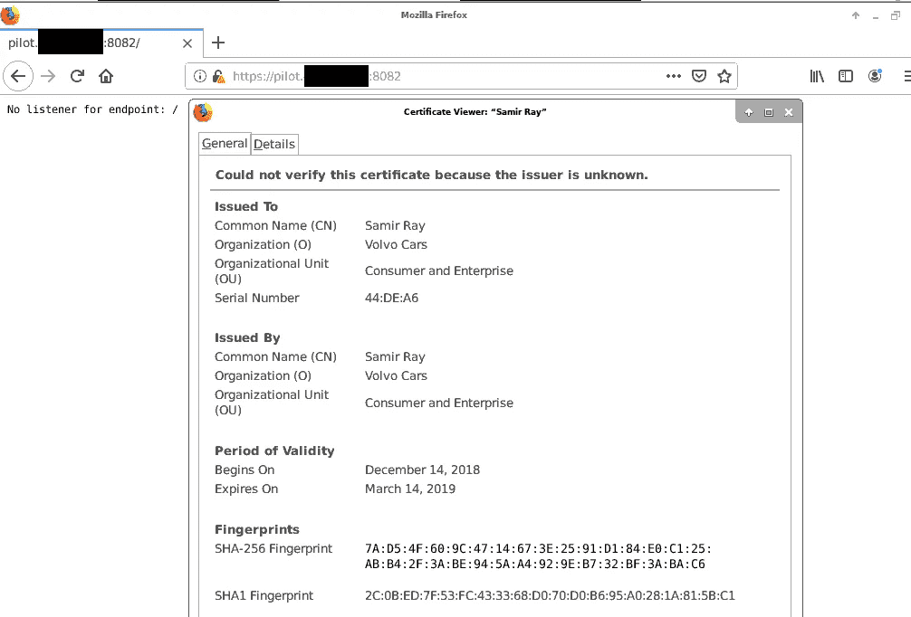*

*这绝对不是我们的目标:D*

*   *让我们检查 Shodan 中存档的 SSL 证书*

*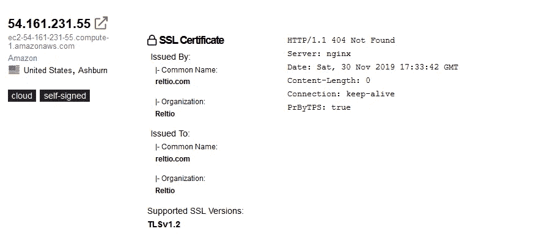**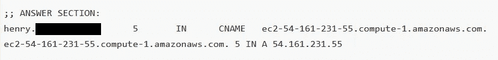*

*这肯定是一个悬而未决的 DNS。*

*   *让我们使用谷歌呆子或冰“ip: 54.161.231.55”*
*   *也许你要做的就是问:D*

*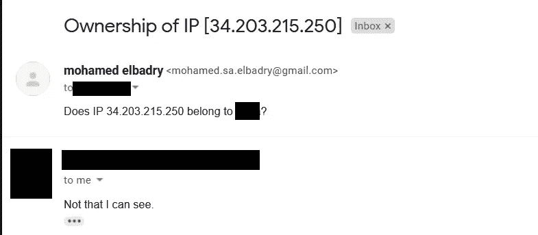*

*当您与安全团队建立信任时，这是非常好的:)*

> ***2020 年 6 月 16 日***

*   ***资产**:私人程序#1 *(*.example.com)**
*   ***报告**:*

*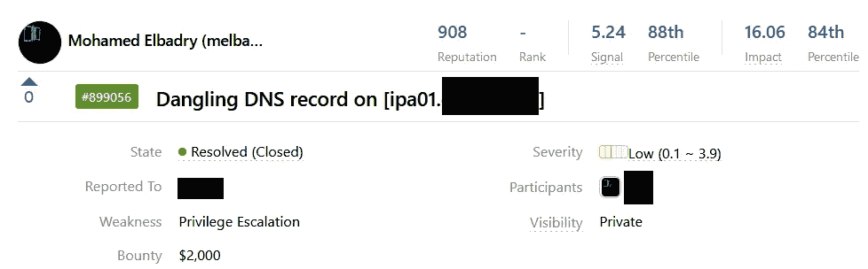*

*   ***详情**:*

*在监控子域名并在报告前确认每个子域名都有悬挂的 DNS 记录后，程序要求我提供每个可能的悬挂记录，他们会立刻确认。*

*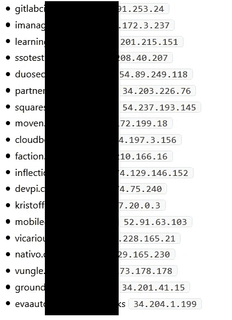*

*原来他们都有悬空的 DNS 记录！！*

> ***2020 年 7 月 10 日***

*这一切都是从 2015 年 10 月 7 日开始的，当时[马特·布莱恩特](https://labs.bishopfox.com/authors/matt-bryant) [在博客](https://labs.bishopfox.com/tech-blog/2015/10/fishing-the-aws-ip-pool-for-dangling-domains)(从 AWS IP 池中寻找悬空域名)中写了一篇关于 AWS IP 池的文章。*

> *“W 你刚刚杀死的 EC2 实例所绑定的 IP 发生了什么事？当您终止一个实例时，IP 地址不会被浪费掉。相反，它被其他 AWS 客户重用。有大量的 IP 地址不断被各种组织和个人回收和信任。”*

*当公司在不使用弹性 IP 的情况下使用 EC2 实例时，会出现此问题。*

*如果 EC2 实例被终止，并且 DNS 没有更新，这将导致为子域创建悬空 DNS 记录。*

*EC2 IP 将被释放到 AWS IPs 池，这意味着可以将 IP 分配给新的 EC2 实例。*

> *如何发现这类问题？*

*   *在 CNAME 检查`compute.amazonaws.com`或`compute-1.amazonaws.com`。*

*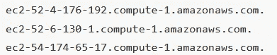*

*   *在报告之前确认它是一个悬空的 DNS，以避免(N/A)，如前所述。*

> *个案研究*

*   ***资产** : [运输](https://transloadit.com/)*

*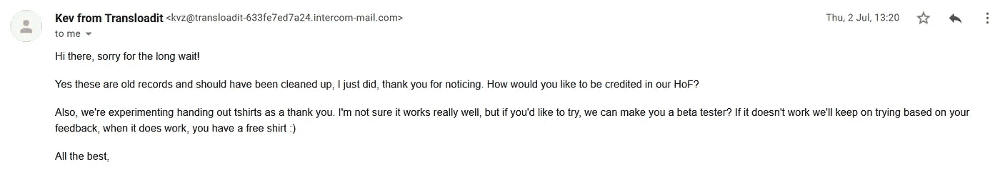*

*   ***资产** : [资产](https://www.avast.com)*

*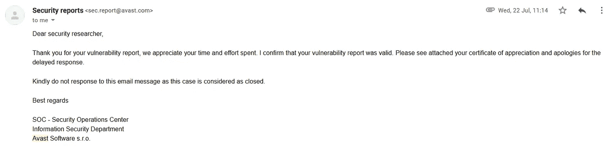*

*   ***资产** : [亚马逊](https://hackerone.com/amazonvrp?)*

*有趣的是，亚马逊自己也有类似的问题。*

*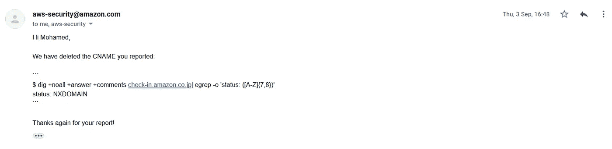*

*   ***资产**:私有程序*

*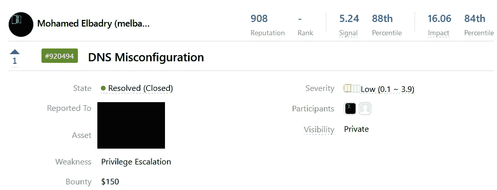**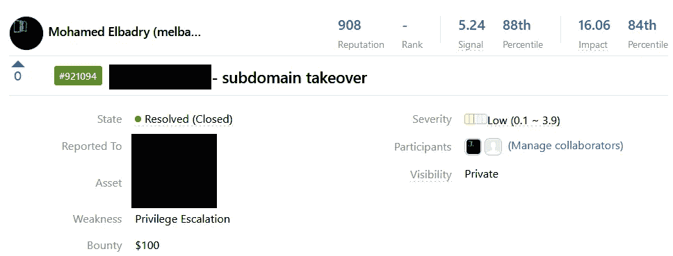*

> *一条建议*

*   *不要忽视旧的研究，它可能是旧的，但不是死的。*
*   *与安全团队建立信任非常重要，这是双向的。*

> *联系人*

*   *[脸书](https://www.facebook.com/melbadry9/)*
*   *[推特](https://twitter.com/_melbadry9)*
*   *领英*