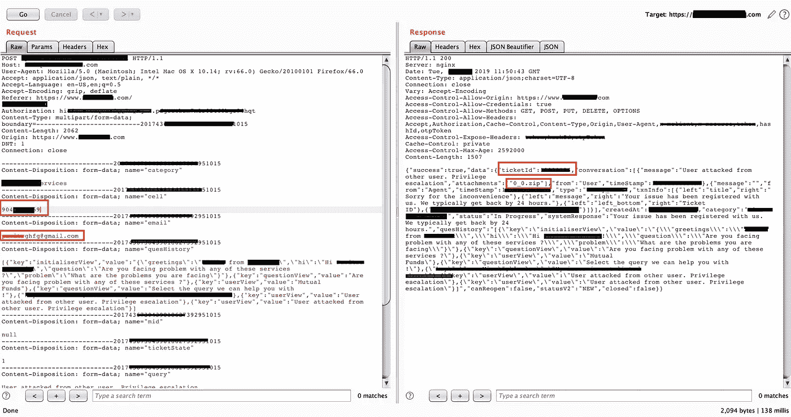
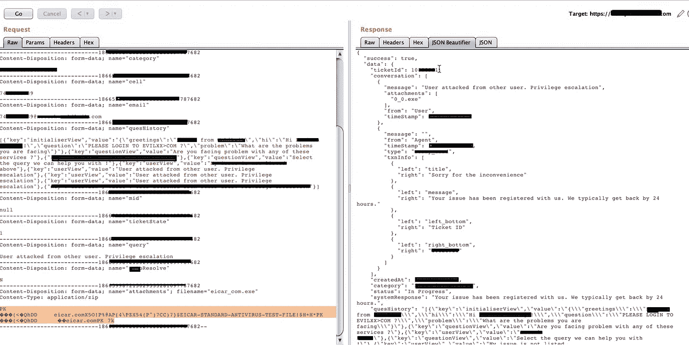
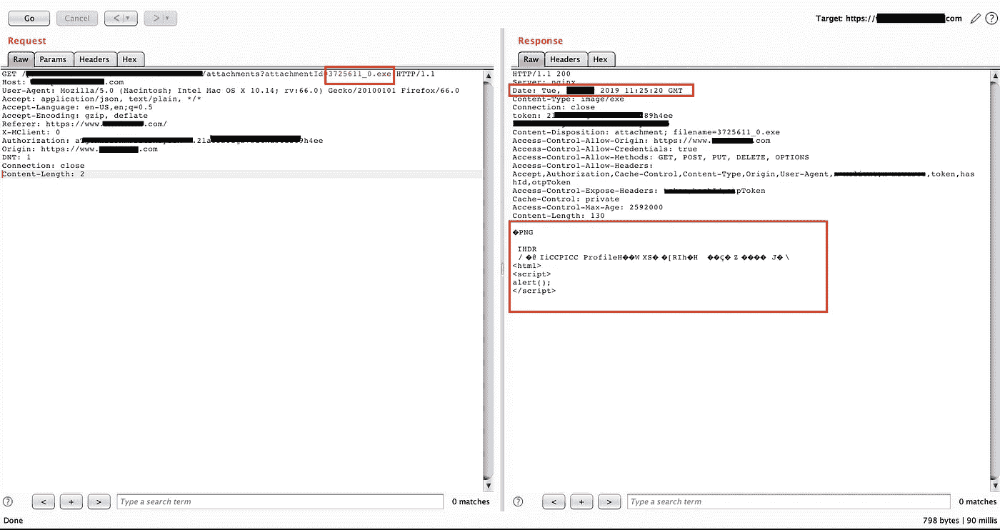

# Dank 写了一篇关于印度创业公司访问控制漏洞的文章

> 原文：<https://infosecwriteups.com/dank-writeup-on-broken-access-control-on-an-indian-startup-d29132a1ecd?source=collection_archive---------0----------------------->

这篇文章是关于一个关键的破坏访问控制以及服务器上无限制的文件上传。这家公司有一个很长时间的臭虫奖励计划。我挑战自己，在已经测试过多次的主应用程序中寻找 bug。这里，由于保密政策，应用服务器被认为是 example.com

这个问题得到了承认，但它既没有得到奖励，也没有提供任何进一步的反馈，完全没有名人堂。

# **描述:**

有一个支持页面，允许用户创建门票，并允许上传相同的屏幕截图，将由客户支持主管查看。因此，由于破坏了访问控制，可以从任何用户创建票证，并通过绕过对映像的扩展检查来上传文件。由于此页面用作反馈和支持表单，任何支持主管都可能会打开它，如果它有恶意软件或勒索软件。上传的文件对应用程序来说是一个巨大的风险。exe 或. ps1 文件，该文件可用于上传恶意软件，但由于内容处置为附件，因此无法执行该文件。

# **影响:**

此漏洞的影响很大，因为任何恶意实体都可以代表其他用户创建票证，并输入任何可能导致无法解决客户问题的详细信息，而且一旦票证打开，由于对多个票证创建的限制，用户在 10 小时内无法创建新票证。检查文件上传模块的访问控制以正确检查风险是很重要的。一旦上传，攻击者只需要找到一种方法来执行代码，就可以将恶意文件发送到票证中。由于票证创建由攻击者控制，因此攻击者可以粘贴链接作为客户服务主管，任何用户在检查假票证时都可以下载并执行该文件。
此外，该附件可下载，因此可用于共享来自合法网站的恶意内容，并可用于钓鱼电子邮件，从合法的 example.com 服务器下载附件

> 文件上传功能用于为客户支持执行人员附加屏幕截图，但由于访问控制被破坏导致无法限制文件上传和票证创建，因此一旦下载，就容易受到恶意软件的攻击，并且恶意软件可能会通过网络传播到客户端。此外，如果任何用户都可以为其他用户创建票证，则会导致客户支持的完整性和可用性受损。

# **易受攻击的 URL:**

[https://www.example.com/help/support](https://www.example.com/help/support)
https://www.example.com/help/report/valueAPI 调用:[https://api.example.com/p/account/tickets/v3/tickets](https://api.example.com/p/account/tickets/v3/tickets)

# **复制步骤:**

1.  参观[https://www.example.com/help/support](https://www.example.com/help/support)
2.  选择像服务这样的类别，要求在发送最后一个请求之前回答几个问题。
3.  选择正确答案，然后选择“否”进入客户支持聊天窗口。
4.  键入恶意内容或发布恶意 URL 的恶意链接并附加任何。exe 或。dmg 或. ps1 文件。
5.  点击提交并拦截请求。更改电子邮件和手机的值，这对于任何现有用户来说都很容易被暴力破解。

***请求:***

> POST/p/account/tickets/v3/tickets HTTP/1.1
> 主机:api.example.com
> 用户代理:Mozilla/5.0(Macintosh；英特尔 Mac OS X 10.14；RV:66.0)Gecko/2010 01 01 Firefox/66.0
> 接受:application/json，text/plain，*/*
> 接受-语言:en-US，en；q=0.5
> Accept-Encoding: gzip，deflate
> Referer:https://www.example.com/
> Authorization:. f 6 r 2 tgfc 5 LV fou 2 krbdubk
> Content-Type:multipart/form-data；boundary =———————163405244814986157001545857884
> 内容-长度:6096
> 产地:https://www.example.com/
> DNT:1
> 连接:关闭
> 
> ———————16340511111111111545857884
> 内容-配置:表单-数据；name= "类别"
> 
> xxxxx service
> —————16340511111111111545857884
> 内容-配置:表单-数据；name="cell "
> 
> 9999999999
> ————————1634051111111111545857884
> 内容-配置:表单-数据；name= "电子邮件"
> 
> 9999999999@xyz.example.com
> ——————163405111111111545857884
> 内容-配置:表单-数据；name="quesHistory "
> 
> [{ " key ":" initializer view "，" value":"{\ "问候\":\ "来自 XXXXX 的 XXXX\ "，\ "嗨\":\ "嗨 YYYY！\ "，\ "问题\":\ "您在使用这些服务时是否面临问题？\ "，\ "问题\":\ "您面临的问题是什么\"}"}，{"key":"questionView "，" value ":"您是否面临这些服务的问题？"}，{"key":"userView "，" value":"XXXXXX"}，{"key":"questionView "，" value ":"选择我们可以帮助您的查询！"}、{"key":"userView "，" value ":"我的 xxxxxxx 怎么下载？"}，{"key":"answerView "，" value ":" { \ " answer text body \ ":\ " 1。点击 xxxxx 上的“xxxx”选项。\\n2。、{"key":"userView "、" value":"no 它没有解决我的查询 " }]
> ————————————————————16340511111111111545857884
> 内容-处置:表单-数据；name= "温和"
> 
> null
> ———————163405111111111545857884
> 内容-配置:表单-数据；name="ticketstate "
> 
> 1
> ——————163405111111111545857884
> 内容-配置:表单-数据；name= "查询"
> 
> 恶意帖子及网址等详情
> ——————————————————16340511111111111111545857884
> 内容-处置:表单-数据；name="resolve "
> 
> n
> ——————163405111111111545857884
> 内容-配置:表单-数据；name= "附件"；filename="SHELL。EXE"
> 内容类型:image/png
> 
> PNG
> 
> IHDR
> /⊙@ iicpicc ProfileH wxsé[RIh HòZ J AK " uí，*+báX ×;《七宗罪》；n-O *íCuè" CYóòY n hs ` e ` O ' wysZC \u = p8s
> 恶意内容 xxxxxxxxxxxxxx xx
> ————————16340511111111545857884—

向客户支持部门提交请求

通过 Post 请求上传的恶意文件

6.由于这是一个图像的附件部分，但由于没有验证检查，我们可以上传任何文件。上传了非恶意的 [Eicar](https://www.eicar.org/?page_id=3950) 文件。

7.提交请求并检查受害者的帐户，该帐户已经创建。

8.现在，要下载该文件或使其可下载，我们需要有效的会话，这样我们就可以托管任何网站，上传内容，并提供链接作为 example.com 应用程序/下载，使其成为钓鱼页面，让用户下载。
从而滥用了这个漏洞的本质。

通过更改聊天 id 的值来下载文件

# **补救:**

对于中断的访问控制，人们通常在创建票证时进行基于角色的身份验证并确认服务器和客户端。

通过使用客户端和服务器端验证，仅允许特定的文件扩展名。仅允许经过授权和认证的用户使用该功能。检查从 web 上获取的任何文件的内容。

# **Bug 赏金提示:**

始终在客户支持或帮助页面检查文件上传，在那里有机会发送附件或上传任何类型的数据以与客户支持进行交互。通过这个技巧，我能够在亚马逊找到[配置错误的 s3 桶。](https://blog.usejournal.com/s3-bucket-misconfiguration-in-amazon-a7da6a6e02ea)

# **参考:**

[https://www.owasp.org/index.php/Broken_Access_Control](https://www.owasp.org/index.php/Broken_Access_Control)
[https://www . word fence . com/learn/how-to-prevent-file-upload-vulnerabilities/](https://www.wordfence.com/learn/how-to-prevent-file-upload-vulnerabilities/)
[https://www.owasp.org/index.php/Unrestricted_File_Upload](https://www.owasp.org/index.php/Unrestricted_File_Upload)
[https://www . virus total . com/GUI/file/2546 dcffc5 ad 854 D4 DDC 64 fbf 056871 CDA 00 f 2471 CB 7 a5 bfd 4 AC 23 b 6 e edad/detection](https://www.virustotal.com/gui/file/2546dcffc5ad854d4ddc64fbf056871cd5a00f2471cb7a5bfd4ac23b6e9eedad/detection)

> 注意:上传的文件是 Eicar 文件，是一个无害文件，带有 sha 256 sum:
> [https://www.eicar.org/?page_id=3950](https://www.eicar.org/?page_id=3950)

*关注* [*Infosec 报道*](https://medium.com/bugbountywriteup) *获取更多此类精彩报道。*

 [## 信息安全报道

### 收集了世界上最好的黑客的文章，主题从 bug 奖金和 CTF 到 vulnhub…

medium.com](https://medium.com/bugbountywriteup)