# 泄露会所数据的数据探索与可视化

> 原文：<https://infosecwriteups.com/data-exploration-and-visualization-on-leaked-clubhouse-data-25408b03664?source=collection_archive---------1----------------------->

## 谁收到了那些独家俱乐部会所邀请？

## 使用 Jupyter 笔记本和 Gephi 的逐步演练

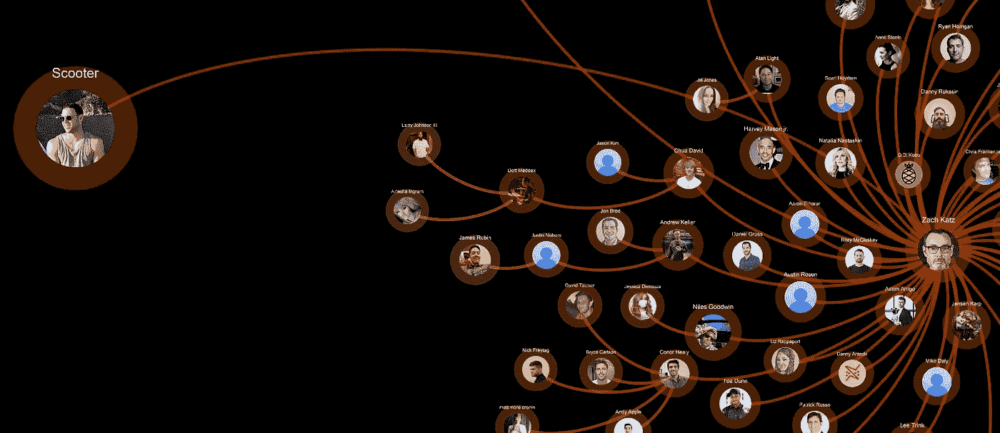

直接或间接收到 Scooter Braun 俱乐部邀请的俱乐部用户网络图，Scooter Braun 以爱莉安娜·格兰德、贾斯汀比伯和黛米·洛瓦托等巨星艺术家的音乐经理而闻名| **由作者生成，步骤详述如下**

三百万份刮下来的俱乐部用户记录在网上公开。让我们看看如何使用数据探索和可视化工具来分割数据集和绘制网络图。

来自 [Henk van Ess](https://medium.com/u/8b2aff42873e?source=post_page-----25408b03664--------------------------------) 的推文，他是 [Bellingcat](https://www.bellingcat.com/author/henkvaness/) 的开源情报(OSINT)调查员

# 数据探索

## 在 Jupyter 笔记本上加载和显示数据

这些数据可以从下面的 Kaggle 库下载。Kaggle 社区提供了一些代码片段来加载和查看数据。

 [## 会所数据集

### joinclubhouse.com 的用户简档数据集

www.kaggle.com](https://www.kaggle.com/johntukey/clubhouse-dataset) 

建议使用 Jupyter Notebook 进行快速数据浏览，因为它可以在线显示数据帧和图像。首先，我们将阅读。db 文件并将数据加载到 Pandas 数据框架中。

在开始我们的数据探索之前，我们必须在 Jupyter Notebook 中设置以下显示配置，以避免截断字段并查看数据帧中的图像。

默认显示选项:

截断的 photo_url 列，图像未显示|由作者生成

调整显示选项后:

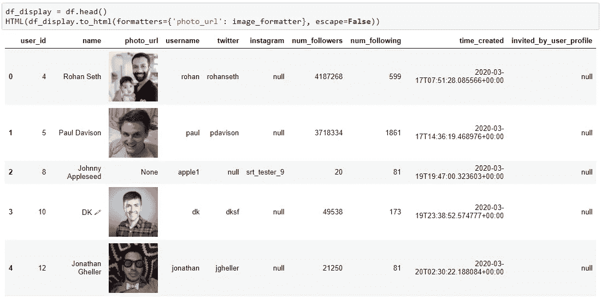

轮廓图像来自 AWS，并显示在作者生成的数据框中

## 查询数据

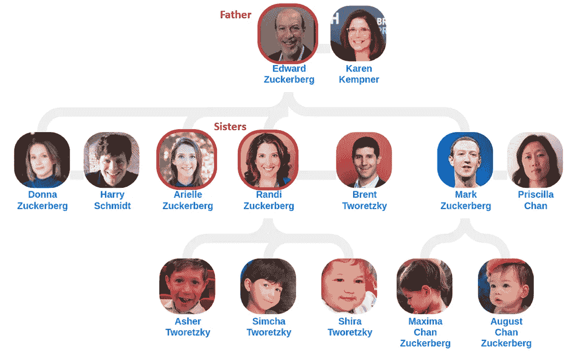

图片来自媒体[马丁](https://medium.com/family-trees/what-you-didnt-know-about-mark-zuckerberg-family-9d1ae3110996)

将数据加载到 pandas Dataframe 后，我们可以使用过滤和搜索功能来查询特定的列。

例如，通过对 *name* 列进行子串匹配，我们能够看到马克·扎克伯格的家庭成员也在 Clubhouse。马克·扎克伯格的记录不包括在这个泄露的数据集中。

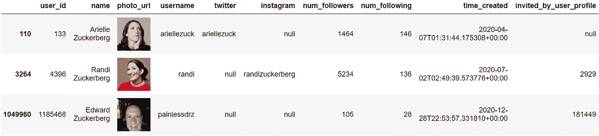

Arielle 和 Randi 是 Mark Zuckerberg 的姐妹，而 Edward 是作者生成的父亲

*invite_by_user_profile* 字段显示发出邀请的用户的 *user_id* 。比如兰迪·扎克伯格被 *user_id* 2929 邀请。

通过对该列进行聚合，我们可以查询发出最多邀请的前几名用户。

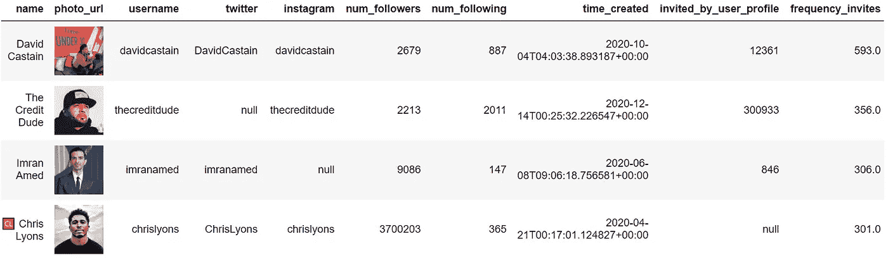

请看第一行，在作者生成的数据集|中，David Castain 邀请了 593 个帐户

# 数据准备

## 将数据转换成网络图

俱乐部会所的新奇之处之一是它的独特性。新用户只有收到现有用户的邀请才能注册帐户。将邀请链建模为网络图会很有趣。

下面的函数将检索上游(邀请者)和下游(邀请接收者)用户，给定一个起始的 user_id。

## 使用 Twitter 丰富数据

由于数据包括俱乐部用户的 Twitter 处理程序，我们可以利用 [Twint API](https://github.com/twintproject/twint) 来收集 Twitter 个人资料信息，比如简历描述和位置。

抓取 Twitter 信息是自动搜索个人资料描述的一种便捷方式。

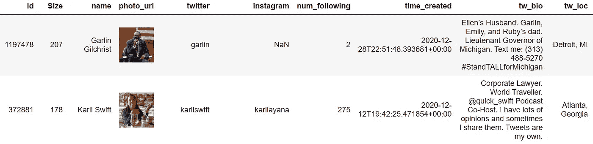

最后两篇专栏文章是作者丰富| Twitter 数据的结果

## 导出节点和边数据

接下来，我们将把包含节点和边数据的字典列表导出到 CSV 文件中。这些将被直接用作 Gephi 的导入。

## 下载和设计个人资料图片

使用请求库，从 AWS 链接下载俱乐部会员的个人资料图片。

由于 Gephi 编辑图像的功能有限，我们将使用 python 中的 Pillow 库来完成。下面的函数会将个人资料图片转换成透明的 PNG 图像，带有圆形图像和一个显示用户名的附加标题。

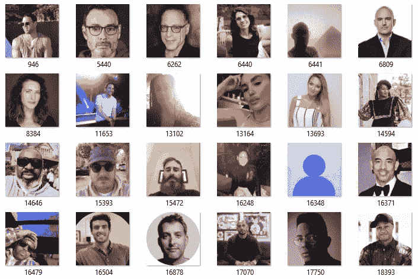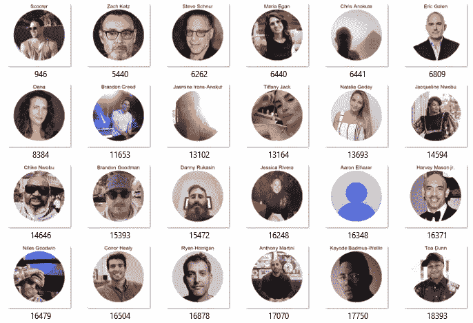

(左)从 Clubhouse AWS 下载的个人资料图片|(右)添加了标题的圆形个人资料图片|由作者生成

# 图形网络可视化

## 安装插件

我们将使用第三方插件。要安装它们，进入工具>插件，在*可用插件*标签下搜索。

1.  *图像预览*:预览插件，允许将图像渲染为节点
2.  *Lineage* :统计插件，计算从开始节点到后代的距离

## 将数据导入 Gephi

1.  在 Gephi 中创建一个*新项目*，并转到*数据实验室*选项卡。
2.  单击导入电子表格并选择节点的 CSV 文件。选择图形类型为*定向*并添加到*新工作空间*。
3.  点击导入电子表格，选择边的 CSV 文件。选择图形类型为*定向*和*附加到现有工作空间*。

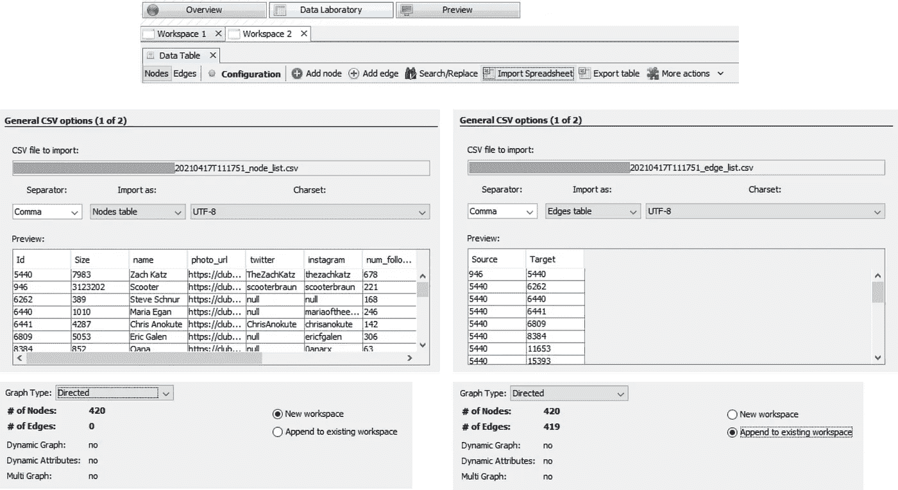

(左)Gephi 为节点导入电子表格|(右)Gephi 为边导入电子表格|由作者生成

## 改变布局和外观

1.  在*布局*窗口下，运行*胡一帆*算法。
2.  在*外观*窗口下，更改节点大小来表示*大小*属性，这是用户拥有的会所关注者的数量。
3.  在*统计*窗口下，运行*世系*算法，该算法会将*距离世系*列添加到数据中。 *DistanceDescendant* 代表离开父节点的跳数。
4.  在*外观*窗口下，改变节点颜色以表示*距离上级*字段。添加冷暖色渐变。
5.  在*布局*窗口下，运行*no overlap*算法，如果节点重叠，则将其展开。

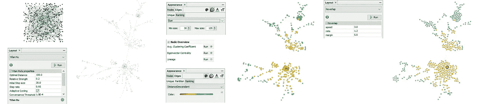

作者在 Gephi |上生成的布局和外观配置步骤

## 设计图表样式

1.  转到*预览*选项卡，选择黑色背景，因为它更酷。
2.  选择*渲染节点为图像*，输入包含轮廓图片的文件夹的*图像路径*。
3.  缩小节点和边的不透明度。

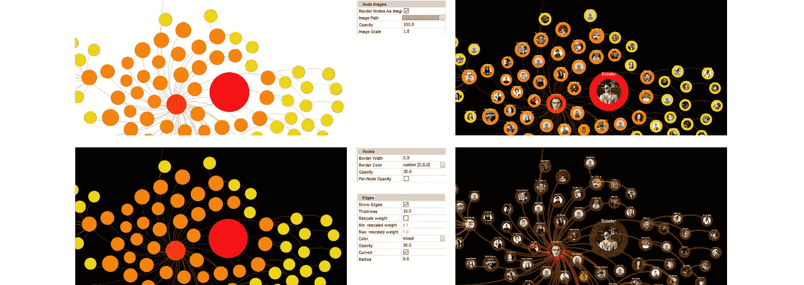

作者生成的 Gephi |上的预览样式更改

# 分析社区

所有社交媒体平台都存在联系，但参与程度各不相同。举个例子，

*   在 Twitter 上，一个*追随*只需要单方面的努力:当 A 选择追随 B 时，A 追随 B。
*   在脸书，一个好友连接需要一个请求和一个确认:当 A 请求一个好友请求并且 B 接受了时，A 就是 B 的好友。

由于需要双方的努力，与 Twitter 关注相比，脸书朋友联系将是更高形式的参与。俱乐部会所邀请类似于脸书，但赌注更高。需要邀请，不是为了获得连接，而是为了使用平台。此外，邀请只能来自现有用户，并且一个用户的邀请数量是有限的。因此，可以有把握地假设，俱乐部会所用户只会向亲密的熟人发送邀请，用户认为这些人会增加他或她自己使用俱乐部会所的体验的价值。

## 例如:斯库特·布劳恩和音乐产业

Scooter Braun 是早期的 Clubhouse 用户(user_id 为 946)，拥有超过 300 万的关注者。这位音乐大亨的唯一邀请是扎克·卡茨，他是一个重要的商业伙伴。

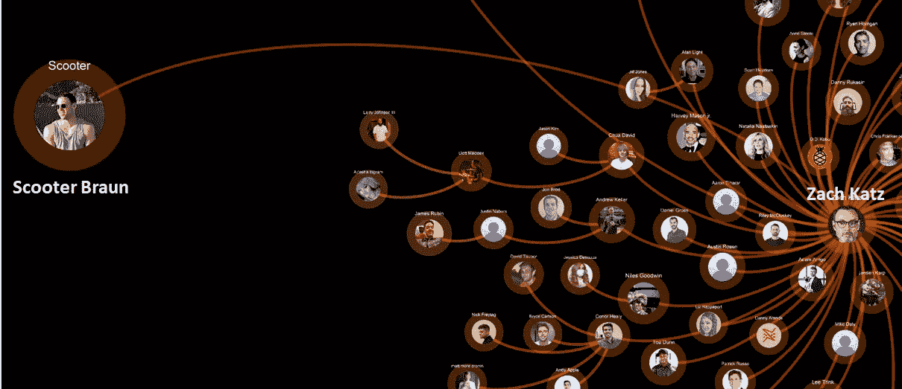

Josh Fogul 在综艺节目上的图片| Scooter Braun 的俱乐部邀请商业伙伴 Zach Katz 加入网络|由作者生成

当我们覆盖邀请链中一些个人资料的 Twitter 简历(蓝色字体)时，我们可以看到他们大多数都在娱乐行业——唱片公司的高管、艺术家经理、内容创作者、制片人、音乐家和公关人员。

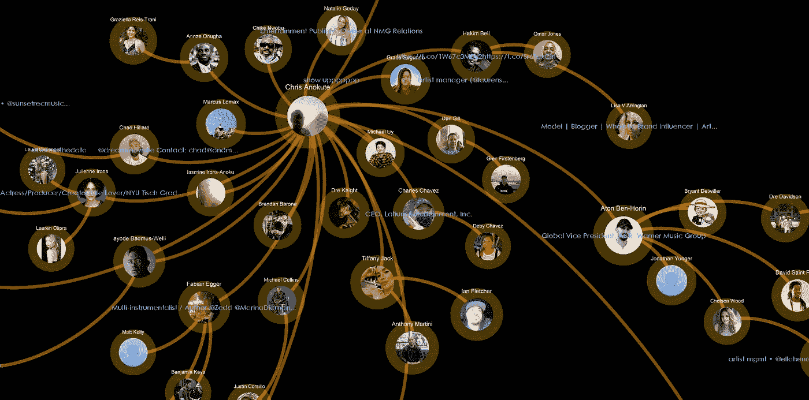

Scooter Braun 俱乐部会所邀请网络的娱乐人物|由作者生成

# 跟踪邀请链

每个加入 Clubhouse 的用户都会收到来自现有用户的邀请，而现有用户已经收到来自早期用户的邀请。追溯到 Clubhouse 在 2020 年 4 月的发布日期，这个邀请链会很有趣。

让我们追踪所有来自最早的 Clubhouse 用户之一——Rohan Seth，Clubhouse 的联合创始人，他在 2020 年 3 月 17 日创建了自己的帐户。

在泄露的数据库中，这个邀请链从 2020 年 4 月到 2021 年 3 月增长到 7574 个用户，总粉丝数为 540 万。一些用户距离 Rohan Seth 发出的第一个邀请还有 31 个邀请跳。

**仅考虑存在于泄漏数据库中的数据*

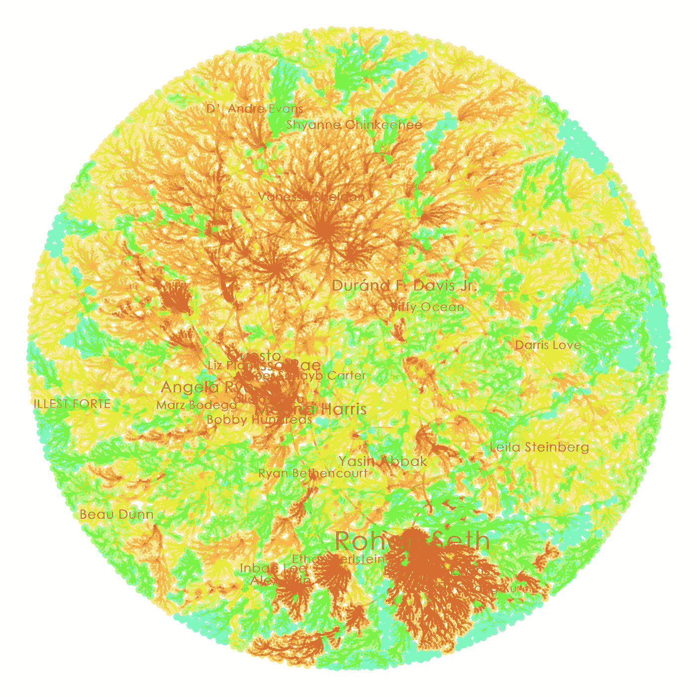

7574 名俱乐部会所用户直接或间接受到俱乐部会所联合创始人 Rohan Seth 的邀请|由作者生成

节点的颜色，从暖色到冷色，代表了与洛汗赛斯分离程度越来越高的用户。

*   红色:由罗汉·赛斯直接邀请的用户。*他们离洛汗塞斯只有一步之遥*
*   橙色:来自 Rohan Seth 邀请的现有[红色]用户的邀请用户。*他们距离洛汗塞斯*有 2-7 个跳跃点
*   黄色:被[橙色]用户邀请的用户。他们离洛汗塞斯有 8-15 跳的距离
*   绿色:被[黄色]用户邀请的用户。他们离洛汗塞斯有 16-22 跳的距离
*   蓝色:由[绿色]用户邀请的用户。*他们离洛汗塞斯有 23-31 跳的距离*

节点大小代表追随者数量。如果用户拥有超过 4000 个关注者，就会显示他们的名字。

# 结论

俱乐部会所数据提供了分析邀请网络的便利方式。尽管这些数据大多是公开数据，但在列出的 Twitter 和 Instagram 账户之间进行验证可能会增加网络钓鱼和骚扰的攻击面。

随着越来越多的政治家和社会活动家到 Clubhouse 分享他们的想法和故事，Clubhouse 可能希望经常审查他们关于隐私和网站完整性的规则。

***参考文献***

[1]亨克·范 Ess，[推特(2021)](https://twitter.com/henkvaness/status/1381612643694305280) ，推特

[2]马丁，[马克·扎克伯格的家谱(2020)](https://medium.com/family-trees/what-you-didnt-know-about-mark-zuckerberg-family-9d1ae3110996) ，中等

[3] H. Shirley，[扎克·卡茨，前 BMG 总裁，与 Scooter Braun 合作进行技术投资风险投资(2019)](https://variety.com/2019/digital/news/zach-katz-scooter-braun-ithaca-holdings-raised-in-space-1203127860/) ，综艺