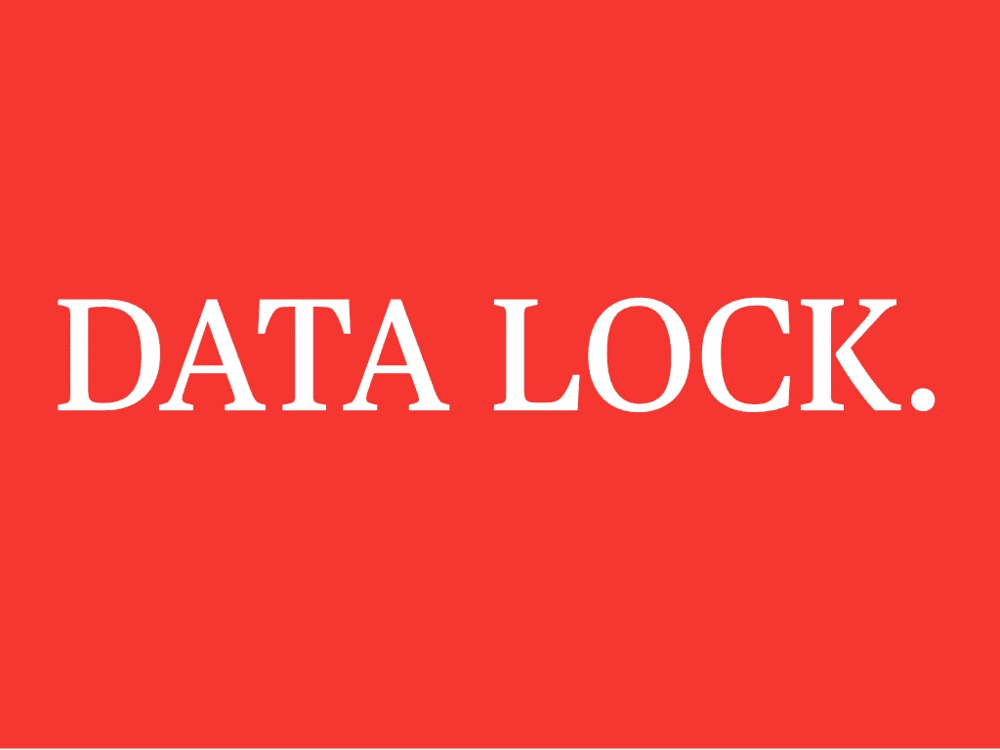
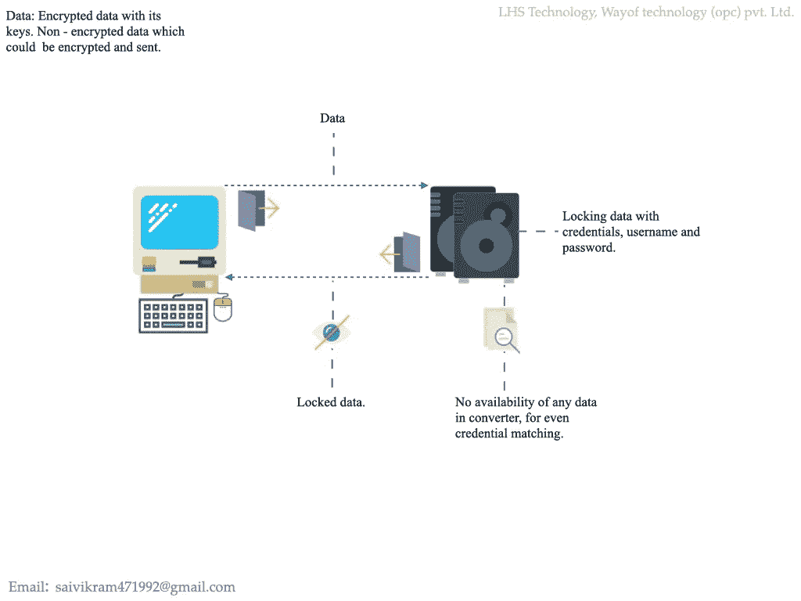
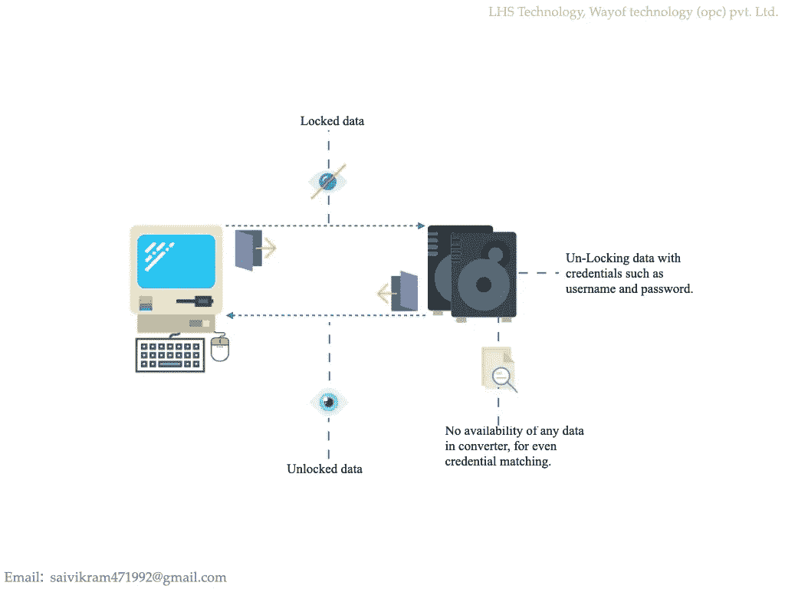

# 数据安全性，通过凭证，锁定不可用。

> 原文：<https://infosecwriteups.com/data-security-by-credentials-lock-with-no-availability-8b4e846870cc?source=collection_archive---------2----------------------->

使用凭证、用户名和密码保护数据。无论是在应用程序中还是在驱动器中，凭据都不可用，这在离线时也有效。

# **锁定数据。**

*   发送到锁的数据可以是加密数据及其密钥。数据也可以是非加密的，可以在应用程序中加密，然后锁定加密的数据。
*   数据被发送到转换器，并使用凭据锁定，其中锁定的数据返回到用户选择的系统存储中的存储位置。
*   转换器中没有任何类型的数据可用，甚至没有 1 位的数据大小。

# **解锁数据。**

*   用户存储在其存储器中的锁定数据被发送到转换器以解锁数据，因此转换器通过输入凭证来解锁锁定的数据，如果凭证正确，数据将被解锁。
*   然后，解锁的数据被发送到用户选择的他的系统的指定存储器。

*   登录时输入的凭证可以由用户定制为三个，在用户名和密码之后，通过点击数字按钮输入四个字母的序列。
*   每个转换器在编程时都被指定了不同的 id，因此尽管用户名和密码用于解锁数据，但只有基于特定 id 的设备才能解锁数据。
*   技术提供商的权威机构将通过不向其他客户提供相同的基于 id 的设备来照顾客户，如果不遵守条款，这对技术提供商来说将是一个法律问题。