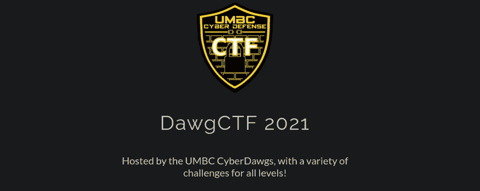
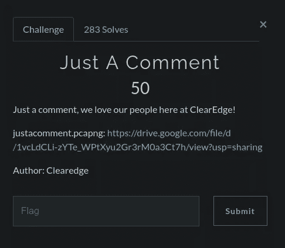
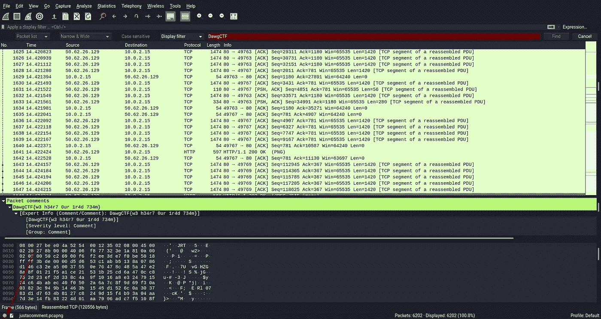
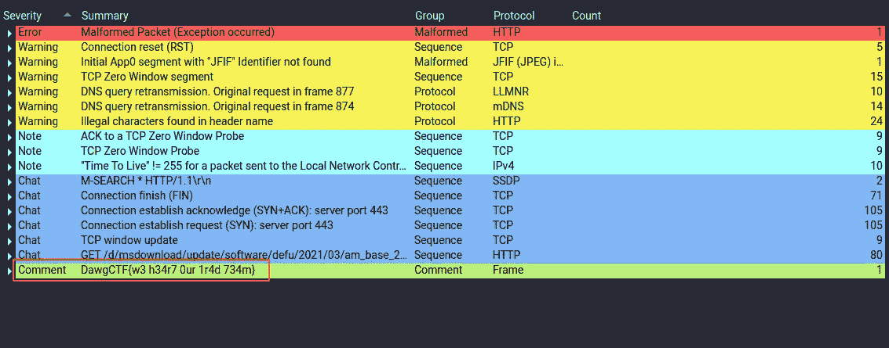
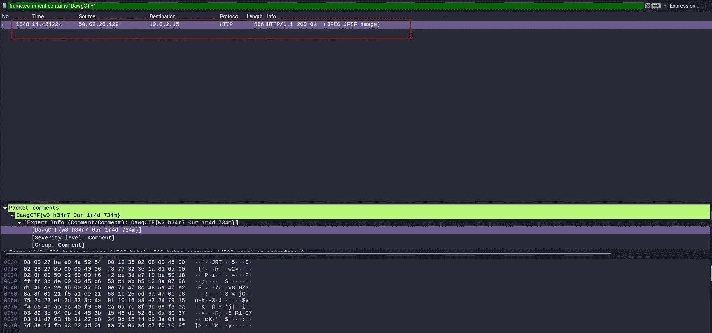
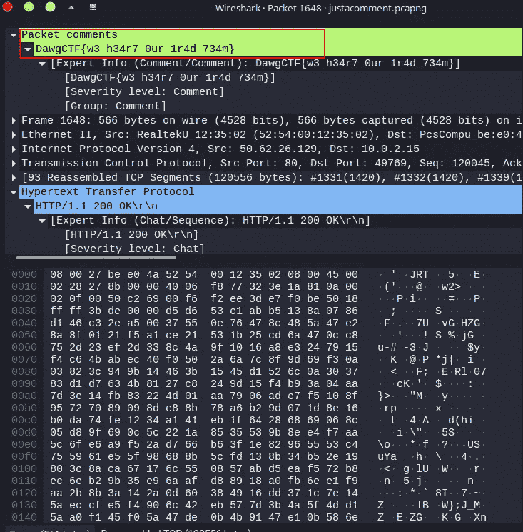

# DawgCTF 2021 演练

> 原文：<https://infosecwriteups.com/dawgctf-2021-walkthrough-2bd50f6ca586?source=collection_archive---------4----------------------->

这对我来说是一次新的经历。我只关注法医方面的挑战。

我只是下载文件。这是一个 pcapng 文件。首先，我不知道挑战是什么，它们意味着什么。经过一些谷歌搜索，我发现国旗是隐藏在一个包的评论。我使用一些随机过滤器从 pcap 文件中找到数据包注释。但是不管用。

> **pkt_comment 包含“搜索字符串”**
> 
> **tshark-R dump . PCA png-T fields-e PKT _ comment-R PKT _ comment | grep search string**

你可以看到，在这种情况下，我们需要知道我们需要什么样的字符串格式。但不知道实际的国旗格式。然后我尝试另一种方法

在 Wireshark 中打开 pcap 文件，并转到左上角。你可以看到一个红点。按下它，是的，我们得到了它

我们可以找到另一个有效的替代框架来找到旗帜

> **frame . comment . contains“DawgCTF”**

谢谢大家；