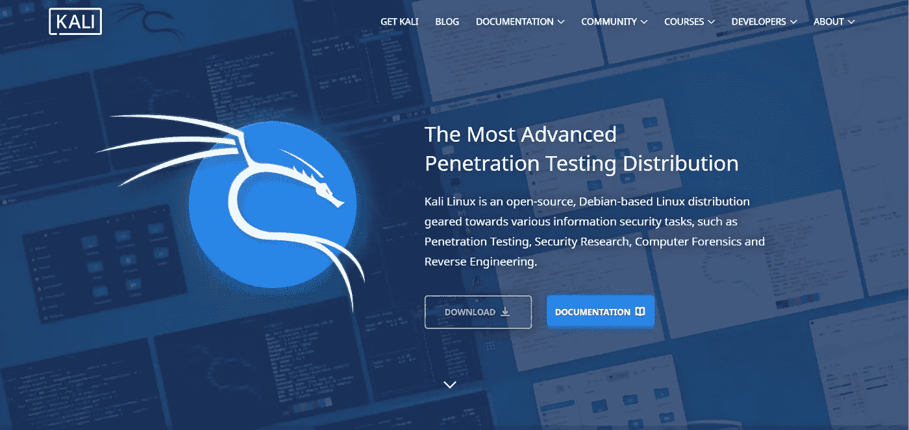
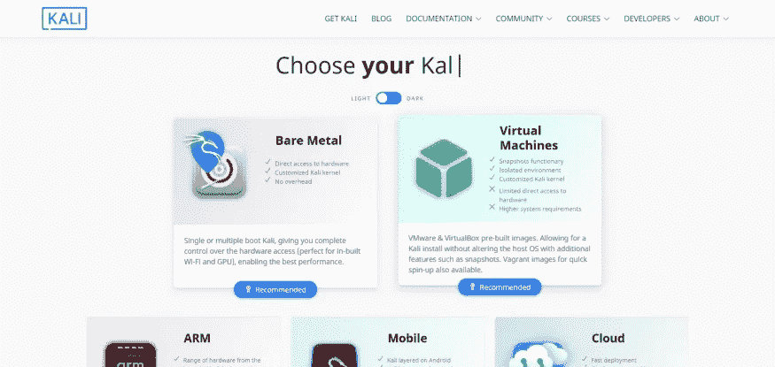
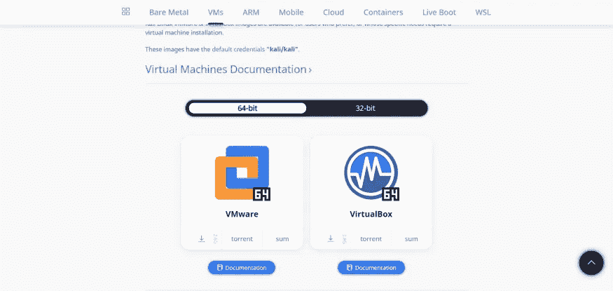
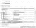
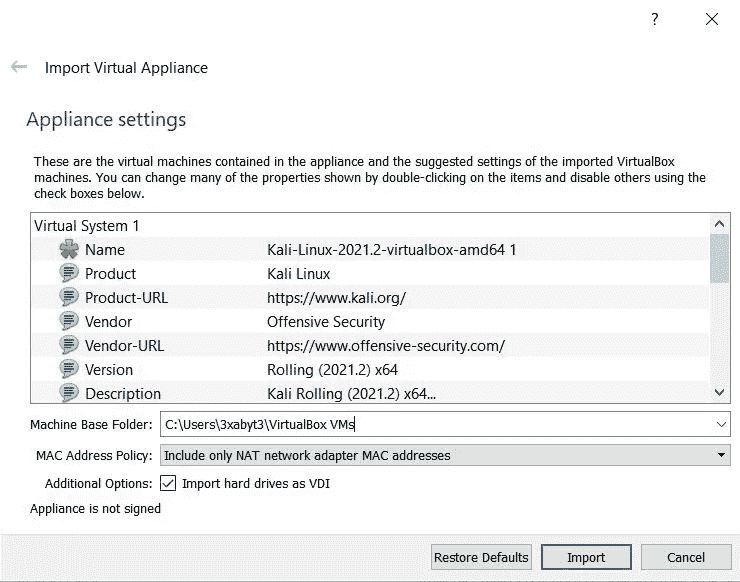
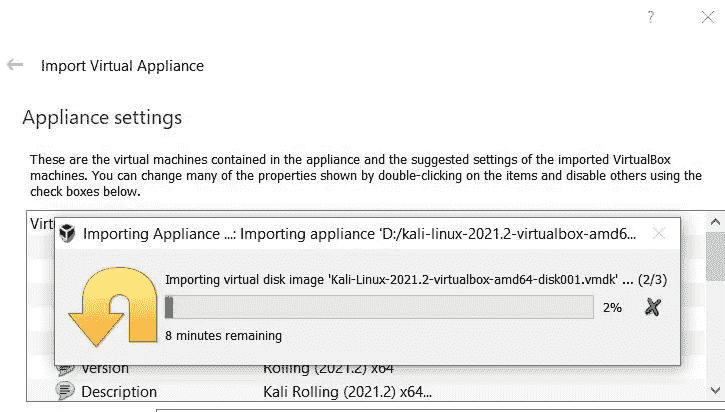
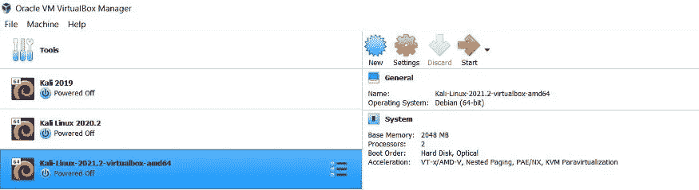
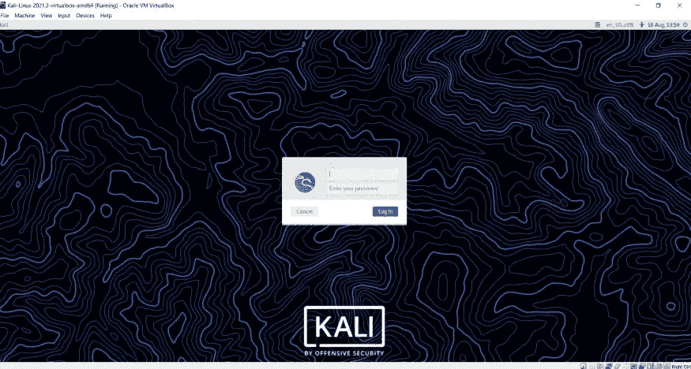
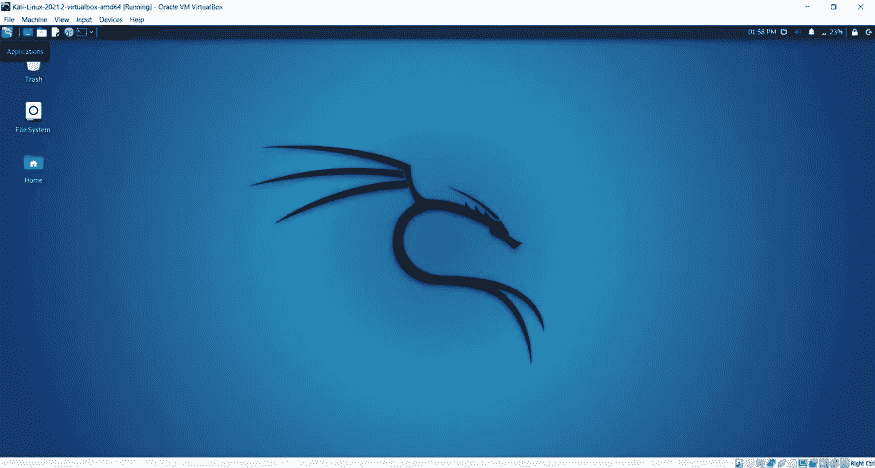

# 第一天，安装 Kali Linux——黑客 100 天

> 原文：<https://infosecwriteups.com/day-1-installing-kali-linux-100daysofhacking-eeb5954e0837?source=collection_archive---------0----------------------->

大家好，我是 Ayush，从今天 01-01-2022，我将开始 100 天的黑客挑战来提高我的黑客技能。所以这是第一天，因为许多初学者不知道在网络安全中使用哪个平台。所以今天我们将展示如何在虚拟机器中安装 Kali Linux。

但在此之前，让我告诉你一点什么是 kali Linux？

基本上 kali linux 是一个基于 debain 的 linux 操作系统发行版，被网络安全专家用于渗透测试、道德黑客、数字取证等方面，我希望你对此有所了解。

那么现在让我们深入到安装部分，但在此之前，我希望你已经在你的 pc 上安装了 virtual box，如果没有，请访问我以前关于 virtual box 安装的博客，点击 [**此处**](http://resources.crypticonicsec.in/index.php/how-to-install-virtual-box-in-windows-10/30/06/2021/linux/) 获取它。

**第一步:**这一步你要进入 kali linux 的官方页面，所以点击这里的****，你会得到如下界面。****

********

******步骤 2:** 现在您必须点击下载，然后选择虚拟盒子作为平台。****

****************

******步骤 3:** 现在，根据您的电脑规格选择一个位，是 32 位还是 64 位，然后单击虚拟框，您的下载将开始，这需要一些时间，因为文件大约为 3.7 GB。****

****************

****第四步:你会得到一个文件。ova 扩展，然后双击它，你会得到如下界面，然后点击导入。****

****************

******步骤 5:** 然后会出现一个提示，只需点击“同意”，导入过程就会开始，这需要一些时间。****

****************

****第六步:完成后，你会得到你的 linux 虚拟机，然后点击虚拟盒子顶部的开始按钮。****

****************

******步骤 7:** 等待几分钟，然后会出现登录屏幕，只需输入用户名 **kali** 和密码 **kali，**即可登录。****

****************

****第 8 步:只需输入凭证，恭喜你终于安装好了你的 linux 机器。****

********

****现在我们终于在我们的系统中安装了 kali linux，所以今天就到此为止，我们将在下一篇文章中见面。如果你喜欢这个，那么请点击一个按钮。****

****谢谢，祝黑客快乐！****