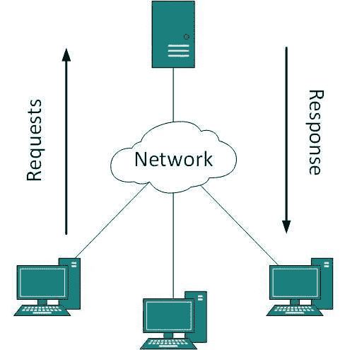
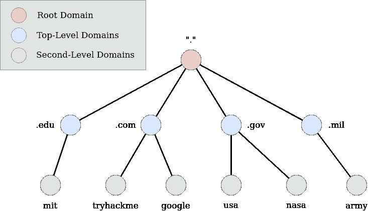
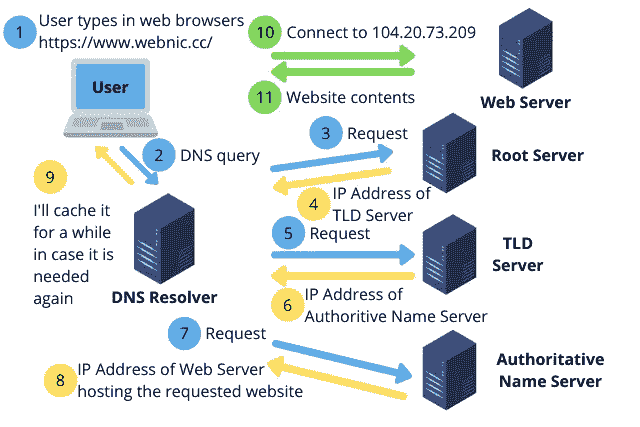
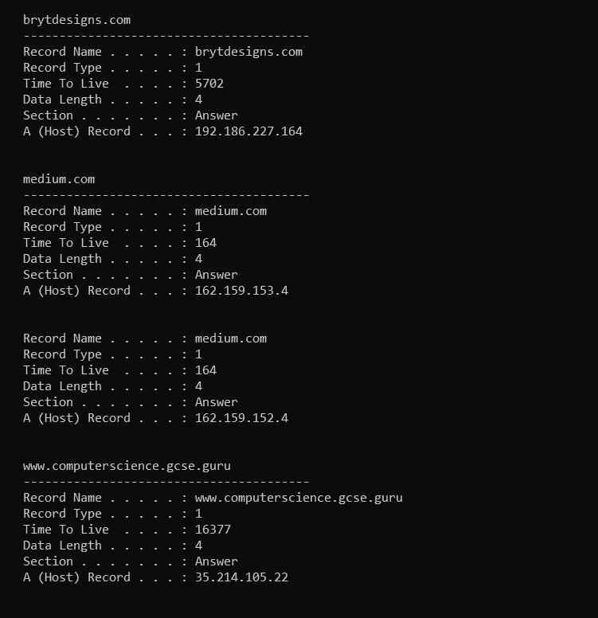
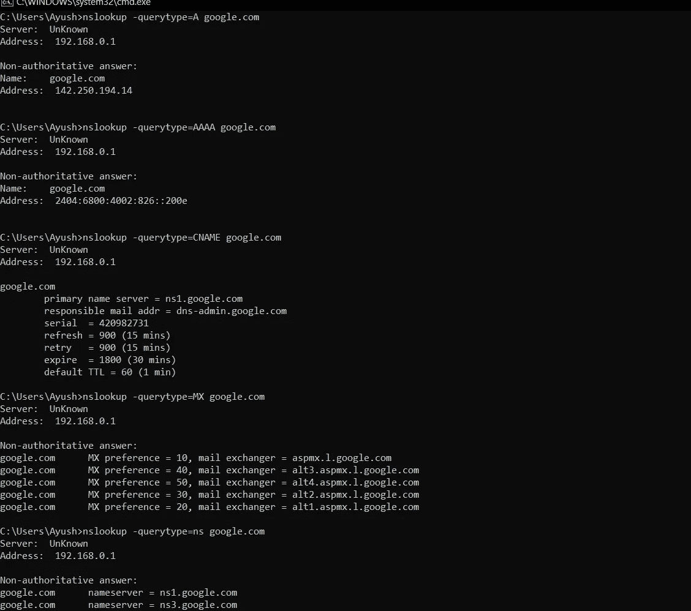

# 第 10 天:关于 DNS #日黑客攻击

> 原文：<https://infosecwriteups.com/day-10-all-about-dns-100daysofhacking-a337b8e763a?source=collection_archive---------1----------------------->

**Day1 :** [安装 Kali Linux](/day-1-installing-kali-linux-100daysofhacking-eeb5954e0837)

**第二天:** [导航 Linux](https://3xabyt3.medium.com/day2-navigating-linux-100daysofhacking-44130f5983bf?source=user_profile---------0-------------------------------)

**第三天:** [电脑联网](/day3-computer-networks-100daysofhacking-1f9734b80313)

**第 4 天:** [网络拓扑](/day-4-cn-network-topologies-100daysofhacking-d01377674623)

**第 5 天:** [子网划分](https://3xabyt3.medium.com/day5-cn-subnetting-100daysofhacking-893346306e0d)

**第 6 天:** [ARP 和 DHCP](https://3xabyt3.medium.com/day6-cn-arp-and-dhcp-protocol-100daysofhacking-2eae786dc97b)

**第 7 天:** [OSI 和 TCP/IP 模型](/day-7-cn-osi-model-100daysofhacking-925c9e769a7d)

**第 8 天:** [TCP 和 UDP](/day-8-cn-tcp-udp-100daysofhacking-2584322871b1)

**第九天:** [网络安全设备](/day-9-cn-network-security-devices-100daysofhacking-b856b5ab092d?source=user_profile---------0-------------------------------)

**Github:**[100 天黑客](https://github.com/ayush098-hub/100DaysofHacking)

大家好，我是 Ayush，如果你还没有看过之前的博客，请点击上面的链接来阅读，在上面我们讨论了重要的概念，这是以后的博客所必需的。

在我们之前的博客中，我们讨论了不同的网络安全设备，如防火墙、IDS 和 IPS。今天在这个博客中，我们将了解网络是如何工作的，你如何访问 google.com 或其他网站，使用什么协议，所有这些都将在未来的博客中涉及，所以让我们开始吧。

# 客户端-服务器模型:

在发现网站的弱点或漏洞之前，你应该了解的最重要的事情是客户端-服务器模式。

每个人都知道，要在网络上工作或在互联网上做一些事情，你至少需要两台设备。

一个是“客户端”，一个是“服务器”。这里基本上客户端的意思就是你用来访问服务器的应用程序，所以在大多数情况下它是你的网络浏览器。

因此，在这种客户机服务器模型中，客户机向服务器请求资源，服务器向客户机提供这些资源，例如:每当你用浏览器访问任何网站时，它就作为客户机向 web 服务器请求网页。然后，web 服务器将该特定网站的网页发送给客户端。

来源:TutorialsPoint

现在的问题是什么是网页，网页只不过是网络服务器发送的资源或文件的集合。例如，你访问一个静态网站，该网站也有一些样式和动态内容，那么你的浏览器很可能会收到 HTML[超文本标记语言]，CSS[层叠样式表]和 Javascript 文件。

**HTML** — HTML 文件就像一个简单的 txt 文件，没有任何颜色和设计。

**CSS** — CSS 为 HTML 提供颜色和设计

**Javascript** — Javascript 文件用于网站想要显示一些动态内容，而这些内容在一段时间内会发生变化。假设网站上显示时间，那么在 Javascript 的帮助下这是可能的。

来源:Bryt 设计公司

现在我们知道客户端从服务器访问资源，但我们知道客户端将如何访问这些资源吗？很简单，客户端将在服务器的 URL 或域名的帮助下访问这些资源。因此，在您的浏览器中输入 URL 后，会发生一些过程，我们将了解 DNS 的概念。

# **DNS【域名系统】**

DNS 代表域名系统，因为它主要用于从服务器访问资源。正如我们所知，每台设备都连接到互联网，并且每台设备都有 IPv4 或 IPv6 地址，类似地，服务器也有 IP 地址，但是要访问任何 web 服务器，我们不能再次输入 IP 地址，因为 IP 地址是数字，而数字不容易记住，这就是为什么**域名系统或域名**的作用是便于人们阅读和记忆。

换句话说，你可以说 DNS 是用来把 IP 地址转换成域名和域名的。

**谷歌的 IP 地址是:**142.250.207.206

**域名是:**[google.com](http://www.google.com)

那么你觉得哪一个容易记住，显然域名也就是 www.google.com 的**[**。**](http://www.google.com.)**

****在深入研究 DNS 的工作之前，我们先来看看域的层次结构。****

# ****域层次结构****

********

****来源:Tryhackme****

# ****mail.google.com****

******顶级域名:**顶级域名不过是域名的最左边，在本例中为**。com** 是 TLD。****

****还有两种类型的顶级域名:-****

******1 gTLD:** 通用顶级域名，例如:-****

****。这是用于商业目的。****

****。组织—用于组织****

****。edu——它被用于教育。****

****。gov-它是用于政府的。****

****所有顶级域名列表:- [点击此处](https://data.iana.org/TLD/tlds-alpha-by-domain.txt)****

******2 ccTDL:** 国家代码顶级域名，这种类型是国家特有的。例如:****

****。在印度****

****。ca-代表加拿大****

****. co.uk —代表英国****

******二级域名:**在 mail.google.com，google 是二级标签域名。它限于 63 个字符+ TLD****

******子域:**子域就是二级域之前的部分，像在 mail.google.com，邮件就是子域或者 3xabyt3.medium.com，这里 3xabyt3 也是 medium.com 的子域。****

****现在让我们看看 DNS 的工作原理:****

# ******DNS 的工作:******

********

****资料来源:网络信息中心****

1.  ****当我们在浏览器中输入任何类似**example.com**的网址时，我们的计算机首先检查其本地缓存，看我们最近是否访问过那个特定的网站，如果访问过，那么很好，如果没有，那么就向**递归 DNS 服务器或 DNS 解析器**发出请求。 **ipconfig /displaydns** 将在 windows 中显示 dns 详细信息。****
2.  ****递归服务器然后查询一个 **DNS 根服务器(。)**。****
3.  ****如果我们在根服务器上找到结果，那么过程就在这里结束。****
4.  ****如果我们在这里得不到结果，那么根服务器将那个特定的请求发送到处理那个特定 TLD 的 **TLD 服务器**，在这个例子中是. com****
5.  ****然后，TLD 服务器用 example.com 的域名服务器的 IP 地址来响应****
6.  ****最后递归 DNS 服务器向 example.com 的**权威** **域名服务器**发送请求。****
7.  ****然后 **IP 地址从权威的** **名称服务器**返回给递归 DNS 服务器。****
8.  ******递归 DNS 服务器**然后用最初请求的域名的 IP 地址响应网络浏览器。****

****这是 DNS 的整体流程。****

********

****ipconfig /displaydns 输出****

****下去吧哥们，今天写的东西挺长的:>****

****现在我们来谈谈一些 DNS 记录:****

******DNS 记录:******

****DNS 记录只是存储在权威 DNS 服务器中的指令，也称为区域文件。这些记录提供了有关域名和主机名的重要和相关的详细信息。****

****以下是一些常见的 DNS 记录:****

******A 记录** —这些记录提供 IPv4 地址。****

******AAAA 记录** —这些记录提供 IPv6 地址。****

******MX 记录** —这些记录解析为处理该域的电子邮件的服务器的地址。****

******CNAME 记录** —这些记录将一个域或子域转发到另一个域。****

****例如，假设 blog.example.com 有一个值为“example.com”(没有“blog”)的 CNAME 记录。这意味着当一个 [DNS](https://www.cloudflare.com/learning/dns/what-is-dns/) 服务器点击[blog.example.com 的 DNS 记录](https://www.cloudflare.com/learning/dns/dns-records/)时，它实际上触发了对 example.com 的另一次 DNS 查找，通过其 A 记录返回 example . com 的 IP 地址。在这种情况下，我们会说，example.com 是 blog.example.com 的规范名称或 CNAME(或真名)。****

******NS 记录:** NS 代表“名称服务器”，名称服务器记录表明哪个 [DNS](https://www.cloudflare.com/learning/dns/what-is-dns/) 服务器是该[域](https://www.cloudflare.com/learning/dns/glossary/what-is-a-domain-name/)的权威(即哪个服务器包含实际的 [DNS 记录](https://www.cloudflare.com/learning/dns/dns-records/))。基本上，NS 记录告诉互联网去哪里找到一个域名的 IP 地址。一个域通常有多个 NS 记录，这些记录可以指示该域的主名称服务器和备份名称服务器。如果没有正确配置的 NS 记录，用户将无法加载网站或应用程序。****

******TXT 记录:**让管理员在记录中存储文本注释。这些记录通常用于电子邮件安全。****

****详细了解所有记录，[点击这里。](https://www.cloudflare.com/en-in/learning/dns/dns-records/)****

****DNS 记录的一些概念来自 cloudflare，所有记录在那里都有很好的解释。****

# ****如何获取任意网站的 DNS 记录？****

****这也称为 DNS 查找。****

****去 https://www.nslookup.io/dns-records/google.com 的网站[看看](https://www.nslookup.io/dns-records/google.com)****

****或者您可以使用命令行工具 nslookup。****

1.  ****nslookup-query type = google.com****
2.  ****google.com AAAA****
3.  ****google.com CNAME****
4.  ****nslookup-query type = NS google.com****
5.  ****nslookup-query type = MX google.com****

********

****NSLOOKUP 的输出****

****所以，伙计们，今天我们将在这里停下来，因为这是一篇相当长的文章。我希望你喜欢它，并学到一些新的东西。如果你有任何疑问，请在博客中回复。如果你觉得这个系列有帮助，请与你的朋友分享。不要忘记订阅邮件，每当我发布关于#100daysofhacking challenge 的任何文章时，都可以收到邮件。****

****非常感谢你读到这里，下次再见！****

****快乐学习，快乐黑客！****