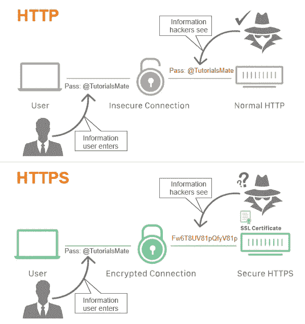
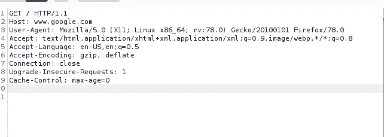
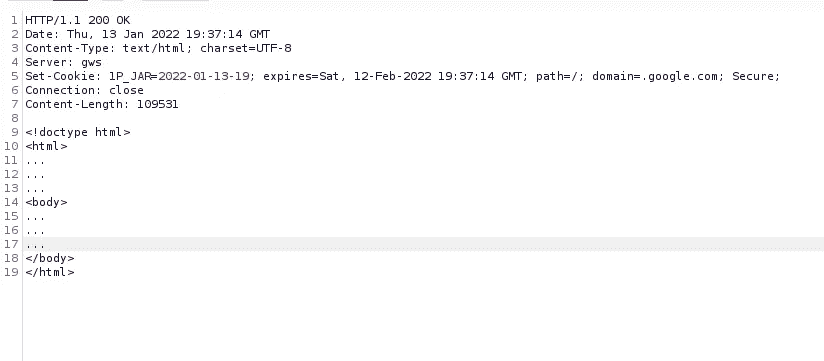
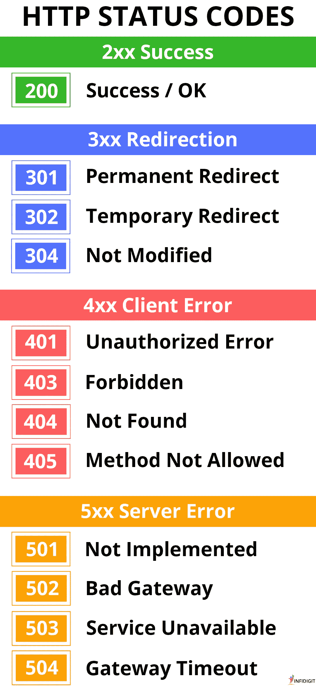

# 第 11 天所有关于 HTTP 协议# 100 日黑客攻击

> 原文：<https://infosecwriteups.com/day-11-all-about-http-protocol-100daysofhacking-bfc0d68d06b7?source=collection_archive---------0----------------------->

获取第 1 天到第 10 天的所有记录， [**点击此处**](https://3xabyt3.medium.com/list/100daysofhacking-challenge-3db6061da4b1)

或者

**Github:** [点击这里](https://github.com/ayush098-hub/100DaysofHacking)

大家好，我是 Ayush，如果你还没有看过之前的博客，请点击上面的链接来阅读，在上面我们讨论了重要的概念，这是以后的博客所必需的。

在我们以前的博客中，我们详细讨论了客户端-服务器模型和 DNS 的所有工作，现在在今天的博客中，我们将学习 HTTP，HTTP Req 和 HTTP Res。所以让我们开始吧。

在我们之前的博客中，我们谈到了客户端服务器模型，在这种模型中，客户端向服务器请求一些东西，然后服务器做出响应，并将响应发送给客户端。

在这种情况下，为了请求服务器并从服务器获得响应，使用了 **HTTP 协议**。

**什么是 HTTP？**

HTTP 代表超文本传输协议，该协议由**客户端**和 **web 服务器**使用，以执行它们之间的通信或发送网页、数据、图像、视频等。这个协议不太安全，因为它以明文传输数据，所以任何人都可以拦截数据，并观察您发送或接收的数据。

**什么是 HTTPS？**

HTTPS 是 HTTP 的下一个版本，这里的 S 表示安全。当我们使用 HTTPS 时，所有的数据无论你从网络服务器发送和接收什么，都会被加密，没有任何第三方可以看到你发送和接收的内容。

来源:TutorialsMate

**HTTP 请求:**

每当浏览器想要与服务器交互时，它就向服务器发送一个 HTTP 请求。HTTP 请求有不同的类型，但是最常见的两种是: **GET** 和 **POST**

**GET:** 当我们使用 GET 请求时，我们基本上是从 web 服务器检索数据。

在这种情况下，我们在 web 服务器中插入一些数据。

当你获取 example.com/index.html 时，你就获取了 index.html，所以这里使用了 get 请求。

假设如果你提交任何形式的用户名和密码，那么大多数情况下会使用 POST 请求。

其他:

**PUT:** PUT 用于更新资源。

**删除:**删除用于删除资源。

现在让我们看看 HTTP 请求的结构:

上图是一个 GET 请求的例子，请求 google 的 web 服务器显示[www.google.com 的主页。](http://www.google.com.)

所有 http 请求都由以下项目组成:

1.  **请求行:**这是 http 请求的第一行，它告诉我们请求方法**【这里是 GET】**，我们想要从 webserver 得到的文件/图片/网页的路径**【这里是/】**，以及 HTTP 的版本**【这里是 HTTP/1.1】**。
2.  重置的行被称为 HTTP 头。这些头用于将关于请求的附加信息传递给服务器。现在让我们一个一个来看:

**请求标题:**

**主机:**它告诉我们主机名。

**用户代理:**它告诉我们正在使用的客户端/浏览器的名称和操作系统。

**Accept，Accept-Language，Accept encoding** 告诉我们将如何响应，意思是用哪种格式，所以这里用 html 格式显示。

**连接**:这个头告诉连接在响应完成后应该保持打开还是关闭。

**Cookie:** Cookie 头用于将用户 Cookie 传递给服务器。

**Referer:** 这个头指定了链接到当前页面的前一个网页的地址

HTTP 请求总是以一个空行结束，通知 web 服务器请求已经完成。

服务器收到请求后，会尝试发送请求中要求发送的任何内容。

现在让我们看看上面请求的 HTTP 响应:

**HTTP 响应:**

r

在上面的图片中你可以看到回应，这不是原创的，为了理解的目的，我已经删除了一些标题，所以现在让我们来看看。

1.  第一行向我们展示了 HTTP 的版本，200 OK 只是状态代码。范围 200 内的状态代码表示网站可访问。

**关于状态代码的更多信息:**

状态代码显示网站的状态，网站是否可访问，或者资源是否存在，所有这些事情都是借助于状态代码来完成的。

资料来源:Infidigit

2.下一行你可以看到回复的日期和时间。

3.下一行是内容类型，表示响应正文的文件类型。

4.下一行显示了服务器名:这里是 gws (Google Web 服务器)。

5.下一行显示了 Set-Cookie 头，它由服务器发送给客户机以设置 Cookie。

6.下一行是与请求相同的连接。

7.内容长度—正文的长度

8.X-Frame-Options 头也是一个指示页面是否可以在 iframe(一个 html 标签)中加载的头。

最后 html，js 中的所有代码都出现了。

一旦浏览器接收到所有的信息，它就会显示 google.com 的主页(在这种情况下)。

要查看请求和响应头的工作，只需打开一个简单的网站，像这样，[https://passwdgen.000webhostapp.com/](https://passwdgen.000webhostapp.com/)然后按下 **ctrl+shift+i** 然后点击网络标签，你会看到请求和响应头。

今天就到这里，我希望你理解了 http req 和 resp 的概念。

现在我们将在下一次见面！

快乐学习，快乐黑客！