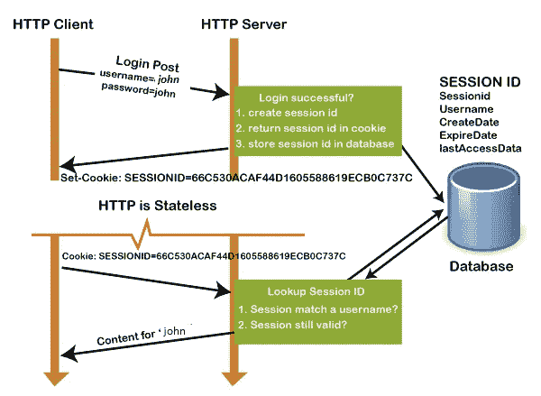
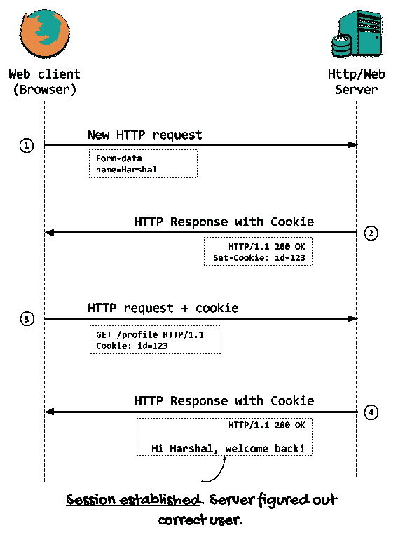
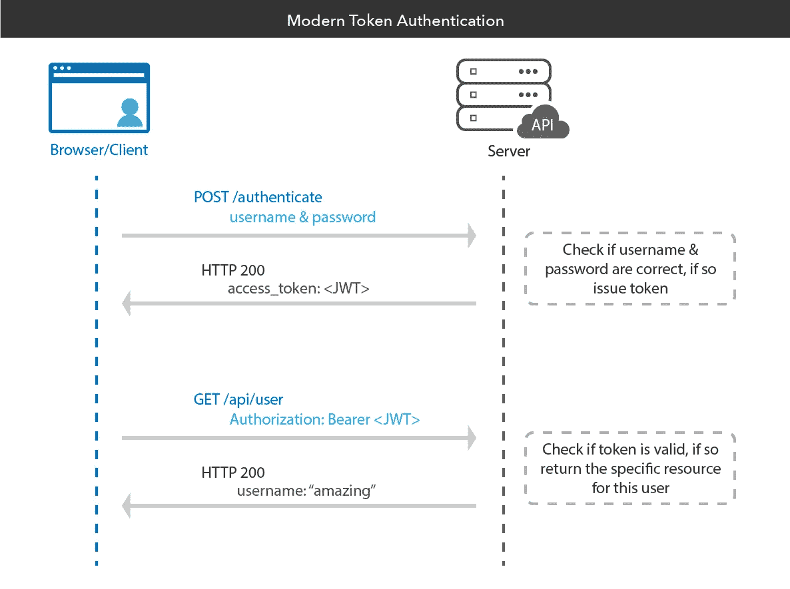
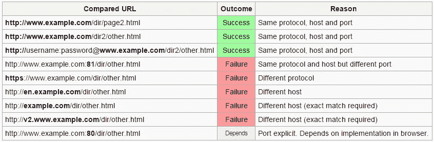

# 第 12 天互联网安全控制# 100 日黑客攻击

> 原文：<https://infosecwriteups.com/day-12-internet-security-controls-100daysofhacking-b407129a452b?source=collection_archive---------1----------------------->

获取第 1 天到第 11 天的所有文章， [**点击此处**](https://3xabyt3.medium.com/list/100daysofhacking-challenge-3db6061da4b1)

或者

**Github:** [点击这里](https://github.com/ayush098-hub/100DaysofHacking)

大家好，我是 Ayush，如果你还没有看过之前的博客，请点击上面的链接来阅读，在上面我们讨论了重要的概念，这是以后的博客所必需的。

在我们之前的博客中，我们讨论了 http 协议，所有关于 http 请求和 HTTP 响应的内容，现在在这篇博客中，我们将讨论一些在客户端和服务器之间通信时使用的安全控制，让我们开始吧。

# 安全控制

到目前为止，我们已经讨论了所有关于 DNS、HTTP Req 和 Response 的内容，因此您可以了解当您输入任何地址(如 google.com)时会发生什么，但是无论我们从客户端和服务器发送什么信息，它都是以正常形式发送的，或者您可以说是纯文本。

因此，无论我们发送什么信息，如果第三人拦截了请求，他/她都可以看到。

为了克服这个问题，使用了一些安全控件，下面将一一讲述:

## **内容编码:**

**编码定义:**编码是**转换数据或给定的字符、符号、字母等序列的过程**。，转换成指定的格式，以便安全传输数据。

**解码定义:**解码是编码的逆过程，从转换后的格式中提取信息。

如果没有适当的编码，那么在 HTTP 请求中发送的任何数据都是以纯文本形式发送的。为了对消息或数据进行编码，我们使用一些编码方法来防止数据损坏。让我们看看:

**Base64 编码** : Base64 编码是对发送到服务器或从服务器接收的任何字符或字符串进行编码的过程之一。

> **“Hello”的编码字符串为:SGVsbG8gV29ybGQ=**

Base64 编码的字符集包括大写字母字符 A 到 Z、小写字母字符 A 到 Z、数字字符 0 到 9、字符+和/，最后是用于填充的=字符。

**为什么要垫高？**

在 Base64 编码中，输入字符串的长度必须是三的倍数。如果不是，那么**编码器根据需要在输出的末尾添加一个或两个填充字符(=)** 以满足这一要求。解码时，解码器会丢弃这些额外的填充字符。

示例:

**I** 编码为: **SQ==**

**Am** 编码为: **QW0=**

**蒂姆**编码为: **VGlt**

这里你可以看到输入字符串的长度不是三的倍数，然后添加一个或两个填充字符。

去这个网站编码或解码任何字符串:【https://www.base64encode.org/】T4

接下来我们将讨论十六进制编码或十六进制编码。

**十六进制编码:**十六进制编码也是编码的过程之一，这种编码代表的是 **base 16** 格式的字符，也就是从 0 到 f 的字符。

> **十六进制或十六进制编码的“Hello”字符串为:48656C6C6F**

在这里，你可以看到一个字符占用了 2 个字节，但是在 base 64 中，一个字符占用了 3 个字节的空间。

**URL 编码:** URL 编码是对 URL 进行编码的过程，或者我们可以说是将 URL 字符转换成基于 ASCII 字符集的指定格式。

在此 URL 中，字符“:”编码为%3A，“/”编码为%2F。

[https://google.com](https://google.com)将编码为 https%3A%2F%2Fgoogle.com

在这里阅读更多关于 URL 编码的信息:[https://www.w3schools.com/tags/ref_urlencode.ASP](https://www.w3schools.com/tags/ref_urlencode.ASP)

你可以使用这个网站来编码解码网址字符:[https://www.urlencoder.org/](https://www.urlencoder.org/)

## **会话和 cookie:**

现在我们来谈谈会话和 cookies，它们在很多网站上都有使用，所以你有没有想过，每当你在你的电脑上打开你的 facebook 帐户并登录后，你不会注销，两天后，当你打开你的浏览器并输入 facebook.com 时，你会被重定向到你的帐户页面，而无需再次输入你的凭据。这怎么可能，这是因为会话和 cookies 已经被 facebook 存储在你的浏览器中。

像 facebook 或 any 这样的网站为每个登录的用户维护一个会话，当用户登录网站时，一个新的会话开始。

登录后，服务器为您的浏览器维护会话 ID，作为身份证明。现在，这个会话 ID 由服务器发送到用户浏览器。现在，这个会话 id 被称为 **cookies** ，当您再次登录该网站以验证您的身份时，它会被发送给该网站上的每个 http 请求。

最后，当用户注销时，会话也将终止，cookie 将被删除或不起作用。

在上面的图像中，您可以看到，John 使用用户名和密码登录，然后使用参数(session Id、用户名、创建日期、到期日期、最后访问数据)创建会话 id，然后将此会话 id 返回给用户。

此后，每当用户试图登录，然后浏览器提供 cookie，然后服务器验证该 cookie，如果 cookie 是有效的，然后约翰获得内容的访问权。

资料来源:webf

我希望用这个图像 cookie 部分是明确的设置-cookie 头是用来设置 cookie 和 cookie 发送值的 cookie 到服务器。

## 基于令牌的认证

以前，我们使用会话 if 或 cookie 登录，然后 cookie 由服务器验证，但是在基于令牌的认证中，每当我们登录到网站时，都会向用户颁发唯一的令牌，然后在该令牌的帮助下，用户可以登录到网站，而无需输入凭证，但是情况是， 如果令牌被泄露，那么任何拥有该令牌的人都可以访问该网站，但对于这个问题，该令牌是使用一些加密技术或通过用秘密密钥签署令牌并在令牌到达服务器时验证令牌签名来编码或加密的。

如果任何人篡改了令牌，并且当令牌到达目的地时，如果原始签名的值与接收到的签名不匹配，则令牌被认为是无效的，只有使用秘密密钥才能生成签名。

身份验证令牌由三个关键部分组成:标头、有效负载和签名。

**表头**

标头定义了正在使用的令牌类型，以及所涉及的签名算法。

**有效载荷**

有效负载负责定义令牌颁发者和令牌的过期详细信息。它还提供关于用户的信息以及其他元数据。

**签名**

签名验证了消息的真实性以及消息在传输过程中未被更改。

基于令牌的身份验证通过以下五个步骤完成:

1.  请求:用户使用他们的登录凭证登录到一个服务，该服务向服务器或受保护的资源发出访问请求。
2.  验证:服务器验证登录信息，以确定用户应该具有访问权限。这包括根据提供的用户名检查输入的密码。
3.  令牌提交:服务器使用数字签名算法为用户生成一个安全的、经过签名的身份验证令牌，持续一段特定的时间。
4.  存储:令牌被传输回用户的浏览器，浏览器存储令牌以供将来访问网站时使用。当用户继续访问新网站时，身份验证令牌被解码和验证。如果匹配，用户将被允许继续。
5.  过期:令牌将保持活动状态，直到用户注销或关闭服务器。

资料来源:俄克拉荷马州开发商

在此阅读有关基于令牌的身份验证的更多信息:[https://www . okta . com/identity-101/what-is-token-based-authentic ation/](https://www.okta.com/identity-101/what-is-token-based-authentication/)

了解更多数字签名算法:[https://www . include help . com/cryptography/digital-signature-algorithm-DSA . aspx](https://www.includehelp.com/cryptography/digital-signature-algorithm-dsa.aspx)

## 同源政策

同源策略是限制不同来源的网站相互通信的规则。

同源策略基本上是从网站起源的地方开始，网站的确切地址是什么。

SOP 是根据协议://hostname.com:端口识别的

让我们用例子来理解:

假设一个网站是:【https://abc.com:443】T4

现在这个网站协议是:https

主机名是:abc

端口是:443

还有另一个网站[http://abc.com:80](http://abc.com:80)

现在这个网站正在使用 http，所以它不是来自第一个网站的同一个来源。

或者任何类似[https://def.com](https://def.com)的网站，这都不是一个来源。

我希望你明白这个概念，如果两个标签在你的浏览器中打开，并且都是两个不同的网站，那么它们可以互相通信，或者你可以在一个网站上运行一个网站的脚本，如果有 SOP 的话。

来源:研究之门

在此了解更多 SOP:[**https://www . acune tix . com/blog/we b-security-zone/what-is-same-origin-policy/**](https://www.acunetix.com/blog/web-security-zone/what-is-same-origin-policy/)

现在我希望所有的概念你都清楚了！

感谢您花时间阅读本文，如果您有任何疑问，请在本博客上回复，我们将在下一篇中见面！

谢谢你，祝你黑客愉快！