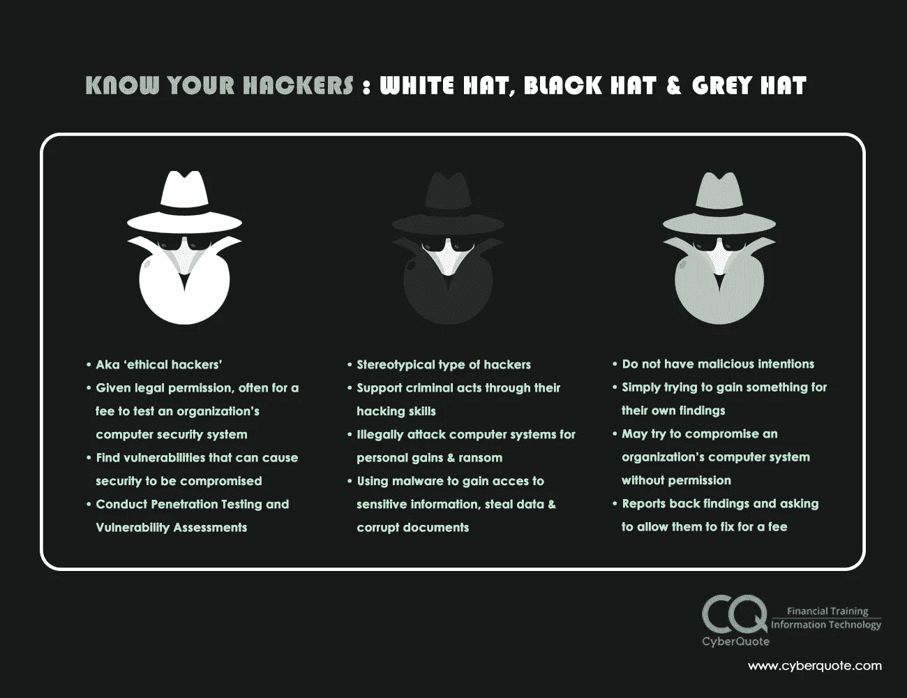
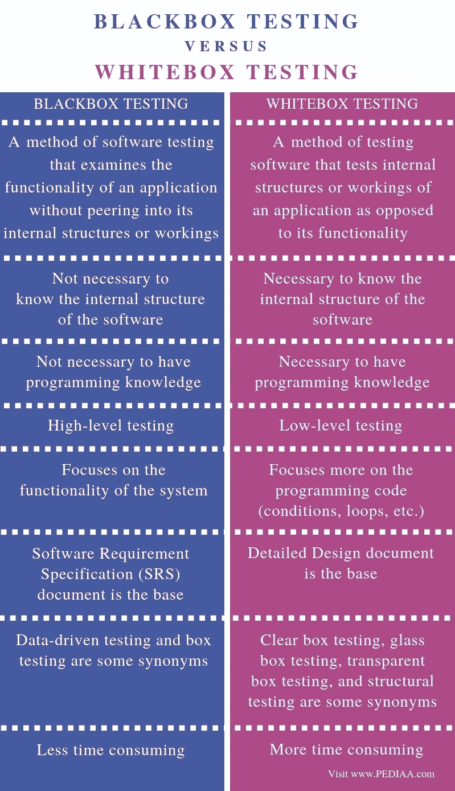
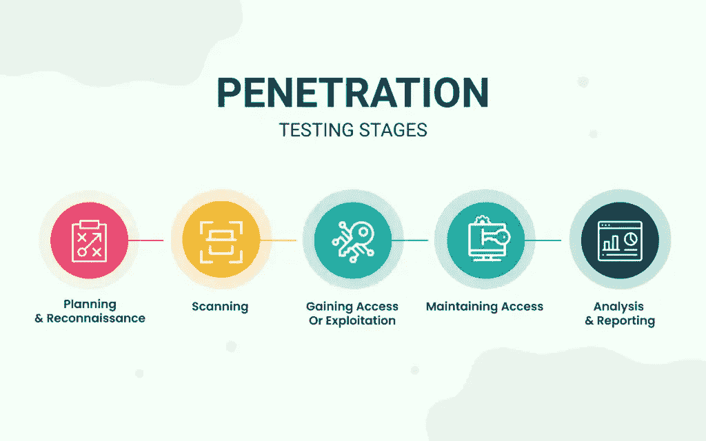
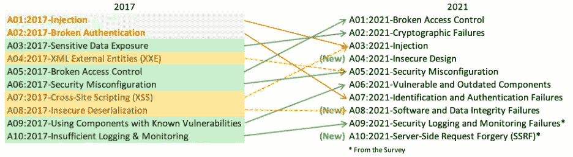

# 第 13 天，测试介绍# 100 黑客日

> 原文：<https://infosecwriteups.com/day-13-introduction-to-pentesting-100daysofhacking-bc44550e8548?source=collection_archive---------3----------------------->

获取第 1 天至第 12 天的所有资料，[**点击此处**](https://github.com/ayush098-hub/100DaysofHacking) 或 [**点击此处**](https://3xabyt3.medium.com/list/100daysofhacking-challenge-3db6061da4b1)

来源:Frsecure

大家好，我是 Ayush，如果你还没有看过之前的博客，请点击上面的链接来阅读，在上面我们讨论了重要的概念，这是以后的博客所必需的。

到目前为止，从第 3 天到第 12 天，我们只讨论了网络概念和一些安全控制，现在从今天开始，我们将学习渗透测试的概念，所以今天我们将从渗透测试的介绍开始。那么，我们开始吧。

## **什么是渗透测试？**

渗透测试是在所有者允许的情况下发现 web 应用程序或计算机系统中的漏洞或弱点的过程，或者换句话说，我们可以说，是从道德上而不是从非道德上发现漏洞。这基本上意味着我们应该事先获得专家的许可来测试任何 web 应用程序或系统。

在渗透测试中，双方都使用相同的工具和技术，一方是出于恶意目的进行测试，另一方是为了保护测试。

在渗透测试开始之前，渗透测试人员和系统所有者之间会进行正式的讨论。对要测试的各种工具、技术和系统达成一致。该讨论**构成渗透测试协议**的范围，并将决定渗透测试的持续时间。

在测试之前，pentester 提供了一个范围列表，或者你可以说他们提供了一些域名或 IP 地址，pentester 必须只测试那些特定的域或 IP。

现在我们将讨论黑客的类型:

**黑客类型:**

**白帽子:**这些都是好的黑客，做任何活动都有事先许可，就像渗透测试员一样。

**灰帽子:**这些是好的和坏的黑客的组合。

**黑帽子:**这些是坏黑客或罪犯，比如那些泄露用户信息、未经许可在任何网站上进行任何测试、试图破坏组织的人。例如，用恶意代码感染设备的勒索软件作者。

以下是三者的区别:

资料来源:cyberquote.com

现在我们将讨论两种类型的测试方法或技术:

**测试方法的类型**

来源:tryhackme

**白盒测试:**在这种类型的测试中，测试人员了解系统或 web 应用程序的内部架构，还可以访问数据库、代码和其他一些 web 应用程序中的秘密路径。

**黑盒测试:**在这种测试中，测试人员不知道系统或 web 应用程序的任何内部结构，他们只是被提供了一两个域名，然后测试人员在上面进行测试。

在上面的两个黑盒测试中更有益，因为在这里测试者在测试网站时像黑客一样思考，但是在白盒的情况下，他们将只测试那些测试者已知的区域。

以下是白盒测试和黑盒测试的主要区别:

pediaa.com 资源

现在，我们将讨论不同的测试方法:

**测试方法**

在讨论方法之前，所有这些方法都遵循渗透测试的 5 个阶段:

**渗透测试阶段:-**

来源:securtraid

达成协议和计划后，将执行以下步骤:

1.  **信息收集** —信息收集是渗透测试的第一阶段，在此阶段，我们收集关于我们的目标或组织的所有公开可用的信息。
2.  **扫描** —扫描是渗透测试的第二阶段，在此阶段我们扫描系统并尝试找到有关系统的技术信息，如目标正在使用哪些技术、正在使用哪些服务器、开放了哪些端口或哪些服务易受攻击。
3.  **漏洞利用** —漏洞利用是渗透测试的第三阶段，我们利用在扫描阶段发现的漏洞来利用系统。
4.  **保持访问权限:**这是渗透测试的第四阶段，我们试图通过在系统中安装后门程序来保持我们在上一步中获得的访问权限，或者你可以说是检查任何犯罪分子是否可以这样做。
5.  **分析:**这是渗透测试的最后一个阶段，无论测试人员发现什么漏洞，都会向开发人员发送详细的报告以修补/修复漏洞。

现在让我们谈谈渗透测试人员遵循的方法。

对于不同的系统和应用，有许多测试方法。但是我们基本上会谈到与 web 应用程序相关的方法论，所以让我们来看看

OWASP 代表开放 web 应用项目，是一个用于测试 Web 应用和服务的框架。

它涵盖了项目的所有阶段:从测试到报告和补救。

owasp 还每 4 年发布 10 大漏洞，许多安全研究人员遵循 OWASP 测试指南或方法，对 10 大漏洞进行测试。

以下是 OWASP 的 10 大漏洞列表:

 [## OWASP 十大

### OWASP Top 10 是开发人员和 web 应用程序安全性的标准认知文档。它代表了广泛的…

owasp.org](https://owasp.org/www-project-top-ten/) 

你也可以点击上面的链接来建立 owap 网站。

我们将主要关注这 10 大漏洞，在我们的下一篇博客中，我们将进行测试设置并参观一些实验室，然后我们将进一步了解一些信息收集技术和 web 漏洞，然后我们将讨论与网络相关的漏洞等等。

所以今天我们就讲到这里，我希望你对渗透测试有一个基本的概念。如果是，那么很好，如果不是，如果再读一遍，或者通过在谷歌上搜索做一些艰苦的工作:)。

所以，感谢阅读的朋友们，下次再见！

快乐学习，快乐黑客！