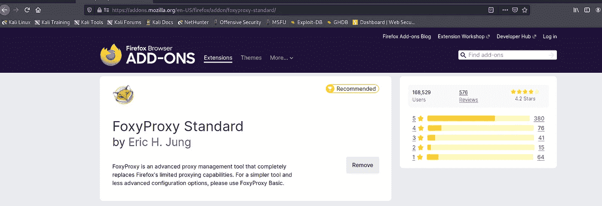
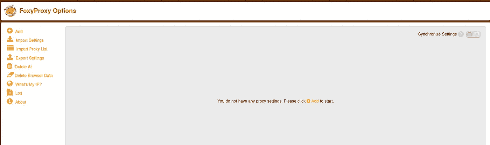
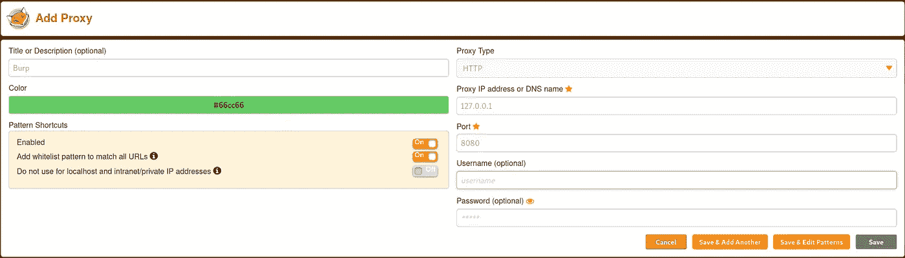
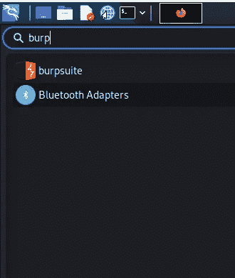
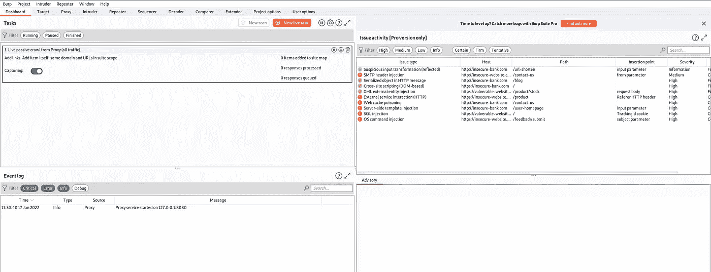
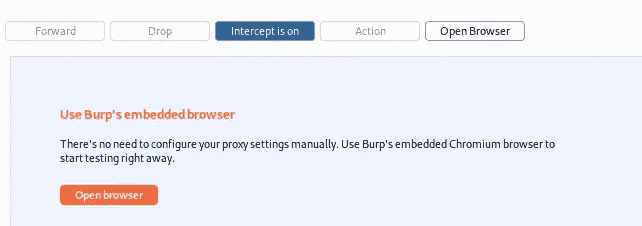
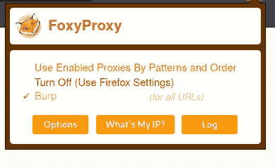
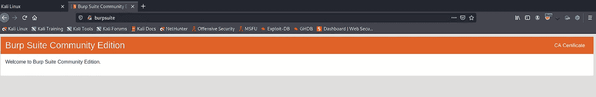
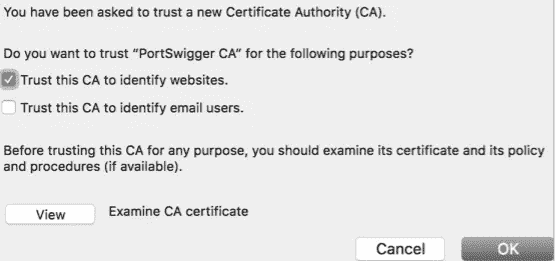
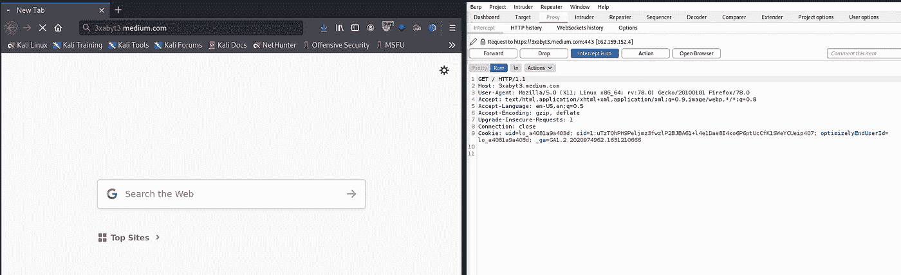

# 第 14 天，设置测试环境# 100 日黑客

> 原文：<https://infosecwriteups.com/day-14-set-up-environment-for-pentesting-100daysofhacking-f8069e91fcd2?source=collection_archive---------2----------------------->

获取第 1 天到第 13 天的所有资料，[**点击此处**](https://github.com/ayush098-hub/100DaysofHacking) 或 [**点击此处**](https://3xabyt3.medium.com/list/100daysofhacking-challenge-3db6061da4b1) **。**

资料来源:联合国人类住区规划署

大家好，我是 Ayush，如果你还没有看过之前的博客，请点击上面的链接来阅读，在上面我们讨论了重要的概念，这是以后的博客所必需的。

在我们之前的博客中，我们讨论了什么是渗透测试、渗透测试的阶段、类型，并了解了 OWASP 方法。

今天在这个博客中，我们将为进一步的报道建立环境，在这个环境中，我们将了解一些网络漏洞。

**选择操作系统:**我们要做的第一件事是选择操作系统，我建议使用基于 unix 的系统，如 Kali Linux，因为它预装了许多用于渗透测试或 bug bounty 和数字取证的系统。要下载它，你可以阅读我们的第一天报道，[点击这里](/day-1-installing-kali-linux-100daysofhacking-eeb5954e0837)。

**设置代理:**成功安装 kali linux 后，我们将使用 firefox 设置代理。这里的问题会出现，什么是代理？

代理只不过是位于客户机和服务器之间的一个软件或程序，类似于 VPN。从客户端到服务器的所有流量都通过代理，从服务器到客户端的所有流量都通过代理。

在我们的例子中，代理位于浏览器和我们交互的 web 服务器之间。该代理在将请求传递给服务器之前拦截请求，反之亦然。通过使用代理，我们可以很容易地修改发送到服务器或来自服务器的请求和响应。

我们将使用 BURP 代理拦截请求和响应，并为其进行设置。

1.  首先在你的 linux 版 firefox 中安装 foxy 代理扩展，[点击这里](https://addons.mozilla.org/en-US/firefox/addon/foxyproxy-standard/)。

2.FoxyProxy 选项页面将打开，然后点击左上角的添加。

3.现在输入如下图所示的详细信息。

4.现在点击保存。

5.现在要打开 burpsuite，点击 kali linux 左上角的图标，然后搜索 burpsuite。

6.Burpsuite: Burpsuite 是一个非常强大的自动化工具，也可以手动使用，主要用于 web 应用程序测试。它有两个版本，一个是社区版，另一个是付费版。我们获得预装在 linux 中的社区版本。要使用付费版本，您需要购买它。

7.现在我们已经配置了 firefox，现在我们将设置 burp。

8.点击打嗝套件后，点击下一步，然后开始打嗝。您应该会看到如下图所示的窗口。

9.现在让我们配置打嗝，点击代理，然后确保拦截是开着的。

10.现在打开你的 firefox，点击 foxyproxy 图标，选择打嗝。

11.现在打开 firefox 在 firefox 上安装 burp 的证书来处理 https 流量。在 burp 打开并运行的情况下，在 firefox 中打开 [http://burp](http://burp) 。

你会看到一个如下图所示的窗口。

12.只需点击 CA 证书，然后证书将下载。

13.现在，在 Firefox 中，点击**首选项>隐私&安全>证书>查看证书>权限**。单击导入并选择您刚刚保存的文件，然后单击打开。然后标记信任此 CA 来识别网站。

14.现在重新启动 firefox 并在 foxy 代理中选择 burp，现在我们都可以拦截 http 和 https 请求了。

15.让我们快速测试一下 3xabyt3.medium.com 是否拦截了 req。

**注意:**当拦截开启时，打嗝会拦截请求，如果关闭则不会拦截。

只要在你的浏览器中打开 3xabyt3.medium.com，然后打开打嗝，你会看到如下窗口。

现在点击前进，然后网站将打开。如果你看不到，那么确保你已经正确地做了所有的设置。

伙计们，今天就到这里，下次再见，非常感谢你们的支持，现在我们已经有 100 多名粉丝了，这是 15 天内的一件大事，非常感谢。

在下一篇文章中，我们将详细了解 burpsuite。

快乐学习，快乐黑客！