# 第 15 天，所有关于打嗝套件#100DaysofHacking

> 原文：<https://infosecwriteups.com/day-15-all-about-burp-suite-100daysofhacking-7d6ae2481c70?source=collection_archive---------3----------------------->

获取第 1 天到第 13 天的所有资料，[**点击此处**](https://github.com/ayush098-hub/100DaysofHacking) 或 [**点击此处**](https://3xabyt3.medium.com/list/100daysofhacking-challenge-3db6061da4b1) **。**

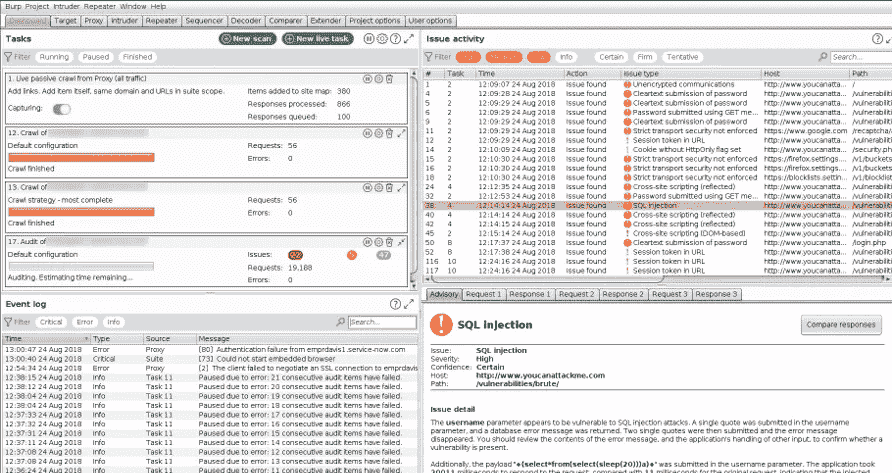

大家好，我是 Ayush，如果你还没有看过之前的博客，请点击上面的链接来阅读，在上面我们讨论了重要的概念，这是以后的博客所必需的。

在前面的例子中，我们在浏览器和 burp 套件之间设置了代理。在今天的博客中，我们将详细了解打嗝套件。

所以打开你的浏览器和打嗝套件，确保一切都配置正确。

今天，我们将看到 burp suite 的许多功能，以前我们知道代理，所以让我们再次从它开始。

## **代理:**

现在打开你的浏览器，打个嗝，然后打开 google.com。你会看到如下所示的窗口。

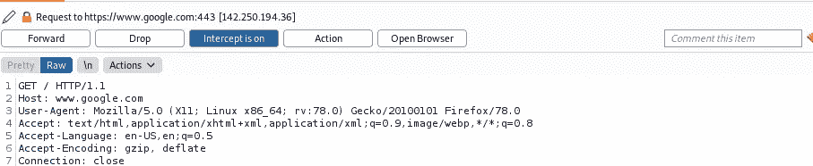

这里发生的情况是，当 intercept 打开时，来自浏览器的每个请求都将通过 burp，除非我们在代理窗口中单击 forward，否则请求不会到达服务器。因此，我们可以在发送到服务器之前轻松地修改请求。

现在，要将请求发送到另一个模块，我们可以右键单击，然后选择要发送到的位置。

在这里，您可以看到有许多可用的选项。

现在让我们操作请求，只需将 Accept-Language 头改为 de，然后您将得到德语结果。

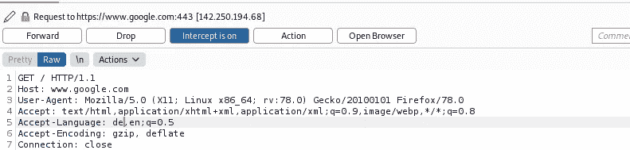

下面你可以看到我们收到的德语结果。

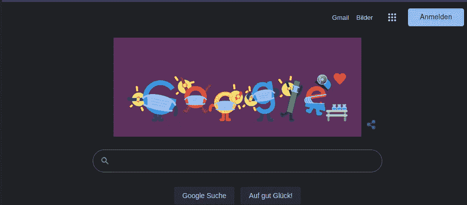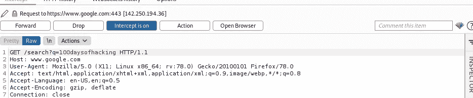

你也可以这样做，如上图所示，这个请求将在谷歌上搜索 100 天的黑客攻击，你会得到结果。

## **侵入者:**

现在让我们来谈谈入侵者，入侵者只是自动发送请求，但在社区版的 burp 中，它运行缓慢，但没关系，我们会看到它是如何工作的。

它可用于执行暴力攻击等攻击。

我们将通过一个例子来了解它，假设一个坏黑客有一个常用用户名和密码列表，他可以使用入侵者进行暴力攻击。

让我们看看我们如何能做到这一点

1.  继续前进[http://testphp.vulnweb.com/login.php](http://testphp.vulnweb.com/login.php)
2.  输入任意用户名和密码，拦截请求。

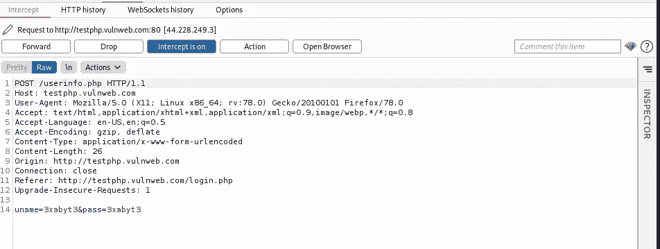

3.现在右键点击**发送给入侵者**，然后转发请求**。**

4.现在转到位置选项卡，并单击清除。

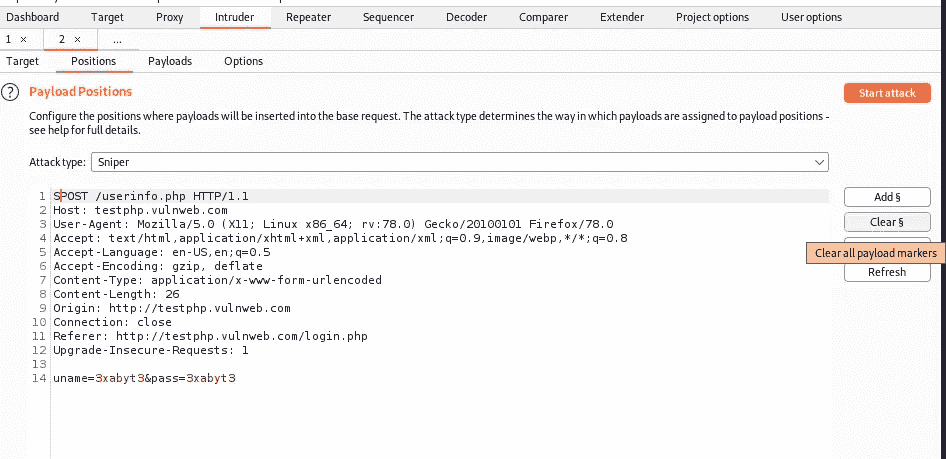

5.现在选择 uname 和 password 的值，然后单击 add。

6.现在把攻击类型改为集束炸弹，因为我们在这里使用了不止一个参数。

7.现在，单击有效负载并为 unames 添加值，如下所示。

8.现在点击有效载荷集，选择 2，并添加一些共同的密码，就像这样。

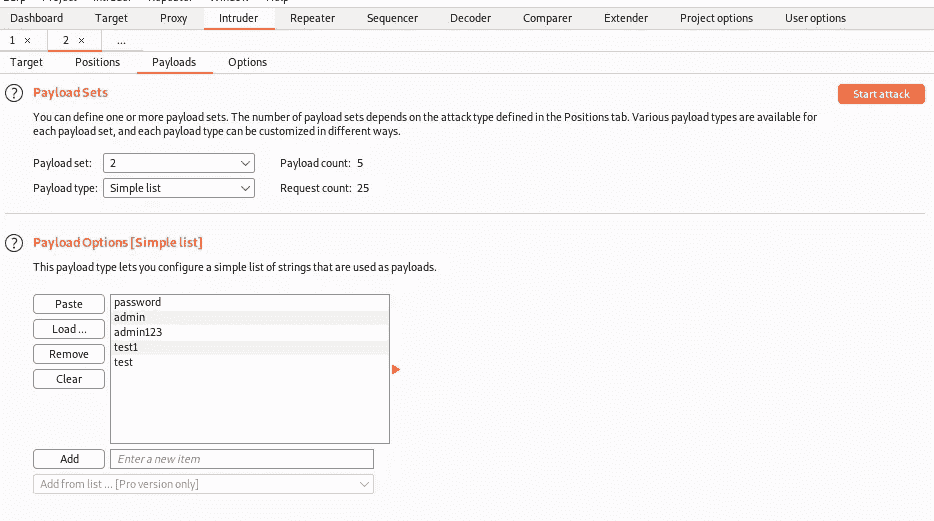

9.现在你已经准备好了，点击攻击。

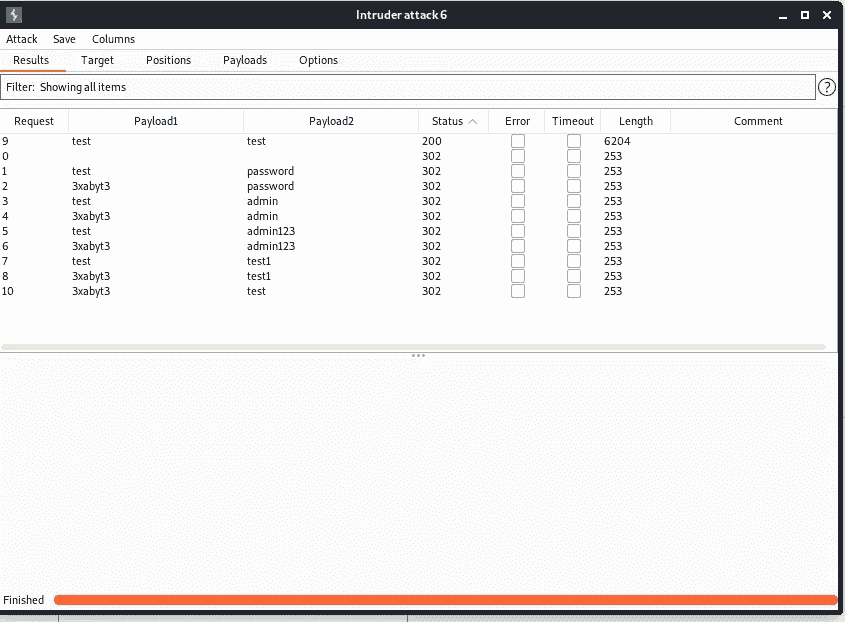

10.攻击完成后，只需点击状态，你会看到 uname:测试，密码:测试，它显示 200 个状态代码。

因此，在这种情况下，我们可以使用入侵者进行暴力攻击，我们可以使用它进行许多重复的任务，如 dir listing n all，我们将进一步看到这一点。我希望你得到了。

## 中继器:

我们可以使用 repeater 来修改请求并详细检查服务器响应。但是你会认为入侵者也帮助我们操纵请求，但是在入侵者情况下是自动的，但是在中继器中我们是手动的。现在拦截任何请求，右键单击代理选项卡，然后选择发送到中继器。然后在中继器的左侧窗口会显示 req，右侧窗口会显示 repsonse。

例如:拦截 google.com 并将其发送到中继器，在中继器中，在/ search 之后传递此参数？q=100daysofhacking。然后点击发送。

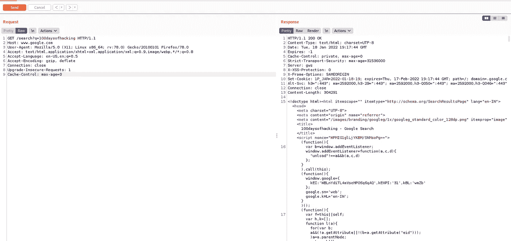

你将得到代码格式的响应，但要看起来像真的一样，只需在响应端点击 render。

它看起来就像我们在浏览器中看到的一样。

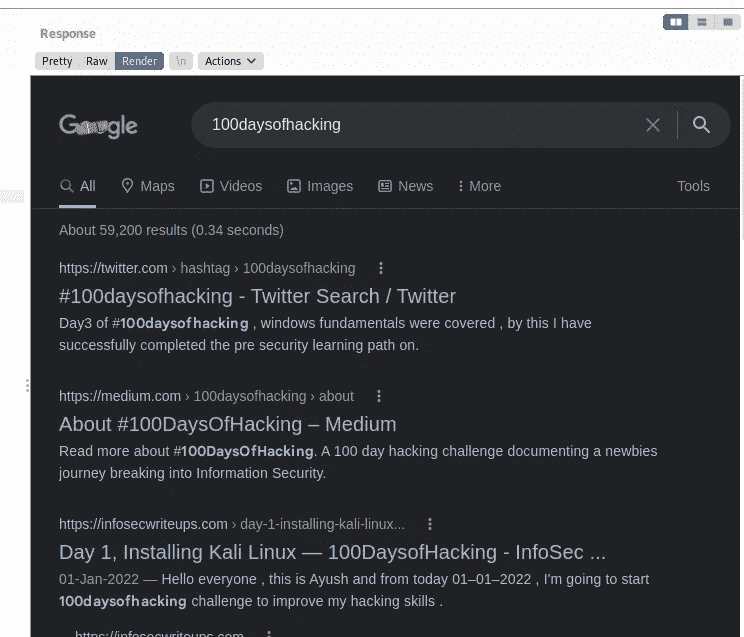

现在在请求中，我们可以将参数从 100 天改为其他值，你会得到不同的结果。

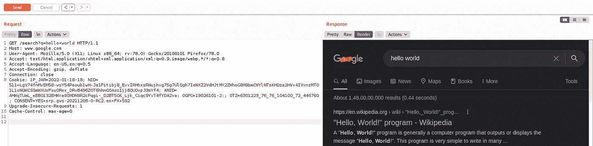

## 解码器

解码器可以用来编码或解码你想要的请求的某些部分。

例如:只需进入 instagram.com，输入用户名和密码，拦截请求，并将请求发送到解码器，然后选择 uname(如果您有电子邮件),然后单击“解码为 url ”,您将看到正常形式的邮件。

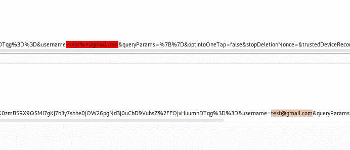

你也可以编码和解码任何你想要的文本，让我们把一个字符串编码成 base64，我们已经在互联网安全控制的文章中看到过。

所以我们再看一遍。

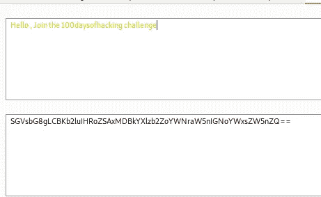

在这里你可以看到我们用 64 进制编码了给定的字符串，同样你也可以解码它。

想了解更多关于编码和解码的知识，[点击这里](/day-12-internet-security-controls-100daysofhacking-b407129a452b?source=list-62d1e2996727----b407129a452b----2-------3db6061da4b1------------------------)。

**比较者**

我们可以使用 compare 来检查请求或响应之间差异。

让我们检查一下。

去 google.com 拦截请求并传递两个不同的搜索参数，你会看到不同。

当我们学习信息收集技术时，仪表板和目标将在以后的博客中讨论。

所以到目前为止，不管我们讲了什么，都要练习，打嗝套件对于测试来说是非常重要的工具，所以你应该知道如何练习。

所以今天就到此为止，下次再见。

如果有任何疑问，请在 instagram 上 ping 我:https://instagram.com/_3xabyt3_

感谢阅读，学习愉快，黑客快乐。

# Infosec Writeups 正在组织其首次虚拟会议和网络活动。如果你对信息安全感兴趣，这是最酷的地方，有 16 个令人难以置信的演讲者和充满力量的讨论会议。[查看更多详情并在此注册](https://iwcon.live/)。