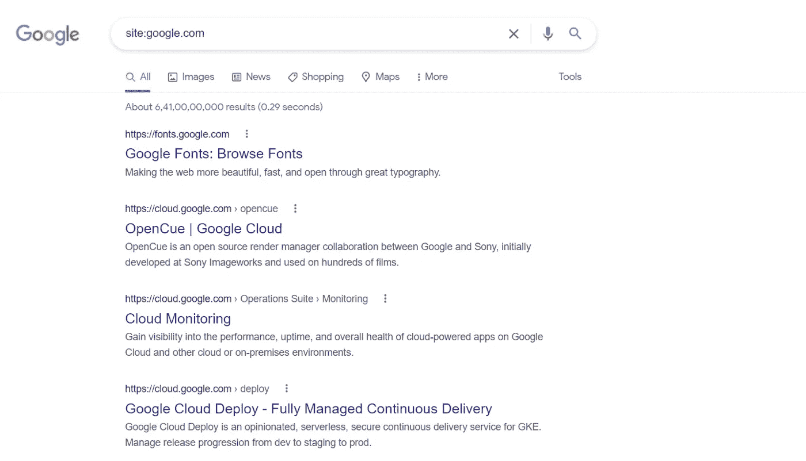
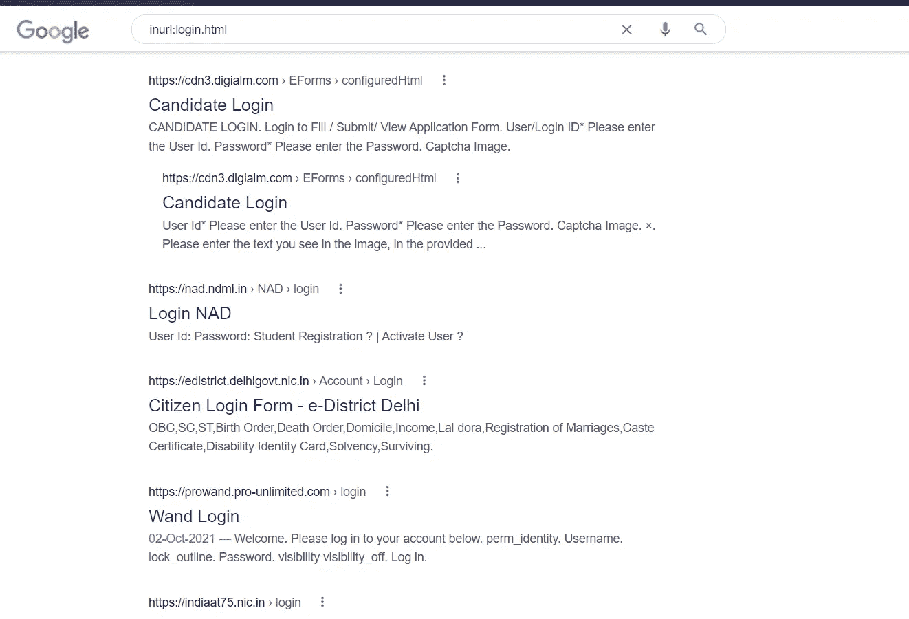
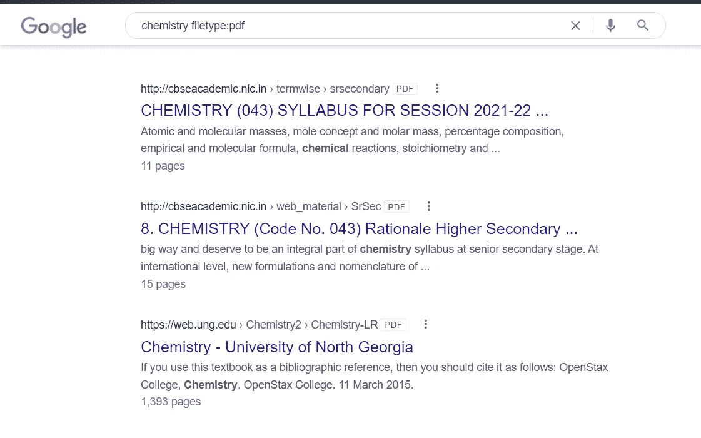
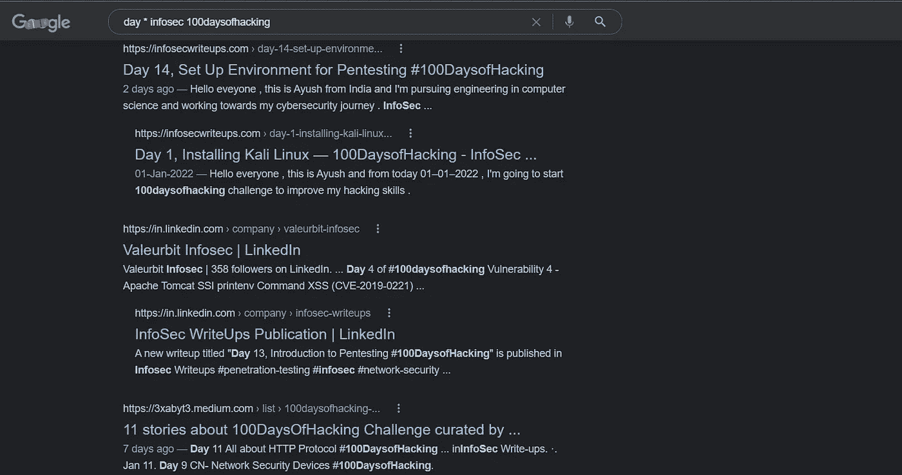

# 第 16 天，网络侦察或信息收集—第 1 部分# 100 天黑客攻击

> 原文：<https://infosecwriteups.com/day-16-web-reconnaissance-or-information-gathering-part-1-100daysofhacking-43d0c723611c?source=collection_archive---------0----------------------->

获取第 1 天到第 15 天的所有资料，[**点击这里**](https://github.com/ayush098-hub/100DaysofHacking) 或者 [**点击这里**](https://3xabyt3.medium.com/list/100daysofhacking-challenge-3db6061da4b1) **。**

大家好，我是 Ayush，如果你还没有看过之前的博客，请点击上面的链接来阅读，在上面的链接中，我们讨论了一些重要的概念，这些概念对于以后的博客是必要的。

在我们之前的博客中，我们了解了 burp suite，它有哪些不同的功能，比如代理、入侵者、中继器等等。当我们在实际目标上工作时，我们将使用所有这些功能，或者当您在目标上寻找漏洞时，您也可以使用这些功能。

今天在这个博客中，我们将学习不同的信息收集技术。

问题是我为什么要收集关于我的目标的信息，答案很简单，就是要更多地了解你的目标，了解什么功能，正在使用什么技术，这就是为什么我们要收集信息。

那么现在让我们开始，攻击任何目标的第一步无非是进行侦察，或者你可以看到收集有关目标的信息。

我们应该知道攻击目标的所有可能方式。

在此之前，我们先来讨论一些基本概念或关键词:-

首先，**什么是信息收集？**

> 信息收集是渗透测试的第一阶段，在此阶段，我们收集公开可用的信息或有关目标的内部信息，同时执行主动侦察和被动侦察，我们可以在进一步的测试阶段使用这些信息。

现在你要想想谁是目标，什么是主动和被动侦察:

> **信息:**基本上，我们将尝试获取有关组织的数字足迹的信息，如他们的 IP 地址、DNS 记录、邮件服务器、子域、web 应用程序的旧快照、后端技术、服务器信息、公开披露的正在使用的软件中的漏洞等。
> 
> **目标:**我们的目标只是我们将在其上执行测试的 web 应用程序。
> 
> **主动侦察:**意思是每当我们与目标交战以获取信息时，就称之为主动侦察。
> 
> **被动侦察:**这是指我们在不与目标交战的情况下收集有关目标的公开信息，称为被动侦察。
> 
> 漏洞:漏洞就是我们在目标中发现的弱点或缺乏安全性。

现在，我希望大家清楚为什么我们要收集信息，简单地探索所有的功能，使用了什么技术，哪些功能是敏感的。

现在让我们看看有哪些不同的技术可以用来收集目标的信息。

## 手动穿过目标:

这是您应该做的第一件事，假设我们的目标是 example.com，那么我们应该首先使用该应用程序，我们应该注意有哪些功能，作为用户，我们应该在该目标上花更多时间来了解它。假设您可以为多个角色创建一个帐户，例如管理员、普通用户和所有人。所以你应该使用所有的功能。

在探索了所有的特性之后，你应该对攻击面(指黑客试图利用系统的地方，或者你可以说是侵入系统)有一个大致的概念，或者入口点是什么。

然后在那之后，我们可以开始深入侦察那个目标。

## 谷歌多金:

google dorking 是一种找到你的目标的具体信息的方法，或者你可以说，它用来缩短结果，假设你得到 138000 个正常搜索结果，但在 Google dorking 之后，你会得到低于 138000 的结果。

Google dorking 还可以找到敏感信息，普通搜索找不到的秘密网址。

顾名思义，谷歌呆子，所以这里我们只需要你的谷歌搜索引擎和一些关于谷歌呆子的信息。

谷歌的搜索引擎有自己内置的查询语言，可以帮助你过滤你的搜索。以下是一些最有用的运算符，可用于任何谷歌搜索:

**网站:Google . com**——这个傻瓜只会给出给定域名的结果。

这个傻瓜只会给出那些页面上有 login.html 的网址的结果。

如果任何网站的标题中有登录名，这个傻瓜就会给出结果。

**filetype:pdf** —该工具将以给定的文件格式给出结果。假设你想要 pdf 格式的化学书，你可以用这个。

**通配符(*) —** 通配符用于搜索在 word 前包含“任何内容”的页面，例如 day * 100daysofhacking，将返回“Day…”。

**引号(" ")—** 它可以用来获得字符串的精确结果。

**OR(|)** — or 运算符用管道符号表示，它可以搜索一个或另一个关键字，或者两个都搜索。

**减号(-)** —减号运算符用于避免显示包含特定单词的结果，例如`pentesting -white`将显示文本中使用“pentesting”的页面，但不显示包含单词“white”的页面

我们也可以一起用两个呆子，就像

**站点:example.com inurl:admin**

**这里是谷歌呆子的备忘单:**

[https://gist . github . com/sundown dev/283 efaddbcf 896 ab 405488330 D1 BBC 06](https://gist.github.com/sundowndev/283efaddbcf896ab405488330d1bbc06)

**你也可以在 GHDB(谷歌黑客数据库)**得到呆子矿

【链接:】[https://www.exploit-db.com/google-hacking-database](https://www.exploit-db.com/google-hacking-database)

解开这个房间也试试黑我，你会得到更多的知识:[https://tryhackme.com/room/googledorking](https://tryhackme.com/room/googledorking)

**要设置 tryhackme 实验室，请阅读以下内容:**

[https://tryhackme.com/room/openvpn](https://tryhackme.com/room/openvpn)

今天就到这里，我知道今天的文章很短，但是由于一些个人原因，我今天不能写更多，我会在下一篇文章中完成它。

谢谢你的时间。

快乐学习，快乐黑客。

🔈 🔈Infosec Writeups 正在组织其首次虚拟会议和网络活动。如果你对信息安全感兴趣，这是最酷的地方，有 16 个令人难以置信的演讲者和 10 多个小时充满力量的讨论会议。 [**查看更多详情，并在此注册**](https://iwcon.live/) **。**

 [## IWCon2022 - Infosec 书面报告虚拟会议

### 与世界上最优秀的信息安全专家建立联系。了解网络安全专家如何取得成功。将新技能添加到您的…

iwcon.live](https://iwcon.live/)