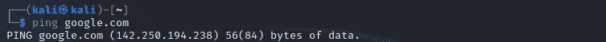
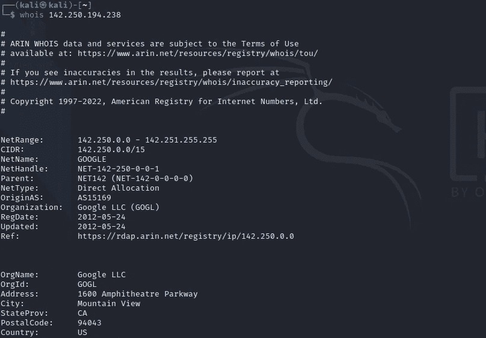
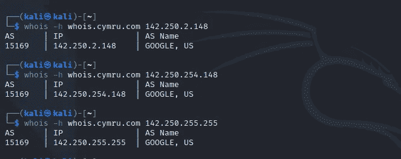
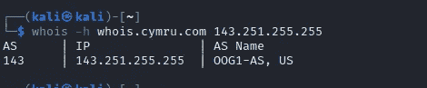
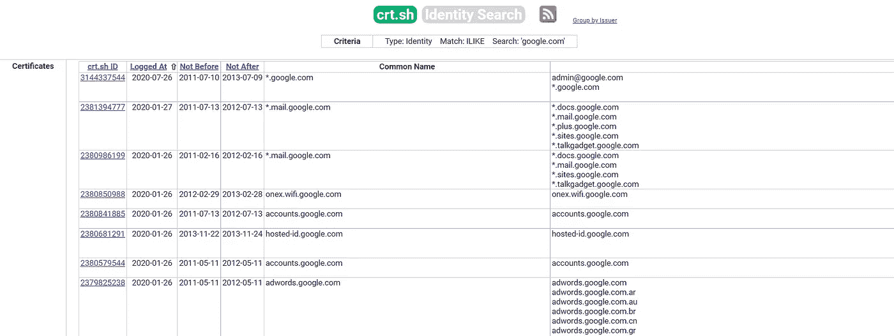
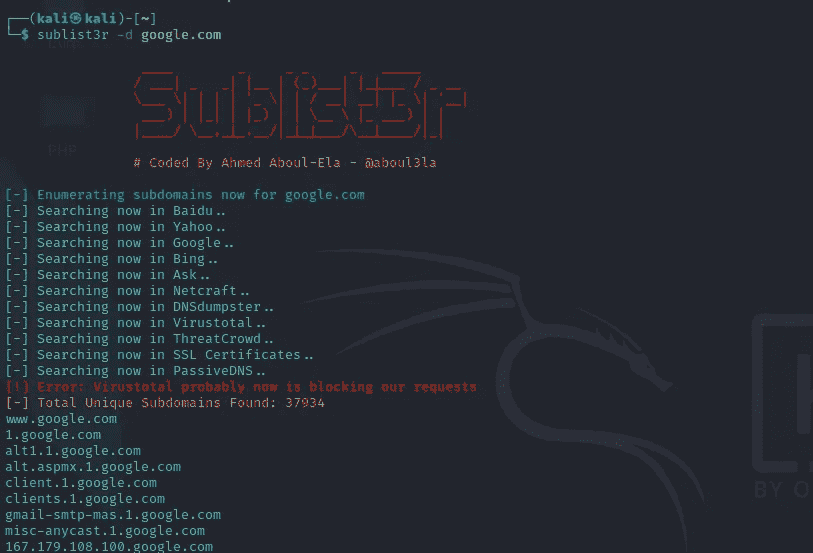

# 第 17 天，网络侦察或信息收集—第 2 部分# 100 天黑客攻击

> 原文：<https://infosecwriteups.com/day-17-web-reconnaissance-or-information-gathering-part-2-100daysofhacking-323ecea7f0a3?source=collection_archive---------2----------------------->

获取第 1 天到第 16 天的所有资料，[**点击此处**](https://github.com/ayush098-hub/100DaysofHacking) 或 [**点击此处**](https://3xabyt3.medium.com/list/100daysofhacking-challenge-3db6061da4b1) **。**

在我们之前的博客中，我们学习了 google dorking 以及用户应该如何手动使用 target，在这篇博客中，我们将学习一些更深入的技术。

**范围发现**

范围发现意味着您可以对公司的哪些资产执行 pen-test。假设有一个 target.com 和 admin.target.com，secure.target.com，不在范围之内，这意味着你不能在这两个子域上执行 pen-testing。

如果你没有范围 n 的限制，那么你可以尝试找到更多的范围，或者你可以说更多的目标资产，而不是像 example.com 一样只测试一个域，你可以搜索许多不同的端点，与目标相关的子域。我们开始吧。

## Whois 和反向 Whois

每当有人购买域名时，他/她的信息就会存储在数据库中，whois 是一种查询这些数据库并向我们显示特定目标信息的协议。

目标 google.com 截图

在这里您可以看到，我们如何借助 whois 工具收集有关 google.com 的公开信息。

在某些情况下，这些信息是不可用的，因为一些组织使用一种叫做**域隐私的服务。**

> 域名隐私是许多域名注册公司提供的附加服务，可以保护你的个人信息。

那么，在这种情况下，我们可以使用反向 whois，这意味着通过使用组织名称、电话号码或电子邮件地址来搜索数据库，以找到在该数据库中注册的域名。这样，我们就可以找到与同一个所有者相关的所有域。

反向 WHOIS 对于寻找不公开的模糊或内部域名非常有用。

我们使用[https://viewdns.info/reversewhois/](https://viewdns.info/reversewhois/)**进行反向 whois **。****

****

**以下是谷歌有限责任公司的结果**

## ****IP 地址****

**我们可以通过查找目标的 IP 地址来找到更多顶级域名，然后使用该 IP 地址执行反向 IP 查找。**

**我们可以使用 ping 或 nslookup 命令来查找 IP 地址，让我们使用 ping。**

****

**在这里，你可以看到 google.com 的 IP 指向:**142.250.194.238****

**在反向 IP 查找中，我们搜索拥有相同 IP 的同一服务器上的域。**

**我们可以使用 IP 运行 whois 命令来查找 IP 范围。**

****

**IP 范围是属于同一组织的一组 IP 地址。如果组织有专用的 IP 范围，您在该范围内找到的任何 IP 都属于该组织。**

**在这里你可以看到一个 IP 范围是:**142 . 250 . 0 . 0–142 . 251 . 255 . 255****

**CIDR 是:142.250.0.0/15**

**差异= 32–15 = 17**

**这意味着主机总数是:2^diff -2= **131070****

**了解更多，然后你可以阅读我们的子网划分指南。**

**要确认该 IP 范围是否由同一个组织使用，我们可以使用 ASN(自治系统号)进行检查。**

**自治系统号(ASN)标识这些网络的所有者。通过检查两个 IP 地址是否共享同一个 ASN，您可以确定 IP 是否属于同一个所有者。**

**让我们检查 google.com IP 范围内的不同 IP 地址。**

****

**在这里您可以看到，该范围内的任何 IP 地址都属于同一个 ASN 15169。这意味着所有 IP 地址都属于同一个组织。**

**whois 命令中的-h 标志设置 WHOIS 服务器以从中检索信息，whois.cymru.com 是一个将 IPs 转换为 ASN 的数据库。**

**让我们在 IP 中做一些更改，检查它显示的是相同的 ASN 还是不同的 ASN。**

****

**在这里，您可以看到我们只是将 142 更改为 143，然后它会显示不同的 ASN。**

**这样，我们可以使用 IP 地址和反向 whois 来扩大我们的范围。**

****SSL 证书解析****

**SSL 证书解析是查找与目标相关的不同域名的另一种方式。但是在 SSL 证书之前，SSL 代表安全套接字层，它用于加密 web 流量，因为 SSL，我们在大多数网站的 url 字段中看到 HTTPS，而不是 HTTP。**

**因此，如何使用 SSL 来查找不同的域名，因此，许多所有者对不同的域名使用相同的证书。**

**正因为如此，我们可以找到与目标相关的不同域名。**

**我们可以使用 [crt.sh](https://crt.sh/) 、censys 和 cert Spotter 来查找域名的证书。**

**让我们在 crt.sh 上为 google.com 加油**

****

**你会得到成千上万的域名。**

## ****子域枚举****

**子域枚举是寻找目标的子域的过程。**

**Dnsdumpster 是一个在线工具，我们用它来查找目标的子域名和 DNS 记录。我们找到一个目标的子域来扩大我们的范围，而不是在每个人都试图不在子域上找到的主域上找到 bug。**

****Sublist3r:** Sublist3 是一个基于命令行的工具，我们可以用它来查找目标的子域。**

**三维 example.com 子列表**

****

**到目前为止，我们已经介绍了如何使用 whoislookup、反向 whois、反向 IP 和查找子域名来扩大我们的测试范围。**

**在下一篇博客中，我们将介绍更多的技巧，因为侦察是测试中最重要的部分，这就是为什么我们要慢慢来，并且无论你学到什么都要经常练习。**

**谢谢你，因为你的时间会在下一个遇见。**

**快乐学习📖祝你黑客愉快💻**

**🔈 🔈Infosec Writeups 正在组织其首次虚拟会议和网络活动。如果你对信息安全感兴趣，这是最酷的地方，有 16 个令人难以置信的演讲者和 10 多个小时充满力量的讨论会议。 [**查看更多详情并在此注册。**](http://iwcon.live)**

** [## IWCon2022 - Infosec 书面报告虚拟会议

### 与世界上最优秀的信息安全专家建立联系。了解网络安全专家如何取得成功。将新技能添加到您的…

iwcon.live](https://iwcon.live/)**