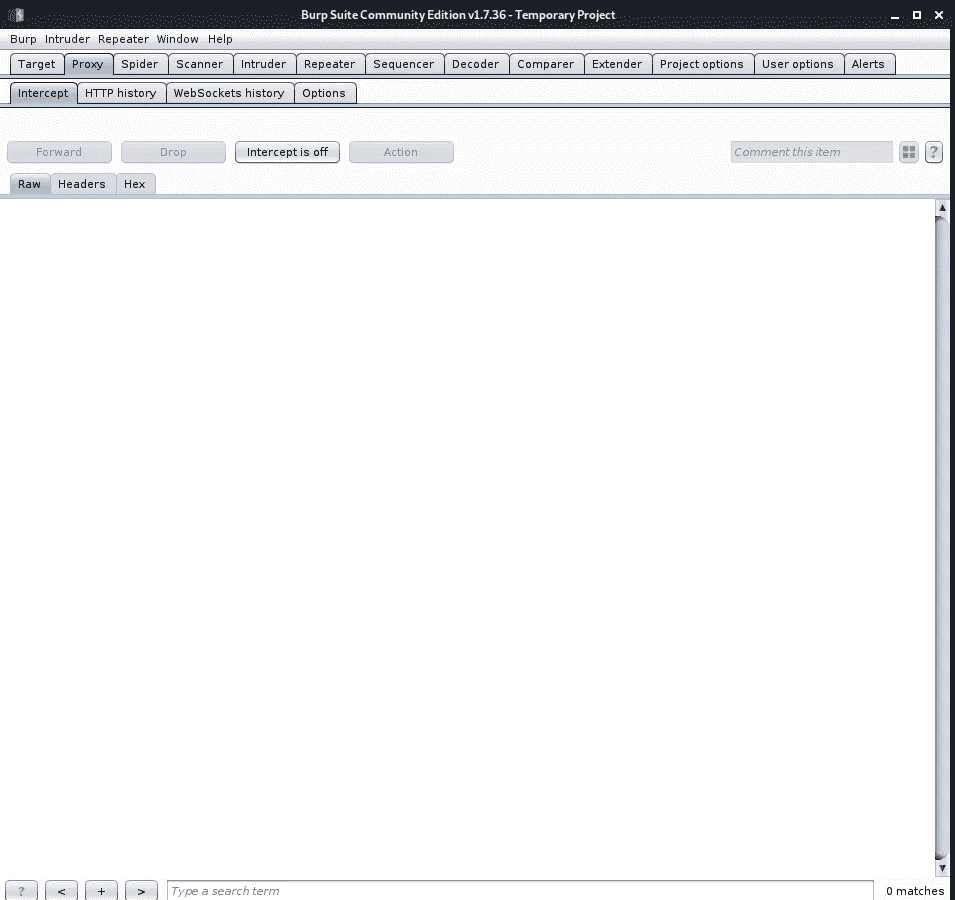
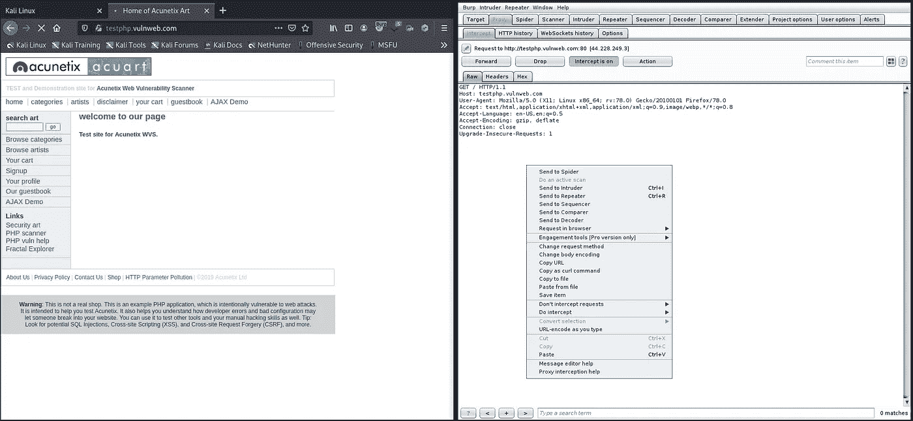
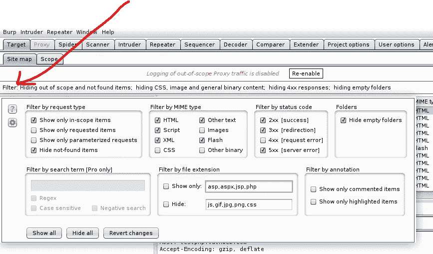
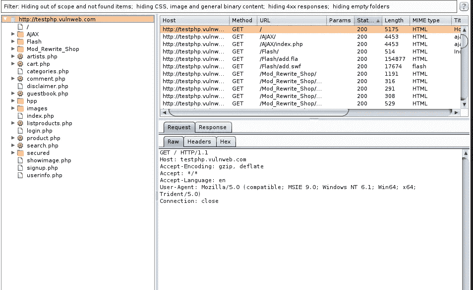
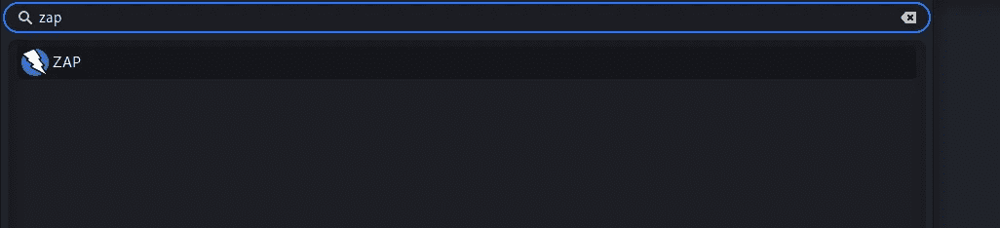
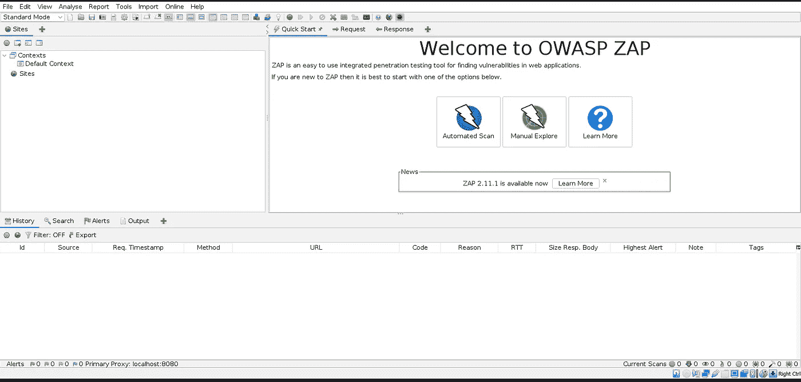
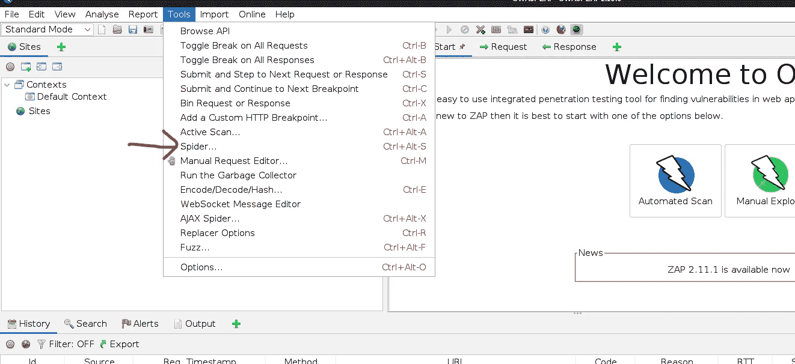
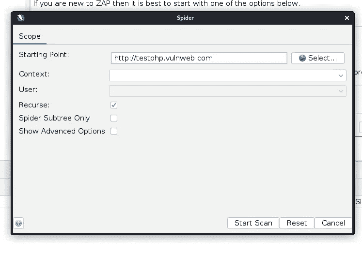
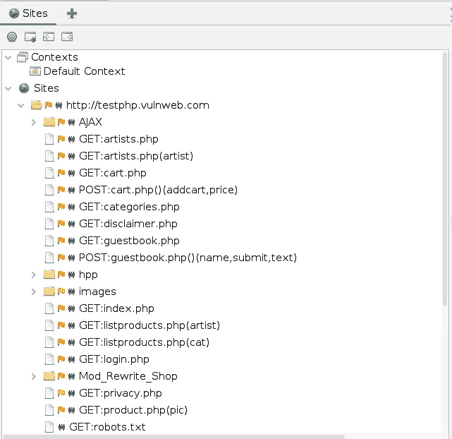

# 第 19 天，网络侦察或信息收集—第 4 部分# 100 天黑客攻击

> 原文：<https://infosecwriteups.com/day-19-web-reconnaissance-or-information-gathering-part-4-100daysofhacking-377c9fc624bb?source=collection_archive---------4----------------------->

获取第 1 天到第 17 天的所有资料，[**点击此处**](https://github.com/ayush098-hub/100DaysofHacking) 或 [**点击此处**](https://3xabyt3.medium.com/list/100daysofhacking-challenge-3db6061da4b1) **。**

在我们之前的博客中，我们学习了 google dorking，scope discovery 以及用户应该如何手动使用 target，在这篇博客中，我们将学习一些更深入的技术。

我们在之前的博客中已经介绍了许多范围发现技术，今天我们还将介绍更多的技术。我们开始吧

# 在网站上爬行

蜘蛛是通过网络蜘蛛或网络爬行找到目录和路径的另一种方式。

网络爬行:这是一个用来识别网站上所有页面的过程。这个过程是在网络蜘蛛工具的帮助下完成的，在这个过程中，我们将使用 [Burp Spider 版本 1.7.36](https://portswigger.net/burp/releases/professional-community-1-7-36) 或 OWASP Zap。

让我们使用上面给出的版本中的打嗝蜘蛛:-

这是 burp 版本 1.7.36 的界面:-

现在让我们拦截这个 url 的请求:-[http://testphp.vulnweb.com](http://testphp.vulnweb.com)

然后做右键，发送给蜘蛛。

然后单击目标选项卡，之后单击给定的过滤器，如下所示。

然后勾选“仅显示范围内的项目”。

然后在这里你会看到 testphp.vulnweb.com 的网络服务器上的所有目录。

这样，你就可以得到所有目录 n 中的所有存在的东西。

现在让我们使用 OWASP ZAP。

# OWASP ZAP

Owasp zap 和打嗝是一样的，现在让我们用 zap 抓取网站。

要打开 zap，只需在 Linux 中搜索 zap。

然后你会得到这样一个界面:

现在点击工具，然后点击蜘蛛。

然后你会看到如下界面:

之后，只需进入一个网站，你想执行扫描，然后点击开始扫描。

您还应该看到一个站点树出现在 ZAP 窗口的左侧。这会以有组织的格式向您显示在目标服务器上找到的文件和目录。

这是你有条理地得到的结果。你可以看到结果和打嗝一样。

对你来说，你可以在 scanme.nmap.org 上做测试

今天到此为止，

感谢您抽出时间，我们将在下一篇文章中讨论不同的信息收集技术。

2021 年 1 月 30 日之后的文章长度将会很长:)

快乐学习📖祝你黑客愉快💻

# 🔈 🔈Infosec Writeups 正在组织其首次虚拟会议和网络活动。如果你对信息安全感兴趣，这是最酷的地方，有 16 个令人难以置信的演讲者和 10 多个小时充满力量的讨论会议。[查看更多详情并在此注册。](https://iwcon.live/)

 [## IWCon2022 - Infosec 书面报告虚拟会议

### 与世界上最优秀的信息安全专家建立联系。了解网络安全专家如何取得成功。将新技能添加到您的…

iwcon.live](https://iwcon.live/)